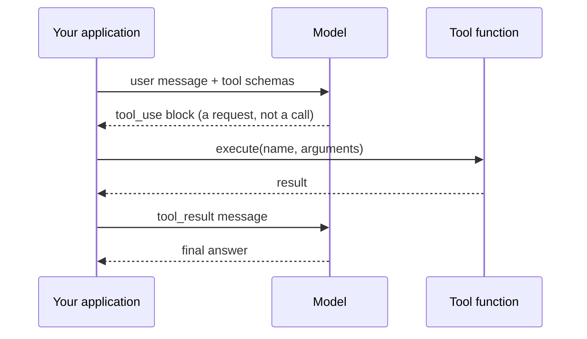

# Chapter 01 — One tool call

## TL;DR

单次 tool call 是每个 agent 的原子单元。模型发出一个结构化请求，描述要运行哪个函数、传入哪些参数；你的代码执行它；结果作为另一条消息回传；模型写出最终回答。此时还没有 loop，没有 memory，没有 orchestration——只有一次往返。本章要做的，就是把这一次往返做到完全正确。课程中其余的一切，都是建立在这同一套机制上的变体与叠加。

---

## Why this matters

问模型"4,892,769 的平方根是多少"，它会给你一个近似值。问它"东京现在的天气怎么样"，它会凭空编造。这些都不是 bug——对于一个没有计算器、也没有联网能力的下一个 token 预测器来说，这正是它应有的行为。

function calling（函数调用）并不会让模型变得更聪明。它给了模型一种途径，去向你的代码索要它自己无法完成的事情。模型决定*何时*发起请求、*用什么参数*；真正的工作发生在你能保证正确性的地方——你的代码里。一旦你脑子里有了这种分工，你就会写出更好的 tool，也会少做出一堆出故障的 agent。

---

## The concept

### The model writes a request; your code does the work

想象一位厨师长，他能观察餐厅前厅，却不会做菜。他写下一张点单——"两个炒蛋，吐司不抹油"——递给后厨。后厨负责执行。盘子端回来。厨师长摆个盘，上菜。

一个带 tool 的语言模型就是这位厨师长。它的"点单"是一个结构化的块，写明要调用*哪个 tool*、*用什么参数*。它无法自己运行这个函数——它什么都运行不了。你的应用程序才是后厨。

出问题的时候，问题就变成了一道诊断题：是厨师长把单子写错了，还是后厨把菜做砸了？两种不同的故障，两种不同的修法。一旦你能在脑子里把它们分开，调试就不再像变魔术了。

### The four-step cycle



1. **描述这些 tool。** 把 user message 连同一份 tool 定义列表一起发送出去——名称、描述、以及参数的 JSON schema。
2. **模型发出请求。** 如果模型判断需要某个 tool，响应里就会包含一个结构化的块——在 Anthropic 风格的 API 里叫 `tool_use`，在 OpenAI 风格的里叫 `tool_calls`——其中带有一个唯一的 `id`、tool 的名称，以及参数。
3. **你来执行。** 按名称找到对应函数，对照 schema 校验参数，运行它，捕获结果。
4. **把结果回传。** 发送一条 `tool_result` 消息，引用同一个 `id`。模型此时拿到了答案，写出它的最终回复。

```jsonc
// What the model emits in step 2 — a request, not a call.
{ id: "call_abc", name: "get_weather", input: { city: "Tokyo" } }

// What you send back in step 4 — same id, your result as content.
{ tool_use_id: "call_abc", content: "18°C, partly cloudy" }
```

无论这个 tool 是去取天气、查你的数据库，还是运行一条 shell 命令，协议都一样。线路格式（wire format）不关心 tool 做什么；关心的是你。

### The schema is the contract

一个 tool 定义中，模型能看到的有三个部分：

- **Name**——模型用来调用它的标识符。
- **Description**——用自然语言告诉模型*何时该用、何时不该用、以及它返回什么*。这是模型唯一的指引。含糊的描述（"获取天气"）会让模型在错误的时机调用 tool；精确的描述（"返回单个城市的当前状况；不要用于历史数据"）则能减少错误。
- **Input schema**——为每个参数提供 JSON Schema：名称、类型、是否必填、以及每个字段的描述。

```jsonc
// What a tool definition looks like — shape, not a specific SDK.
{
  name: "get_weather",
  description: "Returns current conditions for a single city. \
                Use for weather questions; do not use for historical data.",
  input_schema: {
    type: "object",
    properties: { city: { type: "string", description: "e.g. 'Tokyo'" } },
    required: ["city"]
  }
}
```

让你的 agent 用你自己的语言和技术栈，写出你的第一个 tool 定义。它会照办。读一读它产出的东西，检查描述是否同时告诉了模型*何时*该调用这个 tool、以及*何时*不该。生产环境 agent 里有一半的 bug，根源都在于一句没有写明"不要用于 X"的描述。

### Schema and function must move together

tool calling 中最常见的静默故障就是 schema 漂移（schema drift）。你在代码里把一个参数从 `city` 改名成了 `location`，但 schema 里仍写着 `city`。模型忠实地发出 `{ "city": "Tokyo" }`。你的分发代码把它传给一个期望接收 `location` 的函数。函数在运行时炸掉——而看到 schema 的那个模型，完全不知道为什么。

schema 是你与模型签下的契约。一旦违约，模型无从知晓。把 schema 和它的处理函数当作一个整体来对待；改了其中一个，就在同一个 commit 里改另一个。Sebastian Raschka 的 coding-agent 讲解把这一点说得尤其透彻——如果 schema 与处理函数之间的关系你还觉得模糊，值得一读。

### Bad inputs and errors are messages, not exceptions

模型发出的参数*大多数时候*都与 schema 匹配。但有时它会在你想要整数的地方发来一个字符串，会漏掉一个标记为可选、但你的代码实际必需的字段，或者编造一个不在允许枚举范围内的值。函数本身也可能失败——文件未找到、网络超时、权限被拒。这些都不应该让整段对话崩溃。

每个生产系统最终都会收敛到的模式：

- 在执行之前，对照 schema 校验参数。
- 如果校验失败，把错误作为 `tool_result` 返回。不要抛异常。
- 如果函数在运行时失败，把*那个*错误也作为 `tool_result` 返回——附上一条对模型有用的消息，而不是一段堆栈跟踪。

模型在从它读得懂的错误中恢复这方面，出奇地擅长。但它无法从那些已经杀死进程的错误中恢复。把异常包装成 tool result，正是"一个会优雅重试的 agent"与"一个在任务中途悄无声息地停下的 agent"之间的区别。

### Tool results have shape

关于结果，有两件事在你真正上线一次之前并不显而易见。

**`id` 的往返是强制性的。** 每个 `tool_use` 块都有一个 `id`。你的 `tool_result` 必须引用那同一个 `id`。丢掉这种关联，模型就无法把结果对应到请求上——对话会以令人困惑的方式断裂。这件事很机械、很容易漏，值得为它写一个单元测试。

**大体量的结果不该内联。** 一次返回 50 KB 的 grep，或一次返回 2 MB 的文件读取，会撑爆你的 context window，毁掉你的 prompt cache，并拖慢后续的每一轮。生产环境里的做法：如果某个结果超过了某个阈值，就给模型发一段摘要加一个指针，把完整内容存到某个模型在需要时可以索取的地方。OpenCode 把这套逻辑封装进了一个专门的截断服务；Hermes Agent 则对每个 tool 强制施加结果大小上限。你的 agent 十分钟就能为你的技术栈搭出等价的东西。

### Provider-specific knobs worth knowing

四步循环是通用的。各家 provider 在它之上叠加了一小撮控制项和模式，以有用的方式改变这套循环的行为。在上生产之前，有六个值得了解：

- **`tool_choice`。** 对每个请求逐一控制：模型*必须*调用某个 tool、*可以*调用任意 tool、*不得*调用 tool，还是*必须调用某个指定的 tool*。当你明知答案需要某个 tool 时（比如一个路由层），用*必须调用 X*；当你想要纯文本时，用*none*。Anthropic、OpenAI、Bedrock 和 Gemini 都以某种形式支持它。
- **Parallel tool calls（并行 tool call）。** 现代 provider 允许模型在一次响应里发出多个 `tool_use` 块。OpenAI 提供了一个逐请求的 `parallel_tool_calls: false` 开关，当你的下游无法乱序处理它们时可以将其关闭。Ch.02 会讲 loop 如何分发多个调用；这个开关在这里。
- **Strict schema mode（严格 schema 模式）。** OpenAI 的 `strict: true`（以及其他平台的等价物）保证模型产出的参数与 JSON schema 完全匹配。开启 strict 后，你可以省掉一半的校验代码；关闭它，你就必须在分发边界上做防御。trade-off：strict 模式会限制 schema 的表达能力（支持的 JSON Schema 特性更少）。
- **Structured outputs（结构化输出）。** tool call 的近亲。不是*用这些参数调用这个 tool*，而是你告诉模型*用匹配这个 schema 的 JSON 来回应*。同样的 JSON-schema 纪律；不同的机制（用的是一个 `response_format` 字段，而非一个 tool 定义）。当模型的最终答案是数据、而非一个动作时，用它。
- **Hosted（内置）tool。** provider 自带一些由*它们*而非你来执行的 tool——web search、代码执行、文件搜索、computer use。在线路上，schema 和 tool-use 的形态看起来是一样的，但结果回来时并没有运行你的分发代码。trade-off：集成更简单，但对运行什么、如何计费的控制更少。
- **Refusal 与内容过滤。** 模型可能基于安全理由拒绝调用某个 tool（或任何 tool）。Anthropic 把这表现为一个 `refusal` 块；OpenAI 则表现为一种单独的内容类型或 finish reason。把 refusal 当作任何其他 tool result 一样对待——记录它、呈现给用户、让 loop 继续。Ch.18 会讲更深入的威胁模型；本章只想让你知道 refusal 这回事存在。

线路格式和确切的字段名会变；概念是稳定的。等你真要接入其中任何一项的那天，向你的 agent 索取当前的 provider 文档。

### Providers differ; the concept does not

Anthropic 用 `tool_use` 和 `input`。OpenAI 用 `tool_calls` 和 `arguments`。Bedrock 有它自己的形态。更上层的 SDK（Vercel AI SDK、LangChain、以及 Hermes Agent 和 OpenCode 里的自定义适配器）会跨平台把它们归一化。字段名换来换去。但机制——模型发出结构化请求、代码运行它、结果返回——在哪里都是一模一样的。如果你能读懂一家 provider 的文档，五分钟就能读懂另一家的。

如果你是认真在做项目，那就把线路格式藏到一个小小的适配器后面，这样你的 tool 就不必关心你上周用的是哪家 provider。OpenCode 和 Hermes Agent 都正是这么干的；让你的 agent 为你的技术栈搭一个出来。

---

## Real-system notes

- **OpenCode** 用带类型的 schema 来定义 tool，外面包一层小巧的 `Tool.define` 辅助函数，把每次调用作为一个带类型的生命周期对象来追踪，并通过一个专门的服务来截断大体量输出。是"一个干净的 tool registry 长什么样"的有力参考。
- **Hermes Agent** 用 `ToolEntry` 对象把 schema、handler 和每个 tool 的结果大小上限捆在一起，并把 tool 错误分类为可恢复与致命两类，好让 loop 知道是否该重试。
- **OpenClaw** 和 **Paperclip** 表明，一个"tool"未必是一个本地函数。channel 适配器、workflow 步骤、shell 命令，乃至对其他 agent 的调用，都可以成为模型能够调用的 tool——只要它们遵守同一套"名称 + schema + 结果"的契约。

---

## Common failure cases

*这些故障是持久的；它们的修法演进得最快——每一条都点出模式，把当前的具体细节留给你和你的 AI 伙伴。*

- **一个无人应答的 tool 请求。** 对话停住，下一次调用因为一个悬空的 `tool_use` 而被拒——可能是被吞掉的异常、一个只答了一半的并行批次，或被重排的消息。*修法：保持"应答每一个 tool_use"这条不变量——在每次调用模型之前，把请求过的 id 集合与返回的 `tool_result` 集合对账。*
- **格式正确但纯属编造的参数。** JSON 通过了 schema 校验，tool 却针对一个幻觉出来的 id 或值去运行，结果自信地错了。*修法：在 schema 之外做语义校验——当一个值能解析、却无法解析出对应实体时，返回一个 `tool_result`，点明哪里错了、以及到哪里去取一个有效的值（Ch.03）。*
- **模型对 tool 调用过少或过多。** 它会把一个本有 tool 可用的答案凭空编出来，或在根本不需要的轮次里触发一个 tool。*修法：把 tool 选择当作一种可度量的行为，由 tool 描述来驱动；当这个选择本不该由模型来做时，用 `tool_choice` 把它接管过来。*
- **单个 tool call 卡住整一轮。** 一个没有 deadline 的慢依赖，会让整轮冻结，既没有错误也没有结果。*修法：给每个 tool 设一个 timeout，把卡死转化为一个可读的 `tool_result`，并把它设在低于本轮预算之下（Ch.02）。*
- **一个大体量的结果毁掉之后的每一轮。** 一个大结果落进消息数组，每轮都重发一遍，悄悄地抬高了成本、latency 和 cache miss。*修法：在 tool 边界上做"裁剪并持久化"——在 tool 定义上设一个字节预算，返回一段摘要加一个指向完整内容的句柄。*

---

## Pair with your agent

几条在本章效果不错的 prompt：

- *"用我的语言和技术栈，从我的项目里定义一个 tool。让描述同时告诉模型何时该用、何时不该用。然后给我看模型调用它时会发出的确切 JSON。"*
- *"在我的 handler 里改一个字段名，但不改 schema。模拟一次模型调用，精确地告诉我故障会如何浮现出来——以及我会在哪里捕获它。"*
- *"把我的 tool 包装一下，让任何抛出的异常都变成一个模型读得懂、并能据此重试的 `tool_result` 错误。给我看包装前后的对比。"*
- *"实现结果截断：如果一个 tool 返回超过 4 KB，就给模型发一段摘要，并把完整结果写到一个模型可以索取的临时文件里。"*
- *"带我走一遍 OpenCode 是如何定义并分发一个 tool 的，然后在我的技术栈里写出等价的实现——保持同样的形态，但用我的习惯写法。"*

---

## What's next

单次 tool call 是原子。Ch.02 会把它放进一个带停止条件、重试、以及把多次调用串成多步工作能力的 loop 里。那正是聊天机器人终结、agent 开始的边界。

---

<!-- nav-footer -->
<div align="center">

[⬅️ 上一章：Ch.00 How to use this course](00-how-to-use-this-course.md) · [📖 课程目录](../../README_zh.md) · [下一章：Ch.02 The agent loop ➡️](02-the-agent-loop.md)

</div>
