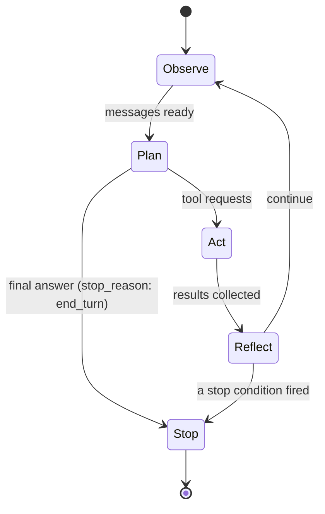
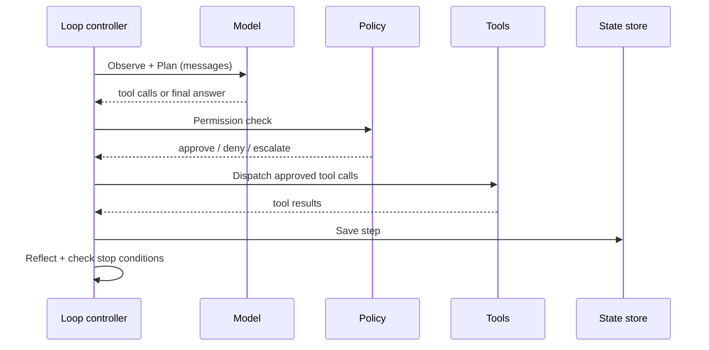

# Chapter 02 — The agent loop

## TL;DR

Ch.01 讲的是一次 tool call。本章把这次调用包进一个 loop 里。模型发出一个 tool 请求，你的代码执行它，结果回传给模型，模型再次决定——是调用下一个 tool，还是停止。难点不在 loop 的循环体，而在于停止。停止条件搞错了，你要么造出一个半句话就退出的聊天机器人，要么造出一个跑到账单爆炸才停的 agent。本章讲解 loop 的形态、结束它的各种方式所构成的谱系、藏在其中的失败模式，以及那个 step 边界——每一项生产级能力（durability、observability、权限、审批、compaction）最终都挂接在这里。

---

## Why this matters

一位同事递给你一个 agent，说它"demo 里能跑，但生产环境里会一直跑下去"。你读了代码。loop 在那里。模型发出 tool call。tool 结果回流。但没有任何东西告诉模型何时该停，也没有任何东西告诉 loop 在模型从不说"完成"时该怎么办。你加上 `if step > 20: break`。loop 退出了——但现在它在答案说到一半时就退出。你把 break 挪到模型回复之后。这下大多数时候能干净退出，但偶尔模型会在看似最终答案之后再发出一个 tool call，于是你悄无声息地漏掉了结果。你为这件事耗了一整天。

修复之道不是写更多代码。修复之道是理解：一个 loop 有*好几种*结束方式，它们全都得在场，而模型自己的 `stop_reason` 才是首要信号——不是某个行计数器。

---

## The concept

### One tool call is rarely enough

一个简单的问题——"东京天气怎么样"——一次调用就够了。一个真实的问题——"这周末东京的天气适合野餐吗，如果适合，我周六的日历有空吗？"——至少需要一次天气查询、一次日历查询，以及一次对比。两次调用，可能彼此条件相关，可能还要第三次来澄清。你无法预先规划出究竟需要多少次调用；模型必须在每一步、根据它目前学到的东西来决定。

这就是 agent loop：Ch.01 的循环被重复执行，每一轮之后都有一个决策点——继续，还是停止？

### The five stages

想象出餐高峰期一间忙碌的厨房。主厨（模型）喊出指令，后厨（你的 tools）执行，主厨尝一尝端回来的成品，再喊出下一轮——直到这道菜装盘出餐。副厨（你的 loop 控制器）并不决定这道菜何时算做好。主厨来决定。但如果主厨沉默了，或者在盘子已经离开出菜口之后还在不停喊单，副厨就需要一套后备方案——一份预算、一个计时器、一只搭在铃上的手——来阻止厨房滑向混乱。

这个 loop 你想叫它什么都行——ReAct、plan-and-execute、think-act-observe。在底层，同样的五个阶段都会出现：

- **Observe（观察）。** 收集模型需要的一切：用户的消息、system prompt、之前的 tool 结果、retrieval 到的 context。在实践中，这就是那个不断增长的 message 数组。
- **Plan（规划）。** 调用模型。它返回的要么是 tool 请求，要么是最终答案，要么是一个问题。你的代码在这里不做任何决策；由模型来做。
- **Act（行动）。** 执行 tool 请求。一次调用或多次调用——和你在 Ch.01 写的派发逻辑相同，现在被放进了 loop 里。
- **Reflect（反思）。** 把 tool 结果连同匹配的 ID 一起追加到 message 数组。模型现在可以看到发生了什么。
- **Stop（停止）。** 检查是否有任何停止条件被触发。若有，返回。若无，回到 Observe。



### What the loop actually carries

loop 不只是在遍历 message 数组。在两次迭代之间，它还持有：

- **目前为止花费的 token** —— 用于预算检查。
- **step 计数** —— 用于迭代上限。
- **近期 tool call 的一小段历史** —— 用于 doom-loop 检测（见下文）。
- **一个 abort token** —— 让用户、或系统的另一部分，能在 loop 进行中取消它。
- **system prompt** —— 在各次迭代间保持逐字节稳定，让 prefix cache 持续命中（Ch.04 解释了原因）。

只有当你第一次试图从一次崩溃中*恢复*一个 loop 时，你才会意识到它承载了多少东西。那是 Ch.08 的课题。眼下，只需知道 message 数组并不是故事的全部。

### Stop conditions are a spectrum, not a checklist

每个生产级 loop 都会用到好几种停止条件，从最软到最硬层层叠加：

- **Model-driven stop（模型驱动停止）。** 模型不返回任何 tool call，并给出 `end_turn` 的结束原因（在 OpenAI 形态的 API 上是 `stop`）。这是首要信号——模型认为自己完成了。
- **显式的 `final_answer` tool。** 往 registry 里加一个 `final_answer(text)` tool。让它成为模型提交结果的唯一合法途径。这强制了有意识的收尾，防止在答案已经存在之后漂移去做额外调用，并给你一个干净、规范的输出用于记录。
- **Grace call（宽限调用）。** 有些系统会在预算几近耗尽时给模型最后一个回合，prompt 里带一条消息："你只剩一个回合了；收尾吧。"模型通常会干净地收场。没有这一步，硬上限会在思路进行到一半时把它切断。OpenClaw 是这个模式最清晰的参考。
- **Step cap（步数上限）。** 对迭代次数的硬性天花板——通常是 10–50，在长时间运行的助理系统里有时约为 90。这是安全网，不是首要停止机制。如果你的 loop 大多数时候都停在这里，那说明上游出了问题。
- **Token 或成本上限。** 当总 token 数或累计成本越过阈值时退出。返回已经产出的任何东西，并标注为部分结果（partial）。

线上传输时的形态：

```ts
// Minimal loop — the shape, not your final code.
for (let step = 0; step < MAX_STEPS && totalTokens < TOKEN_BUDGET; step++) {
  const response = await llm.complete({ messages, tools });
  totalTokens += response.usage.totalTokens;

  // Model-driven stop or explicit final_answer.
  if (isFinalAnswer(response)) return finalize(response);

  // Act + Reflect.
  for (const call of response.toolCalls) {
    const result = await dispatch(call.name, call.args);
    messages.push(toolResult(call.id, result));
  }
}
return partialResult(messages, "budget_exhausted");
```

让你的 agent 把这段翻译进你的技术栈，然后加上 grace-call 行为，这样你就不会在思路进行到一半时悄无声息地把它切断。

### Sometimes the right answer is to compact, not continue or stop

每一步之后，loop 实际上有三个选择，而非两个：继续进入下一次迭代、因某个条件触发而停止，或者*compact*——暂停、缩小 message 数组，然后继续。当 context window 快被填满时就会触发 compaction；OpenCode 的 session processor 会盯着一个可用 context 的计算值，Hermes Agent 则从一个 token 溢出检查里触发它。其中的机制——裁掉什么、概括什么、逐字保留什么——属于 Ch.05。属于*这里*的，是认识到 loop 有第三根杠杆，而不只是一个开关，以及这根杠杆是在 step 边界处被拉动的。

### Errors are also turns

当一个 tool 失败、或模型发出一个格式错误的 tool call 时，正确的做法——几乎总是——把错误作为 `tool_result` 追加进去，然后继续循环。模型很擅长读懂错误，要么用修正后的参数重试，要么转向另一种方法。从 loop 里抛出一个异常几乎从来都不是答案。

有两类错误值得关注：

- **Transient（瞬时性）。** 网络抖动、rate limit、模型过载。带退避（backoff）地重试（生产系统使用从几秒到两小时不等的时间表）。反复失败后，回退到一个*兼容的*模型——它支持相同的 tool schema，至少拥有这一回合所需的 context window，并满足任务的推理与内容策略要求。一个缺少主模型 tool 格式、context 容量或策略对等性的回退方案，不是回退——它是另一种失败模式。Hermes Agent 和 OpenClaw 都提供了可配置的 fallback 链；兼容性就是在这条链的定义里声明的。
- **Permanent（永久性）。** 凭据错误、schema validation 失败、tool 不在 registry 里。立即上报。再多重试也修不好它。

每一个值得研究的系统最终都收敛到同样的形态：先对错误分类，再路由到 retry、fallback 或上报。让你的 agent 把 `classify_error(err) → action` 接进你的 loop，并写出能证明每一类都被正确路由的测试。

### Doom loops and how to catch them

最常见的失控模式是 *doom loop*：模型连着三四次用相同的参数调用同一个 tool，得到同样没用的结果，却从未察觉自己卡住了。OpenCode 和 Hermes Agent 都提供了显式的检测——通常的规则是"如果最近三次 tool call 名称相同、参数也相同，就暂停并请求继续的许可"。

逐字节相等能抓住大多数情况。它抓不住那些调用形态在变、却没有取得真实进展的慢速循环——`read(file, offset=0)` → `read(file, offset=100)` → `read(file, offset=200)`——模型一直在"看"，却始终没找到东西。对付这些，你需要一个能跟踪自身进度的 tool，或者一个关于"message 数组增长了多少却没产出有用输出"的启发式规则。大多数团队从逐字节比对入手，加上一个 step cap，然后接受由成本预算来兜住那些更微妙的卡死状态。

### Parallel tool calls in one turn

现代的供应商允许模型在单次响应里发出多个 tool 请求。如果这些 tool 彼此独立、可以安全并发，你就应该这么做——它能大幅削减墙钟（wall-clock）延迟。OpenClaw 和 Hermes Agent 里的模式是：把每个 tool 标记为 `concurrency_safe: true | false`，把安全的那些放到一个 worker pool 上跑（八个 worker 是常见的上限），其余的串行执行。只读的 tool 是安全的。任何会写入、发送或付款的都不是。

### Streaming, partial deltas, and refusals

现代供应商以分块（chunk）的方式流式传输响应：文本 token、推理块、tool-use 块、结束原因，有时还有拒答（refusal）或安全停止。loop 必须先把这些拼装成一幅连贯的图景，然后才能行动。有五个只在 streaming 模式下才出现的关注点：

- **tool-call 的参数是逐步到达的。** OpenAI 风格的 streaming 会以 JSON 字符串增量（delta）的形式发出 tool-call 的参数——`{"city"` 然后 `: "Tok` 然后 `yo"}`——跨越多个事件。loop 必须在解析和派发之前，把某个 tool-call `id` 的所有增量累积起来。在一个不完整的片段上派发，是最常见的 streaming bug。
- **参数里的格式错误 JSON。** 即便累积完成，模型也可能发出无法解析的 JSON——多余的逗号、未闭合的字符串、有键没值。把它当作任何其他可恢复错误来处理：返回一个 `tool_result`，说*"你的参数没能解析；这是错误信息；再试一次"*，让下一回合来纠正。把解析错误摆给模型看，它很擅长修自己的 JSON。
- **拒答作为终结性回合。** 模型可能以安全为由拒绝调用某个 tool（或任何 tool）。Anthropic 会发出一个 `refusal` 块；OpenAI 则呈现为另一种 content 类型或结束原因。对 loop 而言，一次拒答以一条拒答消息结束该回合，而不是以一个 tool 结果结束。记录它；向用户上报；不要对着同一个 prompt 盲目重试。
- **流中途的安全停止。** 一次响应可能被供应商的内容过滤器截断——流以 `content_filter` 的 `finish_reason`（OpenAI）或其等价物结束。把它当作该回合的终结性失败；如果有用就上报那段部分输出；不要盲目重试（同样的过滤器会在同样的输入上再次触发）。
- **流中途的取消。** 下一小节里的 abort token 同样适用于流，而不只是适用于下一回合的边界。一次干净的取消会停止从供应商读取、关闭连接，并且不提交任何成形到一半的 tool call。任何已经派发出去的，都会得到一个*"用户已取消"*的 tool_result。

各供应商的线格式不同；但 loop 对响应的处理形态——累积、校验、派发或上报——在哪里都一样。

### Interrupts and cancellation

一个用户按下 Ctrl-C、一个超时被触发、一个父进程判定 loop 跑得够久了——这些都需要向内传播。模式是：每个 loop 都持有一个 abort token，每个长时间运行的 step 都检查它，一个被触发的 token 会干净地解栈并带着部分结果退出，而不是把整个进程撕掉。"中断在 tool call 进行到一半时到达"这件事值得单独想一想：让 tool 跑完（或者让它自己检查 token），而不是让一次做了一半的写入沦为孤儿。

### Step boundaries are where everything attaches

Act 与 Reflect 之间的过渡——在结果被收集之后、被追加之前——是天然的检查点。在那一刻，loop 持有一个完整的工作单元：一份计划、一组 tool call、一组结果。有五类生产级能力挂在这条边界上：

- **Durability（持久化）。** 保存状态。在崩溃后存活下来，而无需重复执行昂贵的工作。→ Ch.08。
- **Observability（可观测性）。** 为每一步发出一条结构化的 trace：调用了哪些 tool、用了多少 token、延迟、错误计数。→ Ch.16。
- **权限检查。** 在派发之前对 Act 阶段设卡。→ Ch.03、Ch.12。
- **人工审批（Human approvals）。** 在高风险动作之前暂停并等待批准。→ Ch.12。
- **Context 压缩。** 裁剪超大结果、去重、概括较旧的回合。→ Ch.05。



loop 的循环体很小。围绕它的那条边界，才是生产系统真正栖身的地方。

---

## Real-system notes

- **OpenCode** 在一个 `SessionProcessor` 内运行 loop，它为每一步的每一个部分流式发出事件，通过一个 worker pool 派发 tool，并在 context window 开始被填满时触发 compaction。
- **Hermes Agent** 在 `run_conversation` 里运行一个类似的 loop，max-iterations 上限接近 90，有一个会在 rate-limit 错误时轮换 API key 的凭据池，以及一条用于从 context 溢出中恢复的 fallback 模型链。
- **OpenClaw** 是 graceful-stop 行为最清晰的参考：它对迭代次数计数，在预算只差一点时给模型一次 *grace call*，然后才强制硬停止。
- **Paperclip** 自己并不运行内层 loop——adapter 才运行。它的职责是 loop *外面*的那层 loop：调度、心跳（heartbeat）、带有从分钟到小时延迟的 retry 策略、存活性审查、持久化的运行日志。

---

## Common failure cases

*这些失败是持久的；它们的修复方式演进得最快——每一条都点出模式，把当下的具体细节留给你和你的 AI 伙伴。*

- **运行总是只在 step cap 处停止。** 长时间运行的任务在迭代天花板处结束，而非由模型驱动的 `end_turn`，于是每次运行都要为最大次数的模型调用买单。*修复：用一个 `final_answer` 停止 tool 作为唯一合法的收尾途径，再加上一个你会为之设警报的 stop-reason 指标（Ch.16）。*
- **一次瞬时的抖动演变成一场重试风暴。** 供应商的一次短暂打嗝把负载和账单推高到远超其本身成本，因为同步化的重试一齐砸向供应商，昂贵的调用悄无声息地重跑。*修复：用 full-jitter 退避来打散这群"羊群"，在带有限预算的前提下先分类再重试，以及一个能快速失败的熔断器（circuit breaker）。*
- **loop 卡住了，但 doom-loop 过滤器从未触发。** agent 空转、毫无真实进展，而逐字节相等的检测器看到调用形态在变，报告一切正常。*修复：在相等检查之外再加一个无进展启发式——进度受限的循环，要求每一步都必须推进某个可度量的量。*
- **本不该并行化的 tool call 被并行化了。** 并发执行让事情更快，却偶尔、非确定性地出错，因为一个标记过于宽松的 tool 在共享状态上发生了竞态。*修复：让 `concurrency_safe` 默认为 false，并对每一批做分区——并发跑那组已被证明安全的，其余的按发出顺序串行（Ch.03）。*

---

## Pair with your agent

几个在本章效果不错的 prompt：

- *"把那段最小 loop 伪代码翻译进我的技术栈。加上 grace-call 行为和其余四个停止条件。给我指出每一个分别在哪里触发。"*
- *"实现 doom-loop 检测：对最近三次 tool call 做逐字节相等比对。带我走一遍它抓住真实卡死模式的测试用例，以及一个它漏掉的用例。"*
- *"把这些错误分类为 transient 或 permanent——rate limit、schema validation 失败、tool-not-found、模型过载、凭据过期——把 `classify_error → action` 接进我的 loop，并写出测试。"*
- *"把一个 abort token 穿进我的 loop。给我看看当用户在 tool call 进行到一半 vs. 在模型调用进行到一半时取消，分别会发生什么，以及部分结果是什么形态。"*
- *"带我走一遍 OpenCode 的 SessionProcessor 是如何在 continue、compact 和 stop 之间做决定的。然后在我的技术栈里写出等价的实现——保持同样的形态，使用我的习惯写法。"*

---

## What's next

你已经有了一个 loop。loop 接下来需要的，是它能信任的 tool。Ch.03 讲的是超越 schema 的那份契约——参数校验、副作用分类、幂等性（idempotency）、可恢复错误与致命错误之间的区别，以及为什么安全的路径比安全的代码更重要。

---

<!-- nav-footer -->
<div align="center">

[⬅️ 上一章：Ch.01 One tool call](01-function-calling.md) · [📖 课程目录](../../README_zh.md) · [下一章：Ch.03 Tools the agent can trust ➡️](03-tools-validation.md)

</div>
