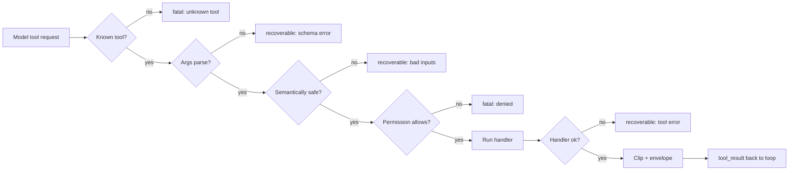

# Chapter 03 — Tools the agent can trust

## TL;DR

工具的 schema（Ch.01）是模型看到的东西。schema 之外的契约（contract），才是 loop 真正需要的东西。一个生产级的工具还会携带一组 metadata（元数据）——只读还是破坏性的、能否安全并行、是否幂等（idempotent）、是否 open-world（开放世界）——loop 在派发之前会先读取这些信息。它会按一个特定顺序走过一条 validation（校验）流水线：先确认工具已知，再确认类型正确，再确认语义安全，再确认权限允许，最后才可执行。它返回一个 result envelope（结果信封），让失败变成一次 turn 而不是一次崩溃。它还会为模型裁剪输出，同时不丢掉给你保留的完整版本。本章讲的就是这些细小的不变式（invariant），正是它们把工具从「一个模型能调用的函数」变成「一个 agent 可以被托付的函数」。

---

## Why this matters

三个简短的场景。

你给 agent 一个 shell 工具。模型把 `rm -rf` 写到了错误的路径上。没有权限 gate，没有 sandbox，也没有任何办法让你在命令执行前先检查它。agent 完全照你说的做了：它调用了工具。

你给 agent 一个发邮件的工具。一次瞬时的网络抖动让第一次调用超时。loop 重试。客户收到了两封邮件。这个「发送」操作不是幂等的。

你给 agent 一个部署工具。它很快返回了 `"ok"`。模型认为成功了，继续往下走。三小时后你发现这次部署从未真正到达集群——API 悄无声息地丢弃了请求，而工具返回了它那个乐观的默认值。

这些都不是模型的失败。它们是工具系统的失败。修复它们的办法，是把工具边界当作一份契约来对待——带上 metadata、validation、错误处理和结果，全部以一种刻意设计的形态呈现。

---

## The concept

### A tool is also a way the model thinks

工具是模型的手。还有一点不那么明显：工具也是模型的*词汇*。一个叫 `edit_file(path, new_content)` 的工具，教会模型用「编辑」的方式去推理。一个叫 `run_shell(command)` 的工具，教会它用 bash 去推理。一个叫 `book_meeting(participants, when)` 的工具，教会它围绕「排期」去推理。

因此，设计一个工具不只是一个接口决策——它是一个 prompt 决策。每一个工具名和 schema，每一个 turn 都坐在 system prompt 里（Ch.04 会解释为什么这对 caching 很重要）。模型读它们、内化它们、然后去伸手取用。一小组命名得当、schema 干净利落的工具，会比一大堆通用工具产出更锐利的推理。*手更少，手更准。*

OpenCode 把这一点落到了实处：`explore` agent 拿到的是只读工具（search、read、glob）；`build` agent 加上了写入能力；专家型 agent 则得到进一步定制的工具集。给模型更多工具并不会让它更聪明——给它*恰当*的工具，才会。

### The validation pipeline

每一次 tool call 在触及真正的副作用之前，都要经过五个阶段：



顺序很关键。便宜的检查先跑——*known*（已知）在 *typed*（类型）之前，*typed* 在 *semantic*（语义）之前，*semantic* 在 *permission*（权限）之前，*permission* 在 *execute*（执行）之前。在解析完一大坨 JSON 之后才做权限拒绝，是在浪费 token。在 handler 已经打开文件之后才做语义检查（路径是否在 workspace 内），就太晚了。references 里的每个系统都收敛到大致这个顺序上，哪怕它们对各阶段的叫法不一样。

每个阶段都要判定这次失败是 recoverable（可恢复——模型能读懂错误并再试一次，比如 schema 错误、错误的路径、文件未找到）还是 fatal（致命——loop 应当停止或升级处理，比如未知工具、权限被拒、凭据过期）。这个 recoverable/fatal 的二分，正是 Ch.02 的 loop 所读取的东西。

### Tool metadata — flags the loop reads, not the model

在模型看到的 schema 之外，每个工具还携带一小组由 loop 消费的标志位（flag）：

```ts
// Tool definition — schema is the model's view; the rest is the loop's view.
{
  name: "edit_file",
  description: "Replace the contents of a single file in the workspace.",
  input_schema: { /* model's view */ },

  // Loop's view.
  read_only:        false,
  destructive:      true,    // permission gate + approval (Ch.12)
  concurrency_safe: false,   // cannot run parallel with siblings (Ch.02)
  idempotent:       true,    // safe to retry on transient failure
  open_world:       false    // result is deterministic given args
}
```

每个 flag 启用了什么：

- **`read_only`** — 可被受限模式的 agent 使用（例如一个无法改变状态的 `explore` agent）。
- **`destructive`** — 触发一次权限询问或人工审批（Ch.12）。
- **`concurrency_safe`** — 可进入 Ch.02 里那个并行派发的 worker pool。
- **`idempotent`** — loop 可以在瞬时失败时重试同一次调用，无需显式的 idempotency key。
- **`open_world`** — 结果在两次调用之间可能变化（web fetch、时间、随机数）；harness 不能像对待 `read_file` 那样去 cache 它或做去重。

OpenCode 在它的 `Tool.Def` 接口上编码了等价的东西；Hermes Agent 在注册时附加类似的 flag；OpenClaw 和 Paperclip 都按副作用类别给工具分类，以此驱动它们的审批和重试策略。具体的名字各有不同；但那个*核心理念*——schema 是给模型的，metadata 是给 loop 的——是通用的。

### The dispatch contract: what the tool can assume

上面那些 metadata，是 loop 从工具那里读到的东西。还有一个对称的方向：工具能从 loop 那里读到什么。当你的 handler 被调用时，dispatcher（派发器）已经完成了 validation 流水线第 1–4 阶段的工作。handler 可以信赖这一点。工具会收到一个 `ToolContext`（或 `ToolUseContext`），它携带：

- **Workspace 根目录**和配置好的 sandbox 路径——已经解析完毕。
- 发起调用的 agent 的**身份**（这样工具就知道自己是在 `explore` 还是 `build` 下运行，并据此调整行为）。
- loop 正在遵守的 **abort token**——长时运行的工具应当周期性地检查它。
- 预先配置好当前步骤、工具名和 call id 的 **logger 和 tracer**，这样工具发出的每一行日志都能回连到 trace（Ch.16）。
- harness 强制执行的**每工具预算**（每个 session 的最大调用数、返回的最大字节数、每次调用的最大墙钟时间）。

工具依赖这些。它不重新检查权限，不重新解析路径，不自己另起一个 logging 文件。这种分工——*dispatcher 负责边界，工具负责干活*——正是让两边都能独立测试的原因。OpenCode 的 `Tool.Def` 和 Hermes Agent 的 `ToolEntry` 都显式地编码了这一点；OpenClaw 和 Paperclip 则通过它们的 hook 接口传递等价的 context。

有一个判断你的边界是否干净的好测试：你能不能在一个单元测试里直接调用 `send_message({to, body}, ctx)`，而无需启动整个 loop？如果能，你的契约就成形得不错。如果不能，那说明工具绕过了 dispatcher、去够它本应作为 `ctx` 一部分接收的东西——你有了一处泄漏，迟早要为它买单。

### Sanitize before you validate

在 schema 解析器看到模型的参数之前，有几个便宜的清洗步骤值得先跑一遍。模型可能吐出一些技术上属于合法 JSON、但在操作上危险的字节：游离的 null 字节、来自被截断流的孤立代理对（surrogate pair）、从某个 tool 结果里粘进来的 ANSI 转义序列、BOM、不匹配的换行符。Hermes Agent 的对话 loop 在入口处就把这些剥掉；references 里的各个生产级 shell 工具会直接拒绝任何包含 `\0` 的参数。

经验法则：*入口处做 sanitize，出口处做 escape，永远不要把顺序颠倒过来。* 在入口处，你是在保护流水线的其余部分免受怪异字节的侵扰。在出口处——把字符串传给子进程、shell、SQL driver 或模板引擎时——你是在保护外部世界，免受模型刚刚吐出的任何东西的影响，无论它看上去多么干净。

### Validation is more than "JSON parses"

Schema validation 是必要的，但不充分。模型能吐出解析得干干净净、却依然错误的 JSON：

- 一个像 `../../etc/passwd` 的路径，按字符串能匹配 workspace 前缀，但在解析（resolve）时会逃逸出去。
- 一个指向 `localhost:25` 的 URL，你的 URL allowlist 本该拒绝它。
- 一个 `limit: 100000`，它能解析成一个正整数，但会撑爆你的 context window。
- 一个像 `user_id: "self"` 的标识符，是模型从训练数据里编出来的，而不是来自你的领域。

这个模式是：*语义*检查紧挨着 *schema* 检查，并且它们都在 handler 之前运行。最典型的例子是路径安全——永远不要靠字符串前缀来判定一个路径在 workspace 内，也永远不要只信赖*文本上*的解析。`path.resolve` 纯粹是词法层面的：它看不出 `workspace/innocent_link` 是一个指向 `/etc/passwd` 的 symlink。一个不跟随 symlink 的 workspace 检查（应通过 `realpath`、逐段使用带 `O_NOFOLLOW` 的 `openat`，或你所在平台的等价手段）会把错误的路径放行，handler 就会乐呵呵地在边界之外读写：

```ts
// Resolve symlinks, then compare structurally. Textual resolution alone is not safe.
async function resolveInsideWorkspace(workspaceRoot, requestedPath) {
  // Resolve symlinks on the root itself — sometimes the workspace is reached via a link.
  const root = await fs.realpath(workspaceRoot);

  const joined = path.resolve(root, requestedPath);

  // If the target exists, resolve its symlinks fully.
  // If it does not exist yet (about to be created), resolve symlinks on the
  // deepest existing ancestor; never operate on an unresolved path.
  const real = await realpathOrParent(joined);

  const relative = path.relative(root, real);
  if (relative.startsWith("..") || path.isAbsolute(relative)) {
    return { ok: false, fatal: true,
             error: `Path is outside the workspace: ${requestedPath}` };
  }
  return { ok: true, value: real };
}
```

同样的形态也适用于 URL allowlist（解析到一个 host *并且*在重定向之后再检查，永远不要只信赖输入的 URL）、shell 工具（把程序加进 allowlist，永远不要 `bash -c`）、以及标识符（在信赖一个值之前，先在你的领域里把它查出来）。这条教训可以推广：任何作用于名字*字符串形式*的检查——路径、URL、表名、标识符——在你把这个名字解析成它实际所指的东西之前，都是不完整的。生产环境里每一个 workspace 逃逸的 bug，都能追溯到一个 `startsWith`，或是缺失的 `realpath`。

### Dry-run is a validation pattern, not just an approval UI

对于一个会改变世界的工具来说，*「你能不能描述一下你打算做什么，但先别真做？」*本身就是一种 validation 模式。一个带 `dry_run: true` 参数的 `delete_file` 工具，返回*「将删除 /workspace/foo.txt（143 字节，最后修改于两周前）」*而不真正删除，能在错误发生之前就抓住它们——既能抓住人为错误（你在审批对话框里看错了参数），也能抓住模型错误（模型凭一段过期的记忆猜错了路径）。

生产系统用它来做审批 UX（Ch.12 讲那个对话框），但它底层的机制——*工具能预览自己的效果*——是一个 validation 原语（primitive）。一次性把它建进去，你就同时得到四样东西：一个更清晰的审批 UI、一条让模型在破坏性动作前自我检查的路径、一个有用的调试界面，以及一套测试脚手架。不是每个工具都需要它。读操作不需要。任何破坏性的操作都应该有。

### Errors come back as messages, with a hint

Ch.02 引入了一条规则：错误是 turn，不是异常。这次 turn 的形态很重要。loop 从一个 tool 结果里读三样东西：

```ts
// Result envelope — what the loop sees, regardless of success or failure.
type ToolResult =
  | { ok: true,  content: string,
                 meta?: { duration_ms, file_hash, exit_code } }
  | { ok: false, recoverable: boolean,
                 code: string, message: string, hint?: string };
```

`hint` 字段是那件秘密武器。一条干巴巴的错误消息——`"file not found"`——会把模型推向瞎猜。一条带 hint 的错误——`"file not found; available files in this directory: src/index.ts, src/util.ts"`——则把模型指向下一步该怎么走。Hermes Agent 的工具错误就携带这种结构化的引导，生产环境里领先的 coding agent 也都这么干。它几乎不花什么成本，却看得见地缩短了 loop。

什么算*致命的*，取决于 harness 的恢复能力（recovery affordance），而不取决于错误标签。*Permission denied*（权限被拒）在有人可触及时，可以是一道审批 gate（Ch.12）。*Unknown tool*（未知工具），在工具是动态加载、或模型只是猜了一个跟真名很接近的名字时，可以触发一次 registry 刷新。*Expired credentials*（凭据过期），在 harness 有刷新路径时，可以是一次凭据修复。工具报告它所知道的——错误码，以及它够不到的那个资源。loop 来决定是升级、询问、修复，还是停止。把 `recoverable: false` 留给那个残余的部分：任何 harness 没有任何恢复手段可对付的东西。其余的一切——包括在你看来大多数像「错误」的东西——都是可恢复的，而模型在从一条形态良好的消息里恢复这件事上，出乎意料地擅长。

### Idempotency is part of the contract

在 agent 系统里，重试是常态（Ch.02 讲过瞬时错误和 fallback 链）。任何带副作用的东西都需要能被安全地重试。标准模式是从这次调用派生出一个 idempotency key：

```ts
// Scope the key by operation intent — not just tool name and args.
const key = sha256(JSON.stringify({
  tool: "send_message",
  args,
  version: 1,
  // Scope: a deliberate repeat at a different turn must hash differently.
  // Prefer a downstream idempotency token when the API exposes one;
  // otherwise scope by the unit of work the user thinks they are doing.
  scope: args.idempotency_key ?? ctx.turn_id ?? ctx.run_id
})).slice(0, 32);

async function send_message(args, ctx) {
  const cached = await ctx.idempotency.get(key);
  if (cached) return ok(cached.result);

  const result = await ctx.messageClient.send(args);
  await ctx.idempotency.put(key, { result });
  return ok(result.messageId);
}
```

读操作天然幂等——调用两次 `read_file` 返回相同的字节。写入、发送、支付、评论、以及 workflow 状态流转，则需要一个显式的 key。如果一个工具在 metadata 里是 `idempotent: true`，*并且*用了像这样的一个 key，loop 就能在任何瞬时失败时重试，而无需先问你。

一个常常让团队措手不及的小提醒：key 编码的是*意图*，而不是*投递尝试次数*。对参数做 hash，这样同一次调用的重试会命中 cache。对操作的 scope（作用域）做 hash——turn、run，或下游的 idempotency token——这样在不同 turn 上的一次*有意为之*的重复（用户说*「其实，那条一样的消息，我是故意要再发一遍」*）会产生一个不同的 key 并被放行。只对「工具加参数」做 hash 太粗了：它会把一次有意的重发也去重掉。如果下游系统有它自己的 idempotency header（Stripe、大多数现代 HTTP API、每一个构建良好的队列），把它一路传下去，让下游成为真相的来源，而不是在它上面再算一个出来。

### What the model sees vs. what you keep

一个 tool 的结果有两类受众。模型需要的是某种紧凑、结构化、没有噪声的东西。你——以及之后某个人工审计员——需要的是完整的那一份。

这个模式是：*为模型裁剪，完整持久化。* OpenCode 的截断服务把完整输出写进一个临时文件，返回一个片段加一个指针；Hermes Agent 强制执行每工具的最大结果尺寸；Paperclip 把冗长的 adapter 输出切成 64-KB 的 blob 存进它的 event store。它们的形态是一样的：消息数组是一个*展示*面，不是一个*存储*面。

随之而来的有三个习惯：

- **把 metadata 和内容放在一起。** 一个 `read_file` 结果携带字节数和一个 hash；一个 shell 命令携带退出码和耗时；一个网络调用携带状态码。模型常常从这些信息推理，其分量不亚于从正文推理。
- **让截断可见。** 默默地裁剪会教给模型一个错误的认知。插入一个清晰的标记——`...[120 KB clipped; full result at <ref>]...`——这样模型就知道它手里没有完整的东西，并且可以要求看更多。
- **当心「静默成功」的陷阱。** 一个工具返回 `"ok"`，并不能证明真的发生了什么。如果你能验证（回显那一行、对文件做 hash、重新读取那个资源），就在工具内部做了它，并把证据放进 metadata。开篇场景里那个部署工具，如果它返回的是集群对该资源的视图，而不是一个乐观的默认值，本可以抓住自己的失败。

### Output schemas, versioning, and provenance

Ch.01 里的 schema 描述的是工具的*输入*。一个生产级的工具还会声明一个*输出 schema*——它返回内容的形态——以及围绕它的几个小契约，这些契约在你回放（replay）一个 session、升级一个工具、或审计一个结果的那一刻，就开始回报你了。

- **Output schema。** 在 input schema 旁边声明结果的形态。在裁剪之前，拿它来校验 handler 的返回值。如果某个下游 API 悄悄地从 `{ id, status }` 变成了 `{ id, state }`，你想要的是在工具边界上得到一个 recoverable 的 validation 错误，而不是一次静默的直通、让模型之后误读它。output schema 还能让一个工具的结果干净地喂进另一个工具的输入——当模型知道哪些字段会出现时，它推理得更好。
- **Schema versioning。** 每个工具都携带一个版本号。对输入*或*输出 schema 的任何破坏性变更，都要把它递增。版本号会流进 idempotency key（如上）、prompt-cache 指纹（Ch.04）、以及 eval 基线（Ch.16），这样旧的运行会继续引用旧的契约，而不是悄悄地用上新的。重命名一个参数是破坏性变更。增加一个带默认值的可选参数则不是。
- **Dependency risk（依赖风险）。** 一个工具的代码不是一个封闭系统——它 import 库、跟下游 API 通信、有时还 shell 出去调系统二进制。其中每一个都是模型无法推理的失败面：一个降级的上游、或一次库的回归（regression），会变成一条令人困惑的错误，然后 agent 在它上面打转。在 registry 条目上声明外部依赖（哪个 API、哪个库版本、哪个二进制），把它们 pin 住，并把依赖失败映射到一个像 `upstream_unavailable` 这样清晰的 code 上，这样 `hint` 读起来是*「下游服务降级了，过几分钟再试」*，而不是一个 stack-trace 片段。
- **Result provenance（结果溯源）。** 每个结果至少携带：工具名和版本、时间戳、产出它的那个下游资源（API endpoint、文件路径、DB 查询）、以及所用的身份或 scope。模型很少需要这一切；但审计这个 session 的人、回放它的工程师、以及为下一次部署把关的 eval 流水线，全都需要。把它完整持久化；从模型看到的那个版本里把它裁掉。

OpenCode 的工具生命周期对象在每一次派发上都携带版本和计时。Paperclip 的运行日志在每一步上编码了等价的东西——adapter、版本、下游调用、耗时。Hermes Agent 把一个工具版本盖进每一个由记忆支撑的结果里，这样当产出该结果的工具的契约已经迁移之后，curator（Ch.07）还能重新推导出一条记忆。一旦一个系统被审计或回放过一次，这个模式就是通用的。

### Hooks bracket every dispatch

派发路径是一切想要观测或修改工具执行的东西的咽喉要道。各个系统里的这个模式——OpenCode 的总线（bus）事件、Hermes Agent 的 `pre_tool_call` / `post_tool_call` hook、OpenClaw 的插件生命周期、Paperclip 的 adapter hook——都是同一个：围绕每次调用的一小串有序回调。

团队几乎总会通过 hook 接上去的五样东西：

- **Tracing。** 围绕每次调用发出一个 span：工具名、参数、耗时、结果尺寸、错误。Ch.16 的内容就住在这里。
- **Redaction（脱敏）。** 在参数和结果被记录或展示*之前*，把 PII、密钥、和凭据洗掉。
- **Transform-input（变换输入）。** 注入默认值（`cwd`、locale、当前用户），归一化路径，追加安全的 flag。
- **Transform-output（变换输出）。** 从终端输出里剥掉 ANSI 转义，对二进制做摘要，附上算好的 metadata（hash、字节数）。
- **Cost 和 budget 追踪。** 统计结果消耗的 token，强制执行每工具的调用预算，记到 Ch.17 的成本账本里。

有两条小规则之后会自己回本：pre-hook 应按注册顺序运行，post-hook 按相反顺序运行（像 middleware 一样），这样清理顺序和设置顺序对得上；任何会改动参数或结果的 hook，都应该在它的名字里把这件事说明白（`redact_secrets_in_result`，而不是 `process_result`）。第一天你一样都用不上。到第二周你会把它们全都伸手要过来。早点把这些接缝接好；它们去掉容易，事后补上难。

### Validation failures are also signals

你返回给模型的每一个 recoverable 错误——schema 失败、路径逃逸、缺失参数、未知枚举——都是一个数据点。这些失败随时间呈现的形态，会告诉你哪些工具描述不清晰、模型对哪些参数感到困惑、以及模型在哪些不该用的场合里伸手去拿了某个工具。把它们带结构地记下来（工具名、失败阶段、模型吐出的参数、错误码），你就白白得到了一个评估界面。

一个小例子：如果 `read_file` 每天两次以*「file not found」*失败，而模型在一个入口是 `app.ts` 的项目里一直要 `src/index.js`，那这不是模型的失败——这是*描述*的失败。工具描述应当提到这个项目的入口约定，或者你应该加一个 `find_entry_point` 辅助工具。要是没有那份结构化的日志，你根本不会注意到。

Ch.16 会完整地讲 trace 流水线。validation 边界是它最丰富的信号来源之一，也是开始捕捉这些信号最便宜的地方之一。从第一天起就开始。

### Fewer tools, sharper reasoning

值得重申，因为这是大多数团队忽视的、最便宜的改进：一个有十二个干净利落工具的 agent，胜过一个有三十个通用工具的 agent。每多一个工具，都是一次让模型伸手拿错的机会、一块模型不得不略读的 system prompt、以及一个你不得不去操心的权限。拿不准时，就削减。

OpenCode 的「按 agent 削减工具」是最清晰的参照：`explore` agent 干脆就没有 `edit` 工具——它做不出错事，因为那件错事根本不在桌面上。按 agent 画像（profile）来定义你的工具集，而不是全局只定义一次。loop 选择 agent；agent 选择工具。

还有一个二阶（second-order）的好处：当你的工具按 agent 削减之后，你的 validation 面也随之缩小。`explore` agent 的工具全都是 `read_only: true` 和 `concurrency_safe: true`，这意味着它可以并行派发六个，不做任何权限检查。`build` agent 则用更严格的 gating 为它更宽的权力付费。那种不对称是好设计，不是摩擦。

---

## Real-system notes

- **OpenCode** 是在 coding-agent 场景下学习工具契约的最强参照：typed schema、按 agent 的 registry、驱动并行和权限的 metadata flag、一个专用于结果的截断服务、以及围绕每次派发的总线事件。如果你只读一份生产代码库来学习本章的模式，就读它。
- **Hermes Agent** 用一个携带 handler、schema、async flag、和每工具尺寸上限的 `ToolEntry`；在边界处把错误分类为 recoverable/transient/fatal；在对话 loop 里 sanitize 进来的文本；并为 concurrency-safe 的工具跑一个 thread-pool。
- **OpenClaw** 围绕每次派发插入 `pre_tool_call`、`post_tool_call`、以及其他几个 hook 点——是研究生产系统如何把遥测、脱敏、和权限 UX 接进同一个边界的好材料。
- **Paperclip** 是把这些契约往上推了一层的例子：adapter 就是工具，运行日志就是结果，审批就是权限 gate，分块的 event 存储就是在 orchestration 规模上的「为模型裁剪、完整持久化」。

---

## Common failure cases

*这些失败是经久不变的；它们的修复手段演变得最快——每一条都点名那个模式，把当下的具体细节留给你和你的 AI 伙伴。*

- **参数合法，调用却错了。** schema validator 说「行」，工具却照样做了错事——一个格式正确、却撑爆 context 的 `limit`，一个编造的 id，一个逃出 workspace 的路径。*修复：在 schema 检查旁边、在 handler 之前跑一个语义检查，并且永远不要默默地把一个坏值强转（coerce）成一个看似合理的值。*
- **工具返回了「ok」，但什么也没发生。** 模型报告成功，loop 继续往前，而那个副作用从未落地。*修复：在工具内部做「读回验证」（verify-by-read-back），把证据放进 metadata；当无法读回时，返回一个 pending 句柄。*
- **一次重试把它发了两遍——或者拒绝按你的本意重发。** 一个 scope 粒度不对的 idempotency key，会造成一次重复发送，或者默默吞掉一次有意为之的重复。*修复：按用户心里以为自己在做的那个工作单元来 scope 这个 key，并且只要下游能做去重就让它来做（Ch.02）。*
- **裁剪让模型失明——或者完整结果撑爆了预算。** 模型从它只收到了一半的输出去推理，或者一个巨大的结果把这个 session 剩下部分的 context 给烧光了。*修复：为模型裁剪、完整持久化——让截断响亮可见，给那个指针一条可跟随的 retrieval 路径，并在派发边界上为结果字节做预算。*

---

## Pair with your agent

几个在本章上效果不错的 prompt：

- *"Add metadata flags (read_only, destructive, concurrency_safe, idempotent, open_world) to my tool definitions. Show me how my loop should branch on each flag, and write a small test for each."*
- *"My tools accept paths from the model. Implement `resolveInsideWorkspace` in my language, then write tests that exercise `..` traversal, symlink escape, an absolute path, and a path with a NUL byte."*
- *"Wrap every tool result in the envelope shape from this chapter, including the `hint` field. Rewrite three of my existing tools so their error messages give the model something to do next."*
- *"Define an idempotency key for my `send_message` tool. Show me the original call and a retry, and verify the second call is a no-op. Then change the args slightly and show the key now differs."*
- *"Add a `dry_run: true` mode to my destructive tools. Show me what the preview output looks like and how the approval UI would render it."*
- *"Walk me through how OpenCode's per-agent tool reduction works. Then design two agent profiles for my project — one read-only, one full — and show me which tools each gets and why."*

---

## What's next

你现在有了 loop 可以信赖的工具。再往上的一层，是这些工具所栖身的那个 prompt。Ch.04 讲的是 system prompt 是如何被组装起来的、为什么它逐字节（byte-for-byte）的稳定性，正是「每个 turn 都为每个 token 付费」和「只付一次费」之间的分水岭，以及 compaction（Ch.05）必须做些什么来避免破坏那种稳定性。

---

<!-- nav-footer -->
<div align="center">

[⬅️ 上一章：Ch.02 The agent loop](02-the-agent-loop.md) · [📖 课程目录](../../README_zh.md) · [下一章：Ch.04 Prompts, context & cache ➡️](04-prompts-context-cache.md)

</div>
