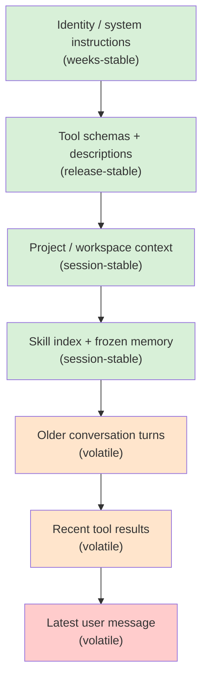

# Chapter 04 — Prompts, context, and the cache that pays for it

## TL;DR

system prompt 不是一个字符串。它是一个被组装出来的结构，由两半构成：一半是稳定的前缀（prefix），在轮次之间不应改变（系统规则、tool schema、项目 context、冻结的 memory 快照）；另一半是易变的尾部（tail），它会改变（最新的用户消息、近期的 tool 结果）。各家 provider 都会缓存这个前缀，所以一个稳定的前缀只需付费一次，之后每一轮都复用——而一个哪怕只改了一个字节的前缀，每一轮都要付全价。本章讲的是：如何组装 prompt 才能让 cache 真正命中、是什么破坏了它（几乎总是你没注意到的某个东西），以及如何设计这个 builder，让 memory 更新、tool 变更和 compaction 不会悄无声息地把你刚刚付过费的东西全部作废。

---

## Why this matters

你上线了一个 agent。它运行良好。两周后，你的账单是预期的四倍。你翻看模型用量日志，发现 `cache_read_input_tokens` 接近于零，而 `cache_creation_input_tokens` 是满的。prompt 每一轮都在从头重建。你检查 system prompt——在最顶部赫然写着一个 `Date.now()`，那是你当初为了"让助手知道当前时间"以求贴心而加上的。每一轮都有一个不同的时间戳，每一轮都是 cache miss，每一轮都付全价。

修复只需一行。但教训更大：cache 省下的钱在它失效之前是隐形的，而 prompt 有六七种方式能悄悄破坏它。本章讲的就是如何设计 prompt，让这件事不发生。

---

## The concept

### The prompt is an assembled structure

一个有用的心智模型：prompt 是一摞分层堆叠的结构，从最不可能改变的放在顶部，到最可能改变的放在底部，依次排序。



稳定与易变之间的分界线，大致就是可缓存与不可缓存之间的分界线。设计 prompt，主要就是把各部分放到这条线的正确一侧，并让它们一直待在那儿。

OpenCode、Hermes Agent、OpenClaw，以及几家领先的商用 coding agent，构建 system prompt 时大致都遵循这个顺序，并通过一个确定性的合并过程，确保在没有任何实质变化时，调用之间的字节序列完全一致。

### The immutability rule

最出人意料的一条规则，也是大多数团队靠违反它才学会的一条：*system prompt 一旦构建完成就被冻结。*

如果某个 tool 在 loop 中途运行并写入了 `MEMORY.md`，正在运行的 system prompt 并不会改变。这次更新会在*下一个 session* 才变得可见，而不是这一个。Hermes Agent 明确强制了这一点——以文件为后端的 memory 更新被刻意设计为不反映到正在运行的 prompt 中。领先的 coding agent 也是同样的做法。原因是机械性的：对前缀字节序列的任何改动，都会让其后每一轮的 cache 失效。

这条规则有两个值得吸收的推论：

- **你能在长 session 中保持 prompt cache 持续预热**，当且仅当没有任何东西在运行途中重写前缀。后台的 memory 写入落到磁盘上；它们会在下一个 session 启动时被读取。
- **一个"实时"的 prompt 比一个冻结的 prompt 贵得多**，往往是好几倍。如果某个功能感觉需要实时更新 prompt（"每一轮都把当前时间展示给模型"），把它放进易变的 tail，而不是稳定的前缀。

### Caching, in provider-neutral terms

provider 真正缓存的是你消息流的一个*前缀*。如果下一次请求的前缀与上一次请求的前缀逐字节匹配，provider 就会跳过对这些 token 的重新处理，并只按正常价格的一小部分向你计费。具体机制因 provider 而异：

- **OpenAI 风格的 API** 会自动缓存前缀。没有任何标记——只要你的 token 与早先的请求匹配，你就拿到折扣。
- **Anthropic 风格的 API** 需要显式的 `cache_control` 块。你最多可以标记四个断点；provider 会各自独立地缓存到每个断点为止。
- **其他 provider**（Bedrock、Gemini、Vertex）介于两者之间，通常通过你 SDK 的归一化层暴露出来。

无论哪种方式，对你的 prompt builder 而言规则都一样：让前缀字节保持一致，把变化放到末尾。provider 之间的差异，只在于你能多激进地塑造 cache，以及如何度量命中。

```ts
// Anthropic-style explicit caching — mark a breakpoint at the end of the stable prefix.
{
  system: [
    { type: "text", text: identitySection },
    { type: "text", text: toolSchemas },
    { type: "text", text: projectContext,
      cache_control: { type: "ephemeral" } }  // ← cache up to here
  ],
  messages: [ ...volatileTurns ]
}
```

### The four-block sliding window

Anthropic 的 caching 让你可以把断点放在*消息*上，而不只是 system 块上。在生产系统中浮现出的一种模式是*四块滑动窗口*：在 system prompt 末尾放一个断点，再在最近几轮 user/assistant 消息上放三个。Hermes Agent 的 `apply_anthropic_cache_control` 做的正是这件事；几家领先的商用 coding agent 也呈现出同样的形态。

这给你带来的好处是：一段长对话能让 system prompt 永久保持预热，*并且*每一轮都重新缓存最近的两三轮，于是下一轮实际的新 token 成本大致就是用户刚刚输入的内容加上最新的 tool 结果。没有这个机制，一段五十轮的对话会在每一步都重新处理一块不断增长的近期历史；有了它，近期历史的开销大致保持恒定。

第一天你并不需要它。当你第一次眼睁睁看着成本随对话长度超线性增长时，你才会去用它。

### Cache TTL: short, long, and warming

cache 条目并非永久存活。截至 2026 年年中，Anthropic 的 ephemeral cache 每个断点默认大约存活五分钟，可以选择以每 token 的价格溢价将其延长到约一小时；OpenAI 风格的自动 caching 使用一个类似的、由 provider 管理的窗口。在调优之前请查阅你 provider 当前的定价——这些数字会变。然而，架构层面的 trade-off 是稳定的：

- **短 TTL** 适用于活跃 session，即连续轮次之间相隔数秒或数分钟。每一次命中都会刷新条目，于是一段繁忙的对话永远不会遇到过期。
- **长 TTL** 在 session 呈突发式（bursty）时值得那笔前置溢价——用户问了个问题，走开半小时，又回来。没有更长的 TTL，整个前缀会在他们回来时重新付费。
- **Cache warming** 对网关（gateway）式系统来说是个小众但有用的模式：在 session 创建之后（或在被驱逐后从磁盘恢复之后），发送一个微小的空操作请求，在用户真正发出第一条消息之前先把 cache 预热好。一些生产网关会对高价值 session 透明地这么做。

正确的设置来自观察你真实流量中*轮次之间的实际时间间隔*。如果你的 p50 轮次间隔小于一分钟，默认 TTL 就够了。如果你的 p90 超过十分钟，长 TTL 的溢价几乎肯定比让 cache 冷却、然后在每次回来时重新付全价更便宜。这个决策是数据驱动的——让你的 agent 把直方图拉出来并挑选阈值；不要靠肉眼估。

### What breaks the cache

几乎所有诱人的东西都是危险的。常见的"惯犯"，具体来说：

- **前缀里的 `Date.now()` 或任何时间戳。** 每一轮都是一个新值。每一轮都是 cache miss。
- **Tool registry 的变更。** 增加或移除一个 tool 会改变 schema 的字节，而这些字节位于前缀的早段。请按 (agent, model) 组合对 schema 数组做 memoize，但要明白：registry 的变更是昂贵的。
- **非确定性的排序。** 如果你用 `Object.entries()` 或一次文件系统遍历来组装 prompt，又不排序，那么顺序可能随运行时版本、随操作系统、随心情而变。OpenClaw 使用一个静态的 `CONTEXT_FILE_ORDER` 映射；Hermes Agent 使用一个固定的 section 列表。选定一个顺序并把它钉死。
- **更新正在运行 prompt 的后台 memory 写入。** 这一点在 immutability rule 中已经讲过——值得重申，因为它是最容易在不经意间引入的一种。
- **注入到共享前缀里的用户专属数据。** 如果多个用户访问同一个 agent，那么每用户的数据属于 tail；前缀应当与用户无关。
- **空白字符与格式的漂移。** 一个多出来的换行符就算 miss。如果你用模板生成 prompt，请把空白字符锁死。
- **依赖 locale 的格式化**（对数字调用 `toLocaleString()`、对日期调用 `format()`），会在不同机器上产生不同的字节。
- **包含 session ID 的"session start"横幅。** 看上去人畜无害，却会跨 session 摧毁 caching。
- **在磁盘上重写你 prompt 模板的自动格式化工具（auto-formatter）或 linter。** 一个保存即格式化的工具，插入一个末尾换行符或归一化引号，会在服务下次部署时悄无声息地让每一个已缓存的前缀失效。
- **高精度的数值格式化。** 把一个分数或价格以完整浮点精度渲染进前缀，可能在不同机器或不同库版本上产生不同的末位数字。

最短的调试路径是：在每个请求上记录一个指纹（fingerprint）——渲染后前缀的一个 SHA——并观察这个值跨轮次的变化。如果在没有任何实质变化时指纹却变了，你就有一处泄漏。本章后面我们还会再用到这个指纹两次。

### Layered fingerprints when the prefix drifts

单一的、覆盖整个前缀的指纹能捕捉到漂移；但它无法告诉你漂移*来自哪里*。便宜的升级是：在记录整体指纹的同时，为前缀的每一层各记录一个指纹：

```ts
debug: {
  prefixFingerprint:   sha(prefix.bytes).slice(0, 12),
  identityFingerprint: sha(prefix.identity).slice(0, 12),
  toolsFingerprint:    sha(prefix.toolSchemas).slice(0, 12),
  contextFingerprint:  sha(prefix.projectContext).slice(0, 12),
  memoryFingerprint:   sha(prefix.frozenMemory).slice(0, 12)
}
```

当整体哈希漂移时，每层的哈希能把原因定位下来。跨部署的一次 tools 哈希变化，通常是某个已启用 tool 的增删，或一处描述的编辑。session 中途的一次 context 哈希变化，通常是一次 workspace 遍历的重排序，或某个 context 文件在磁盘上被重写。session 期间的一次 memory 哈希变化，就是 immutability rule 被违反了。这种分层视角，把*"cache 在某处坏了"*变成一行日志里的*"有人编辑了某个 tool 的描述"*。

对于那些分层哈希把嫌疑范围缩小、但还没点名到具体字节的情形，把最近一次成功渲染的前缀暂存到磁盘（或一个小的内存环形缓冲区），然后把当前这个跟它 `diff` 一下。一个游离的换行符、一个被重排的键、一个高精度数字——全都会立刻现形。OpenCode 和 Hermes Agent 出于其他原因（compaction、session resume）已经持久化了渲染后的前缀；把它变成一个调试面板只需几行代码，而不是一套新系统。

当 cache 命中率下降、而你又坚信*"什么都没改"*时，这就是你该拿出来的工具。

### Tool schemas are part of the prefix

tool 定义位于 prompt 的靠顶部位置，而且它们往往很大。它们的变化也比人们预想的频繁——启用一个新 tool、微调一处描述、收窄一个 enum、增加一个参数，全都会改变字节。生产系统中通行的模式：

- **按 agent profile 对 tool schema 数组做 memoize。** OpenCode 按 (agent, model) 组合来做，于是相同的 agent 共享一个相同的 schema 字符串。
- **把顺序钉死。** tool 每次都应以相同顺序出现。按字母排序，或使用一个保留插入顺序的 registry，但绝不要去遍历一个无序的哈希。
- **把 tool 描述的编辑当作前缀变更对待。** 它们*就是*前缀变更。在 session 边界处发布它们，而不是在 session 中途。

这也是为什么 Ch.03 那条"更少的 tool，更锐利的推理"会带来第二重红利：更少的 tool 就是更少的前缀字节，就是更多的 cache 复用。

### Compaction is a cache discontinuity

Ch.02 把 compaction 作为每次迭代的一种结果引入，与 continue 和 stop 并列，而具体技术留到了 Ch.05。这里值得点明的一点是：compaction 会在它触发的那一轮破坏消息级别的 cache——消息数组已被重写，provider 从那一点起看到的是一个新前缀。

一个有用的设计选择：在历史的*尾端*做 compaction（把最老的几轮总结成一段简短文字，让近期轮次原封不动），而不是在中间。尾端 compaction 牺牲的是那些本来就快要滚出去的内容的 cache；中间 compaction 则会让从 compaction 点往后的一切都失效，而那可能是对话的绝大部分。OpenCode 的 `SessionCompaction.Service` 和 Hermes Agent 的 `ContextCompressor` 都是这么工作的——它们保护一个近期轮次的窗口，只重写更老的内容。

compaction 的触发本身也是一个关乎 cache 的决策。激进地 compaction（每五轮一次）会频繁烧掉 cache；被动地 compaction（只在即将溢出时才做）能让 cache 保持预热更久。大多数系统最终都收敛到被动式。

### Per-agent prompt variants without cache explosion

multi-agent 系统（Ch.10、Ch.14）每个 agent 有不同的 prompt——explore、build、plan、compaction、titler、summarizer。天真的做法意味着 N 个不同的 system prompt 和 N 份不同的 cache。能让 cache 保持可共享的模式是：

- **把真正共享的部分放在最前面**——通用规则、基础 tool registry、项目 context。
- **把 agent 专属的覆盖项放在其次**——额外的 tool、permission 规则、agent 人格、特定角色的指令。
- **在两半之间的边界处做 cache。**

OpenCode 用的正是这种形态：一个两段式的 system 数组，前半段是模型系列（model-family）规则，后半段是 agent 专属内容。前半段在一个 session 里对所有 agent 都保持 cache 预热；只有当你从 `explore` 切换到 `build` 时，后半段才付一次 cache miss。节省是复利式叠加的：在一个频繁进行 agent 交接的 session（在 coding 工作流中很常见）里，共享的那一半可以命中 cache 数千次。

### Project context comes from somewhere

图中"project / workspace context"那一层不是凭空出现的。生产 agent 通过一条在 session 启动时只运行一次的固定流水线来发现它：

- **从工作目录向上遍历**，寻找 context 文件（`AGENTS.md`、项目级指令文件、`README.md`、仓库根标记）。领先的 coding agent 通常在第一个 git 根或文件系统边界处停止。
- **以确定性的顺序读取。** OpenClaw 的 `CONTEXT_FILE_ORDER` 是一个静态映射（`soul.md`、`identity.md`、`AGENTS.md`、`MEMORY.md`、`README.md` 处于固定位置）；Hermes Agent 在 `build_system_prompt` 中使用一个固定的 section 列表。把顺序钉死，让同一个项目多次运行之间的字节完全一致。
- **限制大小。** 一个塞进前缀的 50-KB `README.md`，第一次是 50 KB 的 cache miss，之后则是 50 KB 要永久保持预热的载荷。截断它，或在 session 启动时用一个廉价模型总结一次，并把这份总结缓存到磁盘上。
- **先快照，再冻结。** session 启动时磁盘上是什么，正在运行的 prompt 看到的就是什么，没有例外。session 中途对这些文件的编辑影响的是下一个 session，而不是这一个——与 memory 是同一条 immutability rule。
- **尊重隐私边界。** 一个多用户 agent 绝不能把用户专属文件读进共享前缀。要么按用户给 cache 划分作用域（每用户不同的 cache 行），要么把用户数据保留在 tail 里。

OpenCode 通过按项目（per-project）的 cache 来解析项目作用域内的状态，于是两个项目不会把 context 渗入彼此的 prompt。各系统通行的总原则是：*发现（discovery）是 builder 的一部分，而 builder 正是你的指纹所覆盖的东西。*如果两次 session 之间，workspace 遍历发现了一个新文件，或某个文件在磁盘上变了，你的指纹就应当改变，而你应当预期（并接受）这次 cache miss。钉死顺序、限制大小的意义在于：确保唯一的 cache miss 是*真实的*那些——而不是文件系统遍历顺序带来的假象。

### Snapshot vs. live: where memory enters the prompt

到了 Ch.05–07，大多数系统至少有两个 memory 来源：

- **以文件为后端的 memory**（MEMORY.md、USER.md、skill 文件）——在 session 启动时读取，*烘焙进* system prompt，冻结。
- **外部或被查询的 memory**（向量数据库、知识库、检索到的文档、新鲜的搜索结果）——每一轮拉取，存活在*易变的 tail* 里，而不在前缀里。

这种拆分之所以存在，*正是因为* caching。任何必须新鲜查询的东西都无法安全缓存；任何能加载一次并保持稳定的东西都可以。Hermes Agent 把这个区分写得很明确：`MemoryManager.prefetch_all()` 在 loop 开始之前只运行一次，它返回的内容被折叠进冻结的前缀；loop 中途的 memory 查询则作为 tool 结果加进 tail。

规则是：如果你的 memory 层想进前缀，就冻结它。如果它想要实时，就接受 tail。试图两者兼得——对一个"稳定"的前缀做实时更新——是各团队意外摧毁自己 cache 命中率最常见的方式。

### The cache and the resume button are the same thing

一个值得注意的副作用：让 cache 保持预热的那套纪律，正是让 session resume 能工作的同一套纪律。一个冻结的前缀、一次确定性的构建、一个稳定的字节序列——这些恰恰就是你从磁盘把一个 agent 重新水合（rehydrate）并毫无意外地继续下去所需要的东西。

如果你能证明在进程重启之后你的前缀指纹仍然相同，你就能对着一份预热的 cache 进行 resume。Hermes Agent 在 `SessionDB` 中持久化的 system prompt 正是为此而存在——网关可以停止再重启 agent，而无需为它自己的前缀重新付费。Paperclip 的 adapter session 编解码器（codec）在更上一层栈里服务于同样的目的：orchestrator 存储的不透明状态，让下一次心跳（heartbeat）能逐字节地从上一次停下的地方接着跑。

这就是为什么那些跳过 Ch.04 这套纪律的团队要付两次费：他们的 cache 命中率很差，*而且*他们的 resume 故事很脆弱。这两件事是同一个问题的两个侧面，它们共享同一个修复。我们将在 Ch.08 重新接上这一话题。

### Cache hit rate is observability

一份你不度量的 cache，是一份你无法信任的 cache。provider 在每个响应上都返回用量字段；追踪它们，并随时间观察它们的比率：

```ts
// Cache hit ratio — what fraction of input tokens came from the cache.
type Usage = {
  input_tokens: number;
  cache_read_input_tokens?: number;     // a hit
  cache_creation_input_tokens?: number; // first time, paid full
  output_tokens: number;
};

function cacheHitRatio(usages: Usage[]) {
  const cached  = sum(usages.map(u => u.cache_read_input_tokens     ?? 0));
  const created = sum(usages.map(u => u.cache_creation_input_tokens ?? 0));
  const fresh   = sum(usages.map(u => u.input_tokens));
  return cached / Math.max(cached + created + fresh, 1);
}
```

按 session、按 agent 把这个数字画出来。对一个稳定的多轮工作流，合理的值通常在 60% 到 95% 之间。当它下降时，第一件要检查的事是上一小节里的前缀指纹；第二件是看看是否有一次发布改动了某个 tool 描述、某条指令，或某个 context 文件。

这个指标属于 Ch.16 的 trace 流水线。你越早把它接上，就越快能在账单到来之前抓到下一个等价于 `Date.now()` 的问题。

### The prompt-builder contract

一个干净的 prompt builder 有两个方法和一个调试辅助函数：

```ts
type PromptBuilder = {
  buildStablePrefix(session: Session): Promise<StablePrefix>;
  buildVolatileTail(run: RunState):   Promise<Message[]>;
};

async function buildRequest(s: Session, r: RunState, b: PromptBuilder) {
  const prefix = await b.buildStablePrefix(s);
  const tail   = await b.buildVolatileTail(r);
  return {
    system:   prefix.blocks,
    messages: tail,
    debug:    { prefixFingerprint: prefix.sha256 }  // log on every request
  };
}
```

这个 contract 把纪律强制了下来。稳定的走一条路，易变的走另一条；任何溜进错误那一半的东西，要么被类型系统抓住，要么被指纹抓住。当某个东西悄悄发生位移时，指纹就是那把"冒烟的枪"——一行日志，抓住一个任何单元测试都抓不到的回归。

Hermes Agent 更进一步，把渲染后的前缀持久化到它的 SessionDB。当网关把内存中的 agent 驱逐掉，而下一条用户消息又把它重建出来时，*完全相同的那串字节*被重放，cache 跨过这次驱逐照样命中。对于 agent 不常驻内存的网关式架构，这是黄金标准。如果你无法持久化完整前缀，至少持久化指纹和生成它的那些输入——这样当 cache miss 时，你能证明它究竟是一个 builder bug，还是一次合法的变更。

---

## Real-system notes

- **OpenCode** 使用一个两段式的 system 数组（模型系列规则 + agent 专属覆盖项），在调用之间为 Anthropic caching 保持不变，按 (agent, model) 组合对 tool schema 做 memoize，并有一个 `SessionCompaction.Service`，在总结更老历史时保护一个近期轮次的窗口。
- **Hermes Agent** 是端到端 cache-aware 设计的最强参考：以文件为后端的 memory 是一份在 session 启动时烘焙进 prompt 的冻结快照，system prompt 被持久化到 `SessionDB` 以挺过 agent 驱逐，一个四块滑动窗口的 `cache_control` 断点（system + 最近三条消息）让近期轮次保持可重新缓存。
- **OpenClaw** 通过一个静态的 `CONTEXT_FILE_ORDER` 映射来维持 cache 的稳定性，以实现确定性的文件合并（`soul.md`、`identity.md`、`AGENTS.md`、`MEMORY.md`、`README.md` 始终处于相同位置），并隔离 provider 专属的 prompt 文件，使得一次模型系列的变更不会让其他 provider 的 cache 失效。
- **Paperclip** 自己并不构建内层的 system prompt——那是 adapter 的事——但它不透明地持久化 session 参数，让 adapter 能跨心跳重放它们。在 orchestration 层面的教训是：prompt 的连续性是一个状态管理（state-management）问题，而不是一个字符串构建问题。

---

## Common failure cases

*这些失败是持久的；它们的修复演进得最快——每一条都点名了模式，把当下的具体细节留给你和你的 AI 伙伴。*

- **一个实时值溜进了前缀。** 一个时间戳、一句 session 问候语，或一个每轮计数器篡改了稳定前缀，于是 cache 永不命中、账单悄悄翻倍。*修复：把前缀指纹变成一个告警，并把任何动态的东西都视为有罪、直到被证明是静态的，让它归入易变的 tail。*
- **一次部署悄悄让每一份预热的 cache 失效。** 一个 formatter、一次依赖升级，或一处被编辑的 tool 描述，挪动了前缀字节，于是所有 session 同时重新预热。*修复：把渲染后的前缀当作一个受变更控制、带分层指纹的构建产物对待，并在 session 边界处发布有意为之的变更。*
- **一旦超过一个租户，cache 纪律就崩了。** 一个与用户无关的前缀在租户之间泄漏，或者把每用户数据折叠进去，又把共享 cache 砸成了一次性的条目。*修复：在 builder 和 cache key 中把"共享/每租户"的边界显式化——共享块缓存一次，作用域内的 tail 以租户为键（Ch.15）。*
- **compaction 触发得太激进，让 cache 一直冷着。** 一个固定节奏的触发器，在 context 压力逼迫它之前就重写了消息数组，扔掉了对话本来即将复用的 cache。*修复：被动地 compaction，而不是按节奏；在尾端 compaction，绝不在中间（Ch.05）。*

---

## Pair with your agent

几个在本章很好用的 prompt：

- *"审计我当前的 system prompt。找出每一处可能在调用之间变动的部分——时间戳、locale 格式化、非确定性排序、用户专属数据、session ID——并重写 builder，让前缀字节稳定。"*
- *"在每条请求日志里加上我渲染后稳定前缀的一个 SHA-256 指纹。跑一个真实的十轮 session，把每一轮的指纹给我看。如果它漂移了，找出原因。"*
- *"实现四块滑动窗口模式：在我 system prompt 末尾放一个 `cache_control` 断点，再在最近的 user/assistant 消息上放三个。然后在一段二十轮的对话里，把 `cache_read_input_tokens` 与 `cache_creation_input_tokens` 画出来对比。"*
- *"把我的 prompt 组装重构成一个两段式 system 数组——模型系列规则在前，agent 专属覆盖项在后。再加一个第二 agent profile，并向我证明 cache 的前半段在它们之间是共享的。"*
- *"我的 agent 有一个会在 session 中途更新的 `MEMORY.md` 文件。改造这个 loop，让更新写入磁盘、但正在运行的 system prompt 保持冻结。用指纹验证一次 memory 写入之后前缀字节未变。"*
- *"带我走一遍 Hermes Agent 是如何在 SessionDB 中持久化它的 system prompt，并在 agent 驱逐之后逐字节相同地重放它的。然后为我的技术栈实现一个等价物——哪怕是一个能挺过进程重启的最小版本。"*
- *"拉出我最近五十个 session 的轮次间隔时间直方图。用 p50 和 p90 来给我推荐一个 cache TTL 设置，并附上为什么这么做的算账——把长 TTL 溢价的成本与冷返回时重新缓存的成本做比较。"*

---

## What's next

你现在有了一个被设计成保持 cache 预热且可复现的 prompt。下一个问题是它所坐落其上的那条易变的 tail——对话历史、tool 结果，以及每一轮都在增长的工作 memory。Ch.05 讲的是如何在不破坏你刚刚构建的 cache 的前提下，防止那条 tail 爆炸；Ch.06–07 讲的是那个更长期的 memory，它会反馈进*下一个* session 的前缀——本章这套纪律正是在那里开始为你回本的。

---

<!-- nav-footer -->
<div align="center">

[⬅️ 上一章：Ch.03 Tools the agent can trust](03-tools-validation.md) · [📖 课程目录](../../README_zh.md) · [下一章：Ch.05 Short-term memory ➡️](05-short-term-memory.md)

</div>
