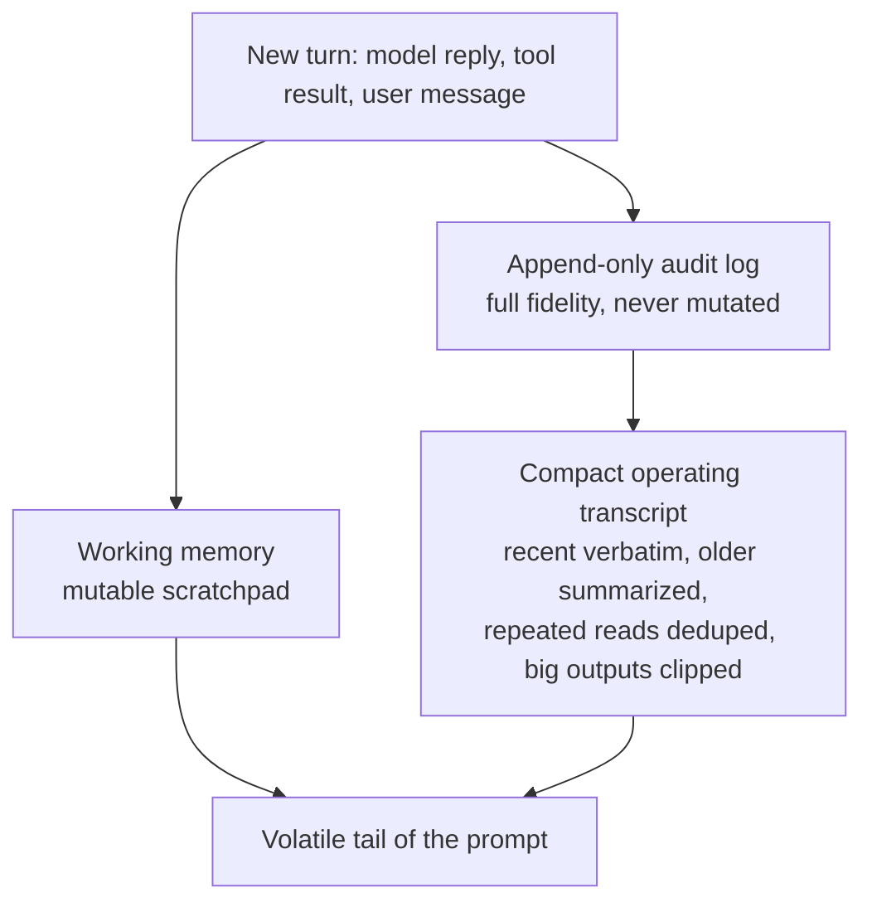

# Chapter 05 — Short-term memory

## TL;DR

Short-term memory（短期记忆）就是 Ch.04 中 prompt 那条易变尾部里的一切——对话记录、最近的 tool 结果，以及 agent 用来追踪当前任务的一小块草稿区（scratchpad）。它是每一轮都在增长的那一层，也是 loop 跑久了最先崩溃的那一层。本章讲的是这块记忆的三种视图（append-only 的审计日志、紧凑的运行视图、可变的 scratchpad），以及生产系统用来在不丢失模型所需信息的前提下控制运行视图体积的那六七种技术：裁剪 tool 输出、对重复读取去重、非对称缩减、轮内 summarization、先折叠后压缩的两阶段、以及按 tool 区分的处置规则。

---

## Why this matters

你的 agent 已经跑了四十轮。每次读的每个文件、每次 grep、每次 web fetch、每次模型轮次——全都堆在 prompt 里。每轮的成本在线性增长。然后模型返回了 `prompt_too_long`。你加了一步去 summarize 旧的轮次。下一轮成功了。再下一轮，summary 本身又太长了。你又加了一步去 summarize 那个 summary。现在模型已经丢掉了原始任务，agent 在解一个三轮之前的问题。

short-term memory 做砸了，在它爆炸之前一直是隐形的；做好了，则因为它从不爆炸而始终隐形。本章讲的就是这两者之间的差别。

---

## The concept

### Three views, not one

一个生产级 agent 没有*一份*记录，它有三份。



- **append-only audit log（只追加审计日志）**是事实真相。每一次模型轮次、每一次 tool call、每一次 tool 结果，全量保留。你永远不去编辑它。它是 resume（Ch.08）的动力来源，也是日后审计员想查看的东西。
- **compact operating transcript（紧凑运行记录）**才是模型在下一轮实际看到的内容。每次组装 prompt 时它都从 audit log 重新构建——经过裁剪、去重、summarize。它是一个*视图*，不是一个*存储*。
- **working memory（工作记忆）**是 agent 为当前任务维护的一小块可变 scratchpad——目标、当前计划、已读过的文件、悬而未决的问题。它可以每一步都被覆盖。

把这三者分开，是让本章其余一切得以成立的设计。编辑了 audit log，你的 resume 就坏了；放任 operating transcript 无界增长，你的 loop 就死了；让 working memory 变成另一份 transcript，你就把同一个问题制造了两遍。

OpenCode 用 `SessionTable` 和 `PartTable` 显式编码了这种拆分来承载 audit log，并用一个 compaction 服务按需产出运行视图。Hermes Agent 用一张带 FTS5 的 SQLite `messages` 表做审计，用一个 `ContextCompressor` 产出紧凑视图。形态是一样的。

### Clip tool outputs at the boundary

杠杆率最高的单一动作：在大块 tool 输出*进入* operating transcript *之前*就把它裁掉。一个 50 KB 的 grep 结果，从现在直到对话结束，每一轮都是 50 KB 的 context。

```ts
// Clip with a visible omission marker. Silent truncation teaches the model a false view.
function clip(text: string, maxChars = 2_000): string {
  if (text.length <= maxChars) return text;
  const half = Math.floor(maxChars / 2);
  return [
    text.slice(0, half),
    `\n[... ${text.length - maxChars} chars omitted; full result available via <ref> ...]\n`,
    text.slice(-half),
  ].join("");
}
```

来自生产环境的两条规则：标记必须可见（模型需要知道内容被裁剪过，否则它会当成自己拿到了完整内容来推理），而完整结果必须存放在某个模型确实需要时能去取的地方——临时文件、附件，或一个独立的 retrieval tool。OpenCode 的截断服务把完整结果写到磁盘，返回一个片段加一个指针；Hermes Agent 在每个 tool registry 条目上强制一个 `max_result_size_chars`。两者都是同一形态的变体。这个存放点是带有自身生命周期的持久化存储——指针何时过期、附件在哪里被 garbage-collected、当模型去取一个已经消失的 `<ref>` 时会发生什么——这些是 Ch.08 的关切，不是本章的。

### Deduplicate repeated reads

如果模型在第 3 轮读了某个文件，第 17 轮又读了一遍，operating transcript 并不需要两份。把较早的那份丢掉，保留最新的：

```ts
// Latest-wins dedupe: keep only the most recent result per (tool, input) pair.
// Skip tools flagged open_world (Ch.03) — their results are not stable across calls.
function dedupeRepeatedReads(messages: TranscriptMessage[], registry) {
  const stable = (m) => m.role === "tool" && !registry[m.toolName]?.open_world;

  const latest = new Map<string, number>();
  messages.forEach((m, i) => {
    if (!stable(m)) return;
    const key = JSON.stringify({ tool: m.toolName, input: m.toolInput });
    latest.set(key, i);
  });
  return messages.filter((m, i) => {
    if (!stable(m)) return true;  // user/assistant turn, or open-world tool: keep
    const key = JSON.stringify({ tool: m.toolName, input: m.toolInput });
    return latest.get(key) === i;
  });
}
```

关键在于按 (tool, input) 而非按文本去重——基于文本的启发式既脆弱又有损。语义是：对同一 tool 用同一参数的最近一次调用，会取代更早的调用。对一个大量执行 `read_file` 的 coding agent 来说，这是继裁剪之后省下最多的一招。

去重只有在 tool 的结果*在给定输入下稳定*时才安全。对同一 URL 的 `web_fetch` 在第 3 轮和第 17 轮可能返回不同的字节；在两轮之间被编辑过的文件，其 `read_file` 已不再与更早的读取相符；`now()` 或 `random()` 按定义就是每次不同。Ch.03 的 `open_world: true` 元数据正是用来标记这些情况的，去重会跳过它们——对可变内容的早期读取，仍记录着当时重要的状态。如果你的 tool 返回可变状态而你没把它标成 `open_world`，那么你的去重就在悄悄丢掉早期快照，而模型会当成最新那份从一开始就成立来推理。

一个有用的副作用：去重也是 doom-loop 的信号。连续三次完全相同的 tool call 配完全相同的输入，正是 Ch.02 用来检测卡死 loop 的同一特征。同一次扫描两件事都能办到——把重复折叠掉，如果数量过多就暂停。

### Asymmetric reduction: protect both ends, compress the middle

一刀切的策略（"保留最后 8 轮，其余 summarize"）能管用到一定程度，但会漏掉要紧的信息。生产系统里通行的模式是*非对称*的：把最近一段轮次以全保真保留，把*最早*一小段轮次也以全保真保留，然后 summarize 介于两者之间的一切。

- **OpenCode** 使用 `DEFAULT_TAIL_TURNS = 2`——最后两轮不受任何 compaction 影响。
- **Hermes Agent** 的 `ContextCompressor` 保护开头的 *N* 轮和结尾的 *N* 轮；只有中间被 summarize。
- 任何设计良好的系统一旦被推过四十轮，都会出现同一形态。

两端都被保护的原因是：*开头*承载着模型反复回看的任务框定（原始目标、关键约束、用户真正的问题），而*结尾*承载着模型此刻正在推理的最新状态。中间是模型已经推理完毕的部分——事实还在，原始轮次不在了。

### Mid-turn summarization

当裁剪和去重还不够时，你就 summarize。标准模式是用一个廉价的辅助模型，把 transcript 的中段压缩成一小块参考性的内容块：

```ts
// Compaction inserts a summary block as content the model can read.
async function compactTranscript(messages, opts) {
  const { keepHead = 2, keepTail = 6, summarizer } = opts;
  if (messages.length <= keepHead + keepTail) return messages;

  const head   = messages.slice(0, keepHead);
  const middle = messages.slice(keepHead, -keepTail);
  const tail   = messages.slice(-keepTail);

  const summary = await summarizer.summarize({
    purpose: "Preserve facts needed to continue the task. Reference only.",
    messages: middle,
  });

  return [
    ...head,
    { role: "user",
      content: `[SUMMARY of ${middle.length} earlier turns]\n${summary}` },
    ...tail,
  ];
}
```

实践中有三个要紧的细节：

- **summarizer 是另一个模型。** OpenCode 跑一个专用的 `compaction` agent，不带 tool，token 预算固定；Hermes Agent 调用一个配成更便宜、更快模型的 `auxiliary_client`。compaction 是少数几个跑*能力较弱*的模型才是正确选择的场景之一：它在每个长会话上都会跑，质量底线是"保住事实"，而成本差会复利累积。
- **summary 的目的是显式的。** *"Preserve facts needed to continue the task"* 产出有用的 summary；*"summarize the conversation"* 产出没用的。要告诉辅助模型它在保住什么、它的输出扮演什么角色。
- **summary 是内容，不是元数据。** 模型在下一轮会把它当作 prompt 的一部分来读。一个清晰的标记（`[SUMMARY of N earlier turns]`）让模型能显式地推理"我并不持有那些原始轮次"这一事实——*"我没有那几轮的细节；如果需要我就重新去取。"*

### What makes a good summary

summary 本身是一门小手艺。一个糟糕的 summary 比没有 summary 更糟——它用笃定的口吻告诉模型一些略有出入的事实，且无从核验。三个属性把有用的 summary 和有害的区分开：

- **保住具体细节，舍弃笼统说法。** *"用户想升级他们的 auth 库"*丢掉了依赖名；*"用户正从 `next-auth@4` 迁移到 `next-auth@5`，并已更新 `app/api/auth/[...nextauth]/route.ts`"*才是模型需要的。事实、文件路径、标识符、日期、决策——这些是承重部分。
- **标明哪些是重建的、哪些是观测到的。** 当"测试通过"的说法来自推断而非直接的 tool 结果时，*"agent 尝试运行了测试套件；从记录看结果不明"*胜过*"测试通过了"*。好的 summarizer 会标出不确定性，而不是把它抹平。
- **在要紧处保留原话。** 当用户说*"就照 Stripe 那样做"*时，summary 应当引用，而非转述。被转述的用户意图每过一遍就漂移一次；被引用的用户意图则稳得住。
- **给 summary 加结构，别只是平铺叙述。** 生产级 summarizer 都收敛到三个小节——*已确立的事实*（文件路径、标识符、已定的结果）、*已做的决策*（连同理由），以及*未决问题*（agent 无法确认的、用户尚未回答的）。一段平铺的文字把三者混在一起，逼模型重新通读。结构化的则告诉模型该从哪儿接手、哪些当参考、哪些要行动。

给 summarizer 的 system prompt 比模型选择更要紧。一个小而 prompt 精良的 summarizer，产出的 summary 比一个大而 prompt 糟糕的更紧凑。OpenCode 和 Hermes Agent 都显式地在这条 prompt 上投入，而这笔投入会在每个长会话上回本。

### Compaction triggers: proactive and reactive

compaction 何时触发？两种策略，都在生产中使用：

- **Proactive（token 阈值）。** 每一步之后，把 operating transcript 的 token 数与 `context_limit − max_output − safety_buffer` 比较。若超出，就在下一次调用前 compact。OpenCode 的 `isOverflow()` 检查在每一步后都跑；safety buffer 通常是几千 token。好处是：compaction 永远不会在糟糕的时刻发生，用户也不必为它在单轮 latency 上买单。
- **Reactive（prompt-too-long）。** 原样发出下一个请求。若 provider 返回 `prompt_too_long`，就捕获它，跑一次更激进的 compaction，再重试。好处是：在真正需要之前你不必为一次 summarizer 调用付费。坏处是：触发它的那一轮用户要多等。

多数团队为了可预测性而收敛到 proactive，再配一个 reactive 兜底以求安全。同一个抽屉里还有第三根杠杆——**model fallback（模型回退）**：当 context 紧张时，切到一个窗口更大的模型（路由在 Ch.17 讲）。当 compaction 会丢掉你丢不起的信息时，就用它。

### The compaction boundary marker

compaction 会往 operating transcript 里插入一个标记——OpenCode 的 `CompactionPart`、Hermes Agent 的 `SUMMARY_PREFIX` 块。这个标记是模型能读到的*内容*，不是隐形的元数据。这一点要紧，有两个原因：

- 模型能就自己的空缺做推理。*"我没有第 5 条到第 30 条消息之间那些轮次的细节，因为它们被压缩了；如果需要我就重新读那个文件。"* 没有标记的话，transcript 里那个突兀的跳跃会把模型搞糊涂，要么彻底无视较旧的 context，要么干脆编造它。
- 标记是 operating transcript 与 audit log 能够对齐的接缝。一个在调试 agent 运行的人，在运行视图里找到标记，再去磁盘上的 audit log 里查原始轮次。

标记应当明确而简短——一行，说明 summarize 了什么、跨了多少轮。再长就是噪声，模型每一轮都得去略读。

### Collapse first, then summarize

便宜的动作排在昂贵的动作之前。两阶段模式是：当 context 开始增长时，先跑激进的裁剪和去重（"折叠"）；只有在那之后 transcript 仍然太大，才动用 summarizer。Hermes Agent 和领先的商业 coding agent 都这么做——先来小而机械、免费的操作；LLM 驱动的 summarization 排第二。

原因：折叠是确定性的，没有每轮成本，而且常常就能完全化解压力。summarization 要多花一次模型调用。把 summarizer 留到真正需要时再用，能让 compaction 平均下来保持便宜——大多数"compaction 事件"根本到不了第二阶段。

### Compaction methods, side by side

凑近看，"compaction"不是一种技术，而是一族，各有不同的成本/质量 trade-off。生产中出现的六种：

| Method | What it does | Cost | What it loses |
|---|---|---|---|
| **Clipping** | 截断任何超过尺寸阈值的单个 tool 结果；插入一个可见标记；把完整结果留在磁盘上。 | 实质免费、确定性。 | 单个结果内部的细节。模型可通过指针重新去取。 |
| **Latest-wins dedupe** | 丢掉同一 `(tool, input)` 调用的更早重复项。 | 实质免费、确定性。 | 模型仍在使用的东西什么都不丢——按定义，较晚的调用已取代较早的。 |
| **History snip** | 丢掉超过固定深度的整段旧轮次（通常是较旧的 tool 结果）；保留模型推理的轮次。 | 免费。 | 旧 tool 结果里的细节；周围的推理被保留。 |
| **Asymmetric summarization** | 一个辅助 LLM 把 transcript 中段压缩成单个参考块；头尾轮次保持原文。 | 每次 compaction 一次辅助模型调用。 | 中段的细粒度结构；只要 summary 塑形得当，事实会被保住。 |
| **Microcompaction** | 与 summarization 相同，但作用于更小的窗口——每次只取最旧的几轮，反复进行。 | 每个长会话若干次小的辅助调用。 | 每次损失更少；但多次累积下来漂移的机会更多。 |
| **Session rotation** | 用一个交接块（handoff block）summarize 所有要紧的东西，开启一个新 session；通过 `parent_session_id` 串接。 | 一份全新的 prompt cache（Ch.04 的成本）；一份新的 audit log。 | 交接块没捕获到的一切。来自 Ch.04 的 cache 温度。 |

在生产中，这些不是互斥的选项，而是一条*流水线*。一个长会话的典型序列：每次插入 tool 时裁剪 → 每次模型调用前去重 → 截掉超过某深度的旧轮次 → 命中阈值时 summarize 中段 → 当 summarization 已跑过两三次后 rotate 这个 session。每种方法都在下一种触发之前为你买来一段时间。

设计决策不是"我挑哪一个"，而是"按什么顺序、用什么阈值"。让你的 agent 为你的技术栈写出这条流水线，并记录每次 compaction 事件触发的是哪种方法——跨一周真实会话的直方图会告诉你阈值是否合理、哪种方法在挑大梁、哪种或许可以去掉。

### Compaction is also observability

一条你不去度量的 compaction 流水线，就是一条你没法调优的流水线。每次 compaction 事件值得记录三样东西：

- **触发的是哪种方法**——clip、dedupe、snip、summarize、microcompact 还是 rotate。跨一周会话的直方图告诉你阈值是否校准。如果每个长会话都触发 summarization、却从不触发 snip，你的 snip 阈值可能太宽松了。如果 rotation 频繁触发，你的 summarizer prompt 可能太弱。
- **前后的 token 数**——每种方法的压缩比。对成本预估有用，也能在有人改了 summarizer prompt、压缩比悄悄变差时抓出回归。
- **模型在多少轮之后回头引用了被 summarize 掉的内容**——如果模型反复去重新取那些已被 summarize 掉的东西，说明你的 summary 漏了事实。如果模型从不回头引用被 summarize 的内容，你可能 summarize 得过于急切，可以把阈值往高调。

这股 metric 流应当进入 Ch.16 的 trace 流水线，与 Ch.04 的 cache 命中率并列。它们合在一起告诉你：你的 prompt 架构在生产中是否真的回本，还是说三个版本之前就悄悄回归了。

### Not all tool results are equal

不同的 tool 在 operating transcript 里值得不同的处置策略：

- **Skill 结果和结构化的 tool 输出**通常短而高信噪比。原文保留。
- **Shell 日志、原始文件转储、网页抓取正文**一旦被消费完就又长又低信噪比。插入时激进裁剪；如果模型已经往下走了，几轮之后整段丢掉。
- **补丁和 diff** 信噪比中等，需要保持可见若干轮以支持后续编辑。保留到补丁被应用或被拒绝，然后丢掉。
- **图像附件**通常很重，但恰好只在一次里高信噪比。在它被引用的那一轮保留，之后的轮次丢掉或压缩成一段文字描述。

OpenCode 的 compaction 显式保护 skill-tool 的结果不被丢掉；Paperclip 把 adapter 的输出分块单独存储，并在 operating transcript 里引用它们。一个有用的练习：把你手上的每个 tool 分类为 `keep_verbatim`、`clip_on_insert` 或 `drop_after_consumed`，并把这个策略和 Ch.03 的元数据一起烤进 tool registry。compactor 读取策略；你就不必一轮一轮地纠结"这个该不该丢"。

### Session rotation: when the conversation becomes a new conversation

对于极长的会话，即便是激进的 compaction 也会丢掉太多。再往上一档：rotate 到一个新 session，向前携带一个 *handoff* 块来 summarize 所有要紧的东西，并用 `parent_session_id` 把新 session 串接回旧的。

Hermes Agent 就这么做——`ContextCompressor` 能生成一个新 session ID，在 SessionDB 中通过 `parent_session_id` 串接，于是完整的血缘可追溯。Paperclip 的 `evaluateSessionCompaction()` 依据每 session 最大运行次数、最大原始输入 token 数、最大 session 寿命（小时）来决定是否 rotate；rotate 时，它写一个 handoff markdown 块来显式地弥合断口。

rotation 比 compaction 更重——一个新 session 有全新的 system prompt 和全新的 cache（Ch.04 的成本）——但它是长跑 agent 最干净的重置。trade-off 是：rotation 为你买来一块白板，却让你赔上积攒起来的 cache 温度。当 summarization 不再够用时再用它；当一次 compaction 就能搞定时别用它。

### Subagent memory is its own

当父 loop 委派给一个 subagent（Ch.10）时，subagent 拿到的是它自己的 short-term memory。父级*看不到* subagent 的中间轮次；subagent 只看到父级递给它的 prompt，加上它自己的 tool 产出的东西。OpenCode 的 `task` tool 创建一个带有父级 context 经过过滤切片的子 session；OpenClaw 的 `sessions_spawn` 也是同样的做法。

这是有意为之。一个把自己的 tool call 灌进父级 transcript 的 subagent，会让 compaction 困难得多，并让中间噪声污染父级的推理。subagent 返回单一观测——它的最终答案——父级的 transcript 只记下这一项。

随之而来、容易绊倒人的推论是：如果你想让父级知道 subagent 的中间工作，subagent 就必须把它包含进自己的最终答案。subagent 私藏的任何东西，对父级而言永远不可见。

### The frozen snapshot, restated

活在 *system prompt* 里的记忆文件——`MEMORY.md`、`USER.md`、agent 笔记、skill 索引——是在 session 开始时捕获的，会话中途不变。这条规则在 Ch.04 已经确立，在这里同样适用。易变尾部（本章）是会话中途变更所在之处；稳定前缀（Ch.04）是会话开始时冻结所在之处。分界线就是 cache breakpoint。

如果你想让某块记忆是活的，就把它放进尾部（tool 结果、working memory）。如果你想让它 cache-warm，就把它放进前缀（记忆文件、system 指令）。想两者兼得——既要实时更新又要被缓存——只会让每一轮都触发一次昂贵的 cache miss。这一对配置——Ch.04 的前缀与本章的尾部——就是 prompt context 的全部架构。其余的一切都是记账。

---

## Real-system notes

- **OpenCode** 是三视图纪律最强的参考：`SessionTable` 和 `PartTable` 承载只追加审计，`Truncate.Service` 在边界处裁剪 tool 结果，`SessionCompaction.Service` 在 `isOverflow` 触发时 proactively 运行，`CompactionPart` 是 operating transcript 里那个可见的边界标记。那个专用的 `compaction` agent（不带 tool、预算固定）是辅助模型模式的好模板。
- **Hermes Agent** 有最干净的轮内 summarization 流水线：`ContextCompressor` 保护头尾轮次，通过 `auxiliary_client.call_llm()` 用一个显式的"仅供参考"标记 summarize 中段，并能在单靠 summarization 不够时 rotate 到一个通过 `parent_session_id` 串接的新 session。每个极长会话最多三次 compaction。
- **OpenClaw** 把每个 session 的 transcript 作为 JSONL 文件存储（每 session 一个文件）作为 audit log，并在 session 开始时把 MEMORY.md 作为冻结快照注入 prompt——与 Ch.04 同样的不可变规则，应用于记忆文件。
- **Paperclip** 是把 compaction 上推到 orchestration 层的范例：`evaluateSessionCompaction()` 盯着最大运行次数、最大输入 token 数和 session 寿命，一旦任一阈值被跨越，就用一个 handoff markdown 块 rotate agent 的 session ID。同一形态，在技术栈上挪高了一层。

---

## Common failure cases

*这些失败是持久的；它们的修法演变最快——每条都点出模式，把当下的具体细节留给你和你的 AI 伙伴。*

- **compaction 把 cache 烧了。** loop 仍在工作，但 compaction 一触发，每轮成本就跳升、再也回不来。*修法：把 compaction 当作一次有意的 cache 重置，并把 compaction 之后的前缀按字节钉死，直到下一次 compaction（Ch.04）。*
- **summary 丢了承重的那条事实。** compaction 刚发生，agent 就重读、重问，或忘了原始任务——从一份几乎对、但不全对的 summary 里笃定地推理。*修法：保护两端，并产出结构化的 facts / decisions / open-questions summary，好让具体细节存活。*
- **compaction 抖动（thrash）。** session 一旦变大，几乎每一轮都触发一次 compaction，summarizer 调用就成了每轮 latency。*修法：滞回水位线（hysteresis water-marks）——一个高位标记触发开始，一个低位标记 compact 到位，好让每次 compaction 买来许多轮。*
- **summary 的 summary 跟丢了主线。** 几次之后 agent 每过一遍就离真正的目标更远，像反复重存一张 JPEG。*修法：永远从 audit log 重新 summarize，绝不从上一份 summary 出发，并在 compaction 次数封顶时 rotate session（Ch.08）。*
- **去重删掉了一份仍然要紧的快照。** agent 表现得好像某个值从未变过，只因只有它最新的那次读取留了下来。*修法：默认不安全的去重——任何在完全相同调用下都可能不同的东西都是 `open_world`、予以豁免（Ch.03）。*

---

## Pair with your agent

几条在本章用得很好的 prompt：

- *"在我的项目里搭起三视图拆分：磁盘上一份只追加的 audit log、一个按需构建紧凑 operating transcript 的函数，以及一个 loop 可读可写的 working-memory 结构体。给我看单独一轮如何流经这三者。"*
- *"给每个 tool 结果加上带可见标记的裁剪。然后写一个测试，验证模型能按引用去取完整结果、并原封不动地拿回原始字节。"*
- *"按 (tool name, tool input) 的 JSON 相等实现 latest-wins 去重。把我最近一次二十轮的会话跑一遍，准确报告 transcript 体积下降了多少。"*
- *"构建非对称缩减：把开头 2 轮和结尾 6 轮以全保真保留，中间通过一个更便宜的模型 summarize。给我看插入 transcript 的边界标记，以及模型下一轮读到它的样子。"*
- *"接一个 proactive compaction 触发器，在 operating transcript 达到 `context_limit − max_output − 4 KB` 时触发。再加一个 reactive 兜底，在 `prompt_too_long` 错误时跑一次更激进的 compaction。把每次 compaction 事件触发的是哪个触发器打印出来。"*
- *"把我 registry 里的每个 tool 分类为 `keep_verbatim | clip_on_insert | drop_after_consumed`。更新 operating-transcript 的构建逻辑去尊重这些策略，并给我看在一个真实会话里的体积影响。"*
- *"我的 agent 偶尔会跑超过 200 轮。实现 session rotation：创建一个通过 `parent_session_id` 串接的新 session，写一个弥合两者的 handoff markdown 块，并在下一条用户消息之前预热新 session 的 prompt cache。"*
- *"加上 compaction observability：记录触发的是哪种方法（clip / dedupe / snip / summarize / microcompact / rotate）、前后的 token 数，以及模型在多少轮之后首次回头引用被 summarize 的内容。把我最近一周会话的直方图画出来，告诉我阈值是否校准良好。"*

---

## What's next

你现在有了一份紧凑、去重、summarize 过、不会撑爆 context window 的 operating transcript。但它没有一样能熬过下一个 session。

Ch.06 讲的是那些*确实*能存活下来的记忆——你在多次运行之间持久化什么、模型如何 retrieve 它，以及 vector 索引、full-text search 和 hybrid retrieval 之间如何比较。Ch.07 接着讲如何安全地写入那块记忆，不去毒化它、也不让它随时间漂移。

---

<!-- nav-footer -->
<div align="center">

[⬅️ 上一章：Ch.04 Prompts, context & cache](04-prompts-context-cache.md) · [📖 课程目录](../../README_zh.md) · [下一章：Ch.06 Long-term recall ➡️](06-long-term-recall.md)

</div>
