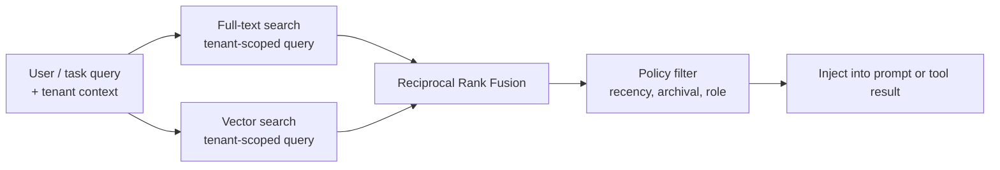

# Chapter 06 — Long-term recall

## TL;DR

short-term memory（短期记忆，见 Ch.05）是模型当下所能看到的内容。long-term recall 则关乎：当前这一轮运行中产生的任何有用信息，如何存活到下一轮运行——以及你之后如何重新找到它。这里有三种 retrieval 范式（semantic vector search、full-text search、curated knowledge），retrieval 有三个可以接入 loop 的位置（在 prefix 中作为冻结的快照、在易变的尾部作为 tool result、在 session 开始时预取），还有一条把它们全部串起来的设计约束：凡是放进 prefix 的东西，必须在各轮之间保持字节级稳定，否则你就会丢掉 Ch.04 里讲的那个 cache。本章讲的是如何挑选正确的组合——不是"加个 vector DB"，而是为当前这个决策选对 context、通过对的机制取回、注入到对的位置。

---

## Why this matters

一个没有 long-term memory 的 agent，会在每个 session 里反复重新学习同样的项目事实、用户偏好和过往失败。一个用错了记忆方案的 agent，则会悄无声息地取回错误的东西——当用户问的是某个具体 error code 时，vector search 却自信地返回一段意思相近的改写；session 之间被重新措辞过的内容，则会被 keyword search 整个漏掉。两者都悄悄失败，都在教模型错误的东西，而且都很容易被误诊为*这模型不行*。

能用的 retrieval，是那种失败模式可见的 retrieval。本章讲的是三种主要机制、它们如何失败，以及如何把它们组合起来，让单点失败不至于变成一个无声的错误答案。

---

## The concept

### What long-term memory actually is

在各类生产系统中，"long-term memory"通常是四类东西叠在一起：

- **纯 markdown 文件** —— `MEMORY.md`、`USER.md`、agent 笔记、skill 文件。人类可读、人类可编辑，在 session 开始时被冻结进 system prompt。Hermes Agent 和 OpenClaw 都以这种形态为核心。
- **结构化表** —— SQLite（`sessions`、`messages`，带 FTS5 索引），更大的系统里用 Postgres。审计用的 transcript 采用 append-only；用于 recall 时可查询。
- **Vector 索引** —— 可选项，通过 `sqlite-vec`、`pgvector` 或专门的存储叠加在上层。当 keyword search 不够用时，用于 semantic similarity。
- **外部 provider** —— Honcho、Mem0、自建的 retrieval 服务，或包装上述任意一种的 MCP tool。

仅靠 markdown 文件就能撑起一个小型单用户 agent——一个只有一个用户、一台机器和少量笔记的 personal assistant，用文件就足够。但一旦你需要跨 session 搜索、审计历史，或扩展到多个用户——而这正是大多数生产路径的情况——结构化表就成了承重结构。Vector 索引和外部 provider 是叠在上层的；没有它们你也能构建出能干的 agent，而且大多数路径在第一天都用不上它们。

### Storage shapes, picked by access pattern

| 形态 | 最适合 | 更新方式 | retrieval |
|---|---|---|---|
| Markdown 文件 | 身份、用户画像、项目规则、skill 内容 | 人类或 curator | session 开始时整文件读取 |
| 结构化表（+ FTS） | 审计日志、session 搜索、按 ID 查 | append-only | SQL 查询、full-text |
| Vector 索引 | semantic recall、改写式查询 | append + embed | k 近邻 |
| 外部 provider | 跨产品记忆、大规模知识 | API push | API 查询 |

第一列同时也是你在加一层之前应该问自己的问题：*在上面那些层还没处理掉的东西里，我的 agent 到底还需要记住什么？* 如果答案是"没有"，那你就不需要这一层。大多数生产 agent 最终落在"markdown + SQLite+FTS"，只有当改写式查询变得常见时才会去碰 vector。

### Three retrieval paradigms

你从三种主要技术里挑选并组合使用：

- **Vector search** 把文本 embed 后取回邻近的 vector。它在改写、相似的历史问题、概念性问题上表现出色。在精确标识符上则失手——ticket 编号、error code、commit hash、函数名。
- **Full-text search**（BM25 或 FTS5）对精确词项建立索引。它在 ID、代码、文件名、精确短语上出色。在改写和概念性查询上则失手。
- **Curated knowledge** 是一小撮维护着的 markdown 页面。当知识集合是有界的、且值得手工编辑时，它表现出色。在规模上则失手——它处理不了成千上万条事实。

```ts
// 三种范式都实现同一个形状——背后是不同的存储。
type Retriever = {
  search(query: string, opts: {
    tenantId: string;
    topK?: number;
    filters?: Record<string, unknown>;
  }): Promise<Array<{
    id: string;
    text: string;
    score: number;
    metadata: Record<string, unknown>;
  }>>;
};
```

一个统一的 `Retriever` 接口让你能够替换实现，或把它们叠起来用。

`tenantId` 这个 filter 不是可选的——retrieval 就是数据访问，一个把某个用户的记忆 recall 进另一个用户 session 的 agent，是一起安全事故，而不是一个 bug。要在存储层强制它（拒绝不带 tenant 的查询），而不是在调用点（在那里它离"被某个粗心的 bug 跳过"只差一步）。

### Hybrid retrieval, the default

对大多数 agent 来说，vector 和 full-text 合用都优于单独使用任一种。标准的合并方式是 reciprocal rank fusion（倒数排名融合，RRF）：



tenant scoping 是一个*查询时*的谓词，而不是合并后的 filter——搜索本身就拒绝返回跨 tenant 的行。任何在合并之后才做的过滤（recency 加权、archival 拒绝、基于 role 的可见性）都是 policy，不是访问控制。把这两者混为一谈正是那个 bug 模式：一个坐落在 retrieval 下游的 tenant filter，意味着跨 tenant 的行早已进过内存——在大多数威胁模型下，这跟泄漏是一回事。

```ts
// RRF：无需训练数据，让在多个列表中都靠前的记录浮上来。
function rrf(rankedLists: Array<Array<{ id: string }>>, k = 60) {
  const scores = new Map<string, number>();
  for (const list of rankedLists) {
    list.forEach((r, idx) => {
      scores.set(r.id, (scores.get(r.id) ?? 0) + 1 / (k + idx + 1));
    });
  }
  return [...scores.entries()]
    .map(([id, score]) => ({ id, score }))
    .sort((a, b) => b.score - a.score);
}
```

RRF 奖励那些在多个列表中都出现的记录，同时仍然允许某个单一的强信号把一条结果托上来。它无需训练，只需要两个形状相同的 ranked list。接好之后，并行运行 vector 和 FTS，把两边的输出都喂给 fuser——这是整个 memory 栈里最廉价的质量提升手段之一。

### Ranking is not just similarity

纯 similarity 分数常常把错的条目顶上来。一条两年前在语义上完美匹配的记录，通常不如一条上周才出现、匹配度略弱的记录有用。生产系统在对结果排序时会依赖三个额外信号：

- **Recency（时近度）。** 对基础分数施加一个小的线性或指数衰减。在 cosine similarity 相同的情况下，昨天的条目胜过去年的。Hermes Agent 的 session search 在汇总结果时会把 recency 加权进去；OpenClaw 则在 vector 和 FTS 命中之上叠加一个 recency boost。
- **Confidence（置信度）。** 在 similarity 相等时，标记为 `user-confirmed` 的条目排在 `agent-inferred` 之上。这个标记来自 Ch.07 的写入路径，但 retrieval 层才是它发挥价值的地方。
- **Access frequency（访问频率）。** 一条 agent 这个月查阅过三十次的条目，多半比一条谁都没碰过的更有用。追踪 `last_accessed_at` 并把它折算进去，既便宜又有效。

在 RRF 之后加一个小的 reranker——recency + confidence + access frequency——对感知质量的提升，往往比换掉底层 vector 模型还大。让你的 agent 接上一个，并按每个 query 记录排名变化；那张直方图会告诉你哪个信号在真正起作用、哪个是死重。

同一个 reranker 也是你彻底拒绝候选项的地方。一条 access frequency 为零、confidence 是 `agent-inferred`、年龄超过 90 天的条目，几乎一定是噪声。在它到达 prompt 之前把它丢掉，而不是让模型去判断它。

### Where retrieval lives in the loop

retrieval 不是单一的接入点。三种放置选择，各有不同的 trade-off：

- **在 prefix 中，session 开始时（冻结）。** 读取一次，烘焙进 system prompt，整个 session 内冻结。cache 是热的，后续每一轮都便宜。`MEMORY.md`、`USER.md`、skill 索引、项目 context 都用这种方式。约束在于：你在这里注入的东西，不能在 session 中途变化，否则会打破 Ch.04 的 cache。
- **在易变的尾部，作为 tool result。** 模型在运行时决定去调用一个 `search_memory` 或 `session_search` tool。结果作为一条 tool message 回来。实时、查询时、无 cache 代价（反正结果就活在尾部里）。最适合那些取决于对话刚刚发现了什么的查询。
- **session 开始时预取，注入进第一条 user message。** harness 在 loop 启动前就去查询外部 provider（Honcho、自建服务）；结果作为一个围栏块进入*尾部*。Hermes Agent 的 `MemoryManager.prefetch_all()` 就是这种形态。它是一种折中——拿到新鲜数据而无需每轮多一次 tool call，但代价是在第一轮要承担一次 cache miss。

大多数生产 agent 三种都用。针对每一块记忆的判断是：*它在 session 内会变吗？如果不会，放 prefix。如果会，做成 tool result。如果它来自外部、很慢但又需要在一开始就有，那就预取。*

### The skill-index pattern — progressive disclosure

prefix 中最常见的一块记忆是 *skill 索引*：一串 `(skill_name, 一行描述)` 的配对，不管存在多少个 skill，它只占几百个 token。任何 skill 的完整内容都通过 `skill_view(name)` tool 按需加载。

这就是 progressive disclosure。模型每一轮都能看到索引（便宜、cache 热）。只有当它真的决定要用某个 skill 时，才付出加载完整内容的代价。Hermes Agent 和 OpenClaw 都用 `~/.hermes/skills/` 或 `~/.openclaw/skills/` 里的 markdown 文件实现这个模式；YAML frontmatter（`name`、`description`、`version`、`platforms`）就成了索引条目。

```ts
// session 开始时 prompt 看到的内容。
function buildSkillIndex(skills: SkillFile[]): string {
  return skills
    .filter(s => !s.archived)
    .map(s => `- ${s.name}: ${s.description}`)
    .join("\n");
}

// 当模型想要 skill 完整正文时调用的东西。
const skillViewTool = {
  name: "skill_view",
  description: "Load the full content of a skill by name.",
  input_schema: {
    type: "object",
    properties: { name: { type: "string" } },
    required: ["name"]
  }
};
```

这个模式可以推广。任何条目带有简短摘要的 memory 存储都可以这样暴露——wiki、FAQ 数据库、runbook、项目 README。Ch.14 会更深入地讲 skill 作为一种设计单元；本章讲的是它们所依附的那个*retrieval 模式*。

### Memory namespaces

memory 就是数据，而数据需要作用域。真实系统沿着四条轴来切分它：

- **per-user / per-tenant** —— 最重要的边界。越过它就会在客户之间泄漏数据。
- **per-project / per-workspace** —— coding agent 通常以项目为作用域；在调试项目 A 时写下的一条记忆，不应在项目 B 的工作中冒出来。
- **per-agent role** —— 一个 explore agent 和一个 build agent 也许可以共享记忆；一个 audit agent 和一个 production agent 则不该共享。
- **per-environment** —— staging 和 production 永远不该共享记忆。staging 里某个写下了误导性事实的测试场景，绝不能在真实的 production session 里浮现。

具体机制各异。Hermes Agent 用以 workspace 为作用域的 MEMORY.md 文件。OpenCode 通过 `InstanceState` 解析以项目为作用域的状态。Paperclip 通过一张 `companies` 表，并对其他一切做行级作用域，实现了显式的多租户。能够规模化的形态是：每一次 memory 查询都带一个 *tenant context* 参数，而存储层拒绝返回不带它的条目。"default"命名空间是一个等着被利用的安全漏洞；不要发布它，哪怕在开发环境里也不要。

除了作用域，memory 还有*生命周期*：条目会因用户请求而被删除、因 TTL 而过期、被 curator soft-delete 等待复核。retrieval 层必须在查询边界处尊重这些状态——一条从 vector 索引返回的 soft-delete 条目，跟一次 tenant 泄漏属于同一类正确性 bug。Ch.07 讲写入侧的机制（curator 生命周期、删除标记、归档）；Ch.18 讲 consent、被遗忘权、retention policy 和审计义务。Ch.06 的职责是拒绝返回那些层已经标记为禁止访问的东西。

### Memory in the prompt: format and budget

memory 如何进入 prefix，比人们预想的更重要。常见形态：

- **带分隔符的 markdown 区块。** Hermes Agent 和 OpenClaw 用 `§`（分节符）来界定 MEMORY.md 的条目，这样模型不必依赖排版就能识别条目边界。
- **YAML frontmatter。** skill 文件用 `name`、`description`、`version` 这些块，prompt builder 可以机械地读取它们。
- **围栏块。** 外部 memory 查询结果常被注入为 `<memory-context>...</memory-context>` 围栏；agent UI 可以把它们从用户可见的展示中剥离，同时保留在模型的视野里。

尺寸预算是实打实的。一个 50 KB 的 `MEMORY.md` 每个 session 都塞进 prefix，就是 50 KB 的 cache 热负载——如果它真的是承重的，那没问题；如果它大半是噪声，那就很贵。定一个软上限（prefix 里总记忆 10–20 KB 是个合理的起点），并让 Ch.07 的 curator 来强制执行它。除了 latency 和成本之外，agent 感觉不出"10 KB 聚焦的笔记"和"50 KB 积累的杂物"之间的差别——也可能在推理质量上感觉得到，因为 prefix 里的噪声越多，模型每一轮要扫过的噪声就越多。

### External memory providers

任何超出本地文件和 SQLite 之外的，都是外部 memory provider——Honcho、Mem0、某个云厂商的 vector 服务、你自己的 retrieval API。各系统共通的模式是：provider 以 plugin 形式注册，从上面那三个放置 hook 之一被调用，其结果遵循同一个 `Retriever` 形状。

Hermes Agent 显式强制的一条有用纪律：*每个 recall 目的只用一个 provider*。为同一个目的混用两个 provider，往往会产生不一致、相互冲突的 recall，而模型无从裁决。如果你需要在单一目的上做冗余，那就让一个作为主用，另一个作为你在日志里比对的影子，而不是作为并行注入。两个 provider 服务于真正*不同*的目的——一个管用户偏好，一个管组织知识库——这没问题；纪律是 per-purpose，而非一刀切的 per-session。

latency 同样重要。一个给 session 开始增加 800 ms 的外部 provider 没问题；一个给*每一轮*都增加 800 ms 的则不行。本章前面那条放置规则直接回答了这个问题：慢的 provider 属于预取路径或 tool-call 路径，永远不该作为模型干等着的每轮同步查找。

### Embedding-model migration

vector recall 与某个特定的 embedding 模型绑定，而那个模型终将被替换——厂商出了新版本、切换到更便宜或自托管的 embedder、endpoint 被弃用。当 embedding 变了，你索引里的每一个 vector 都落在了错误的空间里，recall 质量会无声下降。

行之有效的迁移形态是：

- **在每条记录上盖上 embedding 模型的戳**（`model: "text-embedding-3-small@2024-01"`）。否则你记不住哪个模型写了哪些 vector，而一个混着多个模型、迁移到一半的索引会给出毫无意义的分数。
- **在后台重新 embed；对新索引做 dual-write（双写）。** 在新索引完全填充好之前，让旧索引继续服务查询。迁移时间长没关系；让一个填了一半的索引服务实时查询则不行。
- **原子地切换查询路径。** 一旦新索引在一组留出的、已知良好的查询上验证通过，就翻转读路径。把旧索引保留一段恢复期，以防新模型在留出集没覆盖到的某些地方发生退化。

从第一天就为此做规划——至少要把模型版本与每个 embedding 一起持久化——这样你才不会在某个被弃用的 endpoint 黑掉的那天才发现这个问题。外部 provider（Honcho、Mem0、托管 vector 存储）在内部就把这件事处理掉了，这是使用它们更充分的理由之一；如果你自己跑索引，迁移就归你管。

### Retrieval as observability

一个你不去度量的 recall 层，它的无声失败你只会在用户抱怨时才发现。有三项度量值得从第一天就接上，与前几章的 cache-hit 和 compaction 信号并列：

- **Empty-hand rate（空手率）。** 有多大比例的 retrieval 返回了零结果？如果它很高，说明你的存储稀疏或查询不对。如果它是零，你可能在过度注入噪声。
- **Reach rate（触达率）。** 在*被注入*的 memory 条目里，模型在下一轮真正引用了多大比例？如果模型从不去够你注入的东西，说明你的 retrieval 送错了 context。Hermes Agent 和领先的 coding agent 都正是为此记录 `last_accessed_at`。
- **Tenant integrity（租户完整性）。** 一个在 tenant A 里发出的合成查询，本该匹配一条只写在 tenant B 里的条目时，*永远*不该返回那条条目。把它作为生产环境中的持续测试来跑，而不只是在部署时跑。

这些指标应当放进 Ch.16 的 trace 流水线，与前几章的 cache-hit-rate 和 compaction-method 直方图并列。它们合在一起告诉你：你精心设计的 prefix 和尾部，到底是在真正服务模型——还是只是在烧 token。

### Subagent recall boundaries

当一个父 agent 委派给一个 subagent（Ch.10）时，recall 是诸多边界决策之一。三种常见策略：

- **subagent 继承父级的命名空间。** 子级看到相同的 memory 和 skill 索引。便宜且一致；但如果 subagent 是些短命的实验、其"教训"不该变成永久 recall，就有污染风险。
- **subagent 拿到一个限定的切片。** 子级只看到为它的 role 打了标记的 memory（`explore`、`build`、某个特定 skill 家族）。OpenCode 的 per-agent tool 集合天然可以推广为 per-agent memory 集合。
- **subagent 什么都拿不到。** 子级只收到父级递给它的 prompt；其余一切都不可见。适合一次性计算；但有子级重做父级记忆本可省去的工作的风险。

按每个 agent profile 来挑，而不是全局一刀切。retrieval 层应当在 tenant 之外再接受一个 *agent 身份*——还是那个 `Retriever` 接口，多了一个 filter 维度而已。

### Stale indexes and session continuity

一个在 session 开始时正确的 memory 索引，到第十五轮时可能已经过期。有几种情况值得留意：

- **curator 在 session 中途归档掉的 skill。** 运行中的 prompt 里的索引仍然提到它们；但文件已经没了。agent 调用 `skill_view(name)` 时拿到"未找到"。在 tool 里优雅地处理它，而不是去重建 prefix。
- **本 session 写入的 memory。** 它在磁盘上，但在运行中的 prompt 里不可见（在 session 开始时已冻结）。它会在下个 session 才变得可见。不要让 agent 以为不是这样。
- **session 之间外部 provider 的更新。** 新条目落了下来。下个 session 开始时会拾起它们；当前这个不会。

这是 cache 约束的反面：稳定性为你换来便宜的回合，代价是轻度的过期。大多数团队接受这个权衡，并在 tool 层优雅地恢复，而不是去跟它硬碰。

### The cache constraint, restated

本章的一切都被 Ch.04 的一条规则塑造着：凡是你注入进 system prompt 的东西都会成为被 cache 的 prefix 的一部分，而 cache 想要的是字节级稳定的字节。它对 memory 的实际含义是：

- **prefix 里的文件在 session 开始时冻结。** session 中途的写入在下个 session 才可见，而非这个。Ch.07 讲写入路径；冻结规则放在这里，因为它约束着你能把什么放在哪里。
- **prefix 里的外部 provider 结果会打破 cache**，如果它们在 session 之间发生变化。要么接受 session 开始时的 cache miss（Hermes Agent 就是这么做的），要么把那些结果作为 tool result 推进尾部。
- **skill 索引在文件列表变化之前是稳定的。** 如果 Ch.07 的某个 curator 在 session 中途归档了一个 skill，这个变化在下个 session 开始前都不可见。这是有意为之。

recall 层和 prompt-builder 层不是两件分开的事——它们是同一件事，只是从两个角度看而已。如果你要从这两章里内化一条规则，就让它是这一条。

---

## Real-system notes

- **Hermes Agent** 是分层 memory 最有力的参考：以文件为后端的 `MEMORY.md` 和 `USER.md`、SQLite+FTS5 的 session 存储、通过 `sqlite-vec` 的可选 vector 索引、通过 Honcho 的可选外部 provider，全部统一在一个 `MemoryManager` 之下——它在 loop 之前预取，并暴露一个 `session_search` tool 供实时查询。
- **OpenClaw** 出货的是同样的形态：每个 workspace 一份 `MEMORY.md`、JSONL 的 session transcript、一个可选的用于 semantic search 的 `active-memory` plugin，并用确定性的文件顺序让被 cache 的 prefix 在 session 之间保持字节级稳定。
- **OpenCode** 以 session 存储和以项目为作用域的状态（`InstanceState`）为核心，配有一个隐藏的 git 快照仓库，按步追踪文件变更，以此驱动一个 revert UI。它的教训是：long-term recall 可以是代码状态，而不只是文本——磁盘上的文件及其 commit 历史也是 memory。
- **Paperclip** 是 long-term memory 的工作流控制平面版本：`issues`、`agents`、`runs`、`approvals`、`cost_events`——全部持久、全部可查询、全部以公司为作用域。那是组织流程层面的 recall，用同样的形态应用到一个不同的领域。

---

## Common failure cases

*这些失败是持久的；它们的修法演化得最快——每条都点出模式，把当下的具体细节留给你和你的 AI 搭档。*

- **vector search 总会返回点什么。** k-NN 没法返回空，所以当其实什么都不匹配时，agent 会自信地引用那条"最不相关的噪声"。*修法：一个分数下限（score floor），外加一个 query-type router，把标识符优先送去 full-text search。*
- **糟糕的 chunking 给你的 recall 上限封顶。** 对的文档就在存储里，但 agent 取回的是它错误的那一块，或只取回了一半。*修法：带 overlap 的 semantic-boundary chunking，并用一个 recall@k 的 gold set 而非 similarity 分数来衡量。*
- **索引落后于事实来源。** retrieval 端出了一条几分钟前被编辑或删除的条目，或漏掉了刚写下的那条。*修法：把索引当作一个失效安全的派生视图，对照规范行重新校验，并对它的滞后报警（Ch.08）。*
- **一次迁移悄悄把 recall 质量砍半。** 什么都没报错，但在你换 embedder 的那一周，混用两个 vector 空间让答案变模糊了。*修法：以 eval 为门控的迁移，用一个留出的查询集作为门，并拒绝跨 embedding 版本比较结果（Ch.16、Ch.17）。*
- **一个不带 tenant 作用域的查询在客户之间泄漏。** 一条新的代码路径在查询存储时没把 tenant context 串进去，于是把一个客户的记忆暴露在另一个客户的 session 里。*修法：在存储层做 fail-closed 的 tenant scoping，外加一个持续的 cross-tenant canary（Ch.18）。*

---

## Pair with your agent

几个在本章效果不错的 prompt：

- *"给我搭一个 `Retriever` 接口和三个实现：通过 sqlite-vec 的 vector、通过 FTS5 的 full-text、以及一个 markdown wiki。把它们都插进同一个 RRF combiner。给我演示一个查询返回三个 ranked list 以及融合后的输出。"*
- *"挑三块我的 agent 需要的具体记忆（一条用户偏好、一个上周的 error code、一条项目规则）。告诉我每一块由哪种 retrieval 方法处理，以及它该在 loop 的哪里被注入——prefix、tool result，还是预取。"*
- *"实现 skill-index 模式：prompt builder 从每个 skill 文件读取 YAML frontmatter，产出一个一行一个 skill 的索引。模型调用 `skill_view(name)` 来加载完整内容。把两边都给我看，然后加上文件在 session 中途被归档的情形。"*
- *"给我的 retrieval 层加上 tenant scoping。写一个测试，证明 tenant A 里的查询无法返回任何由 tenant B 写下的条目，哪怕在故意构造的畸形输入下也不行。"*
- *"测量我 system prompt 的 memory 区块在十个 session 里的尺寸。如果它平均超过 15 KB，提议哪些东西该从 prefix 挪进一个按需的 tool-result 模式，并估算成本差异。"*
- *"带我走一遍 Hermes Agent 的 `MemoryManager.prefetch_all()`。然后为我的技术栈实现一个等价物：在 session 开始时做一次外部 provider 查询，把结果作为围栏块注入进第一条 user message。"*
- *"搭建 A/B 日志：对同一组查询比较 vector-only、FTS-only、hybrid（RRF）。把我上周的 session 全部跑过这三种，并按 query type 报告哪种策略最常取回正确的东西。"*
- *"加上 retrieval observability：empty-hand rate、reach rate（模型有没有真的用上我注入的东西？）、以及 tenant integrity 测试。把这三个按天画出来，告诉我哪一个在退化。"*
- *"给我的 hybrid 流水线加一个 reranker，在 RRF 分数之上对 recency 和 user-confirmed 条目做加权。记录排名的位移，并告诉我这个 reranker 是在干真活，还是只在打乱并列的分数。"*

---

## What's next

你现在知道了 memory 住在哪里、如何取回它、如何对取回的东西排序，以及它如何契合 Ch.04 的 cache 纪律。

更难的问题是：一开始到底该往 memory 里写什么——以及如何防止它腐烂。Ch.07 会讲写入模式、memory 边界处的安全 filter、原子写入与并发写者争用、冲突解决、让 memory 保持修剪的 curator 生命周期，以及 subagent 在何种意义上被允许、又在何种意义上不被允许写回。

---

<!-- nav-footer -->
<div align="center">

[⬅️ 上一章：Ch.05 Short-term memory](05-short-term-memory.md) · [📖 课程目录](../../README_zh.md) · [下一章：Ch.07 Memory writing & curation ➡️](07-memory-writing.md)

</div>
