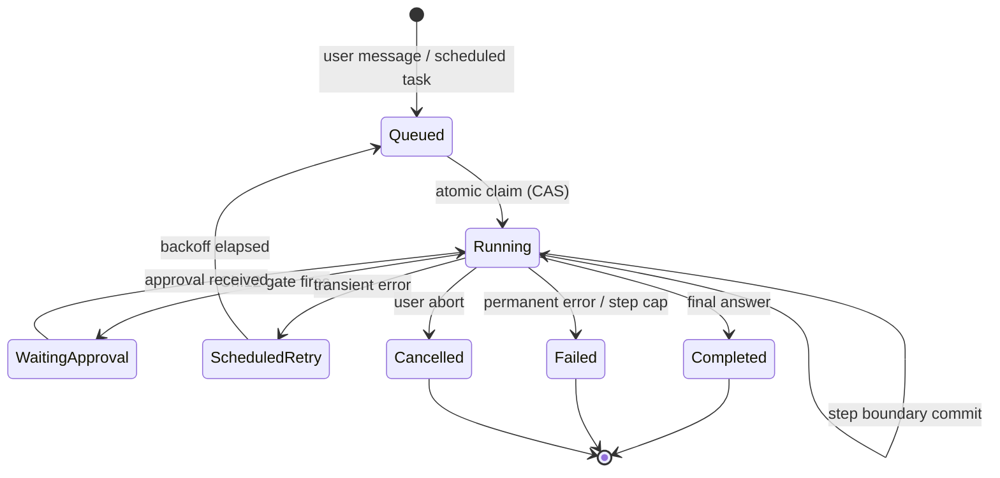
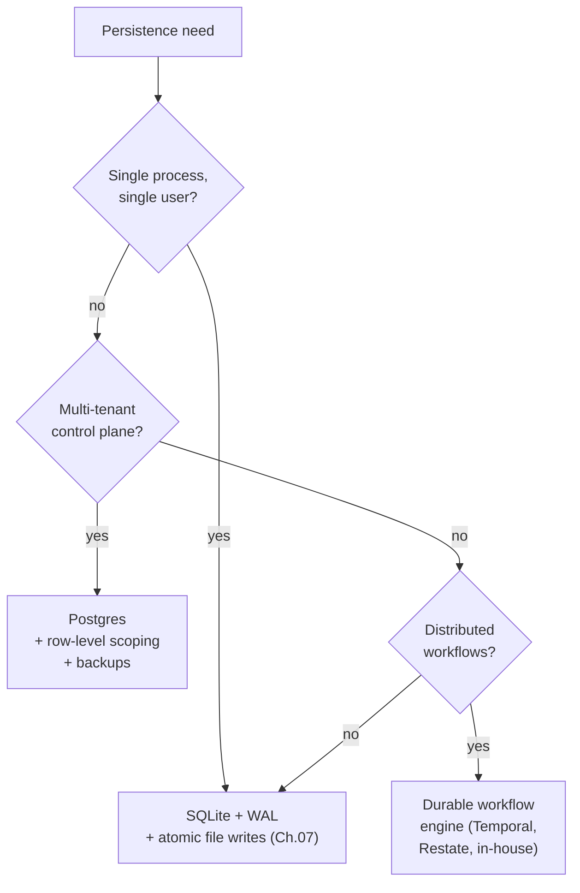

# Chapter 08 — State and persistence

## TL;DR

一个长时间运行的 agent 应当能够在进程重启、节点故障或在 loop 中途发生部署时存活下来——既不重做已经完成的昂贵工作，也不重复执行带有破坏性的操作。本章讲的是 durable execution（持久化执行）：什么算作运行时的 state（消息数组、in-flight 的 tool call、abort token、credentials、prompt fingerprint）、step-boundary（步骤边界）提交点落在哪里、run state machine（运行状态机）与 compare-and-swap claim（比较并交换式认领）如何协调多个进程、heartbeat（心跳）与 orphan reaper（孤儿回收器）对挂起的工作做了什么、如何在 SQLite、Postgres 与 durable workflow engine（持久化工作流引擎）之间做选择，以及 crash recovery（崩溃恢复）、resume 与用户点击一个标着 "Resume" 的按钮三者之间的区别。

---

## Why this matters

一个 coding agent 已经运行了四十分钟。它读了五十个文件，做了十二处编辑，生成了三段 pull-request 描述。部署发布了。进程重启了。agent 丢掉了内存中的 abort token，但 checkpoint 说它当时正处在第 23 步。在 replay（重放）时你发现 agent 重新发送了其中一段 pull-request 描述，因为那个负责发布描述的 tool 不是幂等的，而 harness 重试了它。你团队的 GitHub 上现在多了一个重复的 PR。模型没问题。agent 的代码没问题。是 persistence（持久化）层漏了。

这正是那种在开发阶段不会暴露的故障类别——它只会在你第一次在真实负载下做部署时出现。代价要么用 reliability（可靠性）来偿付，要么用本章所讲的这些细致工作来偿付。

---

## The concept

### What "durable" actually means for an agent

并非所有运行时 state 都是一回事。在写任何代码之前，先做一份有用的清单：

- **消息数组（the message array）**——每一次模型轮次、每一次 tool call、每一次 tool result。append-only（只追加）、durable，是 replay 的事实来源。（这就是 Ch.05 中的 audit log，只是从运行时的角度来看。）
- **Tool execution status（工具执行状态）**——对每一次 tool call 而言：pending、running、completed、failed。它紧挨着消息存放——在 OpenCode 的 `ToolPart.status` 里、在 Paperclip 的 `heartbeat_runs.status` 里、在 Hermes Agent 的内联结果里。
- **In-flight side effects（在途副作用）**——那些*已经开始*但还没返回的写入、发送、支付。这是最难恢复的一块 state，也是最容易误判的一块。
- **Working memory（工作记忆）**——来自 Ch.05 的那个小型可变草稿区。它必须能跨崩溃持久化，因为从 transcript（对话记录）重建它未必能精确复现。
- **Abort token**——一个进程本地的信号。*它无法在重启后存活。* 如果失控的 run 只能通过 abort token 来停止，那么一次崩溃就会让它们继续跑下去。
- **Auth profile 与 credentials**——必须在启动时重新加载，或者能够从一个 credential pool 中重建。Hermes Agent 把它们存在 `~/.hermes/agents/<id>/auth-profiles.json` 下；Paperclip 则把加密后的行存进 Postgres，并由一个 master-key 文件守护。
- **Prompt fingerprint**——来自 Ch.04 的那个 SHA。它必须能在 store 中往返一圈而不变，这样重建出来的 system prompt 才是逐字节一致的，cache 才能在重启后存活。
- **Cost 与 token ledger（成本与 token 账本）**——为 budget cap（预算上限）服务的累计值（Ch.17）。Hermes Agent 在 resume 时从消息日志重新计算；Paperclip 则把它单独持久化进一张 `cost_events` 表以便审计。如果预算必须*跨*重启强制执行，那么这本账本就需要自己的 durability——在日志被部分 compaction 之前，从日志重算是没问题的，一旦被压缩就不行了。

一个 durable 的运行时，意味着上面每一项都有一条明确的策略：提交前持久化、提交后持久化、resume 时重建、或者接受丢失。这里没有"默认"答案；逐项挑选、写下来，然后让你的 agent 根据这份清单生成 persistence 代码。

### The step boundary as the commit point

一个 step 就是一次完整的 loop 迭代：模型调用 → 任意 tool 派发 → reflect（反思）。提交点落在 Reflect 与 Stop 之间——正是 Ch.02 标识出的、一切都附着于此的那个边界。一个 step 完成后，在 loop 让出控制权之前，应当有三样东西已经落盘：

- 追加到 audit log 的新消息。
- tool execution status 已转入它的终态值。
- working memory 以及任何 cost/usage 计数器已更新。

OpenCode 在每个 `LLM.stream()` 周期之后做 flush；Hermes Agent 在形如 `_flush_messages_to_session_db` 的写入里做同样的事；Paperclip 则按每条 `heartbeat_run_events` 行提交。这个模式是通用的：在让出控制权之前写入。一个在写入持久化之前就返回给调用方的 step，是一个可能丢失的 step。

```ts
// What a step-boundary commit holds.
type Checkpoint = {
  sessionId:           string;
  stepIndex:           number;
  status:              "running" | "waiting_for_approval"
                     | "completed" | "failed";
  messageRange:        [number, number];   // appended on this step
  workingMemory:       WorkingMemory;
  tokensSpent:         number;
  costSpent:           number;
  promptFingerprint:   string;             // Ch.04
  lastError?:          string;
  committedAt:         string;
};
```

不要把 secret 写进 checkpoint——存 secret 的*引用*，在运行时再解析。不要把重试计数器写进消息日志——它们属于 checkpoint，在那里被更新。

### The run state machine

一个 run 是用户消息（或定时触发）与其终态答案之间的工作单元。每一个生产级系统都用一个显式的状态机来对它建模。隐式的状态转移，是 agentic 系统里一半重复副作用 bug 的根源。



Paperclip 几乎原样把它编码了出来——`heartbeat_runs.status IN (queued, running, completed, failed, cancelled, scheduled_retry)`。规则如下：

- 每一个依赖当前状态的转移都需要一次条件更新——`UPDATE ... WHERE status = <expected>` 是底线。最典型的竞态是 `queued → running`（两个 worker 争抢同一行），下一小节会详细走一遍这个模式，但同一个 `WHERE` 子句也守护着审批（`running → waiting_approval`）、中止（`running → cancelled`）、retry 转移，以及防止并发覆盖的终态写入。基于一个在你脚下已被改动的状态所做的转移，就是一次 lost update（丢失更新）——同一个 bug，换个标签而已。
- `running → terminal` 是*一旦赢得就幂等*的：一次把同一终态写到一个已处于终态的行上的重复提交，是一个 no-op，这正是 replay 或 retry 时期望的行为。
- 终态永不回转。一个 `failed` 的 run 若需要重试，会产生一个*新的* run，并用 `parent_run_id` 链回去——绝不做原地复活。

这一层的大多数 agent bug 都是状态机 bug：要么是某个隐式转移让同一份工作发生了两次，要么是某个缺失的转移让一个 run 卡死。

### Crash recovery vs resume vs the "Resume button"

这三者听起来相似，行为却大不相同。

- **Crash recovery（崩溃恢复）**是*同一意图，新的进程躯体*。部署重启了；用户期待工作继续。system prompt 没变；cache *可能*仍是热的——前提是前缀逐字节一致地通过磁盘往返了一圈，*并且* provider 的 TTL 还没过期，*并且*你路由到的是同一个模型与 region（cache 是 per-provider、per-model、常常还是 per-region 的——细节见 Ch.04）。in-flight 的 tool call 需要仔细分诊。
- **Resume** 是*同一 session，时间更晚*。用户关掉标签页，几小时后又回来了。cache 可能已过期（Ch.04 的 TTL）。system prompt 可能在两次访问之间被改过。audit log 重放得干净利落，但世界可能已经向前走了。
- **"Resume button"** 是用户为继续一个已暂停 session 而做的*显式动作*。用户知道中间有一段间隔；系统因而有更多自由去请求确认、呈现发生了什么、并在合适时重置 working memory。

把这三者混为一谈会产生微妙的 bug。Crash recovery 对*那些可以安全 replay 的工作*应当是静默而激进的——只读操作、被标记为 `idempotent: true` 的 tool（Ch.03）、以及有 outbox 兜底的副作用。其余一切都走下一小节的 in-flight 分诊，把不可 replay 的 tool call 呈现给用户，而不是静默重试。Resume 应当在可能时保留 cache，在不能时接受其成本。Resume button 则应当*向用户展示*他们身在何处、以及接下来要重跑什么。

### In-flight tool calls during a crash

整章里最难的一种情形。一次 tool call 开始了；结果从未返回；进程死了。重启时，有四种选项，按偏好顺序排列：

1. **该 tool 被元数据标记为 `idempotent: true`（Ch.03）。** 重放它。第二次调用返回相同的结果。
2. **该 tool 带有一个外部 idempotency key（幂等键）。** 用同一个 key 重放它；下游系统会去重。
3. **该 tool 在执行前写入了一个 durable outbox。** 重放时先读 outbox；若该意图被标为已履行，则跳过；否则用同一个 key 重试。
4. **该 tool 不适合 replay。** 把这个 run 标为 failed，呈现给用户。一句尴尬的*"这件事到底发生了没？"*，也好过一封重复的邮件。

来自 Ch.03 的那些元数据标记，正是让 harness 能不假思索就挑对选项的东西。没有这些标记的 tool 默认走 (4)：大声失败、询问用户、绝不静默重试。反过来——默认去重试——正是重复 PR 产生的方式。

### Atomic claim with compare-and-swap

任何跨多进程运行的东西——一个 heartbeat scheduler 来拾取排队中的工作、两台 API server 争抢同一个 session——都需要一次 atomic claim（原子认领）。各种数据库里的这个模式是一样的：在一个 status 列上做 compare-and-swap。

```sql
-- Claim a queued run atomically. Returns the row only if you won the race.
UPDATE runs
   SET status      = 'running',
       claimed_by  = :worker_id,
       claimed_at  = now()
 WHERE id     = :run_id
   AND status = 'queued'
RETURNING *;
```

如果这个 `UPDATE` 影响了零行，说明另一个 worker 先认领了它；继续往下走。如果它影响了一行，那么这份工作就归你所有，直到你把它转入某个终态、或你的租约（lease）超时。Paperclip 在 `heartbeat_runs` 上用的就是这个形态；在 Postgres 风味的栈里，事务内的 `SELECT ... FOR UPDATE` 是等价的；在开了 WAL 的 SQLite 里，同样的 `UPDATE ... WHERE status=...` 也行，因为写入者是被串行化的。

对于单进程系统（单用户模式下的 Hermes Agent、一个 OpenCode dev server），CAS 是杀鸡用牛刀。但对于任何*将来可能*横向扩展的东西，从第一天就把它接进去——代价是一个列加一个 `WHERE` 子句；事后补加它的代价要高得多。

### Heartbeats and orphan recovery

一个没有 heartbeat 的 claim 就是一处缓慢的泄漏——worker 死了，run 却一直停在 "running"，再没别的进程来拾取它。生产系统会给 claim 再配上两个列：

- **`last_heartbeat_at`**——worker 在 run 存活期间每隔几秒更新它一次。
- **`lease_expires_at`**——一旦过了这个时间点还没看到心跳，这个 run 就被推定为孤儿。

一个 reaper 服务会周期性地扫描那些 `lease_expires_at < now()` 的 run，要么把它们重新入队（`status → queued`，重新尝试），要么在重试次数耗尽后把它们标为失败。Paperclip 的 `reapOrphanedRuns()` 正是这样；它在清除租约之前还会确认操作系统的 PID 确已死亡，以应对心跳只是变慢、而非真正消失的情况。

有两个调优常量是诚实的 trade-off：

- **Heartbeat interval（心跳间隔）。** 越短，孤儿检测越快，但写流量越大。Paperclip 每隔几秒写一次。
- **Lease timeout（租约超时）。** 越长，越能容忍一个慢 tool（一次 30 分钟的编译）；越短，恢复越快。Paperclip 默认六小时，并允许适配器按工作负载来调它。

对分布式 agent 来说，reaper 不是奢侈品。它是唯一能阻止一个崩溃的 worker 把工作永久卡死的东西。

reaper 本身也需要存活性保障。把它作为一个有自己心跳的独立任务来跑，否则每个 worker 都会在启动时争抢去当 reaper。Paperclip 通过 run 所用的同一个 CAS 模式来选举出单一的 reaper——在一张小小的 `service_locks` 表里有一行，被认领并刷新。

### Append-only event log vs per-step snapshot

跨系统出现了两种 persistence 形态，常常被组合使用：

- **Append-only event log（只追加事件日志）。** 每个 step 都写入新行；当前 state 通过按序读完所有行来计算得出。Hermes Agent 的 `messages` 表是这样；Paperclip 的 `heartbeat_run_events` 是这样；OpenCode 的 `PartTable` 大体也是这样。
- **Per-step snapshot（逐步快照）。** 每个 step 都写入*整个* state 对象，覆盖前一个。resume 更快（无需 replay）；磁盘占用更大；更难审计，因为中间值丢失了。

大多数生产级 agent 对 audit log 采用 append-only（因为 Ch.05 反正需要完整的 transcript），对 working memory 与 checkpoint 元数据采用 per-step snapshot（因为它们需要快速随机访问和小的占用）。这种组合运维成本很低，既给了你审计的脉络，也给了你 resume 的脉络，二者都不必重复存储。

### Choosing the store



SQLite 扛起了极大量的生产负载。Hermes Agent 与 OpenCode 都以 SQLite 为后端，并跑着真实的工作负载。原因在于：WAL 模式不需要配置任何东西就能给你并发读取者加单一写入者，`fsync` 让它 durable，而那个文件就只是一个文件——易于复制、易于备份、用一个 CLI 就能检查。

当*多个进程*必须协调写入、当你需要由数据库强制实施的*多租户*行级范围隔离、或当你需要一个能跨节点唤醒延迟任务的*scheduler*时，就该走出 SQLite。Paperclip 选择 Postgres 正是出于此：它是一个三样都需要的 control plane。再往上一级是 durable workflow engine（Temporal、Restate、自研等价物）——当 agent 自身的逻辑最好被表达为一个带有任意副作用步骤、且这些步骤必须 replay-safe 的 workflow 时，它很有用。

WAL 模式不是免费的。它会在 `.db` 旁边多出一个 `-wal` 文件和一个 `-shm` 文件，在重写入阶段大致会让磁盘占用翻倍。对于移动端或边缘 agent，朴素的 journal 模式或许才是对的选择。Hermes Agent 的 `apply_wal_with_fallback` 处理了 WAL 不可用的情况（NFS、SMB），并优雅地回退到 `journal_mode=DELETE`。

### Idempotency at the step boundary, not just the tool

Ch.03 讲过 tool 级别的 idempotency key。Step 级别的幂等是另一种保证：*同一个 step，重放之后，必须产生同样的可观测效果。*

```ts
function stepIdempotencyKey(c: {
  sessionId: string; stepIndex: number; action: string;
}) {
  return sha256(`${c.sessionId}:${c.stepIndex}:${c.action}`).slice(0, 32);
}
```

在它之上坐落着两种模式：

- **Outbox pattern（发件箱模式）。** 在发出一个副作用之前，先把*意图*（连同它的 idempotency key）写入一张 durable 表。等副作用成功之后，再把该意图标为已履行。replay 时，harness 先读这张表：已履行的意图被跳过；未履行的用同一个 key 重试。这把*决策*的 durability 与*投递*的 durability 解耦了开来。
- **Fulfillment marker（履行标记）。** 这是给非分布式系统用的更简单版本：checkpoint 上的一个 `step_complete` 布尔值。一旦置上，这个 step 就永不重跑，哪怕它内部某个子动作从未返回过任何值。诚实的局限在于：这个标记只告诉你*你自己*的提交情况，而非世界的情况。如果一个副作用跨过了网络，而进程恰好在调用送达与标记被持久化之间死掉了，恢复时无从知道到底发生了哪一种。盲目跳过有丢失工作的风险；盲目重试有重复执行的风险。正确的做法是*reconciliation（对账）*——去问下游系统那次调用到底送达了没有——而这正是 outbox pattern 的用途所在，也正因如此，一旦副作用离开你的进程，fulfillment marker 就不再够用了。

大多数生产级 agent 用第二种；当副作用跨越一个你无法完全信任的网络边界（第三方 API、消息队列、自身也会崩溃的下游服务）时，outbox pattern 才会登场。

### The compaction chain meets resume

Ch.05 引入了 session rotation（会话轮转）：当 compaction 不再够用时，会创建一个新的 session，用 `parent_session_id` 链回旧的那个。从 persistence 的角度看，这同时也是一个*resume primitive（resume 原语）*。一个失败的长时间运行 session，可以被一个新的 session 取代——后者以一个 handoff block（交接块）开头，概括父 session 的 state；audit log 仍然一路追溯到底，而新 session 的 cache 全新地预热，不会拖着旧 session 的臃肿。

由此得出一条推论：永远不要因为一个 parent session 被它的子 session resume 了就把它删掉。把它归档、标为已被取代，但这条链必须保持完整。resume、audit 与 rollback（回滚）全都依赖它。Ch.07 的"永不裁剪 audit log"规则在这里同样适用——不同的角度，相同的纪律。

### Operating the store: backup, restore, migration

没有被备份的 state，就是将要丢失的 state。模式如下：

- **Backup（备份）。** Paperclip 内置了周期性的 `pg_dump`，带一个可配置的保留窗口。以 SQLite 为后端的系统应当按计划跑一次 `VACUUM INTO` 快照并把文件拷出去。底线是每日一次全量快照；更好的是增量 WAL 备份。任何比"每日"更稀疏的东西，都只是你将在事故之后讲述的一个故事而已。
- **Restore（恢复）。** 永远恢复一个*一致的*快照——绝不要把备份里的选择性行恢复进一个活动的 store，除非你能证明它们不会破坏状态机。restore 还必须遵守 Ch.07 的删除标记——在用户请求或保留策略下被移除的内容，在一个旧快照被取回时仍要保持移除状态，否则你刚刚就复活了你承诺过要删除的数据。restore 很少发生；在你需要它之前就排练它，最好把它作为你部署清单的一部分。
- **Schema migration（schema 迁移）。** schema 会在两次部署之间改变。OpenCode 与 Paperclip 用 Drizzle migration；Hermes Agent 用一行 `schema_version` 显式地给 schema 打版本。向前的路是走熟了的；*向后*的路几乎从来没人走过。默认采用 additive migration（新增列并带默认值），把破坏性的 migration 留给显式的数据清理部署。
- **In-flight runs across a migration（迁移期间的在途 run）。** 一个在 schema v3 下写入的 checkpoint，若 v4 丢弃或重命名了某个列，可能在 v4 下无法干净地反序列化。给每个 checkpoint 都盖上写入它的那个 schema 版本（`checkpointSchemaVersion: 3`）。让 resume 路径具备版本感知能力——施加 per-version 的强制转换把 checkpoint 向前迁移，并在无法转换时大声失败，而不是静默产出一个损坏的 run。对于破坏性 migration，先*抽干（drain）*在途的 run：停掉队列，等活跃的 run 终止或被取消，然后再迁移。五分钟的吞吐量暂停，胜过三天去 debug 一个迁移到一半的 checkpoint。

### What a "Resume button" actually requires

如果你交付了一个标着*"Resume"*的按钮，用户期待的就不止是 crash recovery。他们期待的是对*我身在何处、接下来要发生什么？* 的一个诚实回答。具体而言：

- 该 session 必须能从磁盘被完整加载——audit log、checkpoint、working memory、cost ledger，一直贯穿到底。
- system prompt 必须逐字节一致地重建，否则就必须告诉用户 cache 将偿付那笔重建成本（Ch.04）。
- 上一次尝试中任何 in-flight 的 tool call 都必须被分类（idempotent / outbox / unsafe），并在 loop 继续之前被呈现出来。
- 用户应当能看到 *agent 上一次做了什么* 以及 *它当时正要做什么*——最后一个已完成的 step 与下一个计划中的动作。

这是 Ch.05、Ch.06、Ch.07 与 Ch.08 *共同*成就的系统。记忆在正确的位置存活下来，audit log 以正确的顺序重放，cache 在能保持的地方保持温热，而用户看到的是一幅连贯的图景，而不是一句*"你的 agent 崩了；点这里"*。Resume button 是表面；它底下的一切，正是本章所讲的内容。

---

## Real-system notes

- **OpenCode** 是在 coding-agent 场景下嵌入式 durability 的最强参考：SQLite + WAL 配 Drizzle migration、append-only 的 `SessionTable` / `PartTable` / `SyncEvent`、一个为 revert 提供动力的隐藏 git 快照仓库，以及一个*不会*在重启后存活的 per-session abort controller（这是有意为之的——中断只在运行时存在）。
- **Paperclip** 是 control-plane 层面分布式 durability 的参考：Postgres 配 `SELECT ... FOR UPDATE` 做 atomic claim、一个带显式转移的 `heartbeat_runs` 状态机、那个在清除租约前确认操作系统 PID 存活性的 `reapOrphanedRuns` reaper、每张表上的多租户范围隔离、带保留策略的定时 `pg_dump` 备份，以及 adapter 进程隔离——这样父进程崩溃时子进程仍在运行。
- **Hermes Agent** 是把 Ch.04 的 cache–resume 二象性应用于此的参考：`SessionDB.sessions.system_prompt` 持久化逐字节一致的 prompt，使一个被驱逐又被恢复的 agent 能重放一个热的 cache，`apply_wal_with_fallback` 处理对 WAL 不友好的文件系统，而 cron scheduler 的基于文件的锁展示了最简单可能的 advisory-lock（建议性锁）模式。
- **OpenClaw** 存储 per-session 的 JSONL transcript，外加 credential 与 memory state，演示了一种无需数据库、能在单用户多 channel 场景下扩展的基于文件的 persistence 模型。这是一个很好的提醒：只要工作负载合适，"durable" 并不要求一个 DB。

---

## Common failure cases

*这些故障是持久不变的；它们的修复演进得最快——每一条都点出模式，把当下的具体细节留给你和你的 AI 伙伴。*

- **一次重启重跑了已经发生过的工作。** 崩溃或部署之后，agent 重新发了一封邮件、重新发了一个 PR，或者重新刷了一张卡。*修复：反转默认值，让一个没有 replay-safety 信号的 in-flight 调用大声失败并询问，而不是静默重试（Ch.03）。*
- **checkpoint 与实际工作互相矛盾。** 磁盘说 step 完成了但副作用从未发生，或者副作用发生了但磁盘忘了。*修复：outbox pattern——在做工作之前写入意图，并在 resume 时与下游系统对账。*
- **每次部署 cache 都冰冷透顶。** resume 是正确的，但回来后的第一轮花的钱是本应花的好几倍。*修复：持久化逐字节一致的前缀及其 prompt fingerprint，resume 时从存储的字节重建，并在能做到的地方钉住 model/region（Ch.04）。*
- **崩溃的 worker 把 run 卡死，或在运行途中被回收。** run 被标为 "running" 却没有任何进程在碰它，或者一个健康的长 run 被从自己脚下杀掉。*修复：依照真实的 p99 step 时长来调 lease，并让 reaper 在清除租约前确认 PID 存活性。*
- **resume 一周比一周慢。** 一个曾经一秒就能恢复的 session，现在要十秒，而 checkpoint 文件大得离谱。*修复：让 per-step snapshot 保持小而有界，存一个指向 append-only log 的 messageRange 指针，而不是拷贝整份 transcript。*

---

## Pair with your agent

几个在本章上效果不错的 prompt：

- *"把我的运行时 state 逐块清点一遍——消息数组、tool status、in-flight 副作用、working memory、abort token、credentials、prompt fingerprint。对每一项，告诉我当前的 store 是否持久化了它，并在没有的地方提出一个修复方案。"*
- *"实现本章里的 run state machine，带一个显式的 `status` 列和 CAS claim。写一个压力测试，让两个 worker 在同一个 queued run 上竞争，并验证恰好只有一个胜出。"*
- *"给我的 run 加上 heartbeat 和一个 orphan reaper。reaper 应当在清除一个卡死的租约前确认操作系统 PID 存活性。为我的工作负载调好 heartbeat interval 和 lease timeout，并用三个要点解释其中的 trade-off。"*
- *"用 Ch.03 的 `idempotent` 标记给我所有的 tool 分类。然后写出 resume-after-crash 的逻辑，用这个标记来决定是 replay 还是 skip-and-ask。用一次故意注入的 tool 中途崩溃来测试它。"*
- *"为一个具体的外部副作用（发送一条 Slack 消息）接上 outbox pattern。写意图、发送、标为已履行。在每一对动作之间注入一次崩溃，并在 resume 时验证结果。"*
- *"在十个真实 session 上剖析我的 checkpoint 载荷。如果它平均超过 50 KB，提出哪些东西应当从 per-step snapshot 移到 append-only log。"*
- *"把 crash recovery、resume 与 Resume button 实现成三条彼此不同的代码路径。给我看下面每一种情况各自触发哪一条：部署后进程重启、用户 24 小时后回来、用户在一个失败的 run 上点击 Resume。"*
- *"写一次 restore 排练：停掉我的服务、恢复昨天的快照、重新启动、证明状态机是一致的。端到端地计时，好让我知道一次事故实际上要花多长时间。"*

---

## What's next

你现在有了一个能在重启后存活、能跨进程协调工作、并能干净地 resume 而不重复执行破坏性操作的运行时。

再往上一层是 *planning（规划）*——一个 agent 如何在执行之前，决定它在许多 step 上要做什么。Ch.09 讲四种 planning 形态（no plan、checklist、plan-execute-replan、dependency graph），各自何时有帮助、何时帮倒忙，以及藏在那些最省事的选择里的失败模式。

---

<!-- nav-footer -->
<div align="center">

[⬅️ 上一章：Ch.07 Memory writing & curation](07-memory-writing.md) · [📖 课程目录](../../README_zh.md) · [下一章：Ch.09 Planning patterns ➡️](09-planning-patterns.md)

</div>
