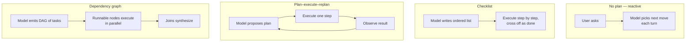
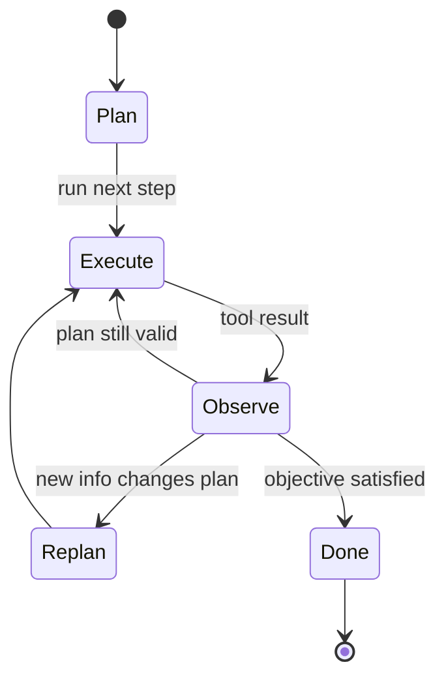

# Chapter 09 — Planning patterns

## TL;DR

有些任务模型一步就能答出来；有些需要三步；有些需要三十步。Planning（规划）就是这样一层：它判断你手上是哪种任务，并为 agent 设计出穿越这个任务的路径。本章覆盖在生产环境中出现的四种 planning 形态（no plan、checklist、plan-execute-replan、dependency graph）、在它们之间做取舍的设计决策（implicit 与 explicit、plan-only 与 build、谁来编辑 plan）、能在 agent 投入执行之前抓住过时 plan 的 replan 触发条件，以及每种形态里隐藏的失败模式。目标是：挑出最契合任务的、最简单的 planning pattern——并能识别出任务何时正在要求你升级到上一层。

---

## Why this matters

没有 plan，agent 会原地打转——它会把同样的文件读两遍，在第 4 步走错方向却浑然不觉，调用某个 tool 去做上一个 tool 已经做完的事。而 plan *过多*时，同一个 agent 会把一半的 token 花在提出一份 20 步的蓝图上，而这份蓝图在第一个 tool result 与之矛盾的那一刻就变得毫无用处。代价体现在 token、latency 上，以及（最糟的）那些自信满满、却解决了错误问题的最终答案上。

解药不是「永远多做 planning」。而是让 planning 形态匹配任务，并知道何时该 replan。本章余下的内容就是这四种形态以及围绕它们的规则。

---

## The concept

### Four shapes, side by side

在深入之前，先建立一张有用的心智地图：



你通常可以通过问两个问题来判断一个任务需要哪种形态：*目标定义得有多清晰？* 以及 *第 1 步的结果改变第 2 步 plan 的可能性有多大？* 定义清晰、发散度低的任务适合前两种形态；后两种则适合那些路径确实不确定、或带有独立分支的任务。

### Shape 1 — no plan

agent 挑一个 tool，运行它，然后要么给出答案，要么挑下一个 tool。这是短问答、一次性查询、简单转换的默认形态。OpenClaw 的 reactive flow 以及大多数主流商用 agent 在 chat 模式下都会在任务签名足够小时采用它——*「装的是哪个版本的 node？」* 不需要 plan。

快、便宜、流畅。但碰到任何真正多步骤的事就很容易原地打转。

### Shape 2 — checklist

模型在行动前写下一份简短的有序列表，并随着推进逐项打勾。OpenCode 的 `TodoWriteTool` 是最清晰的参照：模型在 working memory 里维护一份 markdown checklist；prompt builder 每一 turn 都把当前列表注入进去。Hermes Agent 用 skill 形态的任务笔记实现了类似的效果。

```ts
// What the checklist tool returns. The list is what the model reads next turn.
type ChecklistPlan = {
  objective: string;
  steps: Array<{
    id:     string;
    text:   string;
    status: "pending" | "in_progress" | "done" | "skipped";
  }>;
};
```

适用于：3–8 个有序步骤，模型大体上能把整个 plan 装在脑子里，但进度追踪会有所帮助。列表就是记忆；模型据此自我纠正。

### Shape 3 — plan-execute-replan

模型提出一份 plan，执行一个或多个步骤，观察结果，然后在结果改变了全局判断时 *重新提出* plan。大多数主流商用 agent 在 interactive 模式下处理非平凡任务时都是这么工作的；Paperclip 的 `plan_only` 执行模式正是这个 pattern 中专门负责「现在规划、稍后执行」的那一半。



适用于：调查、debugging、研究——任何在第 3 步结束之前你都不知道第 5 步长什么样的事。代价是每次 replan 事件都要多花一次模型调用；收益是 agent 不会被绑死在一份过时的 plan 上。

### Shape 4 — dependency graph

对于带有独立分支的任务（并行 review 三个文件；从三个来源抓取并合并），把 plan 表达成一张有向图，并行执行可运行的节点。实践中，这种形态位于纯 planning 之上一层，落在 delegation（Ch.10）里——那些可运行的节点通常会变成 subagent 调用。

```ts
// Runnable = pending + all deps complete. Trivial scheduler.
function runnableNodes(nodes: PlanNode[]) {
  const done = new Set(
    nodes.filter(n => n.status === "done").map(n => n.id)
  );
  return nodes.filter(n =>
    n.status === "pending" && n.dependsOn.every(id => done.has(id))
  );
}
```

适用于：带有显式并行和 join 点的 workflow。不适用于：任何看起来是线性的东西——那种情况下这张图只是为了复杂而复杂。

### Choosing a shape

| Task shape | Planning shape |
|---|---|
| One obvious action | No plan |
| 3–8 ordered steps | Checklist |
| Uncertain path; results change next step | Plan-execute-replan |
| Independent branches with joins | Dependency graph |

有两种反模式要留意：因为 dependency graph 看起来高级就去用它，而其实一份 checklist 就够了；以及对一个明显需要结构的任务死守在「no plan」模式里。模型对这两者都会照单全收——得靠你的设计来把它顶回去。

### Plan as memory, not as text floating in a message

plan 不过是一段文本——但你把它放在哪里很重要。它可以存放在三个地方：

- **在 tool result 里。** 模型调用了 `todo_write`；结果就是新的列表；这份列表像其他任何 tool result 一样出现在易变的尾部。
- **在 working memory 里**（Ch.05 的可变 scratchpad）。列表是 `WorkingMemory.currentPlan` 的一部分，prompt builder 每一 turn 都会渲染它。
- **在一个用户可以编辑的独立文件里**（`plan.md`，OpenCode 的 `plan.ts` flow）。agent 和用户共享这个 artifact；任何一方都能修改。

跨 turn 把 plan 放在同一个地方，这样模型才知道该去哪儿找。不要有时写进文件、有时又在 tool result 里返回；选定一个。Hermes Agent 把任务 plan 放在 skill 文件里；OpenCode 把它们放在 todo tool 里；主流商用 agent 往往把它们放在 working memory 里，每一 turn 都新鲜渲染进 prompt。

### Plan-only agents vs build agents

真实的生产系统会做一个有用的区分：负责 *planning* 的 agent 跑的是一套与负责 *building* 的 agent 不同的 tool 集。OpenCode 注册了独立的 `plan` 和 `build` agent profile；Paperclip 通过 `planning_mode_directive` 把 issue 路由给 planner 或 builder。其形态是：

- **Plan-only agent。** 只读 tool，不做编辑，不开 shell，输出是一份结构化的 plan。一个便宜的模型往往就够了。
- **Build agent。** 完整的 tool 访问权限，包括写入、编辑、shell。昂贵的模型住在这里。

交接：planner 的 plan 经过批准（由用户或由某个 policy），然后 build agent 以这份 plan 作为起始 context 运行。当 planner 和 builder 是不同的 agent 时，这就进入了 Ch.10 的范畴；在单 agent 设置中，同一个 agent 在不同 turn 之间切换模式。

### Implicit vs explicit plans

有些 agent 从不写 plan——它们只是不断挑选下一个 tool。另一些则把写 plan 作为第一个动作。implicit 在小任务上更快；explicit 能及早抓住「脆弱假设」这一失败模式。一个有用的默认规则：*如果任务描述点名了两个或更多交付物，就要求一份 explicit plan；否则让模型逐 turn 自行决定。*

朝这个方向最便宜的助推：在系统 prompt 里为那些看起来多步骤的任务加上一句 *「start by writing your plan」*。模型通常会照办，而它写出的 plan 本身就是一个有用的信号——如果模型连一份 plan 都讲不清楚，那这个任务就是定义不足的。

### When to replan

有四个信号意味着「这份 plan 已经不再有效」：

- **New information**——某个 tool result 与 plan 的假设相矛盾。
- **Failed step**——某一步报错或返回了意料之外的输出。当心 Ch.02 里那种 doom-loop 的特征：同一步以同样的方式失败三次，意味着该 replan，而不是 retry。
- **Scope creep**——用户加了一项新需求；现有 plan 覆盖不了它。
- **Stale assumption**——plan 是假设文件在 `path/A` 时写的；它现在却在 `path/B`。这是最难察觉的：agent 必须显式地去 *检查* 那个假设，而不是想当然地认为它还成立。

```ts
// Cheap defense: check preconditions before each step.
async function preconditionsHold(step: PlanStep, ctx: AgentContext) {
  for (const check of step.preconditions ?? []) {
    if (!(await check(ctx))) return false;
  }
  return true;
}
```

replan 本身不是免费的——它要花一次模型调用。当出错的代价高时（动到生产数据），就积极地 replan；当代价低时（一份研究摘要），就懒一点。

### Plans are state

plan 活在 working memory 里（Ch.05），并和其余的运行时状态一起 check-point（Ch.08）。崩溃之后，resume 应当接续这份 plan 和已完成步骤的列表——而 *不是* 凭空造一份新 plan 再把已完成的步骤重跑一遍。这正是 Ch.08 的 step-boundary commit 防止 planning 层重复执行的方式。

```ts
type PlanningCheckpoint = {
  goal:              string;
  plan:              ChecklistPlan | { nodes: PlanNode[] };
  completedStepIds:  string[];
  lastReplanReason?: string;
  lastReplanAt?:     string;
};
```

接 persistence 时，把 plan 纳入 checkpoint。接 resume 时，在第一次模型调用 *之前* 把它加载进来，这样模型才知道自己处在任务中途。

### Inspect-and-pick vs plan-upfront

对于「no plan」和「plan-execute-replan」之间那点含糊地带，有个有用的框架：在每一步，agent 要么 *检视* 当前状态并挑出下一个动作（reactive），要么 *承诺* 一个事先规划好的下一动作（declarative）。两者并不互斥——大多数生产 agent 都是混合体。

- **Inspect-and-pick。** 低 latency，流畅，适合探索。代价是：模型可能会跟丢高层目标，转而追逐局部最优。
- **Plan-upfront。** 启动时 latency 更高（plan 要花一次模型调用），但 agent 被锚定在目标上；下游步骤继承了这套框定。代价是：当世界在 plan 脚下发生变化时会僵化。

最常胜出的混合形态：先做足够的 upfront planning 以确立工作的 *形态*（三到七步），然后在每一步内部 inspect-and-pick。plan 是脚手架；每步的决策填充其中。

### Plan abstraction level

一份 50 步的 plan 是一份规格说明，不是 plan。一份一步的 plan 根本就不是 plan。合适的粒度落在两种反形态之间：

- **太细。** 四十七步。第一步失败，整份 plan 就失效了；维护成本占了主导。
- **太泛。** *「修掉这个 bug。」* 没有给出 agent 可以据以执行的任何结构。

一条有用的规则：**每个 plan 步骤应当映射到一两个 tool call。** 如果某一步要求 agent 在行动前先想上一整段，就把它拆开。如果某一步是 *「用参数 Y 调用 tool X」*，那是实现，不是 plan——让模型自己去推导。大多数生产 agent 在中等复杂度的任务上会收敛到 5–12 步。

在同一个任务上（一处登录回归）做个具体的对比：

| Granularity | Example step |
|---|---|
| Too vague | *「修掉这个登录 bug。」*——没点名资源，没说明结果。agent 无从下手。 |
| Too detailed | *「调用 `read_file({path: 'src/auth.ts'})`；定位到第 42 行；调用 `write_file(...)` 把 `userId` 改成 `user.id`；调用 `run_shell({cmd: 'npm test'})`。」*——是实现，不是 plan；第一处失败就让它下面的一切作废。 |
| Inspectable milestone | *「针对 dev server 复现失败的登录流程；把这个 500 追溯到 `src/auth.ts` 里那个出问题的字段；修正字段引用；重跑 auth 单元测试和集成测试。」*——每一步都点名了一个结果和一个资源；tool 由 agent 自己挑。 |

中间那一行是模型 *在运行时被允许去做* 的事，而不是 plan *本身要做* 的事。最下面那一行才是 plan：agent 有足够的结构去行动，而你也有足够的结构在执行途中检视，无需去读代码。

### Plan revision UX

如果用户能在执行途中编辑 plan，你就能得到一个好得多的反馈回路——这也是让 agent 不至于跑偏的最便宜手段之一。其 pattern 是：

- plan 存放在用户看得见的地方（一个文件、一个 UI 面板、一条聊天消息）。
- agent 在每一 turn 开头重新读取这份 plan。
- 用户的一次编辑对下一 turn 可见，并可能触发一次 replan。

OpenCode 的 `plan.md` 文件是用户可编辑的。主流商用 agent 通常会把 plan 渲染在 UI 里并接受内联编辑。在那些 plan 只活在模型 working memory 里的系统中，这一点大多缺失了——一个被错过的机会。如果你能给用户一个抓住 plan 的把手，就给。

### Planning is also observability

与前面几章的 cache、compaction、retrieval 和 memory 指标并行，有三项 planning 测量值从第一天起就值得记录：

- **Replan rate**——触发了 replan 的步骤所占的比例。太高（>30%）意味着 plan 的抽象层级不对；太低（<5%）通常意味着 agent 在忽略本应触发 replan 的新信息。
- **Plan vs. execution divergence**——在会话结束时，把最初提出的 plan 与实际发生的事做对比。差异大，是个信号：planner 正在产出低价值、被 executor 无视的 plan；差异小却结果糟糕，则意味着 plan 一开始就错了。
- **Time-to-first-action**——从用户消息到 agent 调用它第一个 tool 之间隔了多久。如果 planner 总是要花两次模型调用才动手，你可能在给小任务做过度的 planning；如果它从不 planning，你可能在给大任务做不足的 planning。

这些指标属于 Ch.16 的 trace pipeline，与前面几章的指标并列。它们合在一起会告诉你：你的 planning 形态是否匹配你的流量——或者是不是有某个团队在该用 checklist 时伸手去够了一张图。

### Failure modes

| Failure | Symptom | Fix |
|---|---|---|
| Over-planning | 模型花掉一个个 turn 打磨 plan，从不执行 | Cap planning turns；要求 N 步后必须执行 |
| Under-planning | 漂移；agent 解决了错误的子问题 | 任务看起来多步骤时要求 explicit plan |
| Plan too detailed | 一处失败让整份 plan 作废 | 拆解到每步 1–2 个 tool call |
| Plan too vague | agent 无法据以行动 | 拒绝那些步骤没有点名具体结果和资源的 plan——*改什么* 和 *改在哪儿*，而不是该调用哪个 tool |
| Stale plan | plan 是假设 X 写的；X 现在为假 | 在每步之前加 precondition 检查 |
| Plan never re-read | 模型凭记忆执行，无视编辑 | 每一 turn 都把 plan 渲染进 prompt |

每一项都是一件可以单独防范的小事；它们加在一起就构成了你在生产中会遇到的大部分 planning bug。

---

## Real-system notes

- **OpenCode** 在一个 coding-agent 的语境下提供了显式的 planning 原语：带不同 tool 集的独立 `plan` 和 `build` agent profile、一个供模型维护 checklist plan 的 `TodoWriteTool`，以及一个供用户编辑、基于文件的 plan 的 `plan.ts` flow。
- **Paperclip** 在 orchestration 层面表达 planning：`planning_mode_directive` 在 plan-only 和 build 模式之间切换 issue；恢复类 issue 可以为窄范围任务请求更轻量的模型。supervisor（heartbeat 服务）把工作路由给 planner 或 builder agent。
- **Hermes Agent** 把 plan 放在 skill 和 working memory 里：长时运行的任务会变成带步骤列表的 skill 文件；cron 触发的工作针对一份轻量的、事先写好的 plan 加上来自 Ch.05 的持久状态来运行。
- **OpenClaw** 更偏 reactive——planning 活在底层的 agent 运行时里，而不在 channel adapter 层——这让它成为「no plan」这个极端、以及思考一份 plan 何时是不必要的噪声时的一个有用参照。

---

## Common failure cases

*这些失败是持久的；它们的修法演进得最快——每一条都点出 pattern，把当下的具体细节留给你和你的 AI 伙伴。*

- **每个短任务都在交 planning 税。** 一个本来一次 tool call 就能答的问题，现在先花一次模型调用去写 plan。*Fix：让 planning 取决于某个任务信号，而不是全局开启，并盯住 time-to-first-action。*
- **agent 照着一份已不再为真的 plan 工作。** 世界变了——一个文件被改名了、一个测试现在能过了——但 plan 文本从未更新，于是它去执行某个前提已经为假的步骤。*Fix：在每一 turn 开头从权威来源重新读取 plan，并在每步之前用便宜的只读 precondition 检查作为后盾。*
- **agent 每一步都重写 plan，永远做不完。** replan 触发器太敏感，于是每一 turn 都在重新生成 plan，而不是取得进展。*Fix：带预算的 replanning，加上连续 replan 次数上限，并修订 plan 而不是重新生成它。*
- **Resume 重跑已经完成的步骤。** 一次重启仅凭目标重建 plan，从第 1 步开始，把已完成（有时是破坏性）的工作又做了一遍。*Fix：在 step boundary 把 plan 和已完成步骤列表一起 checkpoint，并在第一次模型调用之前把两者都加载进来（Ch.08）；破坏性步骤必须是幂等的（Ch.03）。*
- **一份 40 步的 plan 在第一步就崩了。** 一份过度指定的蓝图把每个 tool call 都写明了，于是早早出现的一个意外就让它下面的一切作废。*Fix：在 plan 接受时强制执行抽象层级，并把 plan-only agent 和 build agent 分开。*

---

## Pair with your agent

几个在本章上效果不错的 prompt：

- *「看看我最近二十次 agent 运行。按它实际用了四种 planning 形态（no plan / checklist / plan-execute-replan / dependency graph）中的哪一种给每次运行分类。告诉我哪些运行对任务用错了形态，以及为什么。」*
- *「实现一个在 working memory 里维护 checklist 的 `todo_write` tool。每一 turn 都在 prompt 顶部渲染当前列表。给我看一次运行，模型在完成步骤时逐项打勾。」*
- *「给我的 plan 步骤加上 precondition 检查。在每步运行之前，验证它所做的假设——文件存在、测试仍然失败、分支是最新的。失败时触发一次 replan 并记录原因。」*
- *「把我的 agent 拆成一个 `plan` profile（只读、便宜模型）和一个 `build` profile（完整 tool、昂贵模型）。接好交接：planner 输出一份 plan，用户批准，builder 执行。给我看两个 agent 的系统 prompt 以及中间那道审批界面。」*
- *「让我的 plan 可供用户编辑。把它渲染在侧边面板里；让用户把它当文本编辑；确保 agent 在每一 turn 开头重新读取它，并在用户改动后 replan。」*
- *「分析我过去一周会话里的 replan 频率。如果 agent 在超过 30% 的步骤上 replan，说明 plan 的抽象层级不对——提出如何把步骤粗化。如果它 replan 少于 5%，可能太僵硬了——提出如何把它放松。」*

---

## What's next

你现在知道了何时该 planning 以及如何表达 plan。下一个问题是：当 plan 需要 *另一个 agent* 来执行它的一部分时，该怎么办。Ch.10 讲 delegation——父 agent 交给 subagent 的那份 packet、返回的 result contract、递归上限、isolation 模式，以及何时 delegation 才是正确选择、何时一个 tool 就够了。

---

<!-- nav-footer -->
<div align="center">

[⬅️ 上一章：Ch.08 State and persistence](08-state-and-persistence.md) · [📖 课程目录](../../README_zh.md) · [下一章：Ch.10 Multi-agent delegation ➡️](10-multi-agent-delegation.md)

</div>
