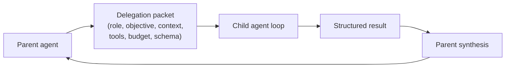
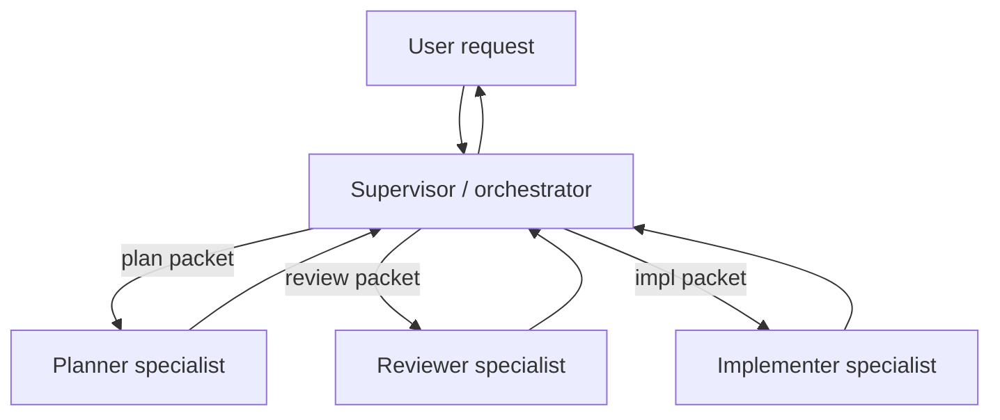

# Chapter 10 — Multi-agent delegation

## TL;DR

一个 multi-agent 系统，本质上就是一个 agent（父 agent）把另一个 agent（subagent）当作一个有边界的工作单元来运行。做得好，它能把某个子任务隔离出来，让父 agent 的 context 保持干净，同时让 subagent 使用不同的 tool 集合、模型或信任边界。做得差，它就会变成一句含糊的"看看这个吧"——配上不受限制的 tool 和不存在的输出契约（output contract），然后你要花一周来调试它。本章涵盖 delegation packet、result contract、sync 与 async、sequential 与 parallel 模式、recursion cap 与 isolation 模式、supervisor 与 specialist 两种拓扑，以及如何判断 delegation 是不是正确的选择，还是只是一次更昂贵的 tool call。

---

## Why this matters

你第一次构建 multi-agent 系统时，会同时发现三件事：subagent 用掉的 token 比你预期的多、返回的文本比你想要的多，而且它做出了你无法审计的决策。这三件事每一件都是契约的失败。packet 太含糊。result schema 根本不存在。审计轨迹（audit trail）是隐式的。

但第二次的收益正是值得你无论如何也要学会它的理由：一个形态良好的 delegation，是让 agent 实现专业化（specialize）最便宜的方式。父 agent 保持通用；subagent 拿到一个紧凑的角色、一个小的 tool 集合，以及一个适配该任务的模型。整个系统比单个无所不知的 agent 成本更低、推理更好。

---

## The concept

### When to delegate (and when not to)

当以下至少有一条成立时，才考虑 delegation：

- 该子任务需要**自己的 context**——不同的 system prompt、不同的 memory、不同的关注焦点。
- 该子任务应当**隔离副作用（side effect）**——一个 worktree、一个 sandbox、一条独立的信任边界。
- 该子任务想要**不同的模型或 tool 集合**——用便宜的模型做一次狭窄的查询，用昂贵的模型做深度推理。
- 该子任务可以**安全地与其他子任务并行**——三个 review 并行执行，然后做综合（synthesize）。

而以下情况*不要* delegation：

- 一个确定性的 tool 就能回答这个问题。
- 一个 skill 就能教会父 agent 自己去做。
- 子 agent 反正都需要父 agent 的完整 context（那你会为 context 成本付两遍费）。
- 子任务太小，不值得再开一轮模型 loop（delegation 是有建立成本的——system prompt、tool 列表、packet 构造）。

大多数团队会跳过的、最便宜的改进：问问自己每一次 delegation 是不是在替换一个本来更便宜的 tool call。

### The delegation packet

父 agent 发给 subagent 的是一个 *packet*，而不是一份 transcript：

```ts
type DelegationPacket = {
  role:            string;       // "researcher" | "reviewer" | "implementer" | ...
  objective:       string;       // 子任务，用散文描述
  context:         string;       // 经过筛选的切片，而不是完整的父 transcript
  allowedTools:    string[];     // 比父 agent 的更收紧
  constraints:     string[];     // "不要写到 /tmp 之外"、"最多读 10 个文件"
  maxSteps:        number;       // 硬上限
  budget?:         { tokens?: number; cost?: number };
  outputSchema:    JsonSchema;   // 结果必须长成什么样
  remainingDepth:  number;       // 剩余的 delegation 深度（见 Recursion caps）
};
```

来自生产环境的几条规则：

- **默认不要把父 transcript 全盘倒过去。**做摘要，或者只挑出 subagent 真正需要的那几条消息。全盘倒会增加 token 成本、扩大 prompt-injection 的攻击面，并提高 subagent 跑偏的概率。
- **收紧 tool 列表。**一个 reviewer subagent 只拿到只读的 tool。一个 implementer 拿到的写权限被限定在某个 worktree 内。一个对外的 researcher 拿到 web 类 tool，但没有 shell。
- **传递剩余的 delegation 深度。**每次 spawn 都让它递减。当它归零时，不再允许 spawn。



### The result contract

返回的东西必须是可校验的。一段裸露的散落文字，就是一颗等着爆的契约失败炸弹。生产系统最终都收敛到类似这样的形态：

```ts
type ResearchResult = {
  answer:       string;
  evidence:     Array<{ source: string; quote: string }>;
  uncertainty:  "low" | "medium" | "high";
  followups:    string[];
  toolsUsed:    string[];      // 用于审计（Ch.16）
  cost?:        number;        // 用于父 agent 的预算汇总
};

function validateAgainstSchema(result: unknown, schema: JsonSchema) {
  // 如果 subagent 的输出不匹配，就拒绝它。
  // 坏输出是一个可恢复的错误——父 agent 可以带着
  // 一条纠正性的 prompt 重试，或者大声失败。
}
```

结构化输出（structured output）让父 agent 能机械地进行推理：校验 schema、给置信度打分、在多个兄弟（sibling）结果之间做比较、向用户呈现。非结构化输出则逼着父 agent 再调一次模型来解读它们——这是每次 delegation 上一笔隐藏的二次成本。

### Synchronous vs asynchronous; sequential vs parallel

两条正交的轴：

- **Synchronous（同步）**——父 agent 等待 subagent。大多数生产环境的搭法都是这样（OpenCode 的 `task` tool、Hermes Agent 的 `delegate_task`）。
- **Asynchronous（异步）**——subagent 在后台线程或进程中运行。Hermes Agent 的 `spawn_background_review_thread` 是这方面的经典参考；Paperclip 的 heartbeat 调度在系统层面就是异步的。

- **Sequential（顺序）**——父 agent 委派 A，等待，然后再委派 B。A 的结果为 B 提供信息。
- **Parallel（并行）**——父 agent 一次性 spawn A、B、C；它们独立运行；当全部返回后父 agent 做综合。

```ts
// 并行，当各个输入真正相互独立时。
const [api, ui, db] = await Promise.all([
  delegate(apiReviewPacket, ctx),
  delegate(uiReviewPacket, ctx),
  delegate(dbReviewPacket, ctx),
]);
const final = await synthesize([api, ui, db], ctx);

// 顺序，当一个结果会塑造下一个 packet 时。
const investigation = await delegate(investigationPacket, ctx);
const patchPlan      = await delegate(buildPatchPlanPacket(investigation), ctx);
const final          = await synthesize([investigation, patchPlan], ctx);
```

并行节省墙钟时间（wall-clock time）；顺序保持推理有序。把它们混着用——采集阶段用并行，综合阶段用顺序。

### Recursion caps and the depth-1 default

一个能 spawn 自己的 subagent 的 subagent，就是一场等着发生的栈溢出。生产环境里有三种模式：

- **Depth-1 默认**（最常见的生产选择）：父 agent 可以 spawn subagent；subagent 不能再往下 spawn subagent。最安全、最简单，除非有具体需求逼你做别的，否则你应该从这个开始。
- **Bounded depth（有界深度）**（OpenClaw 用深度 5）：允许到一个小上限；耗尽就抛错。
- **Topology cap（拓扑层面的上限）**（Paperclip）：完全不允许在 loop 内 spawn；由调度器（scheduler）派发；agent 的父/子关系被作为数据来追踪，而不是栈帧。

```ts
function assertCanSpawnChild(ctx: AgentContext) {
  if (ctx.remainingDelegationDepth <= 0) {
    throw new Error("Delegation depth exhausted; flatten or hand off via supervisor");
  }
}
```

一个微妙的坑：深度上限通常是基于计数的，但深度 N−1 的两个 subagent 可以各自 spawn 一个子 agent，从而让深度 N 处的有效工作量翻倍。如果成本比嵌套更重要，那就换成*基于成本*的上限——以 spawn 出来的 token 总量为准，而不是嵌套层数。

### Isolation modes

每个子 agent 能拿到什么级别的隔离：

| 模式 | 隔离了什么 | 成本 | 何时使用 |
|---|---|---|---|
| **Same process, shared memory（同进程、共享内存）** | 只隔离 system prompt 和 tool 集合 | 最便宜 | 快速的 specialist 查询 |
| **Separate session, shared store（独立 session、共享存储）** | memory 命名空间、审计日志 | 低 | 大多数 subagent 用途 |
| **Worktree** | 文件系统（每个 subagent 一个 git worktree） | 中 | 不能碰到主分支的代码编辑 |
| **Sandbox** | OS 级隔离（Docker、Modal、Vercel） | 高 | 不可信代码的执行 |
| **Separate process / adapter（独立进程 / 适配器）** | 完整的进程边界 | 最高 | 不同的运行时；channel adapter 风格 |

OpenCode 支持 worktree 隔离。Hermes Agent 的 tool environment（`tools/environments/`）在每个 tool 的层级上支持 Docker、SSH、Modal、Vercel Sandbox。Paperclip 把每个 adapter 跑在一个独立进程里。这个选择是一个信任与预算的权衡（trade-off）：隔离越高成本越大，但能容纳的风险也越多。

memory 与召回（recall）那一侧——subagent 能从哪里读、能往哪里写——由 Ch.06（recall 边界）和 Ch.07（write-back 边界）覆盖。两侧要选同一个答案；混合策略（subagent 什么都能读，但什么都不能写）通常能用；反过来（能写但不能读）几乎从来不行。

### Parallel work on shared artifacts

当多个 subagent 在相关的产物上并行运行时（三个 reviewer 跑同一个代码库、两个 implementer 编辑同一文档的不同章节），要*在* spawn *之前*就选定一种协调形态。两种模式几乎覆盖了所有情况：

- **隔离编辑 + 在综合阶段合并。**每个 subagent 在自己的 worktree、sandbox 或命名空间里工作；当全部返回后，父 agent 合并这些输出。重叠会以合并失败的形式浮现，在单一一处被解决——由父 agent 的综合步骤来解决（当编辑互不相交时做确定性合并）、由一个 reviewer specialist 来解决（当它们干净地重叠时做语义合并），或者由用户来解决（当重叠是真实冲突时）。这是更安全的默认选择；它把冲突推到一个解决点上，而不是任由兄弟们在共享状态里相互竞争。
- **共享黑板（shared blackboard）。**一个小的结构化存储（一个 JSON 文件、一个 Redis hash、一行数据库记录），兄弟们在各自运行期间都能读写——对于"我已经查过 `auth.ts` 了，跳过它"这类协调很有用。黑板继承了 Ch.07（原子写入）和 Ch.08（CAS 状态转移）的加锁与 CAS 纪律；一个没有这些纪律的黑板，是一个伪装成协调模式的竞态条件（race condition）。

具体到 coding agent，worktree 隔离加上一个综合后的合并步骤，是已被确立的模式：每个 subagent 拿到自己的 checkout，父 agent 把各个 diff 并排检视，然后合并要么是确定性的（无重叠），要么被浮现出来等待解决（检测到重叠）。让并行的 subagent 在单一仓库状态上相互竞争，是 multi-agent 编码 bug 中代价最高的一类——那些部分性的、彼此不一致的编辑，单看每个文件都貌似合理，一到集成时就崩。多开一个 worktree 的成本，远小于回退那种烂摊子的成本。

### Supervisor vs specialist topology

有两种角色在各个系统里反复出现：

- **Supervisor / orchestrator（监督者 / 编排者）**决定谁来跑、以什么顺序、用什么输入。通常就是主 agent loop。Paperclip 的 heartbeat 服务就是一个控制平面（control-plane）层级的 supervisor。
- **Specialist（专才）**是一个被紧紧限定范围的 subagent，有狭窄的 tool 集合和清晰的角色——`explore`、`review`、`summarize`、`extract`。specialist 不决定做什么；由 supervisor 来决定。



能扩展的模式：给你的 specialist 起名字。每个都有一份 system prompt、一个 tool 列表、一个 result schema，以及一行描述。supervisor 按名字来挑。OpenCode 内置的 agent profile（`build`、`plan`、`general`、`explore`）是这方面的经典参考；随着新的 specialist 需求浮现，你通常会为每个项目再加几个自定义 profile。

### Per-subagent restrictions

父 agent 对一个 specialist 施加的每一条限制，同时也是一次 Ch.04 上的胜利。一个只有三个 tool 的 specialist，system prompt 更短（多个 specialist 之间 cache 复用更多）。一个用更便宜模型的 specialist，每次调用更省钱。这些节省会在大量 delegation 中累积复利。

实践中：

- **Tools。**每个角色一份显式的 allowlist；默认拒绝。（Ch.03 的元数据标志告诉 supervisor 哪些 tool 对哪个 specialist 是安全的。）
- **Model。**狭窄任务用又便宜又快的；真正困难的子问题用推理模型。
- **Memory。**按 Ch.06 划定范围；通常读父 agent 的命名空间，写到自己的命名空间。
- **Approval gate（审批门）。**如果 specialist 能采取破坏性动作，它继承父 agent 的权限规则——Ch.12 讲这个门。

### Context handoff

一个 subagent 最大的单项成本，就是父 agent 传给它的 context。三种模式，从最便宜到最丰富：

- **全新的 system prompt + 仅 objective。**subagent 从干净状态开始。最便宜。当 objective 本身包含了全部 context 时管用。
- **摘要式交接（summarized handoff）。**父 agent 的 compaction（Ch.05）把相关的几轮对话摘要进一个 `<context>` 块。中等成本；通常是对的选择。
- **筛选过的 transcript 切片。**父 agent 挑出最后 N 轮，或全部匹配某个过滤条件的轮次。最贵；只在 subagent 确实需要原始措辞的场景下保留使用。

来自 Ch.05 的一条有用规则：父 agent *精简过的*运行 transcript，通常是一个比完整审计日志更好的交接起点。compaction 已经替你挑过哪些是重要的了。

### Subagent output discipline

一个明明一句话就够、却写出好几段的 specialist，是一处 token 泄漏。父 agent 应当强制要求：

- **简短的最终答案。**寥寥数句，或一个结构化对象。比这更长就是一次综合失败。
- **没有中间噪声。**父 agent 默认不应该在*它自己的 prompt context 中*看到 subagent 的 tool call 或推理过程——只看最终答案。（OpenCode 的 `task` tool 就是这么做的；Hermes Agent 的 `StreamingContextScrubber` 会把注入的 memory 从父 agent 的视野中隐藏起来。）这是一条 *prompt-context* 规则，不是一条*审计*规则：subagent 的 tool call、推理和中间轮次仍然会被记录到审计日志（Ch.05）和 trace 流水线（Ch.16），并且对于调试、回放和事后复查保持可检视。从父 agent 的 prompt 中隐藏是为了省 token、让父 agent 保持专注；但绝不要对运维者（operator）隐藏。
- **答案需要时给出引用过的证据。**每一个承重的（load-bearing）论断，都给出一个父 agent 可以核查的来源。

被训练得简短的 specialist，通常和 Ch.05 的 summarizer 用同样的方式训练：在 system prompt 里写明确的目的、用结构化的输出 schema、综合步骤用低 temperature。模型能做到；父 agent 得开口要。

### Subagent failure handling

一个 subagent 可以以三种可区分的方式失败：

- **Recoverable（可恢复）**（例如 schema 校验失败）。父 agent 带着一条纠正性 prompt 重试，上限设为 1–2 次。
- **Permanent（永久性）**（例如 tool 不可用、凭证无效）。父 agent 把失败浮现出来，要么换一个 specialist 试，要么向上失败到用户那里。
- **Silent（静默）**（例如输出通过了校验但答案是错的）。最难处理的一种。防御手段藏在 result schema 里（置信度字段、引用、结构化字段）以及交叉校验里（让第二个 subagent 来 review 第一个）。

持续追踪 subagent 的成功率。一个 30% 概率失败的 specialist，要么范围划得不好，要么被指派到了错误的任务上；无论哪种，它都是一个值得尽早抓住的 Ch.16 信号。

### The supervisor in a long-running control plane

有一种模式值得单独一提，因为它看起来不像 subagent：一个活在 agent loop *之外*、横跨多次运行的 supervisor。Paperclip 的 heartbeat 服务正是如此。它做调度、重试、监视孤儿任务、强制执行预算、把工作路由给 agent。它所监督的那些"agent"并不是进程内的 subagent——它们是可能跨越数分钟乃至数小时的完整 agent 运行。

这个模式对于那些工作生命周期长于单次 agent 调用的生产系统至关重要：长时间运行的自动化、多步审批、异步的用户交互。supervisor 是持久层；agent 是工人（worker）。Ch.08 的持久化与状态机，是它赖以站立的地基。把 supervisor 本身也当作一次 Ch.08 的运行来对待：状态机、原子认领（atomic claim）、heartbeat、回收器（reaper）。

### Background subagents

最简单的非阻塞 delegation：一个守护线程（daemon thread），在一轮对话成功之后运行，把结果写回 memory 或 skill。Hermes Agent 的后台 review fork 是这方面的经典参考（从 memory 写入的角度在 Ch.07 讲过）。把它用于"决定这个 session 里有没有什么值得记住的"或"在后台总结今天的工作"——而不是任何用户正在等待的东西。

需要遵守的约束：

- 后台 subagent 应当使用一个不同的（通常更便宜的）模型。
- 一个受限的 tool 集合——通常只有 memory 和 skill 类 tool。
- 它们的结果在*下一个 session*才可见，而不是这一个。Ch.04 的 cache 规则反过来适用：不要从一个后台进程里去改动正在运行的 prompt。

### Verification and cross-checking

一个较新的模式，在参考系统里尚未普及，但值得点出来：spawn *第二个* subagent，它唯一的工作就是拿着同一份 context 去 review 第一个的输出。这个 reviewer specialist 拿到原始 packet 加上第一个 subagent 的结果，然后返回*批准*或*这个答案有以下问题*。这是对静默失败的一份便宜保险。

两条实务提示：让 reviewer 的 tool 集合比 worker 的更紧（通常只读），并把 reviewer 的预算设在 worker 成本的一个零头上——一个比它所审查的工作还贵的 reviewer，不值得这次调用。

---

## Real-system notes

- **OpenCode** 提供了最干净的进程内 delegation 参考：一个 `task` tool，它用筛选过的 context spawn 出子 session，以及一个 `Agent.Service.handleSubtask` 流程，向父 agent 返回单个结构化的观测结果（observation）。内置的 `build` / `plan` / `general` / `explore` profile 展示了 supervisor/specialist 的拆分。
- **Hermes Agent** 是两种风格的参考：用于在线 subagent 的同步 `delegate_task`，以及用于异步后台 subagent 的 `spawn_background_review_thread`，后者配有一份紧紧受限的 tool 白名单。
- **Paperclip** 是控制平面模式的代表：一个 supervisor（heartbeat scheduler）把 issue 路由给 agent、追踪 `parent_run_id` 血缘、并跨运行强制执行预算与审批。恢复任务可以通过 `assigneeAdapterOverrides` 请求一个更轻的模型——在编排层面做每个 subagent 的模型选择。
- **OpenClaw** 把 channel adapter 用作一种跨进程边界的 delegation 形式：入站消息派发到底层的 agent 运行时；adapter 就是那条边界。是"subagent 是一个不同进程"这一情形的有用参考。

---

## Common failure cases

*这些失败是持久的；它们的修复方式演化得最快——每条都点出模式，把当下的具体细节留给你和你的 AI 搭档。*

- **Fan-out 让 token 账单翻三倍。**一个任务被拆成一扇子（fan）subagent，成本是多轮 loop 加上综合，而单看任何一条 trace 都不显眼。*修复：一份汇总到父运行的 fan 预算，对整棵树设一个基于成本的上限，而不是逐叶计数。*
- **subagent 返回一堵文字墙。**好工作被裹在散文里，父 agent 还得再花一次模型调用去解读，吃掉 cache 和 context。*修复：把简短当成一个被校验的约束——一个有界的 result schema 加一个硬输出上限，超限就拒绝并重试。*
- **并行的 subagent 损坏了一个共享产物。**兄弟们同时编辑同一份状态，合并以一种没有任何单个输出能解释的方式崩掉。*修复：把工作切分，让兄弟们无法相撞，只在重叠不可避免之处才回退到真正的并发控制（Ch.08）。*
- **一个 subagent 返回了一个自信的错误答案。**结果形态正确但内容是假的，而 schema 校验抓不住它。*修复：用一个对证据有独立访问权的对抗性交叉核查，配上可核查的引用，而不是一个自评的置信度字段。*
- **一个后台 subagent 死了，父 agent 永远地等下去。**一个异步 worker 崩溃，结果永远没落地；这个失败是一种没有异常可捕获的"缺席"。*修复：把异步 delegation 当作一次有租约（lease）、有截止时间的运行，并为部分返回制定一个 fan-in 策略（Ch.08）。*

---

## Pair with your agent

几条在本章上效果不错的 prompt：

- *"对我当前调用的每一个 tool，判断它应该继续保持为 tool，还是应该变成对某个 specialist subagent 的 delegation。套用本章的四条标准，并解释每一个决策。"*
- *"为我的项目设计两个 specialist subagent：一个 `reviewer`（只读、便宜模型、简短的结构化输出）和一个 `implementer`（worktree 隔离、昂贵模型）。把两份 system prompt 和 result schema 都写出来，再加上决定何时调用各自的 supervisor 逻辑。"*
- *"把本章的 delegation packet 接进我的代码库。加上 `remainingDepth` 字段和 `assertCanSpawnChild` 守卫。写一个测试，证明一次深度为 2 的嵌套 spawn 会带着一条有用的错误信息干净地失败。"*
- *"拿我的一个多步研究任务，把它重构成带有末尾综合步骤的并行 delegation。把墙钟时间和总成本与顺序版本做对比。"*
- *"挑出我上周三个常见的 subagent 失败。把每一个归类为 recoverable / permanent / silent。对每一类，写出父 agent 侧的处理代码，并给我看它生成的审计轨迹。"*
- *"加一个后台 review subagent，在每一轮成功对话之后运行，tool 白名单为 `{memory, skill_manage}`。确保它的写入只在下一个 session 才对父 agent 可见（Ch.04 规则）。用 prefix fingerprint 来验证。"*
- *"为我的 agent，按 specialist 记录过去一个月的 subagent 成功率。如果有任何 specialist 失败率超过 20%，提议要么收紧范围、要么换一个模型。"*
- *"实现一个 reviewer subagent，在我的 `implementer` specialist 的任何输出返回给父 agent 之前对其做复核。把 reviewer 的预算设为 implementer token 花费的 30%；如果 reviewer 不同意就拒绝并重试。"*

---

## What's next

现在你有了一个会做规划（plan）的父 agent、一种把 subagent 工作表达为有界 packet 的方式，以及让 delegation 保持聚焦的纪律。Ch.11 把 Ch.01–10 的一切组装成单一的 harness——loop、tool registry、prompt builder、memory 层、持久化引擎、planner、delegation 表面——汇成一套你可以适配到自己技术栈的、可组合的架构。

---

<!-- nav-footer -->
<div align="center">

[⬅️ 上一章：Ch.09 Planning patterns](09-planning-patterns.md) · [📖 课程目录](../../README_zh.md) · [下一章：Ch.11 The agent harness ➡️](11-agent-harness.md)

</div>
