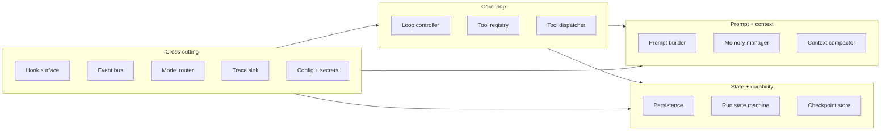
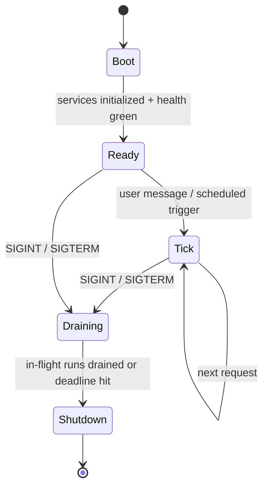
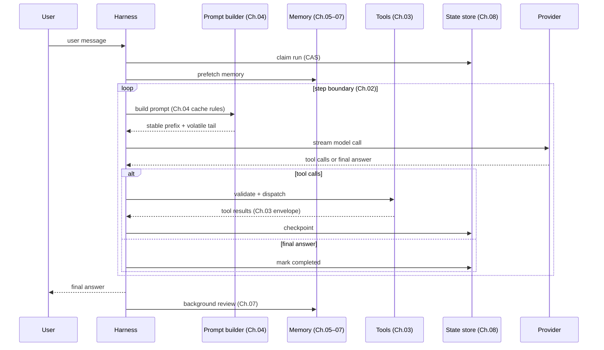

# Chapter 11 — The agent harness

## TL;DR

harness 是围绕模型构建的运行时（runtime）。从 Ch.01 到 Ch.10，每一章讲的都是它的某一块零件：loop、tools、prompt、memory、persistence、planning、delegation。本章要做的，是把这些零件组装成一个单一的程序——它有清晰的生命周期（bootstrap → tick → shutdown），有定义良好的 hook 扩展面，有不会泄露 secret 的配置模型，以及 harness 本身与调用它的应用代码之间一条干净的边界。模型带来判断力，harness 带来结构。读完本章，你应该能看着任何一个生产级 agent，叫得出它的各个组件、它的生命周期，以及什么插在了哪里。

---

## Why this matters

知道 harness 是什么，可以让你避开三种失败模式。

第一种：你把 tool dispatcher 直接内联写在 loop 里，把 prompt builder 内联写在 dispatcher 里，把 memory 层内联写在 prompt builder 里。六周之后，你想扩展其中任何一块，都会牵连到其他几块。harness 的存在，正是为了让每一章对应的组件都有一个干净的接口和一个明确的归属位置。

第二种：你有很好的组件，却没有生命周期。数据库在第一次 tool call 之后才连上，plugin loader 在第一次模型调用之后才运行，heartbeat 在 migration 完成之前就启动了。harness 定义了一套启动顺序，让这些事不再是意外。

第三种——Anthropic 在他们关于长时运行应用的文章里说得很到位：*harness 里的每一个组件，都编码了一个关于「模型自己做不到什么」的假设。* 没有这个框架，harness 会在底层模型早已不再需要某些功能之后，继续堆积这些功能。harness 不是一座永久的纪念碑；它是脚手架，应当随着模型的演进而演进。

---

## The concept

### What a harness is, and what it is not

harness 拥有：loop、prompt builder、tool registry 和 dispatcher、memory manager、persistence 层、hook 系统、bus、model router，以及把这一切串联起来的生命周期。

harness *不*拥有：agent 相信什么、它积累的具体 skill、具体 tool 的 prompt、决定该解哪些任务的业务逻辑。这些都是应用代码。同一个 harness，今天应该能托管一个 explore agent，明天托管一个 customer-support agent，下周托管一个 analyst agent——而 harness 本身一行都不用改。

一条好用的判据：如果移除某个功能会破坏「这个系统能解什么任务」，那它是应用代码；如果移除它会破坏「这个系统还能不能跑起来」，那它是 harness。Paperclip 是这一划分最干净的参考——Paperclip 本身并不调用模型；它派生（spawn）adapter 进程（应用层）并对它们进行 orchestration。OpenCode 用同样的方式把 server / services（harness）与 agent 定义（应用层）分开。

### The component inventory

每个生产级 harness 都有十项服务，外加几项可选项：



每一个方块都是你已经读过的一章。Ch.01——loop 主体；Ch.02——loop controller；Ch.03——tool registry + dispatcher；Ch.04——prompt builder；Ch.05——memory manager + compactor；Ch.06–07——memory store + writer；Ch.08——persistence + run state + checkpoint store；Ch.09——planner（叠在 loop 之上的一层）；Ch.10——delegation（supervisor 住在 loop 里，specialist 由它派生）。Hooks、bus、router、trace sink 和 config 是横切（cross-cutting）的管道——接下来讲。

harness 就是这张图，各章则是其中的零件。

### Composition: how the services wire

生产级 harness 中反复出现三种模式，大致按正式程度递增排列：

- **Closure factories（闭包工厂）。** 每个服务是一个函数，接收它的依赖、返回一个带方法的对象。串联只在 `main` / `app.ts` 里做一次。Paperclip 用的是这种——小巧、显式，传入 fake 即可轻松测试。
- **Service registry（服务注册表）。** 组件在启动时把自己注册进一个 typed registry；使用方按名字查找。当有很多同类事物（tools、agents、providers）时很有用。
- **Layered DI（分层依赖注入）。** 每个服务通过类型签名声明它的依赖；运行时按顺序解析它们。OpenCode 正是用 Effect 的 `Layer.effect` 来做这件事。

选一种，然后坚持用它。最糟糕的 harness 就是把三种混在一起——有的服务靠注入，有的靠注册，有的当单例 import 进来。服务在构造时是 async 还是同步，同理：选一个约定并守住它。

```ts
// A typed harness — services as fields, all dependencies explicit.
type Harness = {
  config:        Config;
  bus:           EventBus;
  hooks:         HookRunner;
  tracer:        TraceSink;
  prompt:        PromptBuilder;     // Ch.04
  memory:        MemoryManager;     // Ch.05–07
  tools:         ToolRegistry;      // Ch.03
  loop:          LoopController;    // Ch.02
  state:         RunStateStore;     // Ch.08
  checkpoints:   CheckpointStore;   // Ch.08
  router:        ModelRouter;       // Ch.17 (forward)
};
```

### The lifecycle: bootstrap, tick, shutdown



三个阶段，各有各的规则。大多数 harness 的 bug 都住在阶段之间的边界上——服务在 boot 完成之前就被用了，请求在 drain 开始之后还被接收，shutdown 没有等 run state machine 完成 checkpoint。

### Bootstrap order

启动顺序不是随意的——每一步都依赖前一步。在各类生产系统中行之有效的顺序是：

1. 加载并解析配置文件（带 env-var override）。
2. 校验配置 schema；遇错快速失败（fail fast），并把*所有*错误一次性暴露出来。
3. 替换 env vars，解析 `$secret:` 引用。
4. 打开数据库；运行所有待执行的 migration。
5. 初始化存储服务（sessions、transcripts、memory store）。
6. **发现 plugins**：从打包路径和用户路径中发现 plugins；加载每个 plugin 的 *manifest*——它贡献的 tools、agent profiles、hook handlers 和 commands——但暂不激活它。
7. 以确定的顺序构建 tool registry：先 built-ins，再 plugin 贡献，最后 config 声明的（Ch.04 的 cache 规则在此适用——顺序在 boot 时固定，之后不变）。
8. 用同样的方式构建 agent registry：先 built-in profiles，再 plugin profiles，最后 config profiles。
9. **激活 plugin hooks**，针对此时已经稳定的 registries；这是第二趟（second pass）。
10. 启动可选的子系统（scheduler、MCP server、WebSocket bus、cron）。
11. 运行健康检查——数据库可达、模型 provider 可达、plugin 握手正常。
12. 翻转 readiness 标志；开始接收流量。

这种两趟（two-pass）结构是关键的承重细节。plugins 会*向* tool registry 和 agent registry 贡献内容，所以在 plugin manifest 加载之前无法构建 registries；但 plugin hooks 又需要*针对*一个稳定的 registry 触发，所以在 registries 构建完成之前无法激活它们。把 plugin 加载拆成「发现 manifest」（步骤 6）和「激活 hooks」（步骤 9）两步，是在不让 registry 在运行时可变（那会破坏 Ch.04 的 cache 稳定性）的前提下，解决这个依赖关系的最简办法。

有两个标志值得区分：*liveness*（进程还活着吗？）和 *readiness*（它在接收流量吗？）。对 load balancer 或 supervisor 而言，它们是两个独立的信号。把二者混为一谈，正是 agent 系统里一半部署期故障的根源。

### One tick, end to end

一个 tick = 一条 user message → 一个最终答复。每一章的贡献都会在此现身：



每一条箭头都是一个 hook 点。pre- 和 post-LLM hook 夹住模型调用。pre- 和 post-tool hook 夹住 dispatch。session-start 和 session-end hook 夹住整个 tick。plugins 通过在这些点注册 handler 来扩展 harness，而不必改动 loop。

### Graceful shutdown

一个信号处理器——SIGINT 或 SIGTERM——会把 harness 翻入 draining 模式。在 drain 期间：

- 新请求被拒绝（或排队，取决于策略）。
- in-flight 的 run 会拿到一个截止时间（通常几分钟），以便走到 step boundary 并干净地 checkpoint。
- 截止时间一到，仍存活的 run 会在 state machine（Ch.08）里被标记为 `cancelled`；它们的 lease 会被下一个实例回收（reap）。
- 待处理的 background-review fork 会被 join，或标记为已放弃。
- 数据库连接池排空；bus 关闭；进程退出。

跳过 graceful shutdown 的代价在平时是隐形的，直到某天一次部署打断了十个长时运行的 agent session；接下来那个实例就得费劲去搞清楚到底发生了什么。Ch.08 的 reaper 负责*恢复*，而本章负责*预防*。

### The hook surface

Hooks 是 harness 的扩展 API。六个生命周期点覆盖了大多数生产需求：

| Hook | Fires when | What it is for |
|---|---|---|
| `pre_session` | session 开始时一次 | 注入身份、设置 namespace、启动 prefetch |
| `pre_llm_call` | 每次模型调用之前 | 最后时机修改 prompt、设置 gate、做 redaction |
| `post_llm_call` | 每次模型调用之后 | token 计数、redaction、抽取 plan |
| `pre_tool_call` | 每次 tool dispatch 之前 | 权限检查（Ch.12）、参数变换 |
| `post_tool_call` | 每个 tool 返回之后 | redact secrets、附加 metadata、记日志 |
| `post_session` | session 结束时一次 | background review（Ch.07）、成本汇总、归档 |

harness 按注册顺序触发每个 hook，传入一个 typed 的 context 对象。plugins 返回一个指令（`continue`、`modify`、`deny`）以及任何副作用（日志、事件），这些都经由 harness 走，而不是直接改动共享状态。Hermes Agent 和 OpenClaw 都以这种方式注册 hook；OpenCode 的 bus-event 模型是其近亲。

来自生产环境的两条规则：

- **Hook 必须是 idempotent（幂等）的。** 一个被重试的 step（Ch.08）会再次触发同样的 hook。如果某个 hook 要写计数器，请用 idempotency key 来做自增。
- **fail-open 还是 fail-closed，取决于这个 hook 的职责。** *观测型（observational）* hook（tracing、metrics、纯日志、事后变换）是 fail-open 的：失败被记下来，loop 继续往前走。*把关型（gating）* hook——安全（Ch.18）、审批（Ch.12）、redaction、policy——必须 fail-closed：审批 hook 失败意味着该动作*未*获批准；redaction hook 失败意味着未脱敏的字节绝不会流到下一阶段；policy hook 失败意味着该操作被拒。在注册时给每个 hook 打上它的失败语义标签；harness 依据标签来路由失败。把所有 hook 默认设成 fail-open，是一个伪装成韧性的漏洞。

### Provider abstraction (and its leaks)

harness 把各个 provider 包在一个统一的接口之后，这样 loop、tools 和 prompts 都不必关心用的是哪一个。实践中这是一个*有泄漏的*抽象，有三个已知的窟窿：

- **Tool schema 格式**因 provider 而异（Anthropic 用 `input_schema`；OpenAI 用 `function.parameters`）。adapter 在入口处做归一化。
- **流式事件（streaming events）**各不相同（Anthropic 发出 `content_block_delta` 和 `tool_use`；OpenAI 发出 `choice.delta.tool_calls[i].function.arguments` 片段）。每个 provider 都有自己的 transport adapter。
- **Cache control 语法**是 provider 特有的（Ch.04 详细讲了 Anthropic 的显式标记形态和 OpenAI 的自动前缀形态）。只在拥有它的那个 adapter 内部应用它；对于不支持该标记的 provider，原样透传。

```ts
// A clean provider interface lives behind every harness's loop.
// metadata() is capability negotiation — the harness asks what the
// provider supports and adapts requests, rather than hard-coding it.
interface ModelProvider {
  stream(req: ModelRequest): AsyncIterable<ProviderEvent>;
  countTokens(text: string): number;
  metadata(): {
    contextWindow:             number;
    maxOutput:                 number;
    supportsCacheControl:      boolean;
    supportsParallelToolCalls: boolean;
    supportsStructuredOutputs: boolean;
    supportsHostedTools:       boolean;
    refusalShape:              "block" | "finish_reason" | "none";
  };
}
```

这就是*能力协商（capability negotiation）*：harness 不是硬编码每个 provider 支持什么，而是在 boot 时（以及配置 reload 时）读取 metadata，据此进行路由/适配。新的 provider 能力无需改代码即可启用；缺失的能力则表现为 router 拒绝把该请求路由到该 provider，而不是表现为 loop 深处某个运行时故障。

harness 通过 model router（Ch.17 的地盘）挑选 provider；loop 只看到接口。当某个 provider 失败时，router 会回退到下一个*兼容的* provider——同样的 tool-schema 方言、至少满足本轮所需的 context window、以及在 reasoning 和 policy 上的对等（Ch.02 在 loop 的错误处理规则里讲过这套纪律）。一个缺少主 provider 能力的回退不叫回退；它是另一种失败模式。Credential pool（在 429 时轮换 API key）也住在 router 里——Hermes Agent 和 Paperclip 都实现了这个。

### Configuration

harness 的配置面通常长这样：

- **文件（File）。** YAML、JSON 或 TOML；在启动时加载一次。Hot-reload 是可选且有风险的——它可能在运行中改动 tool description，从而破坏 cache（Ch.04）。
- **Env-var override。** 每个 key 都能被某个 env var 覆盖。env 优先于文件。请用一套有文档、带前缀的命名约定；随意的无前缀 env var 会变成调试陷阱。
- **Secret 引用。** 敏感值存在别处——keychain、AWS Secrets Manager、加密文件。配置里只放 `$secret:NAME` 指针，运行时解析；secret 绝不出现在加载后的 config 对象里。
- **Schema validation。** Pydantic、zod、JSON Schema——选一个。在启动时遇到校验错误就失败，并把*所有*错误一次性暴露出来。配置无效时，agent 不应启动。
- **Plugin 贡献。** plugins 可以用它们自己的 key 扩展 schema，在加载时合并进来。

一个值得提前防范的常见 bug：把一个含有已解析 secret 的配置值写到磁盘。serializer 应该重新输出 `$secret:` 引用，绝不写已解析的值。用一个单元检查来测它——序列化后 grep 一下已知的 secret 材料。

### Session, run, subagent — the vocabulary

四个工作单元术语在各系统间反复出现；钉死它们的含义，能让代码和文档保持一致：

- **Session** — 一条对话线程，对应一个 channel 上、一个 workspace 里的一个参与者。有稳定的 ID；持久化 transcript + state；可被 resume（Ch.08）。
- **Run** — loop 的一次调用。有起点、有终点、有最终状态（succeeded / failed / cancelled）。一个 session 在其生命周期内包含许多 run。
- **Subagent** — 由父级派生的一个子 run（Ch.10）。它看到的是父级 context 的一个过滤后的切片；返回单一一条观测结果。
- **Heartbeat** — control plane（Paperclip）用的一种唤醒 tick：supervisor 周期性醒来，逐个检查每个 session 有没有活要干。一次 heartbeat 不一定会产生一个 run。

OpenCode 的 `SessionID` 和 `RunID` branded type 是把这几者分清楚的最干净参考；Paperclip 的 `issues` / `heartbeat_runs` / `agent_task_sessions` schema 则最为详尽。

### Instance state and tenant scoping

一个服务于不止一个 project、user 或 tenant 的 harness，需要*实例状态（instance state）*——按 project 而非全局来 scope 的服务。OpenCode 的 `InstanceState.make()` 就是这个模式：服务按 `(project, agent)` 组合惰性构造并缓存。Paperclip 的多租户走得更远——每张表都有一个 `company_id`，每个查询都带着它。

能扩展的形态是：在每个 harness 操作的边界处，查出当前 `(tenant, project, agent)` 对应的 instance，并通过它来路由。绝不要从一个请求处理器里直接伸手去够某个全局服务。回头咬你一口的那个泄漏，往往是某个用户看到了另一个用户的 memory——因为一个全局单例被共享了。Ch.06 的 namespace 规则和 Ch.08 的 tenant-scoped state machine，都依赖于这套纪律。

### The bus and the streaming surface

生产级 harness 会把两个相邻的关注点分开：

- **内部 event bus** 让 plugins 和 observability 订阅 harness 事件（`session_started`、`tool_completed`、`run_failed`），而无需改动共享状态。多数 harness 跑一个简单的进程内 pub/sub；bus 默认*不是* durable 的——需要在重启后存活的事件会被单独持久化（Ch.08）。
- **streaming surface** 把 token、tool 事件和状态更新投递给各种 UI（TUI、web、CLI）。Server-sent events 和 WebSocket 都很常见。harness 把 bus 事件按 session 过滤后扇出（fan out）给已连接的客户端。

把这两者分开。bus 用于进程内 pub/sub；streaming surface 是面向网络的那张脸。把它们混在一起会产生别扭的耦合——每个 UI 事件都变成一个全局 bus 事件，而 bus 在高负载下会变成一个序列化瓶颈点。

### Health and readiness

有两个探针（probe）值得从第一天就上线：

- **Liveness** — 进程到底还活着吗？很廉价：一个不带任何依赖的简单 HTTP 200。
- **Readiness** — harness 准备好服务真实流量了吗？它检查数据库、模型 provider（带一个缓存一分钟的微型测试调用，以免反复猛打它）、plugin 握手，以及启动时任何关键的 hook 错误。

有三个指标在头一个月就能回本：活跃 run 的数量、queue depth（队列深度）、每分钟的 error rate。它们属于 Ch.16 的 trace pipeline，但从一开始就在 harness 这一层把它们接上是值得的。

### Simpler harnesses age better

Anthropic 的《Harness design for long-running agentic applications》一文给出了一条好用的规则：*harness 里的每一个组件，都编码了一个关于「模型自己做不到什么」的假设。* 随着模型变强，这些假设会变弱。上个季度还称职的组件，到了这个季度可能就成了不必要的开销。

两条务实的推论：

- **每年审计你的 harness。** 对每个组件问一句：*当前的模型还需要它吗？* 把不再回本的去掉。Anthropic 提到，当一个更强的模型不靠它也能处理更长的连贯工作时，他们就移除了自己的「sprint」分解层。
- **加复杂度也要守同样的纪律。** 每个新加的 harness 组件，都应当解决一个*实测过的*失败模式，而不是一个理论上的。投机性加上去的组件，几乎从来不会再被拿下来。

目标不是最精巧的 harness。而是能可靠扛住你的工作负载的*最简单*的 harness。本章的这些模式是一份「有哪些可用」的清单，不是一份「必须都有」的清单。

---

## Real-system notes

- **OpenCode** 是 embedded harness 最强的端到端参考：用 Effect Layers 做的 typed 服务组合、干净的 session/run 分离、按 provider 家族划分的 transport adapter、一个 SSE event bus，以及按 project 划分的 `InstanceState` 模式。把它当作一个 coding agent 的「默认」harness 形态来读。
- **Hermes Agent** 是 harness 与 gateway 分离的参考：内层的 agent loop 独立于各 channel adapter（Telegram、CLI、cron），所以同一个 harness 可以服务于许多 surface。它的 plugin hook 面（`pre_llm_call`、`post_tool_call` 之类）设计得很到位，值得借鉴。
- **Paperclip** 是 control-plane 式的 harness：它不直接调用模型；它通过一个 heartbeat scheduler，配合显式的 run-state machine、原子 claim 和 reaper（Ch.08），来 orchestrate *其他* harness（adapter 进程）。是多租户、多进程生产部署最强的参考。
- **OpenClaw** 在一个 personal-assistant harness 之上提供了最干净的 channel-gateway 抽象——尤其适合用来专门研究 gateway/harness 边界。

一个开源仓库之外的指引：Anthropic 的《"Harness design for long-running agentic applications"》（anthropic.com/engineering）是关于「context reset vs. compaction」（Ch.05 的地盘）、evaluator agent（Ch.10 的 verification 模式），以及「harness 的精巧程度应当紧跟模型能力」这一原则的最佳短读。

---

## Common failure cases

*这些失败模式是耐久的；它们的修法演进得最快——每条都点出模式，把当下的具体细节留给你和你的 AI 伙伴。*

- **在依赖就绪之前就被用了。** 全新 boot 之后的第一个请求失败，第二个就成了，而你在本地永远复现不出来。*修法：一道强制的 readiness gate，在每一个声明的依赖都报告健康之前拒绝翻转——配合两趟式 plugin 结构，先发现，再构建 registries，最后激活 hooks。*
- **liveness 和 readiness 是同一个探针。** 一个缓慢的依赖让一个健康的进程看起来像崩了，于是 supervisor 把整个机群拖进重启循环。*修法：liveness 不依赖任何东西，readiness 依赖一切，二者接到不同的消费者上。*
- **一个 gating hook fail-open 了。** 一个本该被拦的动作放行了，只留下一条没人告警的 hook 错误日志。*修法：把 fail-closed 设为默认且强制——gating hook 必须显式声明它，observational hook 才主动选择 fail-open（Ch.12）。*
- **一个 tenant 看到了另一个的 session。** 一个全局单例溜进了请求路径，在高负载下跨租户泄漏了状态。*修法：在每个操作边界做按租户的 instance 解析，不留任何全局逃生口（Ch.15）。*
- **harness 一直在给模型早已长大的地方搭脚手架。** 某个组件仍在消耗 latency 和 token，却已经不再防住任何东西。*修法：一次有证据支撑的定期 harness 审计——给每个组件标上它所解决的实测失败，并拿它的移除对照 eval 套件做 A/B（Ch.16）。*

---

## Pair with your agent

几个在本章上很好用的 prompt：

- *"画出我当前 agent 代码的组件图。指出每个组件实现的是 Ch.01–10 中的哪一章，并标出任何在一个文件里塞了两章份量关注点的地方。"*
- *"把我 agent 的启动代码，按本章的 bootstrap 顺序重新排列。验证 health 和 readiness 能各自独立地失败——给我看一个不会杀掉进程的、失败的 readiness 检查。"*
- *"接好六个生命周期 hook（`pre_session`、`pre_llm_call`、`post_llm_call`、`pre_tool_call`、`post_tool_call`、`post_session`）。加一个示例 plugin，给每个事件记录带时序的日志。验证这个 plugin 能在不改动 loop 的前提下被加进来。"*
- *"实现 graceful shutdown：SIGINT 触发 drain 模式，in-flight 的 run 最多拿 60 秒来收尾，仍在运行的任何东西在 run state machine 里被标记为 cancelled（Ch.08）。用一个故意卡住的 run 来验证。"*
- *"把我的 provider 集成重构成一个 `ModelProvider` 接口，每个家族一个 adapter。确认 loop 现在能针对一个没有网络访问的 mock provider 编译通过。在单元测试里用这个 mock。"*
- *"拿 Anthropic 的规则来审计我的 harness：『每个组件都编码了一个关于模型自己做不到什么的假设。』对每个组件，说出那个假设。基于当前前沿模型能可靠做到的事，提出一个可以移除或简化的组件。"*
- *"加上 tenant scoping：每个触及状态的服务都接收一个 tenant context。写一个测试，证明一个针对 tenant A 的请求够不到 tenant B 的 session、memory 或 run state。"*
- *"搭好 harness 的 event bus，以及一个监听它的 SSE streaming 端点。给我看一个 session，它的 token 实时流到浏览器里，同时 plugins 也在 bus 上订阅着同样的事件。"*

---

## What's next

你现在有了架构、生命周期和扩展面。剩下的章节会加上生产 agent 上线所需的各层：human-in-the-loop 审批（Ch.12）、connectors 和 MCP（Ch.13）、把 skills 和 subagent 设计当作一个单元（Ch.14）、backend 基础设施（Ch.15）、observability（Ch.16）、成本与 latency 策略（Ch.17）、安全与对抗性输入（Ch.18），以及运维（Ch.19）。每一个都是一个组件或关注点，栓接到你现在已有的这套 harness 形态上。

下一章是 Ch.12：那道在采取高风险动作之前暂停 loop、向人类发问的 gate。

---

<!-- nav-footer -->
<div align="center">

[⬅️ 上一章：Ch.10 Multi-agent delegation](10-multi-agent-delegation.md) · [📖 课程目录](../../README_zh.md) · [下一章：Ch.12 Human in the loop ➡️](12-human-in-the-loop.md)

</div>
