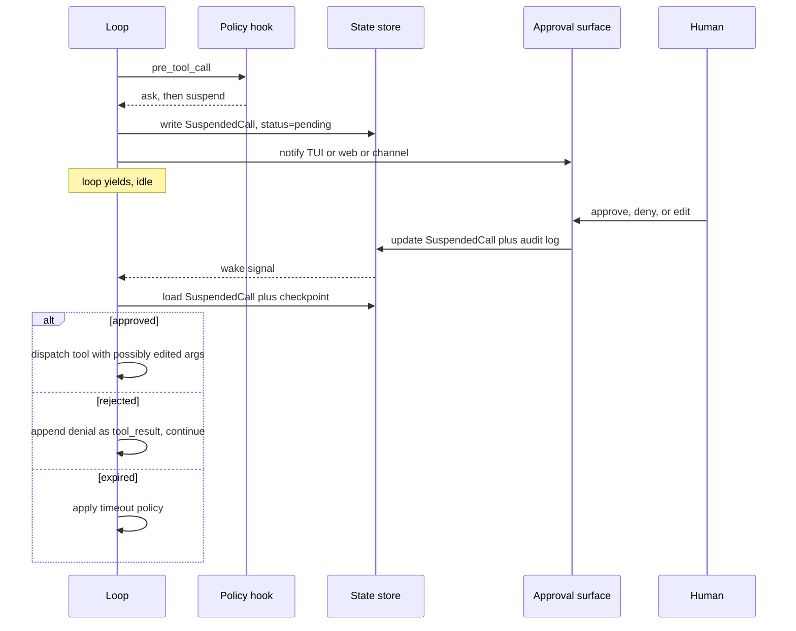

# Chapter 12 — Human in the loop

## TL;DR

Human-in-the-loop（人在回路）并不是简单的"不确定时就问用户"。它是一套面向高影响动作的结构化控制面：干净地暂停、持久化状态、给出足够的 context 供人做决策、收集这个决策、留下审计记录，然后从完全相同的位置恢复执行。本章讲的是其中的机制——三动作规则集（allow / ask / deny）、各类 approval 界面（inline TUI、web dashboard、async channel）、与第 8 章 `WaitingApproval` 状态衔接的暂停与恢复协议、人真正看到的 payload、有时限的 approval 与超时策略、多审批人工作流、面向可信自动化的逃生口，以及当人说"不"之后会发生什么。

---

## Why this matters

一个你大概率见过的小场景。你的 agent 既得力又能干。它有读文件、写文件、发消息、部署代码的 tool。某天，模型发出了一个删错目录的 tool call。这个动作毫不含糊；这个调用语法上完全合法；用户输入的是"清理一下 build 目录"，而模型把它理解得太宽泛了。这中间没有 approval gate。agent 恰恰做了你允许它做的事。

HITL 这套设计想说的是：动作并非一律平等。读一个文件和删一个目录不是同一种操作；它们的 approval 界面也不应该相同。模型在"做什么（what）"上可以很聪明；但在"该不该做（should）"上，人依然是那个该拍板的角色。

本章要解决的，是怎样做到这一点，而又不至于把每一个 tool call 都变成一个充满摩擦的勾选框。

---

## The concept

### Allow / ask / deny — the three-action ruleset

在 `references/` 中的各类生产系统里，approval 这个原语的形态是一致的：一组规则，每条规则带一个 pattern 和三个动作之一。最后匹配者胜（last match wins）。

```ts
type PermissionRule = {
  match:   { tool: string; argsPattern?: Record<string, string> };
  action:  "allow" | "ask" | "deny";
  scope?:  "call" | "session" | "forever";
};

// 示例规则集：允许读，src/ 下的写操作要先问，删除一律拒绝。
const rules: PermissionRule[] = [
  { match: { tool: "read_file" },                                action: "allow" },
  { match: { tool: "write_file", argsPattern: { path: "src/**" } }, action: "ask"   },
  { match: { tool: "delete_*" },                                  action: "deny"  },
];
```

要记住的三条规则：

- **最后匹配者胜。** 一条更靠后、更具体的规则会覆盖一条更靠前、更宽泛的规则。OpenCode 的 `Permission.evaluate` 正是这么做的。
- **任何破坏性动作的默认动作都是 `ask`** —— 与第 3 章的 `destructive: true` 元数据标志相互对照。运行时会把任何被标记为 destructive 的 tool 提升为 `ask`，除非有一条显式的 `allow` 规则覆盖它。
- **`deny` 在运行中的 session 内不可被覆盖。** 用户可以编辑配置然后重启，但运行中的 loop 会绝对尊重 `deny`。

整套机制以第 11 章 hook 界面中的一个 `pre_tool_call` hook 形式存在。该 hook 读取规则集、做出决策，然后要么让调用继续、要么排队等待一次 approval、要么把一个拒绝作为 tool result 返回。

### Approval surfaces

"批准什么"是一回事。"人在哪里看到它"才是让 HITL 真正可用的关键。有三种界面占主导地位：

| 界面 | Latency | 最适合 | 失效模式 |
|---|---|---|---|
| **Inline TUI 提示** | 秒级 | 交互式编码、开发工作流 | 用户不在——loop 无限期阻塞 |
| **Web dashboard** | 秒级—分钟级 | 多用户系统、治理流程 | 通知淹没在繁忙队列里被错过 |
| **Async channel**（Slack、Telegram、邮件） | 分钟级—小时级 | 长时运行的自动化、非工作时间的工作 | 回复链让 agent 和人都搞混 |

生产系统通常会支持不止一种。OpenCode 内置 inline TUI + web；Hermes Agent 加入了 async channel，这样一个长跑的 cron job 可以请求 approval，并在用户几小时后回复时继续执行；Paperclip 偏向 web dashboard，配以邮件/Slack 通知。每个 agent 的取舍是：选择与用户在发问那一刻的实际在场状态相匹配的界面。

一条来自生产环境的规则：*latency 预算越长，payload 就必须越丰富。* 一个 inline TUI 提示可以依赖用户还记得刚刚发生了什么。而一封几小时后才看到的邮件 approval，必须自成一体、不依赖上下文。

### The suspend protocol

当 loop 为了 approval 而暂停时，第 8 章的运行状态机会转入 `WaitingApproval`。在暂停之前，必须持久化到磁盘上的内容包括：

- 待定的 tool call（名称、参数、该次 dispatch 的幂等性 key）。
- 指向 run、session、user，以及需要做决策的 actor 的引用。
- 原因——模型试图完成什么，用一句话说清。
- 过期时间戳（见下文*有时限的 approval*）。
- tool 产生的任何 dry-run 预览的快照。

```ts
// harness 暂停时所持久化的内容。第 8 章的 checkpoint 在此之上扩展。
type SuspendedCall = {
  approvalId:        string;
  runId:             string;
  sessionId:         string;
  actorId:           string;
  toolName:          string;
  proposedArgs:      unknown;
  dryRunPreview?:    string;
  reason:            string;
  riskTier:          "read" | "reversible" | "external" | "high_impact";
  createdAt:         string;
  expiresAt:         string;
  status:            "pending" | "approved" | "rejected" | "edited" | "expired";
};
```

恢复是它的逆过程。当 approval 到达时，harness 读取这一行，依据 schema（第 3 章）校验该决策，然后要么重新 dispatch 这个（可能被编辑过的）调用，要么把拒绝作为 tool result 返回给 loop。loop 从它暂停时所处的那个精确步骤边界继续——第 8 章的幂等步骤规则在此适用。



### What the human actually sees

payload 是区分"好的，我批准"和"等等，这是什么？"的关键所在。每一个 approval 界面都应该展示：

- 提议的动作，用一句话、用通俗语言说清。
- 精确的参数，按界面格式化（TUI 中是 JSON，web 中是表单，聊天中是代码块）。
- 当 tool 支持时给出的 dry-run 预览——*"将删除 `/workspace/build`（143 个文件，2.4 GB）。"*（第 3 章的 dry-run 模式。）
- agent 提议它的原因——由模型显式生成的*面向用户的理由（rationale）*，与 tool call 一同给出，并可选地用计划步骤名称（第 9 章）和 tool 的确定性元数据（第 3 章的描述与 risk tier）加以补充。*不要*从模型隐藏的或最近的 reasoning 中提取这个理由：有些 provider 根本不暴露它，被暴露出来的内容也不总是与动作一致，而且 reasoning trace 本身是一个攻击面（第 18 章——来自前一个 tool result、形如 prompt-injection 的文本可能最终被反射到那里）。人看到的理由应该来自模型*为人而写*的一个字段，而不是窥探它思维过程的一扇窗。
- risk tier，以及任何把它提升到 `ask` 的标志。
- 该 approval 过期前的剩余时间。

OpenCode 的 approval 对话框会为 `edit_file` 渲染 diff；Paperclip 的对话框会包含发起源 issue 和干系人名单；领先的商业编码 agent 会为昂贵操作展示预估的 token / 成本影响。挑你的界面适用的部分照搬过来。

### Approval scopes

大多数 approval 其实并不是关于*这一次调用*。它们关乎*这一类调用，从今往后*。真实系统提供三种作用域：

| 作用域 | 持续到 | 何时使用 |
|---|---|---|
| **仅此次调用** | 调用完成 | 真正一次性的高影响动作 |
| **本 session** | session 结束或轮换 | 单个任务中重复出现的调用 |
| **永久（受限范围）** | 用户从单一界面撤销它 | 可信的 tool，且被紧紧限定在某个安全用例上 |

UI 通常是*批准*下方的一组按钮。存储方面：

- **此次调用** —— 更新 `SuspendedCall` 这一行；别的什么都不变。
- **本 session** —— session 的 `permission_overrides` 映射中新增一条；后续调用会在匹配全局规则集之前先与它匹配。
- **永久** —— 用户的配置中新增一条 `allow` 规则，它在下一次 session 启动时生效。*信任是受限的，而非一揽子授予*：该规则受以下因素约束——tool 名称、MCP server 及其版本（若是外部的——第 13 章）、tenant 或 workspace，以及一个参数类别（某个具体的 path glob、某个 enum 值、某个 URL 上的域名）。一个对 `web_fetch` 针对 `docs.example.com` 点过*信任*的用户，并没有批准对任意 URL 的 `web_fetch`。该规则应当引用 tool 定义的一个指纹（fingerprint），这样一次描述改写或版本升级就会触发一次全新的询问，而不是默默地继承旧的信任。而且用户必须能够从单一界面撤销任何*永久*规则，而不是去编辑 YAML——可撤销性是让宽泛作用域得以存活的那个安全阀。

要避免的陷阱：因为某个 UI 默认选了更宽的作用域，就把*本 session*悄悄提升为*永久*。在每一个对话框上都把作用域写明白。默认偏向更窄的作用域；扩大范围必须是一次显式的点击。

### Plan-mode approval — approve once, execute many

当 agent 处于 plan mode（第 9 章）时，最划算的 HITL 是*批准计划，然后执行*。计划本身就是 approval 的 payload——用户看到这些步骤，批准这项工作的整体形态，执行器随后无需逐步询问就推进下去。

机制是这样的：planner 产出一份计划，每个步骤都标注了 risk tier *以及它打算使用的具体参数*——路径、标识符、目标资源、预期 diff。approval 对话框展示这份计划。一经批准，harness 就插入一条 session 作用域的 `allow`，*由计划中的参数加以约束*，而不只是由 tool 名称约束。一份写着*编辑 `src/auth.ts`*的计划，产出的是一条针对 `edit_file` 且 `path = src/auth.ts` 的 allow（对于 diff 形态的 tool，还附带一个 diff 大小或范围的约束），而不是一条无差别的 `edit_file` allow。对于计划没有预料到的任何动作，执行器仍然要询问；漂移（drift）的检测方式是把提议调用的参数形态与该约束相比对——相同 tool 名称配上新参数，是*漂移*，而不是*匹配*。

Paperclip 通过 `executionPolicy = planning_mode` 实现这一点；OpenCode 的 `plan` agent 会写一个 `.opencode/plans/<name>.md`，它在用户批准后，会变成针对 build agent 匹配 tool 的、受参数约束的 session 作用域 allow。

要守住的纪律：不要让执行器偏离计划太远。如果计划说的是*编辑 `src/auth.ts` 和 `src/db.ts`*，而执行器提议要编辑 `src/payments.ts`，那么 plan 作用域的 approval 并不覆盖它——升级回到用户那里。参数约束正是机械地强制执行这一点的东西；没有它，*"同一个 tool，不同的文件"*就会蒙混过关，approval 也就从一份契约退化成了一张许可证。

### Edit instead of approve

很多时候，人的正确回应既不是*是*也不是*否*，而是*差点意思，改成这样做*。生产系统把这变成了一等的动作。

```ts
type ApprovalDecision =
  | { kind: "approved" }
  | { kind: "rejected"; reason?: string }
  | { kind: "edited"; replacementArgs: unknown }
  | { kind: "expired" };

// 对于 `edited`，在 dispatch 之前依据 tool 的 schema（第 3 章）校验。
function applyEdit(decision: ApprovalDecision, tool: ToolDefinition) {
  if (decision.kind !== "edited") return decision;
  const parsed = tool.schema.safeParse(decision.replacementArgs);
  if (!parsed.ok) {
    return {
      kind: "rejected",
      reason: `Edited args failed schema: ${parsed.error}`
    };
  }
  return decision;
}
```

OpenCode 的 approval 对话框包含一个*Edit*按钮，点开是一个内联 JSON 编辑器。Hermes Agent 的交互式 TUI 允许用户在批准前改写一条被提议的 shell 命令。领先的商业编码 agent 会展示一个 diff 预览，并允许用户在说"是"之前调整提议的文件内容。

两条来自生产的模式：依据同一个 tool schema 校验这次编辑（模型发出的调用通过了校验；人编辑过的调用也应当通过），并把编辑结果与原始内容一同记录，使审计轨迹同时呈现两者。

### Dangerous-default detection

有时一个 tool 在配置里被标记为 `allow`，但*那个具体的调用*在某种模型无法被期望注意到的方式上是有风险的。harness 会基于启发式规则把 `allow` 提升为 `ask`：

- **大影响。** 删除 >100 个文件；写入 >1 MB；影响 >N 条记录的批量操作。
- **危险路径。** 任何触及 `.git`、`.env`、`node_modules`、`/etc`、生产配置文件的操作。
- **非工作时间执行。** 凌晨 3 点由 cron 触发的破坏性操作会受到额外审视。
- **跨 tenant 或跨 workspace 的操作**（第 6 章的命名空间规则）。
- 环境中出现**形似生产的凭据**（env vars 中含有 `PROD`、`LIVE`）。

```ts
// 把任何匹配的调用从 allow → ask 提升，无论配置如何。
function dangerousDefault(call: ToolCall, ctx: AgentContext): boolean {
  if (call.name === "delete_files" && call.args.paths.length > 100) return true;
  if (touchesProtectedPath(call.args.path))                          return true;
  if (ctx.now.getUTCHours() < 6 && call.tool.destructive)            return true;
  if (looksLikeProductionEnv(ctx.env))                               return true;
  return false;
}
```

Hermes Agent 的 `ToolCallGuardrailController` 和 Paperclip 的 heartbeat 级检查都实现了各自的变体。阈值各有不同；原则不变——这些调用通过了类型检查、通过了 policy，但仍然能从人的一瞥中获益。

### Time-bounded approvals

approval 不会永久存活。harness 必须实现并在其中做出选择的三种策略：

- **过期即自动拒绝（auto-deny）。** 最安全。请求超时，模型收到一个拒绝，loop 不执行该动作而继续。
- **过期即照常继续。** 对于"阻塞比行动更糟"的低风险操作最为务实。但很少是正确的默认值。
- **过期即升级。** 治理形态：超时把请求转给一位后备审批人，或转给一位更高权限的用户。Paperclip 的多审批人流程就是这么做的。

正确的默认值是**auto-deny**，而*照常继续*只对运营方显式选择启用（opt in）的那些 tool 可用。把*照常继续*设为默认是个自伤的坑——一个被遗忘的 approval 就变成了一次静默执行。

一个有用的生产细节：approval 界面展示一个倒计时。当它归零时，界面本身展示结果（被拒绝 / 被升级）。审计日志把这次过期记录为一个一等事件，而不是一次静默的超时。

### Subagent approval inheritance

当父级进行委派（第 10 章）时，问题就变成了：父级的 approval 是否覆盖 subagent？三种策略：

- **继承。** subagent 以父级的 session 作用域 approval 运行。最省事；在 subagent 被限定得很窄时是安全的。
- **只继承 `allow`。** 从父级继承显式的 allow；任何 `ask` 都在 subagent 层级重新询问。多数生产系统默认如此。
- **不继承。** subagent 从规则集白手起家，仅此而已。最安全；也最吵。

OpenCode 默认*只继承 allow*；领先的商业编码 agent 也遵循同样的默认。挑选的规则：subagent 越是隔离（独立的 worktree、全新的 context），继承就越合理；subagent 越是强大（能写、能用 shell、能联网），就越应该重新询问。

### Multi-approver workflows

对于共享系统中的高风险动作，一次 approval 是不够的。这一模式（在 Paperclip 的 `issue_approvals` 表中最为清晰）：

- 该动作需要一组角色（`author`、`project_lead`、`security`）的签字（sign-off）。
- 每次签字都连同时间戳、角色、决策以及可选的评论一并记录。
- 只有当所有必需的签字都为 `approved` 时，动作才推进。
- 任何单个 `rejected` 都会立即中止整条链。
- 任何单个签字的超时都会升级到一位后备审批人。

这是治理，而非交互式 HITL。当风险足以证明其运营成本合理时，它是正确的工具——部署、账户关闭、跨团队变更。对于其他一切，它是错误的工具；如果签字链在日常操作上触发，它们就会被无视。

### Autonomous mode — the explicit escape hatch

有些工作负载根本就不应该有 human in the loop：cron 触发的例行工作、沙箱内的探索、CI 检查。harness 应当*显式地*支持这一点，而不是让它作为配置失误的副作用出现：

```yaml
# harness 配置节选。
permissions:
  mode: autonomous              # 显式；绝不从缺失 TTY 推断得出
  on_destructive: auto_deny     # 绝不静默允许，也绝不静默询问
  approval_log: enabled         # 即便无人审批，仍然审计
```

三条规则：该模式在配置中是**显式的**（没有隐式的*"没有 TTY 就不要 approval"*）；破坏性动作仍然有一个默认值（这里是 auto-deny），而不是静默允许；审计日志仍然记录那些*本会询问*的事件，以便运营方能复查一次交互式运行会在哪些地方发出提示。

诚实的说法是：*autonomous mode 是放弃人工审查，而不是放弃问责。* 日志必须保留。

### Approval as audit trail

每一次 approval——授予、拒绝、编辑、过期——都是一个值得保留的事件。最低限度的记录：

- **谁（Who）** —— actor ID、reviewer ID、来源界面（TUI、web、channel）。
- **什么（What）** —— tool 名称、参数（若参数含密钥则记其哈希）、risk tier。
- **何时（When）** —— 创建、决策、过期的时间戳。
- **为何（Why）** —— agent 提议它的原因、审批人（如有）给出其决策的原因。
- **如何（How）** —— 决策的形态：approved / rejected / edited（带 diff）。

这正是第 16 章将变为 observability 的同一份日志。它也是事后的事故复盘最先会要的东西。Hermes Agent 写入结构化 JSON 条目；Paperclip 把它们持久化到专用的 approval 表中；OpenCode 使用 bus event，下游收集器可据此持久化。

### Approval-by-decline — what happens after no

一次拒绝是一个回合（turn），而不是一个异常（exception）。harness 把一个 tool result 返回给 loop：

```ts
{
  ok: false,
  recoverable: true,
  code: "user_denied_action",
  message: "User denied this action.",
  hint: "Try a different approach, or ask the user what they would prefer.",
}
```

模型读取这个拒绝，并决定下一步怎么做——通常是其中之一：提议一个不同的动作、向用户征求指引、总结它尝试过的内容然后停下。与第 3 章的 `hint` 字段相互对照：一条有用的拒绝消息会告诉模型*哪类替代方案是可接受的*，而不只是*不行*。

agent*不该*做的：默默放弃用户的目标。一个被拒绝的步骤几乎从不意味着一个被拒绝的*任务*。loop 应当提议一条不同的路径，或者把僵局摆到台面上——而绝不是凭空消失。

---

## Real-system notes

- **OpenCode** 是 inline approval 界面最清晰的参考：一个带 `allow` / `ask` / `deny` 的 permission 规则集、最后匹配者胜的求值、作用域感知的 approval（call / session / forever），以及一个点开 JSON 编辑器的*Edit*按钮。其 bus-event 模型把 approval 干净地集成进了第 11 章的 harness。
- **Paperclip** 是多审批人与 async-channel 的参考：专用的 `issue_approvals` 表、签字链、超时升级、web dashboard 加上 Slack 与邮件通知。组织治理方面最强的参考。
- **Hermes Agent** 是个人助理场景中 async-channel HITL 的参考：一条 Telegram 或 Slack approval 消息到达、等待，并在人回复时恢复 agent。`--quiet-mode` 标志加上结构化日志，展示了如何在不丧失问责的前提下设计 autonomous mode。
- **OpenClaw** 提供了 channel-gateway 版本：通过聊天 channel 进行的 approval，不同于在 dashboard 里的 approval，而 channel adapter 会为该媒介塑造 payload 的形态。其在界面与 payload 分离上的处理值得研究。

---

## Common failure cases

*这些失败是持久的；它们的修复方式演进得最快——每条都点明模式，把当下的具体细节留给你和你的 AI 伙伴。*

- **人只是一味点"是"。** 太多 tool 被标记为 `ask`，于是 approval 被走过场盖章，那个真正重要的便随大流溜了过去。*修复：像对待告警一样为询问设预算，并盯住 approval 漏斗——把人从不拒绝的 tool 从 `ask` 移到 `allow`（第 16 章）。*
- **loop 因人不在而永远阻塞。** 一次 run 在 `WaitingApproval` 里坐上好几个小时、占着资源，而根本没人盯着那个界面。*修复：为每一个被暂停的 approval 设时限，以 auto-deny 为默认，并对待审批队列深度设告警（第 8 章）。*
- **批准一次变成批准一切。** 为某一个动作授予的作用域以裸 tool 名称为 key，于是 agent 在同一个"是"之下做出了更宽泛的调用。*修复：把每一个作用域绑定到 `(tool, argument-class, fingerprint)`，并把参数漂移当作一次全新的询问（第 13 章）。*
- **一个过期的 approval 触发两次，或对着一个已经物是人非的世界触发。** 一次崩溃重新执行了一个已批准的动作，或者一个数小时前的 approval 作用在了一个此后已经改变的 context 上。*修复：对已批准的步骤做幂等重放，外加在 dispatch 时刻依据当前状态重新校验 payload（第 8 章）。*
- **人批准了他们看不见的东西。** 一个单薄的或被注入污染的 payload，借人的判断把一个坏动作洗白了。*修复：要求 dry-run 预览，把参数渲染为可检视的数据，并让理由来自一个可信的、面向人的字段（第 3 章、第 18 章）。*

---

## Pair with your agent

几条在本章上效果不错的 prompt：

- *"把我所有的 tool 分类到 risk tier（read / reversible / external / high_impact），并为每个提议默认动作（allow / ask / deny）。然后把 permission 规则集写成 YAML，并依据我实际的 tool registry 加以校验。"*
- *"实现暂停协议：当一个 approval 触发时，写入一行 `SuspendedCall`，把 run 转入 `WaitingApproval`（第 8 章），并通知 approval 界面。在 approve / reject / edit / expire 时，从那个精确的步骤边界恢复。用一个故意延迟的 approval 来测试。"*
- *"通过 Slack 加上 async-channel approval。agent 发出 approval payload；人回复 *yes / no / edit*；当回复到达时 loop 恢复。处理好人在数小时后、session 已轮换之后才回复的情况。"*
- *"实现危险默认值的启发式规则：大批量删除、受保护路径、非工作时间、形似生产的 env vars。每一条都把 `allow` 提升为 `ask`。从我的历史里给我看五个本会被升级的真实 tool call。"*
- *"加上三种超时策略（auto-deny / continue / escalate），并让我按 tool tier 分别配置它们。用一个故意过期的 approval 来验证：正确的策略触发了，且审计日志把它记为 *expired*——而不是静默的。"*
- *"接好 approval 审计日志：每一次 approve / deny / edit / expire 都写一行结构化记录，含 who、what、when、why、how。把我上一周的 approval 跑一遍，告诉我哪些 tool 问得太频繁（UX 摩擦），哪些从不询问（很可能风险归类错了）。"*
- *"重构我的 subagent 派生（第 10 章），使父级的 session 作用域 `allow` 规则被子级继承，而 `ask` 规则在 subagent 层级重新询问。用一个提议破坏性动作的 subagent 来验证——确保父级先前的 allow 并不覆盖它。"*
- *"做一个 *永久信任此 tool* 按钮，它向我的用户配置中加入一条显式的 `allow` 规则。验证该规则被写入、被持久化，并在下一个 session 的 permission 求值中可见，且对话框里带一个显式的作用域标签，让用户知道自己正要选择启用的是什么。"*

---

## What's next

你现在有了一个面向高影响动作的控制面：一个规则集、一组 approval 界面、一套暂停与恢复协议、有时限的 approval，以及一份事后能回答*谁、什么、何时、为何*的审计日志。第 13 章讲的是这些界面之下的那一层——connector 与 MCP。当你第一次连接到一个第三方 MCP server 时，本章的这道 approval gate 正是那个问你是否信任它的东西。

---

<!-- nav-footer -->
<div align="center">

[⬅️ 上一章：Ch.11 The agent harness](11-agent-harness.md) · [📖 课程目录](../../README_zh.md) · [下一章：Ch.13 Connectors, MCP, IPC ➡️](13-connectors-mcp-ipc.md)

</div>
