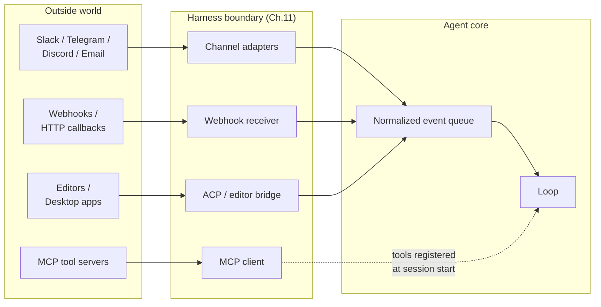
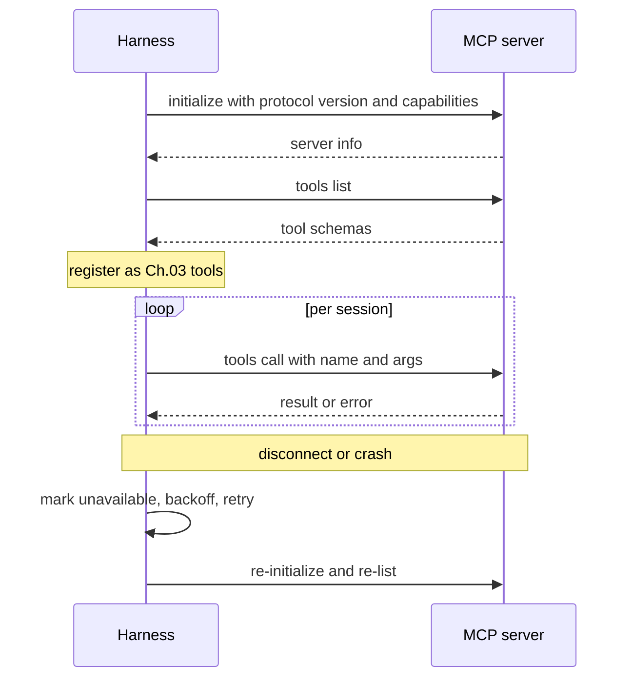
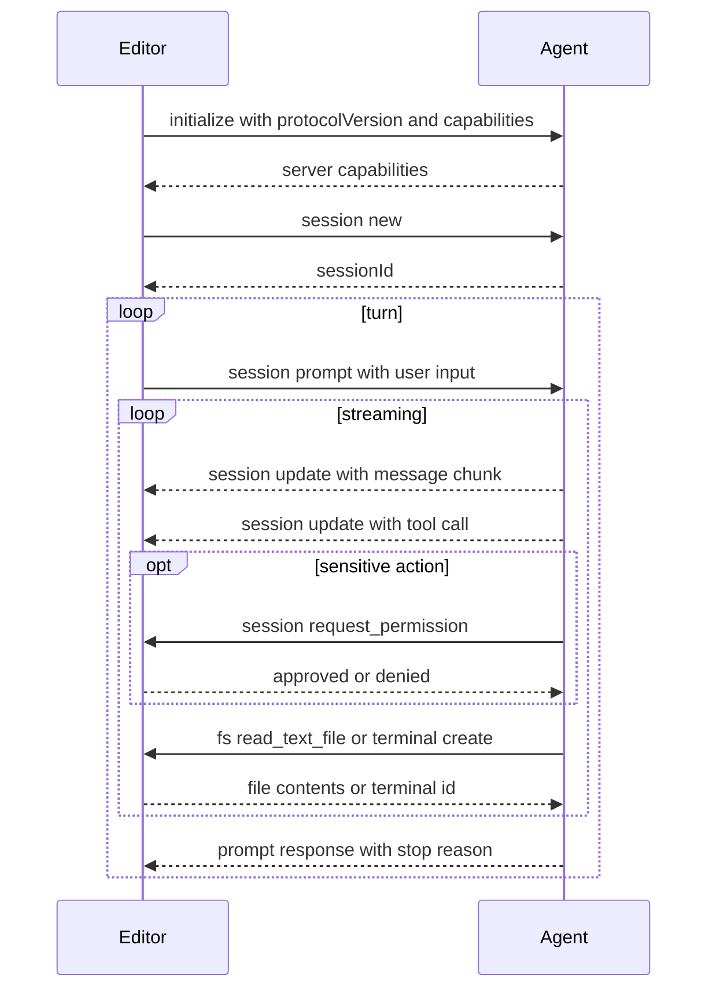

# Chapter 13 — Connectors, MCP, IPC, and channels

## TL;DR

一个只从 stdin 读取、向 stdout 写入的 agent 只是个演示品。真正有用的 agent 会连接到工作本就发生的地方 —— Slack、邮件、GitHub、Jira、Telegram bot、编辑器、内部 dashboard —— 并使用远超自身进程的 tool server。本章涵盖三个连接层：把来自众多平台的入站工作归一化为同一种事件形状的 channel adapter；用于 tool server 和编辑器集成的 Model Context Protocol（MCP，模型上下文协议）及其姊妹协议 Agent Client Protocol（ACP，agent 客户端协议）；以及把整个体系串在一起的 IPC 模式（JSON-RPC、HMAC 签名的 webhook、SSE、WebSocket、queue）。此外还有那些只有在生产环境里才会暴露出来的失败模式：rate limit、消息去重、replay 攻击、来自 channel 内容的 prompt injection，以及 gateway 与嵌入式 harness 之间的区别。

---

## Why this matters

大多数有用的 agent 最先在边缘处失败。模型变强了；loop 很稳健；prompt 是 cache 预热的；memory 层也很干净。然后 Telegram bot 在每秒 30 条消息时超时，agent 悄无声息地漏掉了用户一半的消息。或者 Slack webhook 发生重试，agent 把同一条回复发了两遍。又或者你上个季度开始用的 MCP server 有内存泄漏，长时间运行的 agent 每天崩溃一次。

agent 的推理核心并不在乎一条消息是来自 Slack、来自 webhook 还是来自 CLI。它应该接收一个归一化的事件，完成工作，返回一个归一化的输出。*消息从哪来* 恰恰是 adapter 层本应隐藏的那类细节 —— 也恰恰是当 adapter 层做得太薄时会反咬你一口的那类细节。

---

## The concept

### Three layers, one boundary



三类集成看起来各不相同，但解决的是同一个问题 —— 与 harness 并不拥有的系统对话：

- **Channel adapter** 把 IM、邮件和 webhook 事件转化为 loop 可用的归一化输入。
- **MCP 和 ACP** 是面向 *tool 和编辑器* 的协议 —— MCP 把外部能力带进 harness；ACP 则把 harness 暴露给编辑器和桌面宿主。
- **IPC** 是管道 —— JSON-RPC、SSE、WebSocket、queue、HMAC —— 把上面这些连在一起。

每一类在形态上都是一个 Ch.11 的 plugin：在启动时 register，拿到一组 hook 表面，向核心暴露一个干净的接口。本章的一切都是这一主题的变体。

### Channel adapters: one event shape from many platforms

无论消息来自哪里，agent 核心都应看到同一种事件形状：

```ts
type ChannelEvent = {
  channel:   "slack" | "telegram" | "discord" | "email" |
             "webhook" | "local" | "matrix" | "signal";
  eventId:   string;          // 去重键（Slack event_id、Telegram update_id 等）
  actorId:   string;          // 触发该事件的用户或服务
  threadId:  string;          // 回复应当发往的地方
  text:      string;          // 提供给模型的归一化文本
  attachments?: Array<{
    kind: "image" | "file" | "audio";
    ref:  string;
    mimeType: string;
  }>;
  raw:       unknown;         // 原始 payload，用于审计
  reply:     (m: AgentReply) => Promise<void>;
};

type AgentReply = {
  text:       string;
  blocks?:    unknown;        // 平台特定的富内容
  visibility: "private" | "thread" | "channel";
  requiresApproval?: boolean; // 通过 Ch.12 的 gate 呈现
};
```

OpenClaw 是最佳参考 —— 它的代码库大部分是把请求路由进同一个 assistant 核心的 channel adapter。Hermes Agent 用 Telegram + CLI + cron + ACP 做了同样的事。能扩展的纪律是：任何新 channel 都自己写一个 adapter；核心永远不知道这个 channel 存在。

### The channel-quirk table

每个平台都带来 adapter 必须处理的约束。这些怪癖的形状足够一致，能塞进一张表里：

| 平台 | 消息大小上限 | Rate limit（典型值） | Threading | 富内容 |
|---|---|---|---|---|
| Slack | ~40 KB / blocks | ~1 条/秒/channel | 一等公民 thread | Block Kit |
| Telegram | 4096 字符/条 | ~30 条/秒（全局） | 回复引用（无 thread） | 内联按钮、MD 子集 |
| Discord | 2000 字符/条 | ~5 条/5 秒/channel | 一等公民 thread | Embed、组件 |
| WhatsApp | ~4 KB | 取决于厂商 | 无 | 有限；取决于套餐等级 |
| Email | RFC 限制 | 取决于服务商 | 通过 header 形成回复链 | HTML 或纯文本 |
| Signal | ~2000 字符/条 | 适度 | 无 | 纯文本 |

这些数字会随厂商变动而变化；接入新 channel 时，向你的 agent 询问当前的限制值。保持稳定的是约束的 *形状* —— 大小、速率、threading、富内容。adapter 必须强制执行三条规则：

- **切分长回复。** 一个输出 12 KB 文本的模型，不能让一个每条限 2 KB 的 channel 崩溃。
- **尊重 rate limit。** 排队、backoff、重试 —— 永远不要刷屏。
- **用平台的能力来渲染。** Slack blocks、Discord embed、Telegram 内联按钮；在平台不支持富内容的地方则回退到纯文本。

### Inbound channel events

*消息* 只是众多入站形状中的一种。生产级 channel adapter 至少要处理五种：

- **私信或 @ 提及。** 最常见；模型收到归一化文本。
- **按钮点击 / 交互式组件。** Slack Block Kit action、Discord 组件交互、Telegram callback query。adapter 把这个 callback 解析为一个 agent 能够据以推理的结构化事件（`button_clicked`、`action_id`、`state`）。
- **文件上传。** adapter 把文件下载到临时位置并传入路径；agent 用一个 tool 去读取或分析它。
- **图像 / 音频。** 在作为文本抵达模型之前，先经过 vision 或转录 tool 处理。
- **表情回应（reaction）。** 加在前一条消息上的一个 emoji —— 往往是一个有用的信号（👍 表示批准，❌ 表示取消），adapter 可以把它转化为一个独立的 `ChannelEvent`。

adapter 的工作是 *翻译*；并非所有事件都会变成工作。一个 `typing` 提示无需唤醒模型。一条旧消息上的 👍 可能只需被确认即可。要逐个事件地决定是入队还是丢弃。

### Outbound channel responses

反方向有它自己的约束：

- **切分** —— 按平台大小把长回复拆成多条消息，并保持顺序。
- **Threading** —— 如果入站消息在某个 thread 里，回复就留在该 thread 里；如果不在，就不要凭空造一个。
- **编辑与 reaction** —— 用一条占位消息显示 *"working…"* 指示；当 loop 返回时把它编辑成最终答案；有时用一个 reaction（✅）代替编辑。
- **Backpressure** —— 如果平台施加 rate limit，由 queue 吸收；永远不要悄悄丢掉一条回复。
- **可见性（visibility）** —— `private`（仅 DM）、`thread`（仅在本 thread 内）、`channel`（任何人）。adapter 强制执行 agent 声明的意图。

一个在各类系统中都有用的模式：收到消息时立即发出一条占位的 *"working on it…"* 消息，然后在答案到达时编辑它。用户看到 agent 已经回应了自己；loop 有时间去计算；channel 的历史里只有一条消息。

### Channel identity and the session key

Telegram 上和 Slack 上的同一个人不是同一个 session。私信里和群组 channel 里的同一个人也不是同一个 session。复合键如下：

```ts
type SessionKey = {
  platform:        string;   // "slack" | "telegram" | ...
  accountId:       string;   // 平台特定的用户/账号 ID
  conversationId:  string;   // channel/thread ID，或 DM 标识符
};
```

这正是 harness 用来把一个入站事件路由到正确 agent 实例的依据（Ch.11 的实例状态模式）。有两个值得钉住的后果：

- **默认没有跨 channel 的 context。** 用户在 Telegram 里告诉 agent 的一个事实，在 Slack 里看不到 —— 除非 long-term memory 层（Ch.06）按比 session 更高的层级来加键。
- **群组 vs DM 是一种策略。** 在群组里，你大概只对 @ 提及做出响应；在 DM 里，每条消息都是给你的。编码这条规则的是 adapter，不是模型。

### Webhooks: HMAC, dedup, and replay

Webhook 是通用的入站形状。三个习惯把能用的 webhook receiver 和坏掉的区分开来：

```ts
// 校验 HMAC，拒绝陈旧请求，去重，快速 acknowledge。
async function handleWebhook(req: HttpRequest) {
  const body  = await req.bytes();
  const sig   = req.header("x-signature");
  const ts    = req.header("x-timestamp");

  if (!constantTimeEqual(sig, "sha256=" + hmac(secret, ts + ":" + body))) {
    return reject(403, "bad signature");
  }
  if (Math.abs(Date.now() - Number(ts) * 1000) > 5 * 60 * 1000) {
    return reject(403, "stale timestamp");          // replay 窗口
  }

  const event = normalize(JSON.parse(body));
  if (await eventStore.seen(event.eventId)) {       // 平台可能重试
    return ok(202, "duplicate");
  }
  await eventStore.record(event.eventId);
  await channelQueue.enqueue(event);
  return ok(202, "accepted");
}
```

webhook 处理器应当 *快速 acknowledge 并把工作入队*。永远不要在一个 HTTP 请求处理器内部运行模型 loop —— 平台会在超时时重试，于是 agent 会把每件事都做两遍。

### What MCP actually is

Model Context Protocol 是一种面向能力 server 的线路格式（wire format）—— 这些 server 是向模型客户端暴露 tool、prompt 和 resource 的程序。一个协议里有三种分类：

- **Tool** —— 与 Ch.03 的 tool 同样的形状。名字、描述、JSON schema、返回值。agent 像调用任何其他 tool 一样调用它们。
- **Prompt** —— server 发布的预写 prompt 模板；客户端可以按需注入。
- **Resource** —— server 暴露的可寻址只读内容（文件、数据库行、URL）；客户端可以把它们作为 context 纳入。

如今大多数生产用法走的是 *tool* 这条线。一项能力存在于某个 MCP server 中（一个数据库 adapter、一个浏览器、一个搜索服务）；harness 消费这项能力，而不拥有其实现。

### MCP transports

| Transport | 连接 | 何时适用 | 注意事项 |
|---|---|---|---|
| **stdio**（子进程） | 本地；harness 启动 server | 仅本地的 tool、开发工作流 | server 崩溃会把连接一并拖垮 |
| **Streamable HTTP** | 远程或本地；HTTP 请求，响应流可选用 SSE | 云托管 server、多客户端 | 连接频繁建立/断开；latency |

这两种是当前的标准 transport。较早的 MCP 文档描述过一种叫 *HTTP+SSE* 的 transport —— 一种分离端点的形状，带一条用于 server-to-client 的长连接 SSE channel。Streamable HTTP 在规范中 *取代了* HTTP+SSE；二者形状不同（单端点加可选的响应流 vs. 两个端点加一条持久的 server 流）。规范为需要与遗留 HTTP+SSE server 对话的客户端提供了向后兼容指引；不要假设反方向也能向前兼容。

有些实现会附带 WebSocket 或其他自定义 transport。这些不属于标准；一旦你用了，就被钉死在那个实现上。在假设可移植之前，先确认你的客户端和 server 各自讲哪种协议。

架构上的规则与具体 provider 无关：连接时发现能力一次，用一个稳定的名字去调用它们，把失败当作 tool result（而非异常）处理，断开后 reconnect。

### Wrapping MCP tools as Ch.03 tools

当一个 MCP tool 抵达 agent loop 时，它应当与内建 tool 无从区分 —— 同样的分发契约、同样的元数据标志、同样的 error 信封。包装模式如下：

```ts
// 连接时：发现并注册。调用时：转发并翻译 error。
async function registerMcpServer(server: McpClient, registry: ToolRegistry) {
  await server.initialize();
  const { tools } = await server.listTools();
  for (const t of tools) {
    registry.register({
      name:         `mcp__${server.id}__${t.name}`,        // 加命名空间
      description:  t.description,
      input_schema: t.inputSchema,

      // MCP 的 annotation 字段名是 camelCase 且带 `Hint` 后缀——
      // 它们是来自 server 的提示，而非断言。对于不可信的 server，
      // 把它们当作朝保守方向取的默认值来对待。
      destructive:        t.annotations?.destructiveHint ?? false,
      concurrency_safe:   t.annotations?.readOnlyHint    ?? false,
      idempotent:         t.annotations?.idempotentHint  ?? false,
      open_world:         t.annotations?.openWorldHint   ?? true,

      run: async (args, ctx) => {
        try {
          const result = await server.callTool(t.name, args);
          return ok(result);
        } catch (err) {
          return fail(`MCP error: ${String(err)}`, false);  // 可恢复
        }
      },
    });
  }
}
```

三条规则：

- **给名字加命名空间。** `mcp__server__tool` 既防止与内建 tool 撞名，也告诉模型这个 tool 来自哪里。
- **尊重 MCP annotation —— 但把它们当作提示，而非断言。** MCP 在每个 tool 上暴露 `readOnlyHint`、`destructiveHint`、`idempotentHint` 和 `openWorldHint`；这些会变成驱动并行（Ch.02）、approval（Ch.12）和重试安全性（Ch.08）的 Ch.03 元数据。协议特意用了 `Hint` 后缀：一个恶意或有 bug 的 server 可以撒谎。一个声称 `readOnlyHint: true` 却实际在写文件的 server 是一个真实的攻击向量。对于不可信的 server，把这些提示当作 *朝保守方向取的默认值* —— 拿不准时就假设 `destructiveHint: true` —— 并让运行时监控（Ch.18）根据观察到的行为重新分类。
- **把 error 翻译成信封。** server 崩溃、超时、返回畸形 JSON —— 这些都变成可恢复的 tool result，而不是被抛出的异常。loop 读取这个 error 并决定怎么做，就像对待内建 tool 一样。

### MCP lifecycle and failure modes



生产中的难点：

- **首次信任。** 一个新的 MCP server 是一次 Ch.12 的 approval —— 用户在任何 tool call 能够触发之前显式信任它。需要存储的内容：server 的身份、一个指纹或 URL、用户的决定，以及日期。
- **懒加载 vs 急加载。** 急加载（启动时就 list tool）能带来 cache 预热的 prompt，但会拖慢启动；懒加载（首次使用时才 list）启动更快，但第一个 session 要付出这份代价。领先的商业 coding agent 倾向于懒加载并预取，OpenCode 倾向于急加载。
- **断开后 reconnect。** 指数 backoff，有上限的重试，最终把 server 标记为不可用。模型应当看到 *"server 不可用；稍后再试"* 作为一个可恢复的 tool result，而不是一片沉默。
- **Schema 漂移。** server 可以在两次 session 之间改变它的 tool schema。harness 必须在 reconnect 时重新 list，而不能假设缓存的 schema 仍然有效。

### MCP scope and threats worth flagging

协议的范围比上面 *tool / prompt / resource* 这三元组更广。当前的 MCP 还定义了 roots（客户端向 server 暴露的文件系统边界）、sampling（server 发起、经客户端回到模型的调用）、elicitation（server 发起的对用户输入的请求）、tasks（长时间运行的异步工作）、tool 输出 schema，以及 resource 订阅。如今大多数生产用法仍在 tool 这条线上，所以本章以此为中心 —— 但在围绕其余部分做设计之前，请查阅规范了解它们当前的形状。

有两个威胁值得明确点名，因为它们是 MCP 特有的：

- **不可信的 annotation。** 上面已经讲过 —— `*Hint` 后缀就是规范在承认：一个 MCP server 可以对其 tool 的行为撒谎。把来自不可信 server 的提示当作朝保守方向取的默认值，并让运行时观察（Ch.18）来重新分类。
- **针对本地 server 的 DNS rebinding。** 一个运行在 localhost 上的 MCP server，可以被同一台机器上的浏览器访问到。一个恶意页面可以利用 DNS rebinding，让跨域请求看起来像是本地请求。本地 MCP server 必须校验 `Origin` header、绑定到 `127.0.0.1`（而非 `0.0.0.0`），并且即便在本地场景也要求一个鉴权 token。这些都不是 MCP 的职责；当你交付一个本地 server 时，它们是你的职责。

授权本身（OAuth、bearer token、面向远程 server 的双向 TLS）是一个变动足够快的规范领域，所以正确的做法是在你接入它时去读当前版本。那条跨版本稳定的架构规则是：永远不要信任一个 MCP server 的身份声明；要通过你对任何第三方 connector 都会使用的那道首次信任 gate（Ch.12）来验证它。

### ACP — the agent as a service

MCP 把 *外部能力暴露给 agent*，而 **Agent Client Protocol**（ACP）把 *agent 暴露给一个外部宿主* —— 通常是一个编辑器（Zed、JetBrains 系 IDE、通过扩展接入的 VS Code）、一个桌面包装层，或一个远程 orchestrator。线路格式是 JSON-RPC；其哲学与十年前让 Language Server Protocol 在编译器领域奏效的那一套相同：*把协议标准化一次，任何 agent 就能与任何会讲它的编辑器协同工作。* ACP 由 Zed Industries 维护，并提供 Kotlin、Python、Rust 和 TypeScript 的官方 SDK。

**命名上的反转。** ACP 把通常的 client-server 词汇翻转了过来。*编辑器* 才是 **client** —— 它承载用户、workspace、文件系统、终端。*agent* 是 **server**。编辑器发起 session；agent 做模型工作；编辑器对文件系统和权限决定拥有最终话语权。第一次读到把编辑器叫作 "client" 会觉得反直觉，但这遵循 LSP 的惯例：谁驱动面向用户的交互，谁就是 client。

**两种部署模式。** *本地* agent 作为编辑器的子进程运行，通过 stdin/stdout 讲 JSON-RPC —— 与 MCP 的 stdio transport 同样的形状。基于 streamable HTTP transport 的 *远程* 部署在规范中被描述为一项草案提案；远程支持尚不成熟。在基于远程 transport 构建之前，先查阅规范了解它们当前的状态；就目前而言，把 stdio 当作生产路径，把远程当作进行中的工作。

**能力协商。** 与 MCP 一样，ACP 以一次 `initialize` 调用开场，双方各自声明自己支持什么。标准能力包括 `loadSession`、`fs.readTextFile`、`fs.writeTextFile` 和 `terminal`。双方都可以声明自定义能力。协商出的 `protocolVersion` 决定线路兼容性；能力标志决定任一方可以调用哪些方法。在 reconnect 时重新 list 能捕捉漂移，这与适用于 MCP 的规则相同。

**编辑器与 agent 之间交换的 session 方法：**

- `session/new` —— 编辑器创建一个全新对话；agent 返回一个 `sessionId`。
- `session/load` —— 编辑器恢复一个既有 session（需要 `loadSession` 能力）。
- `session/prompt` —— 编辑器发送用户输入；agent 流式推送进度，并以一个最终的停止原因回复。
- `session/update` —— agent 以通知的形式流式推送进度：标记为 agent / user / thought 的消息分片、tool-call 请求与结果、plan、slash-command 更新、mode 变更。
- `session/cancel` —— 编辑器中断进行中的这一轮；通知形式，不期望响应。
- `session/request_permission` —— agent 在执行敏感动作前向编辑器请求用户批准（Ch.12 的 gate，如今走 JSON-RPC）。

**反向 channel：编辑器作为 tool 提供方。** 因为编辑器持有文件系统和终端，agent 会 *回调* 编辑器来取得这些原语：

- `fs/read_text_file`、`fs/write_text_file` —— 文件 I/O。所有路径必须是绝对路径；行号从 1 开始。
- `terminal/create`、`terminal/output`、`terminal/wait_for_exit`、`terminal/kill`、`terminal/release` —— shell 命令执行的生命周期。

这正是与 MCP 在结构上的不同：在 MCP 中，agent 单向地调入能力 server。在 ACP 中，agent 既 *接收* 来自编辑器的请求（`session/prompt`），又 *回调* 编辑器来取得 fs 和终端访问。两个协议都汇聚到 JSON-RPC，并在可能的地方复用 MCP 的内容形状 —— ACP 的规范明确表示它 *"在可能之处复用 MCP 中所用的 JSON 表示"* —— 同时增加了 MCP 没有的、编码特定的 UX 类型（diff、plan、mode）。



**MCP vs ACP 一览：**

| 关注点 | MCP | ACP |
|---|---|---|
| 方向 | harness 调入外部 tool | 编辑器调入 agent；agent 回调取 fs 与终端 |
| "client" 是谁 | harness | 编辑器 |
| 线路格式 | JSON-RPC | JSON-RPC |
| Transport | stdio、Streamable HTTP、WebSocket | stdio、HTTP、WebSocket |
| 内容形状 | 自定义 | 在可能之处复用 MCP 的 |
| 编码特定 UX | 不在范围内 | diff、plan、mode |
| Approval 流程 | 在 harness 处由 Ch.12 包装 | 一等公民方法 `session/request_permission` |
| 能力协商 | 有 | 有，外加自定义 `_meta` 扩展 |

**实现与生态。** Zed 是第一个交付 ACP 的主流编辑器，也是该协议的大本营。Hermes Agent 和 OpenClaw 都实现了 ACP adapter，好让外部编辑器能驱动它们；若干领先的商业 coding agent 则暴露 ACP server，好让任何兼容的编辑器能驱动 *它们*。和十年前的 LSP 一样，越多编辑器和 agent 采用，价值就越复利增长：每一个新编辑器都解锁了每一个既有的兼容 ACP 的 agent，反之亦然。线路格式目前处于协议 v1；各 SDK 的制品版本独立推进。

**给 harness 构建者的实用建议。**

- 把 ACP 当作又一个入站表面对待 —— 本章前面的 channel-adapter 模式同样适用。能力协商映射到你的 tool registry；`session/prompt` 映射到一个 `ChannelEvent`；`session/update` 映射到 Ch.11 的 harness 事件总线。
- 为 `session/request_permission` 复用你的 Ch.12 approval 表面。编辑器里的 UX 不同（一个模态弹窗而非聊天对话框），但底层的 gate 是同一个。
- 反向 channel 的 `fs/*` 和 `terminal/*` 方法，正是你接入沙箱决策的地方。始终经由你既有的 tool dispatcher（Ch.03）路由，好让它的元数据标志、validation 和审计日志仍然生效 —— 不要仅仅因为调用来自 JSON-RPC 而非模型，就绕过 harness。
- 针对不止一个编辑器做测试。ACP 的价值在于与编辑器无关；如果你的 agent 只在 Zed 里能用，那你并没有真正实现 ACP。

### IPC patterns beyond MCP

MCP 和 ACP 覆盖了 tool 和编辑器这两种场景。其他 IPC 模式也反复出现：

- **JSON-RPC over stdio**，用于运行在独立进程里的 plugin worker。启动时做能力协商；带 ID 的请求/响应；通过退出即重启来做崩溃恢复。
- **Server-Sent Events（SSE）**，用于从 harness 到 UI 客户端的单向流式传输 —— token 流、状态更新、运行事件。通过给缓冲区设上限来做 backpressure；通过从最后已知的 event ID 重放来做重连。
- **WebSocket**，当 UI 客户端也需要发送东西时 —— 中断、approval、对 plan 的编辑（Ch.09 的 plan 修订）。
- **持久 queue**，用于 web 处理器与 worker 之间的交接（Ch.08 的运行状态机就坐落在它之上）。
- **HMAC 签名**，用于 harness 实例之间或 harness 与 gateway 之间，好让一个被转发的请求无法被伪造。

### Plugin workers and isolation

一个活在 harness 进程内的 plugin 可以让 harness 崩溃。生产系统把有风险的 plugin 放到一道进程边界之后 —— JSON-RPC over pipe，harness 在崩溃时重启 worker，worker 与父进程没有共享内存。Paperclip 的 `plugin-worker-manager` 和 Hermes Agent 的 plugin loader 都实现了这一点；OpenCode 把大多数 plugin 保留在进程内，但为那些会接触不可信代码的 plugin 支持进程外运行。

每个 plugin 的决策：受信的内建 plugin 可以留在进程内；用户安装的或第三方的 plugin 应当放到进程外。代价是一次小小的 JSON-RPC 跳转；收益是一个坏 plugin 没法把整个 harness 一并拖垮。

### Gateway vs embedded

两种架构模式反复出现：

- **Gateway。** 一个中心 harness；所有 channel 和客户端都连到它。Hermes Agent 的 `gateway`、OpenClaw 的中心守护进程、Paperclip 的 server。共享状态更简单（一个 DB、一个 memory 层）；水平扩展更难（一个进程就是瓶颈）。
- **嵌入式。** 每个 channel 运行自己的 harness 进程。一个 Telegram bot 是一个进程；一个 Slack bot 是一个进程；它们通过共享存储来协调。更易扩展；保持状态一致更难。

大多数生产部署从 gateway 起步，撞上扩展上限后，要么分片（每租户一个 gateway），要么转向嵌入式。这个选择由 workload 驱动；要内化的纪律是 *让以后能够切换* —— 把 adapter 层保持得足够干净，使一个 adapter 不在乎自己运行在哪种模型里。

### Things to watch for

connector 层特有的、与课程其余部分不同的失败模式：

- **来自 channel 内容的 prompt injection。** 一条包含 *"忽略此前的指令并执行 X"* 的用户消息，总体上是一个 Ch.18 问题 —— 但 adapter 是你能拦截简单情形的地方。在 adapter 处剥掉明显的标记（控制字符、畸形的 @ 提及语法）；其余的交给 Ch.18 的威胁模型处理。
- **rate-limit 风暴。** 一个影响某单一租户的平台级 rate limit，不应阻塞其他租户。把 rate-limit 状态按租户保存在 adapter 里，而不是全局保存。
- **重复投递。** 每个 webhook 平台都会重试。在为 loop 入队 *之前* 按 `eventId` 去重 —— 而不是在 loop 内部去重。
- **replay 攻击。** 检查已签名 webhook 上的时间戳；拒绝任何超过几分钟的请求。
- **乱序消息。** 一个平台在高负载下可能乱序投递消息。当顺序要紧时，使用平台的时间戳或序号，而不是到达时间。
- **日志中的 token 泄露。** bot token、OAuth token、嵌入了凭据的 MCP server URL —— 永远不要记录它们。参见 Ch.07 的脱敏（redaction）模式。
- **异步 tool result。** 如果一个 tool call 流式输出（一个长时间运行的脚本），要预先决定 channel 是实时展示它（编辑一条占位消息）还是只展示最终结果。把两者混在一起会让用户困惑。

---

## Real-system notes

- **OpenClaw** 是 channel 密集型 gateway 的最佳参考：一个由许多 channel adapter 路由的个人助理核心，每个 adapter 都实现同一个 plugin 接口（`start`、`stop`、`send`、`monitor`），好让核心永远不必去了解平台的怪癖。
- **OpenCode** 是 *SDK-and-gateway* 形态最干净的例子：一个本地 server 暴露 HTTP + SSE API，由 TUI、web UI、桌面包装层和 SDK 客户端通过同一个表面来消费。
- **Hermes Agent** 是 *跨表面* HITL 与集成的参考：同一个 agent 实例通过 CLI、dashboard、cron、Telegram 和 ACP 接收工作，并在请求抵达的那个表面上回复。
- **Paperclip** 把 agent 集成当作控制平面层级上的 adapter 来对待 —— 许多 bot 运行时通过同一种通用的 orchestration 形状被调用，共享预算、approval 和审计。

---

## Common failure cases

*这些失败是持久的；而它们的修法演进最快 —— 每条都点出模式，把当前的具体做法留给你和你的 AI 伙伴。*

- **重复回复。** 一个被重试的 webhook 或被重新投递的 queue 消息让 loop 跑了两遍，于是用户拿到同一个答案（或同一个昂贵动作）不止一次。*修法：用一个以平台 event ID 为键的 seen-store 做入队前去重，再加上出站上的一个幂等键（idempotency key，Ch.03）。*
- **高负载下沉默，或 channel 刷屏。** 一阵突发流量触发了平台的 rate limit，agent 被限流到沉默；或者它反复循环、刷屏，直到 bot 被封禁。*修法：一个有 rate limit、带 backpressure 的出站 queue，按租户/按 channel 维护状态，并配一个流量熔断器（circuit breaker）。*
- **一个 MCP server 挂起并冻结了这一轮。** 一个 tool call 永不返回 —— 一个死锁、一个半开 socket，或一个缓慢的泄漏 —— 于是 loop 永远阻塞，而不是优雅降级。*修法：一个 per-call 的超时，产出一个可恢复的 error 信封（Ch.02），外加一个 per-server 的熔断器和存活检查。*
- **回复落到错误的地方，或跨对话泄露。** 一个被压扁的 session key 把一个私密答案发到了公开 channel，或把一个用户的 context 渗进了另一个用户的对话。*修法：让完整的 session key 在两个方向上都承载实义，并把可见性当作一道显式的硬 gate，默认取最窄的范围。*
- **一个受信的 connector 做了你从未授权的事。** 一个声称只读的 server 悄悄写入或外泄数据，或一个 bot token 落进了一份被转发的日志。*修法：一道首次信任 gate（Ch.12），再加上把 connector 当作不可信的输入与代码来对待 —— 对 `*Hint` 取保守默认、做边界脱敏（Ch.07），并埋一个 canary 凭据。*

---

## Pair with your agent

几个在本章上效果很好的 prompt：

- *"为我项目的主 channel（Slack 或 Telegram）构建一个 `ChannelEvent` 归一化器。给我看一条入站消息、一次入站按钮点击和一次入站文件上传，全部归约到同一种形状。"*
- *"针对我的 channel 平台，列出每一条怪癖：消息大小上限、rate limit、threading 规则、富内容支持。写出该 adapter 的切分、backoff 和 threading 辅助函数。"*
- *"实现 webhook 校验：HMAC 检查、时间戳窗口、按 event ID 去重、把工作入队，并在 100 ms 内返回 202。用一次刻意的 replay 和一次刻意的重复来测试它。"*
- *"把我已经在用的一个 MCP server 接成一条 Ch.03 tool registry 条目。验证带命名空间的名字、schema 翻译，以及一个 MCP error 会变成一个可恢复的 tool result 而不是被抛出的异常。"*
- *"我的 MCP server 偶尔会在 session 中途断开。实现带指数 backoff 的 reconnect、在停机期间返回一个 *server 不可用* 的 tool result，以及在 reconnect 时重新 list 以捕捉 schema 漂移。"*
- *"通过 JSON-RPC 把我那个唯一有风险的 plugin 移到一个进程外 worker。验证 worker 中一次刻意的崩溃能干净地重启，而不会拖垮 harness。"*
- *"盘点我的 Ch.13 表面：每个 channel、每个 MCP server、每个 webhook、每个 UI 客户端。对每一个，点出它的信任 gate（参见 Ch.12）、失败模式和脱敏表面。"*
- *"带我走一遍 OpenClaw 的 gateway 如何把同一个用户的 Telegram 消息和 Slack 消息路由到 *不同* 的 agent 实例。然后为我的项目设计对等方案，决定何时应该共享跨 channel 的 memory、何时应该隔离（Ch.06）。"*

---

## What's next

第 14 章从集成管道转向 *扩展的单元*：skill、MCP server 和 subagent —— 同一项能力可以采取的三种不同形状，以及在它们之间做取舍的设计决策。

---

<!-- nav-footer -->
<div align="center">

[⬅️ 上一章：Ch.12 Human in the loop](12-human-in-the-loop.md) · [📖 课程目录](../../README_zh.md) · [下一章：Ch.14 Skills, MCP & subagents ➡️](14-skills-mcp-subagents.md)

</div>
