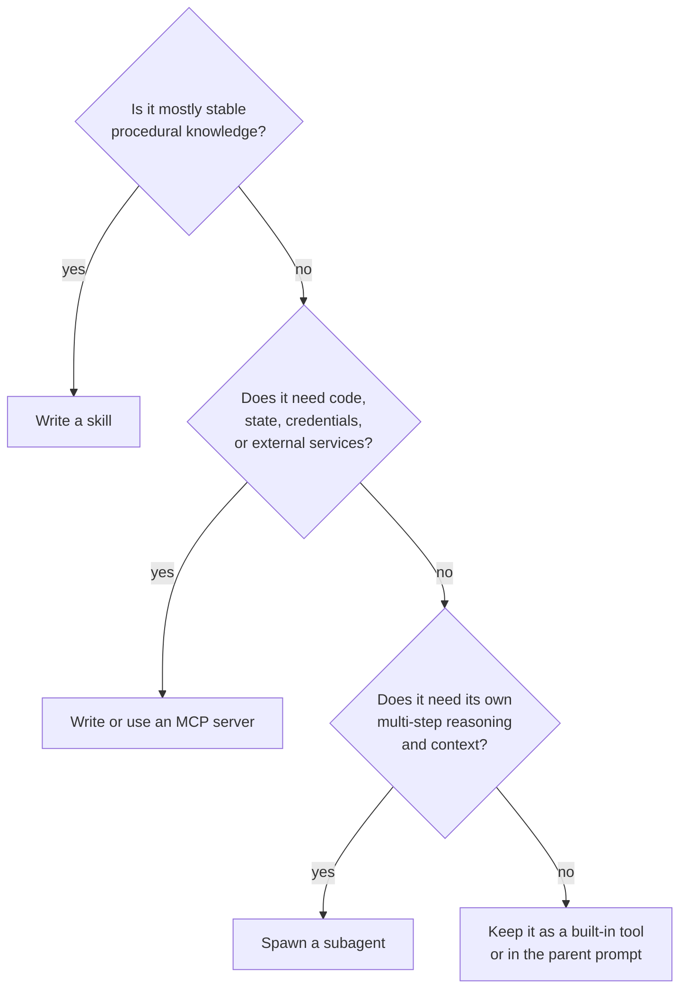
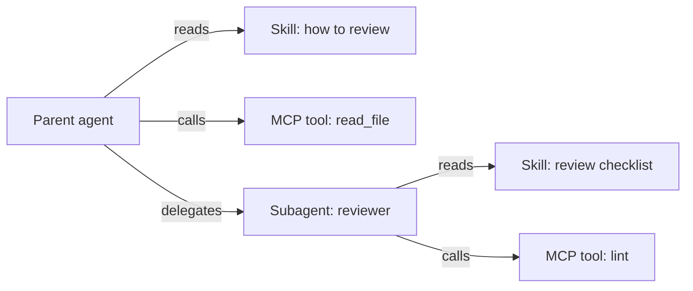

# Chapter 14 — Skills, MCP, and subagents: three shapes of one capability

## TL;DR

当模型需要某种它尚不具备的能力时，可以采用三种形态之一：**skill**——写成一个 markdown 文件，告诉模型该怎么做某件事的指令；**MCP server**——一个外部进程，把能力以 tool 的形式暴露出来（Ch.13）；或者 **subagent**——一个独立的 agent loop，拥有自己的 context 和结果契约（result contract）（Ch.10）。它们并不能互相替代。skill 成本低，教会模型*怎么做*；MCP server 成本中等，隔离的是*执行*；subagent 成本高，隔离的是*推理*。本章就是这套决策准则（rubric）、每种形态各自的设计规则、各自的失败模式，以及如何随着系统成熟把一种能力从一种形态迁移到另一种形态。

---

## Why this matters

每个构建 agent 的团队，一碰到新的能力缺口，第一反应都是*"再开一个 agent"*。但大多数时候，正确答案是*"写一个 skill"*。次多的时候，正确答案是*"调用一个 MCP server"*。完整的 agent loop 是最强大、也最昂贵的选项——只有当工作确实需要属于自己的 context 和推理时才用得上，其余几乎都用不到。

一个默认选择 subagent 的团队，会积累看不见的成本（每一次 spawn 都是一整轮完整的模型 loop），也会积累迟早要偿还的复杂度（multi-agent orchestration 引入了单 agent 不会有的失败模式）。一个懂得这套决策准则、并且从最轻的层级起步的团队，跑得更快，交付得更干净。

---

## The concept

### The three shapes in one sentence each

- **Skill** —— 烘焙进 agent prompt 里的 markdown 指令，教会模型如何用它已有的 tool 去处理某个反复出现的任务。
- **MCP server** —— 一个独立进程，对外暴露 agent 调用的 tool；能力存在于 agent 之外，可以跨多个 agent 复用。
- **Subagent** —— 由父 agent 为某个有边界的子任务 spawn 出来的一整个 agent loop，拥有自己的 prompt、tool 集、预算和结果契约（Ch.10）。

同一种能力——*"review 这个 PR"*——可以采用全部三种形态。挑选合适的当中最轻的那一种。

### Skills — anatomy

一个 skill 就是一个带有 YAML frontmatter 和自由格式正文的 markdown 文件：

```markdown
---
name: review_typescript
description: Review TypeScript code for type, async, and security issues.
version: 1.2.0
platforms: [coding-agent, code-review-bot]
prerequisites: [typescript-installed]
---

# Review TypeScript code

When reviewing TypeScript code, in this order:

1. Check public function inputs are typed.
2. Check async errors are handled (no swallowed promises).
3. Check user-controlled strings reach shell / SQL / HTML sinks safely.
4. Report findings before style comments.
5. Quote the file:line you're commenting on.

Do not invent issues. If unsure, flag *suggested review needed* and move on.
```

在各个生产系统里反复出现的有五个字段：`name`、`description`、`version`、`platforms`、`prerequisites`。正文是 markdown——指令、示例、坑点。Hermes Agent 的 skill 格式遵循 agentskills.io 社区约定——这是一个新兴的 skill 共享枢纽（hub），而不是某个由治理机构正式发布的标准。OpenClaw 和 OpenCode 采用同样的形态，只有些微差别。

### Skills — discovery, loading, and the hub

skill 在各系统里分布在四个地方：

- **Bundled（随包附带）** —— 随 agent 一起发布。通用模式、基线行为。
- **User-installed（用户安装）** —— 放在 `~/.hermes/skills/`、`~/.openclaw/skills/`，或某个 workspace 的 `skills/` 目录下。按机器或按项目区分。
- **Plugin-contributed（插件贡献）** —— 由某个 plugin（Ch.11）在启动时注册。视同 user-installed，但随 plugin 一起做版本管理。
- **Hub-distributed（枢纽分发）** —— Hermes Agent 集成了 `agentskills.io`：`hermes skills install <name>` 会从 hub 拉取一个 skill，agent 在下一个 session 读取它。这就是 marketplace 模式；预计会有更多 agent 采纳它。

发现机制是启动时的一次目录扫描；扫描器读取 frontmatter，并注册每个 skill。扫描时并不会把完整正文加载进内存——那是后面才发生的事。

### Skills — progressive disclosure (in brief)

Ch.06 完整讲过这种 retrieval 模式：一份 skill *索引*（name + description + version）每一轮都待在 prompt 里——无论有多少 skill，都只占几百个 token——而 skill *正文* 则通过一个 `skill_view(name)` tool 按需加载。Ch.14 这里值得重申的角度是：索引里的每一条都是 prefix 成本，每一份正文都是潜在的 prompt injection（见下面的信任小节），而二十个精炼的 skill 始终胜过两百个大多无关的。Ch.06 的预算规则在此适用——把 agent 几个月都没碰过的 skill 归档——下面的信任规则适用于任何你放进索引的东西。

### Skills — curation

skill 会老化。一个 agent 从不使用的 skill，或者一个调用已废弃 API 的 skill，比没有 skill 更糟——它会把模型拉向陈旧的模式。Ch.07 讲过完整的 curator 生命周期（active → stale → archived）；针对 skill 的具体应用是：

- **Active（活跃）** —— 最近 N 天内用过；出现在索引里。
- **Stale（陈旧）** —— 30 天未用；仍在索引里，但被标记。
- **Archived（归档）** —— 90 天未用；从索引中移除，可恢复。

Hermes Agent 的 curator 按空闲时间调度运行，还能做一件更强的事：*从成功的序列中写出新 skill*。如果 agent 总是以相同顺序运行三个 tool 来处理某个反复出现的任务，curator 会把这个序列提升为一个模型可以指名调用的 skill。这是生产中最强大的模式之一——*会写 skill 的 skill*。

### Skills — provenance, trust, and prompt-injection risk

skill 是 agent 每个 session 都会当作指令来读的文本。这使它成为整个系统里杠杆最高的攻击面之一——从机制上讲，一个恶意 skill 就是 prompt injection 的另一种说法。合理的默认立场是：*在你有理由相信之前，把每一个 user-installed 或 hub-distributed 的 skill 都当作不可信。* 即便相关协议还在成熟中，下面这套信任模型也值得钉死：

- **来源（Provenance）。** 每个 skill 都携带 `name`、`version`，*以及* 一个 `source`——它来自的 URL、hub 条目、文件路径，或者贡献它的 plugin。安装门禁（install gate，Ch.12）读取 `source` 并决定是否要询问。来自 bundled 集合之外的 skill 不应悄无声息地进入索引。
- **安装时审批。** 一个新 skill 就是一次 Ch.12 的审批，和一个新 MCP server 一样。在它进入索引之前，把 skill 的正文——逐行——展示给用户。*"信任来自这个来源的这个 skill"* 的作用域由 source、version 以及正文的指纹（fingerprint）共同界定；正文被改写就会让信任失效，触发一次新的询问。
- **签名（Signing）。** 在 hub 或分发渠道支持的地方，针对一个公开的密钥验证签名。skill 注册体系还太早期，签名语义尚未标准化——跟踪规范、能签则签，默认情况下拒绝安装来自公开来源的未签名 skill。
- **正文审查（Body inspection）。** 在把一个 skill 加入索引之前，对正文跑一遍 Ch.18 的威胁扫描——和 memory 层在 Ch.07 用的是同一套模式。一个包含*"忽略先前的指令"*的 skill 永远到不了 prompt。
- **卸载只需一键。** 如果来源变得不可信（hub 被攻陷、作者被攻陷），用户必须能够在不编辑文件的情况下移除该 skill。Ch.07 的 curator 负责归档；卸载是它在运维上的孪生兄弟。

那条团队第一次想到时往往会惊讶的通用规则是：*skill 比 MCP server 更危险*。server 的 tool 在进程隔离中执行；skill 的文本在你模型的 prompt 里执行。对待 skill 边界至少要和对待 MCP 信任边界一样小心——通常还要更小心。

### MCP servers — when to write your own

Ch.13 讲过 MCP 协议。剩下的问题是：*我什么时候该写一个 MCP server，而不是写一个 built-in tool 或一个 skill？* 三个信号：

- **能力存在于 agent 进程之外** —— 一个数据库、一个浏览器、一个第三方 SaaS，或一个用不同语言或 runtime 写的服务。进程隔离确实有用。
- **能力要跨多个 agent 复用** —— 你只构建一次，你组织里好几个不同的 agent 都来消费它。
- **能力需要自己的凭据或信任边界** —— MCP server 持有 API key；agent 进程永远看不到它。

如果这三条都不成立，更轻的答案通常是一个 built-in tool（Ch.03）或一个 skill。

### MCP servers — naming, schema, auth

当你确实要写一个时，真正要紧的设计选择：

- **单一职责 vs 多能力。** 一个小而专注的 server（`pg-query`、`s3-list`）比一个塞了二十个不相关 tool 的 server 更容易测试、保护和版本管理。优先选很多个小 server，而不是一个巨型 server。
- **Tool 命名。** harness 会把你的 tool 命名空间化为 `mcp__<server>__<tool>`（Ch.13）；挑清晰简短的 tool 名，因为它们每一轮都会出现在模型的 prompt 里。
- **Schema。** tool schema 是 prefix 的一部分（Ch.04）。把它收紧；每一个可选字段都是 prefix 字节，也是一个模型可能填错的机会。
- **Annotations（注解）。** 通过 MCP 的 `readOnlyHint`、`destructiveHint`、`idempotentHint` 和 `openWorldHint` 显式标注每个 tool 的元数据——这样当 harness 消费你时，它才能正确接线 Ch.02 的并行、Ch.12 的审批和 Ch.08 的 retry 安全。`Hint` 这个后缀是故意的：消费方 harness 应当把这些当作 server *声称* 的保守默认值，而不是它*已证明*的断言（Ch.13）。
- **Auth。** 把凭据保存在 server 内部；绝不从模型那里以 tool 参数的形式接收它们。使用 OAuth 或一个由环境挂载的 secret；在 agent 无需知情的情况下轮换它们。

### Subagents — the profile as the unit

Ch.10 讲过 delegation 的机制。*本章* 关心的是扩展的单元：一个 subagent 最好被理解为一个你可以 spawn 的 *profile*——一个有名字的角色，带有固定的 system prompt、一份 tool 列表、一个模型、一份预算，以及一个 result schema。

```ts
type SubagentProfile = {
  name:           string;       // "reviewer", "implementer", "researcher"
  description:    string;       // what the supervisor reads when picking
  systemPrompt:   string;       // role-specific instructions
  model:          string;       // often cheaper than the parent's
  toolAllowlist:  string[];     // tighter than parent's
  maxSteps:       number;
  recursionDepth: number;       // usually 1 — see Ch.10
  resultSchema:   JsonSchema;
};
```

supervisor（Ch.10）按名字挑选 profile；registry 不过是一张 map。OpenCode 内置的 profile——`build`、`plan`、`general`、`explore`——是规范的参考。自定义 profile 则是你为项目添加专才的方式。

### Subagents — built-in profiles vs custom

横跨各生产系统的一套好用的起步集合：

- **`explore`** —— 只读 tool、便宜的模型、返回结构化的发现。对于*找东西*类任务最安全的默认值。
- **`build`** —— 带写入的完整 tool 集、昂贵的模型。通用型工作者。
- **`plan`** —— 只读 tool、便宜的模型、返回一个结构化的计划（Ch.09）。产出是一个计划，不是一个动作。
- **`reviewer`** —— 只读 tool，以另一个 subagent 的输出作为输入，返回*通过*或*发现问题*。来自 Ch.10 验证模式的廉价保险。

自定义 profile 套用同样的形态。纪律是：按照 profile 在你项目里扮演的角色来命名，而不是按照底层 tool。*"数据库迁移 reviewer"* 是一个 profile 名；*"调用 pg_query 和 write_file"* 是实现细节。

### The decision rubric

| 维度 | Skill | MCP server | Subagent |
|---|---|---|---|
| 它增加了什么 | 给模型的指令 | 外部 tool | 一个独立的推理 loop |
| 每次使用的成本 | 几个 prompt token；正文仅在加载时 | 一次 tool-call 协议往返 | 一整轮模型 loop |
| 隔离 | 无 | 进程边界 | context + tool + 模型边界 |
| 最适合 | 模型反复重新发明的稳定流程 | agent 进程之外的能力 | 需要自身推理的有边界子任务 |
| 失败模式 | 模型忽略或误用 | server 崩溃、schema 漂移 | subagent 打转、漂移、超支 |
| 更新节奏 | 在 session 开始时 | server 独立部署 | 每次 agent 配置变更 |
| 版本管理 | YAML frontmatter `version` | server 发布 | profile 定义 |

当你能在自己的技术栈里测量时，加上具体的成本估算：一个 skill 在索引成本之后，每次使用基本免费；一次 MCP tool call 增加几毫秒外加序列化开销；一次 subagent 运行增加数百毫秒，外加一整轮模型 loop 的 token 花费。



生产系统最终落定的默认值是：skill 最先试，subagent 最后用。如果你的团队在大多数新能力上都伸手去抓 subagent，那很可能是你的 skill 层发育不良。

### The same capability three ways

举一个具体例子，让这套准则变得可触摸。这个能力是*"总结一份长文档"*。

**作为 skill** —— 当文档已经在 agent 的 context 里，模型只是需要那套流程时：

```markdown
---
name: summarize_document
description: Summarize a document already in context.
version: 1.0.0
---

# Summarize document

1. State the central claim in one sentence.
2. List up to five supporting points.
3. Mention caveats from the source.
4. Keep the summary under 150 words.
Do not add unsupported opinions.
```

**作为 MCP tool** —— 当总结需要外部处理时：PDF 解析、文档存储、向量查找：

```ts
const summarizeTool = {
  name: "summarize_document",
  description: "Summarize a stored document by ID.",
  input_schema: {
    type: "object",
    required: ["documentId"],
    properties: { documentId: { type: "string" } },
  },
  // 实现位于 MCP server 内部，调用私有存储。
};
```

**作为 subagent** —— 当总结本身就是一项研究任务时：多份文档、相互冲突的证据、迭代式阅读、结构化综合：

```ts
await delegate({
  role:         "researcher",
  objective:    "Synthesize the strongest claims across these documents.",
  context:      buildContextPacket(documentIds),
  allowedTools: ["read_document", "search_documents"],
  maxSteps:     12,
  outputSchema: ResearchSummarySchema,
});
```

三种形态，三套成本画像，三种失败模式。能力是同一个；选择取决于复杂度落在哪里。

### Composition: how the three combine

这三种形态被设计成可以组合：



来自生产的三种模式：

- **一个调用 MCP tool 的 skill。** 该 skill 指导模型如何编排一串被 MCP 包裹的 tool call。模型读取 skill，然后派发那些 tool。
- **一个拥有自己 skill 的 subagent。** 当一个 subagent 被 spawn（Ch.10）时，它默认继承父 agent 的 skill 索引；OpenCode 允许你传入一个子集。subagent 看到的是和父 agent 一样的 `skill_view` tool。
- **一个其 tool 内部运行一个 subagent 的 MCP server。** 一个 plugin 把一次 subagent 调用包装成一个以 MCP 暴露的 tool。从外面看它像一个 tool；在里面它 spawn 出一整个 agent loop。对于在不重新实现 profile 的前提下、跨许多 agent 安装复用同一个专才，这很有用。

这三层不是层级结构。你根据准则，按能力把它们混搭起来。

### Migration between shapes

随着系统成熟，能力会在形态之间移动。四种常见迁移：

- **一次性 tool 序列 → skill。** 如果模型总是以相同顺序调用同样三个 tool，就写一个为该模式命名的 skill。模型会直接伸手去用它，而不是重新发现它。
- **Skill → MCP server。** 如果一个 skill 长大了，或者开始需要凭据或外部 state，就把它抬升进一个 server。skill 变成一行指令*"调用 mcp__server__do_thing"*，而工作从 prompt 里移了出去。
- **MCP server → built-in tool。** 如果一个 MCP tool 每一轮都被调用，每次调用的协议成本就会累加起来。把它提升为一个 built-in（Ch.03），换取 latency 上的收益。
- **Subagent → skill + tools。** 当一个 subagent profile 本质上只是在执行一套流程（而不是在探索）时，把它收缩成一个父 agent 读取的 skill，针对父 agent 自己的 tool 执行。每次调用省下一整轮模型 loop。

迁移是正常的，不是初始设计糟糕的标志。第一周合适的形态，很少就是第六个月合适的形态。

### Failure modes per shape

| 形态 | 失败 | 你如何察觉 | 该怎么做 |
|---|---|---|---|
| Skill | 模型忽略它 | `skill_view(name)` 从未被调用；模型的输出绕过了 skill 的流程 | 收紧 description；把某个关键步骤提升为 built-in tool |
| Skill | 指导过时 | 模型遵循了过时的步骤 | curator 归档（Ch.07）；version 字段；显式废弃 |
| MCP server | 崩溃或超时 | tool-result error envelope | 带退避（backoff）重连（Ch.13）；如有可用就回退到 built-in |
| MCP server | Schema 漂移 | 新的 `tools/list` 返回了不同的形态 | 每次连接时重新 list；如果某个 tool 消失就警告 operator |
| Subagent | 打转、漂移 | step 预算触顶；reviewer 不认可 | 收紧 profile 的 tool + system prompt；调低预算；加一个 reviewer |
| Subagent | 超支 | 超出 token 或成本预算 | 预算上限（Ch.10）；给该 profile 换更便宜的模型 |

横跨三者的一条有用提醒：命名上的失败通常是出问题的*第一个*信号。一个叫 `review_typescript` 的 skill，比叫 `reviewer` 的更难和别的 skill 混淆。一个前缀为 `mcp__github__create_pr` 的 MCP tool，比 `create_pr` 更难被误派发。一个名为 `db-migration-reviewer` 的 subagent，对 supervisor 来说比 `subagent-7` 更易读。命名即设计。

### Plugin skills, plugin tools, plugin agents

关于第三个维度的一点说明：plugin（Ch.11）可以贡献这三种形态中的任意一种。单个 plugin 就可以发布：

- 一套 **skill set** —— 注册进 skill 索引的 markdown 文件；
- 一个 **MCP server** —— 随包的二进制，或以 stdio 方式 spawn 的进程；
- 一个 **subagent profile** —— system prompt + tool 列表 + result schema，注册进 profile registry。

OpenClaw 和 Hermes Agent 三者都有；OpenCode 的 plugin 扩展 skill 和 tool，但不扩展 profile。plugin 内部的选择遵循同一套准则——挑选合适于该 plugin 用途的、当中最轻的形态。

---

## Real-system notes

- **Hermes Agent** 是 skill 最丰富的参考：完整的、与 `agentskills.io` 兼容的 SKILL.md 格式、一个目录扫描器、一个能把成功序列提升为新 skill 的 curator、通过 `hermes skills install/push` 实现的 hub 集成，以及版本感知的归档。
- **OpenCode** 同时暴露了 subagent 式的 delegation（`task` tool）和一个 `skill` tool，还会通过 agent 权限过滤 tool。它是把内置 profile 集合（`build`、`plan`、`general`、`explore`）作为起步分类法的最干净参考。
- **Paperclip** 用 skill 和 adapter 来协调外部 agent runtime——它展示了这三种原语如何在组织层面成为运维控制：skill 作为指令，adapter 作为 MCP 形态的边界，控制平面（control plane）里的 agent 作为 subagent。
- **OpenClaw** 把 plugin 层展示得最干净：plugin 通过一个 plugin SDK 贡献 skill、MCP server 和 channel adapter。它是*从一个 plugin 同时贡献三种形态*的好参考。

---

## Common failure cases

*这些失败是持久的；它们的修复演化得最快——每一条都为模式命名，把当下的具体细节留给你和你的 AI 伙伴。*

- **每个能力都变成一个 subagent。** 当完整的模型 loop 嵌套在完整的模型 loop 里时，token 账单的攀升速度快过流量。*修复：守住"skill 优先，subagent 最后"的默认值，跟踪一个形态混合（shape-mix）指标，要求为每一级高于 skill 的选择提供一个具体理由（Ch.10）。*
- **skill 在索引里堆积，模型不再遵循它们。** 数百条条目让每个 prompt 都背上负担，而模型却在内联里重新发明流程。*修复：按字节预算修剪索引——给每个 skill 的加载率（load rate）埋点，通过 curator 把死重量归档（Ch.07）。*
- **一台生病的 MCP server 拖垮了不相关的能力。** 一台不稳定的"厨房水槽"式 server 失败了，把旁边的能力一起拖下水。*修复：把 server 塑造成单一职责，给承重的能力一个回退形态，重连时重新 list tool（Ch.13）。*
- **一个 skill 在你眼皮底下变了，悄悄操纵着模型。** 一份曾经可信的正文在上游被改写，却带着它原本的祝福坐进 prompt。*修复：把信任绑定到正文的指纹上，而不是来源名上，每次变更都重新扫描（Ch.12、Ch.18）。*
- **第一周合适的形态在第六个月就是错的。** 一个 skill 膨胀成怪物，或者一个 MCP tool 每一轮都被调用，却没人重新塑形它。*修复：让迁移触发条件可测量，并运行一次定期的形态迁移审计。*

---

## Pair with your agent

几个在本章上效果很好的 prompt：

- *"挑出我可能给 agent 加上的十个新能力。对每一个，走一遍决策准则，告诉我它应该是一个 skill、一个 MCP tool，还是一个 subagent。用驱动该选择的那个维度为每个选择辩护。"*
- *"审计我当前的 agent。把 `skills/` 里的一切、我正在调用的每一个 MCP server，以及每一个 subagent profile 都分类。标记出任何形态不对的东西，并提出一个迁移方案。"*
- *"为我的技术栈写出*总结一份文档*这个能力的三个版本——一个作为 skill，一个作为 MCP tool，一个作为 subagent。在同一份 10 KB 输入上测量每一个的 latency 和 token。"*
- *"用 `skill_view` 实现 skill 索引模式。加一个指标，统计模型实际上每个 skill 调用 `skill_view` 的频率。告诉我索引里哪些 skill 是死重量。"*
- *"搭一个 subagent profile registry，包含 `explore`、`build`、`plan`，以及一个为我项目定制的 profile。把 supervisor 挑选 profile 的逻辑和每个 profile 的 result schema 给我看。"*
- *"在我 agent 上个月的日志里找出迁移候选。哪些 tool 序列重复得足够多、该成为 skill？哪些 MCP tool 每一轮都被调用、该成为 built-in？哪些 subagent profile 本质上是确定性的、该收缩成 skill？"*
- *"写一个同时贡献三种形态的 plugin：一个 skill、一个 MCP tool、一个 subagent profile。验证每一个都干净地注册，并且 agent 能在一个 session 里用上全部三个。"*

---

## What's next

你现在懂得了扩展的单元。Ch.15 转向支撑 harness 在规模下持续运行的 *backend*——队列、流式端点、持久的副作用机制，以及在用户多于一个、同时在飞的 session 多于一个时，托管 loop、memory、persistence 和 connector 的那个 runtime。

---

<!-- nav-footer -->
<div align="center">

[⬅️ 上一章：Ch.13 Connectors, MCP, IPC](13-connectors-mcp-ipc.md) · [📖 课程目录](../../README_zh.md) · [下一章：Ch.15 Backend infrastructure ➡️](15-backend-infrastructure.md)

</div>
