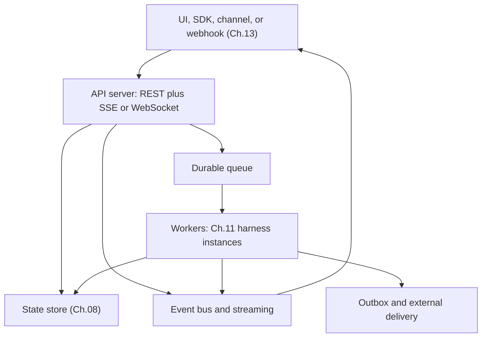
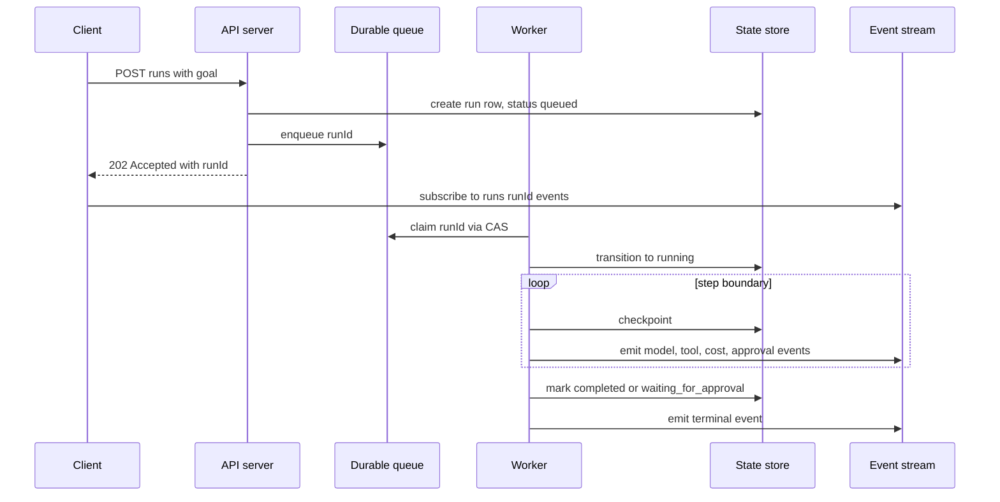
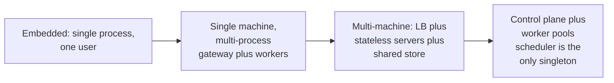

# Chapter 15 — Backend infrastructure for agents

## TL;DR

一个 web 请求只存活几毫秒。而一次 agent run 可以存活数分钟、数小时，或经历多次唤醒。因此，生产级 backend 会把"请求的受理"与"实际的执行"分离开：受理工作、将其入队（enqueue）、流式推送进度、对状态打 checkpoint，并让 side effect（副作用）具备幂等性（idempotent）。本章讲的是 scaling 的视角——Ch.11 里的 harness 如何变成一项服务于众多用户的服务：API 表面（REST + SSE + WebSocket）、queue 与 worker 的形态、用心跳（heartbeat）方式唤醒到期工作的 scheduler、从内嵌（embedded）到多机的 deployment 拓扑、multi-tenant 隔离、secrets、备份、rate limit、预算、运维表面，以及那些一旦你从单机扩展到多机就会悄悄失效的单用户假设。

---

## Why this matters

最简单的 agent backend 就是一个 HTTP endpoint，它同步调用模型并返回最终答案。这对单轮（one-turn）演示是够用的。但一旦 agent 需要 tool、审批、重试、长 context 或后台工作，它立刻就崩了。三类失败会很快出现：

- **客户端超时。** worker 还在运行，请求就已经超时了。
- **重复执行。** 客户端发起重试；于是可能有两个副本各自执行 side effect。
- **没有可见性。** 用户看到的是一个转圈圈，而不是进度、tool call、审批与错误。

修复方案不是把超时调长。修复方案是一种不同的架构——一种为"存活时间超过任何单个请求的工作"而设计的架构。

---

## The concept

### The shape of a backend

一个生产级 agent backend 通常有五层：



每一层你都已经见过了。Ch.11 的 harness 就是跑在每个 worker 内部的东西。state store 是 Ch.08。bus 与 streaming 表面是 Ch.11 的管道工程。channel 适配器与 webhook 是 Ch.13。本章讲的是：当*一个用户*变成*许多用户*、*一个进程*变成*许多机器*时，这些已有的部件如何拼装在一起。

### The API surface

API 暴露三种形态的操作：

- **变更（Mutations）** —— `POST /runs`、`POST /messages`、`POST /sessions`。改变状态并快速返回的短 HTTP 请求。它们绝不在请求路径里调用模型。
- **实时流（Live streams）** —— `GET /runs/:id/events`（SSE）或 `WS /runs/:id`（WebSocket）。把进度事件投递给客户端的长连接。单向用 SSE；当客户端也需要发送时用 WebSocket——比如中断、run 中途的审批、计划编辑（Ch.09）。
- **轮询读取（Polling reads）** —— `GET /runs/:id`、`GET /runs/:id/transcript`。供那些无法维持长连接的客户端使用。

OpenCode 暴露的正是这种形态：REST 变更、用于实时事件的 SSE，以及一个把 HTTP API 包装起来、供想以库形式调用的调用方使用的 typed SDK。Paperclip 在其上叠了一层 control-plane API——issue 创建、agent 列表、审批路由——这样运维人员就有了独立于 agent 之外的、属于自己的表面。Hermes Agent 更进一步，提供了一个 OpenAI 兼容的 endpoint，使得现有的 OpenAI 客户端无需改动即可驱动它。

### Enqueue, stream, finish

一次长时运行的 agent run 的标准请求流程：



这些原则，都在前面介绍过：

- API handler **绝不调用模型。** 它写入持久状态并入队，在 100 ms 内返回 202。
- worker 用 CAS（Ch.08）来 claim，因此两个 worker 永远不会跑同一个 job。
- 每个 step 边界都写一个 checkpoint（Ch.08）并向 bus 发出一个事件。
- 向客户端的 streaming 通过 bus 与 worker 解耦，因此即便客户端断开又重连，worker 的进度依旧可见。

### Queue and worker patterns

| Backend | 最适合 | 主要局限 |
|---|---|---|
| In-memory queue | 本地演示、单进程 | 重启即丢——别假装它是 durable 的 |
| SQLite atomic UPDATE | 单机、single-tenant | 单写者；无法跨机 scale |
| Postgres `SELECT ... FOR UPDATE` | 多机、中等规模 | 随 worker 数增长要留意锁争用与 queue-claim 策略；阈值取决于 schema 与 workload |
| Redis Streams 或 NATS JetStream | 更高 throughput，由你运维 broker | 运维开销——broker 是一项要运行的服务 |
| SQS 或 Pub/Sub | 托管的 durable 交接，cloud-native | 云厂商锁定；厂商特定语义 |
| Temporal、Restate、DBOS | 内建重试的分布式长时 workflow | 概念更多；平台绑定 |

从简单的开始。大多数生产级 agent 早在需要 Kafka 之前，就已经跑在 SQLite 或 Postgres 上了。无论用哪种 backend，模式都一样：每个 job 是一行带 status 列的持久记录，worker 原子地 claim（Ch.08 的 CAS 模式），worker 写入事件与 checkpoint，worker 转入终态。

```ts
// Worker loop. The control flow is the same regardless of queue backend.
async function workerLoop(ctx: WorkerContext) {
  for await (const job of ctx.queue.claimRuns()) {       // CAS-based claim
    try {
      await ctx.db.runs.update(job.runId, { status: "running" });
      await executeAgentRun(job.runId, ctx);              // the Ch.11 harness
      await ctx.db.runs.update(job.runId, { status: "completed" });
      await job.ack();
    } catch (err) {
      await ctx.db.runs.update(job.runId, { status: "failed" });
      await ctx.db.runEvents.insert({
        runId: job.runId,
        type:  "run.failed",
        payload: { message: String(err) },
      });
      await job.releaseOrDeadLetter(err);                 // bounded retries
    }
  }
}
```

把 worker pool 调到匹配模型 provider 的 rate limit，而不是这台机器的 CPU。大多数 agent backend 在模型 API 上是 I/O-bound 的；只要模型跟得上，在一颗 CPU 上跑十个 worker 完全没问题。

### The heartbeat scheduler

有些工作没有入站请求——cron job、定时复盘、带退避（backoff）的重试、周期性的 agent 任务。各系统通用的模式是一个 *heartbeat*（心跳）：单个 scheduler 进程按固定间隔醒来，向 state store 查询到期的工作，然后将其入队。

```ts
// Single scheduler tick, every N seconds.
async function heartbeat(ctx: SchedulerContext) {
  const due = await ctx.db.query(`
    SELECT id FROM runs
     WHERE status = 'scheduled'
       AND wake_at <= now()
     LIMIT 100
  `);
  for (const row of due) await ctx.queue.enqueue(row.id);

  await ctx.reaper.reapOrphanedRuns();      // Ch.08
  await ctx.curator.maybeRunCurator();      // Ch.07
}
```

Paperclip 的 heartbeat 就是这种形态——它查询到期的 `heartbeat_runs`、运行孤儿回收器（orphan reaper），并在空闲时触发后台 curator。scheduler 是少数在 scale 下必须保持*单例（singleton）*的组件之一：若同时运行两个 scheduler，除非你加上分布式锁，否则会出现双重派发（double dispatch）。大多数团队用与 Ch.08 相同的 CAS 行模式来选举 scheduler leader（一张 `service_locks` 表，每隔几秒 claim 并刷新一次）。

### Deployment topology spectrum



挑能装下你流量的*最左*那种形态，而不是同行正在用的*最右*那种。迁移路线如下：

- **Embedded（内嵌）** —— Hermes CLI、OpenCode 本地版。一切都在一个进程里；SQLite 落盘。完美契合单用户。
- **Single-machine multi-process（单机多进程）** —— Hermes gateway、OpenClaw。一个父进程（gateway + scheduler），每个 agent 一个子进程。带 WAL 的 SQLite 能处理并发读。一直 scale 到单颗 CPU 成为瓶颈为止。
- **Multi-machine（多机）** —— 标准配置下的 Paperclip。负载均衡器后面是多个 stateless server；共享 Postgres；一个选举出来的 scheduler。加机器就能加 throughput。
- **Control plane + worker pools（控制平面 + worker 池）** —— Paperclip 在 scale 下的完整形态。control plane（API + scheduler）与 worker 池分离（worker 池可能位于不同 region，或归不同团队所有）。worker 向 control plane 注册、claim 工作、上报状态。

两个反模式。*过早分布式（Premature distribution）*：只有一个 tenant 时就上多机——徒增运维复杂度而无 scaling 收益。*卡在 embedded（Stuck at embedded）*：已经有五十个并发用户了还在用内存里的状态——随着状态在请求与 worker 之间漂移，悄悄滋生正确性 bug。

### Embedded vs external database

生产存储的选择与 deployment 形态相对应：

- **SQLite + WAL**（OpenCode、Hermes CLI）—— 内嵌；数据就在进程旁边；备份就是文件拷贝。契合 embedded 与单机。Hermes Agent 的 `apply_wal_with_fallback` 处理 NFS/SMB 的情形（WAL 不兼容），办法是回退到 journal 模式。
- **Embedded Postgres**（Paperclip 的零配置选项）—— 捆绑式；无需安装外部服务；不用专门的运维团队就能跑 Postgres 形态的查询。介于 SQLite 与完整 Postgres 之间时很有用。
- **External Postgres**（生产环境下的 Paperclip）—— 一旦你有不止一台 server 就成了必需。schema 集中在一处；多台 server 连入；migration 在启动时运行；备份靠定时 `pg_dump`。

SQLite 和 Postgres 都能扛得住真实的生产负载。从 SQLite 迁到 Postgres 的恰当时机*不是*某个用户数阈值——而是第二个写者需要协调的那一刻。在那之前，SQLite + WAL 更快、更简单、也更容易备份。

### Multi-tenant isolation

三个隔离层级，各有清晰的代价：

| 层级 | 隔离的是什么 | 代价 | 何时用 |
|---|---|---|---|
| **行作用域（Row scoping）** | 行打上 `tenant_id` 标签 | 最便宜 | 大多数 B2C 与小团队 B2B |
| **每租户数据库（Per-tenant database）** | 每个 tenant 一个 DB | 运维成本 | 严格的监管要求 |
| **每租户算力（Per-tenant compute）** | 每个 tenant 一个 pod 或容器 | 最高 | 敏感数据或合规强制 |

Paperclip 在 `company_id` 级别使用行作用域——每张表都有 `company_id`，每个查询都按它过滤。风险在于：一条漏写的 `WHERE` 子句就会造成跨租户泄露。缓解措施：

- **存储层默认拒绝（Default-deny）。** 没有租户上下文的查询应当报错，而不是返回所有数据。
- **生产环境里的合成租户测试。** 一个持续运行的测试：在租户 A 里造假数据，再从租户 B 去查询（期望零结果），这能在用户发现之前就早早抓到泄露。
- **审计日志（audit log）同样按租户作用域。** Ch.05 的 append-only 日志要有自己的 `tenant_id` 列；运维视图默认是按作用域的，而非全局的。

行作用域是默认选择；每租户 DB 与每租户算力是当监管或信任要求迫使你升级时的进阶层级。

### Secrets management

在生产级 agent backend 中，secrets 存在于三个地方：

- **环境变量或本地文件**（OpenCode、Hermes CLI）—— 对单用户、单机来说没问题。不适合 multi-tenant。
- **OS keychain**（OpenCode 用于凭据）—— 系统级，静态加密，通过 OS API 访问。
- **Vault 或 secret manager**（Paperclip 配合 `local_encrypted` 或 `aws_secrets_manager`）—— 在 multi-tenant 规模下成为必需。每个 tenant 的 secrets 相互隔离；运行时解析；绝不写入日志。

贯穿这三者的纪律是：secrets 在 config 中以*引用*形式出现（例如 `$secret:slack_token`），在运行时被*解析*，并且*绝不被记录*。落盘的 config 文件里绝不应包含已解析的 secret——serializer 总是重新发出那个引用。Ch.07 的脱敏层负责日志这条路径；secrets 层负责存储这条路径。

轮换（Rotation）通常是手工的。Hermes Agent 的 `credential_pool` 会在遇到 rate-limit 错误时在多个 API key 之间轮换，但不会生成新的 key；那是运维人员的活儿。

### Backups, restore, disaster recovery

没有备份的状态终将丢失。三项实践：

- **定时快照。** Paperclip 默认带有周期性 `pg_dump`，保留 7 天。基于 SQLite 的系统应当定时运行 `VACUUM INTO` 并把文件拷出来。每日是最低限度；成本允许的话每小时一次。
- **恢复演练。** 你第一次从备份恢复，不应该是在事故发生时。安排一次季度演练：停掉一个 staging 实例、恢复昨天的快照、验证状态机的一致性（Ch.08）。
- **schema migration 只能向前。** Ch.08 讲过这条规则；在 scale 下它被强制执行——生产环境绝不回滚 schema。增量式 migration（带默认值的新列）是安全的；破坏性的则要等到其最后一个消费者已过去两个版本之后再做。

### Data governance at the backend

multi-tenant 的行与加密的 secrets 只是安全故事的一部分，而非全部。一旦 backend 开始处理带真实数据的真实用户，就会冒出五个关切点：

- **API 认证与授权。** 每个 API 调用都需要身份（一个 session token、一个 API key、一个 OAuth bearer）*以及*一次授权检查（这个主体在这个 tenant、这个 run、这个资源上是否有权限？）。缺失身份时默认拒绝。授权决策应放在任何 handler 之前运行的 middleware 里，而不是散落在各个路由体内部——正是这一点让一次漏掉的检查不会演变成跨租户泄露。
- **加密。** 传输中（边缘的 TLS *以及*内部服务之间的 TLS，而不只是负载均衡器那一段）与静态时（state store 的数据库级加密；对消息正文或 memory 条目这类高敏感列做字段级加密）。磁盘级加密是地板，不是天花板。
- **数据驻留（Data residency）。** 有些用户受监管约束，要求数据必须留在特定 region（EU GDPR 是经典案例；许多行业监管机构亦类似）。state store、模型 provider 与对象存储都必须位于正确的 region。这要在 deployment 拓扑层面解决，而非运行时——一个为了找到自己的 session 而不得不跨越 region 边界的请求，已经是不合规的了。
- **模型厂商的数据管控。** 有些模型 API 默认会用你的输入做训练；有些允许你退出；有些则彻底禁止你发送某些数据类别。在接入之前先读厂商的数据使用政策；按数据类别选对 endpoint（允许训练 vs 零保留），并把这个选择连同 run 一起记入审计日志。
- **存储层的保留与删除。** Ch.07 负责*写入侧*的机制（删除标记、supersedes 链）；Ch.18 负责*策略*（同意、被遗忘权、审计保留）。Ch.15 的职责是在存储层兑现这两者：一次真正级联生效的 `tenant_id` 删除、一份不会在恢复时让已删数据复活的备份保留策略（Ch.08 的 replay-privacy 规则），以及按 region 作用域的备份，使驻留要求在灾难恢复中依然成立。

这五项是 backend 与监管方、安全团队和用户之间的契约。Ch.18 端到端地讲威胁模型；本章则是那些*实现*该契约的存储与路由决策落地的地方。

### Horizontal vs vertical scaling

瓶颈会随你成长而迁移。一条典型路径：

- **1 台 server。** 瓶颈在 loop 与 tool 执行上的 CPU。修复：给这台机器加 CPU。
- **10 台 server（大致量级）。** Postgres 争用可能开始咬人——`SELECT ... FOR UPDATE` 的锁等待、connection pool 饱和。确切阈值取决于 schema、索引策略、锁粒度以及读/写比；有些 workload 更早就感受到了，另一些则能 scale 到数百台才出现。修复：connection pooling（PgBouncer）、对 queue 做分区（按 tenant 或 queue 名 shard），或改用 `SELECT ... FOR UPDATE SKIP LOCKED` 以免 worker 在彼此身上串行化。
- **100 台 server。** Postgres 已不足以作为 queue。修复：专门的分布式 queue（Kafka、Redis Streams、NATS JetStream）。
- **1000+ 台 server。** scheduler 的 heartbeat 本身成了一个 scale 问题。修复：按 tenant 或 region 对 scheduler 做 shard。

诚实的说法是：大多数 agent backend 永远到不了 10 台 server。在你还没到 10 台之前就为 1000 台做优化，是把工程当作消遣。

### Load balancing and sticky sessions

三种均衡策略：

- **Round-robin（轮询）。** 每个请求落到不同的 server。无状态、简单。代价：任何内存里的 cache（system prompt、working set）在第二个请求上都会 miss。若走这条路，请搭配数据库支撑的 cache。
- **Sticky sessions（粘性会话）。** 把 session ID 哈希到某台 server；同一 session 的后续请求都落到那台。让 cache 保持热。代价：当一台 server 挂掉时，所有粘在它上面的 session 都会 cache miss，直到负载均衡器把它们重新路由出去。
- **按 tenant 哈希。** 租户 A 的全部流量到 server X，租户 B 的到 server Y。可预测；故障被限制在受影响的那个 tenant 内。当租户之间负载异质时很合适。

Ch.04 的 cache 规则左右着这个选择。如果你的 prompt cache 在 provider 侧（Anthropic 的前缀 cache），任何重建出相同 prompt 字节的 server 都会命中 cache——round-robin 就行。如果你的 cache 在进程内，那你就想要粘性。

### Rate limiting and admission control

两层：

- **API 边界处的 per-tenant rate limit。** 每个 tenant 一个 token bucket，按匹配其订阅档位的速率回填。bucket 空时直接拒绝（429），而不是无限排队。让 bucket 保持 per-tenant，而非全局——一个吵闹的 tenant 不应阻塞一个安静的 tenant。
- **模型调用处的 provider rate-limit 级联。** 当 provider 返回 429 时，轮换 key、回退到另一个 provider，或回退到一个更小的模型（路由细节归 Ch.17）。Hermes Agent 与 Paperclip 都实现了在遇到 429 时轮换的 credential pool。

一个有用的生产小细节：把 rate limit 当作*一等的 run 状态*暴露出来，而不是一次静默的重试。用户应当在 streaming 事件里看到*"waiting for rate limit"*，而不是一个空白的转圈圈。

### The cost ledger at the backend

每次 agent run 都消耗 token，而 token 要花钱。在 scale 下，cost ledger（成本账本）是运维必需，而非可选：

- **Per-run 成本**在 run 结束时记录——按 provider 与模型记下输入 token、输出 token。
- **Per-tenant 汇总**——日维度与月维度的聚合，让计费或内部分摊（chargeback）得以运作。
- **预算闸门（Budget gates）。** 每次 run 之前，检查该 tenant 的剩余预算；若这次 run 会超支则拒绝。Paperclip 的 `budgets.getInvocationBlock()` 是经典模式。
- **运维人员的覆盖（override）。** 管理员可以授予一次性额度，或在月中提高上限；该动作会被审计。

ledger 是 durable 的（Ch.08），所以消息日志的部分 compaction 不会丢掉成本数据。把 ledger 与 trace pipeline（Ch.16）搭配起来；成本是最有用的 per-tenant 信号之一，值得画出来。

### Side-effect durability: the outbox at scale

Ch.08 介绍了 outbox 模式。在 scale 下，三个细节很重要：

```ts
type OutboxRow = {
  id:              string;
  runId:           string;
  action:          string;        // "post_slack_message", "send_email", ...
  idempotencyKey:  string;
  payload:         unknown;
  status:          "pending" | "dispatching" | "dispatched" | "failed";
  attemptCount:    number;
  nextAttemptAt:   string;
};

async function checkpointWithOutbox(ctx, input) {
  await ctx.db.transaction(async (tx) => {
    await tx.checkpoints.upsert(input.checkpoint);
    await tx.outbox.insert({ ...input.row, status: "pending" });
  });
}

async function dispatchOutbox(ctx) {
  const rows = await ctx.db.outbox.claimPending({ limit: 50 });
  for (const row of rows) {
    try {
      await ctx.externalActions.dispatch(row.action, row.payload, {
        idempotencyKey: row.idempotencyKey,
      });
      await ctx.db.outbox.markDispatched(row.id);
    } catch (err) {
      await ctx.db.outbox.scheduleRetry(row.id, backoff(row.attemptCount));
    }
  }
}
```

- **在 side effect 之前先写下意图。** checkpoint 与 outbox 行在一个事务里提交；如果 worker 在 side effect 之前崩溃，outbox 行依然在那里，供 dispatcher 重试。
- **at-least-once 是现实的语义；effectively-once 是目标。** 跨网络的真正 exactly-once 投递，不是分布式系统能给出的承诺——worker 可能在 side effect 落地与标记被写下之间崩溃，没有任何协议能阻止这一点。你能构建的是 *effectively-once*：dispatcher 在恢复时可能不止一次地尝试某个 side effect，但下游（Stripe、GitHub、大多数现代 HTTP API、每一个构建良好的 queue）会按 idempotency key 去重，于是*被观察到的*效果只有一次。对于少数不认 idempotency key 的下游，在你这一侧维护一张去重表，在 dispatch 之前先查一下。
- **outbox 本身也是一个 scaling 关切点。** outbox 里出现积压，说明你的下游 API 比你的 agent throughput 慢。监控 outbox 深度；当它增长时告警。

### The single-user assumption that breaks at scale

一份对单用户工作良好、却会为多用户悄悄崩坏的模式清单：

- **模块级全局变量** —— 一个单例 `sessionState`、一个全局 tool registry。一旦两个请求共享一个进程，它们就共享了那个全局变量。把状态移进一个 `tenantContext` 参数，或一个 per-request 的作用域。
- **channel 事件的顺序派发。** *"一次处理一条 Slack 消息"*对单用户没问题；面对一百个 tenant，你就有了队头阻塞（head-of-line blocking）。改为并行处理，但保持 per-tenant 的有序性。
- **一切都用基于文件的 session 存储。** 落盘的 JSON 文件很好用，直到 10,000 个文件共处一个目录、文件系统索引器被噎住。超过几千个 session 就用数据库。
- **进程内 scheduler。** 每台 server 都跑自己的 `setInterval`；于是你得到 N 倍的工作量。选举出一个单例 scheduler（Ch.08 的 CAS 行），或迁到托管 scheduler。
- **进程内 cache。** 本地内存；不跨 server 共享；重启即丢。迁到 Redis，或接受 per-server 的成本。

每一条对单用户都是个小 bug，到了 scale 下就是一类生产事故。在你发布第二台 server 之前，先在你的 harness 里把它们审一遍。

### Cold start, warm pool, and serverless

三种延迟画像，各有用途：

- **Cold start（冷启动）。** 请求到达时进程才启动——schema migration 检查、插件加载、首次模型调用。通常是数秒，在大 bundle 上有时更久。对 cron 驱动的工作可以接受；对交互式 chat 则很痛。
- **Warm pool（暖池）。** 保持 N 个空闲 worker 在运行、随时准备 claim 工作。延迟降到大约一百毫秒。会持续占用内存。Hermes Agent 就这样缓存 gateway agent；Paperclip 则按需 spawn。
- **Serverless**（Lambda、Cloud Run 等）。除非你预置并发（provision concurrency），否则每次都冷启动。每个平台对执行时间都有自己的硬上限——远低于一小时，因厂商而异；在围绕它做设计之前查一下当前文档。对 stateless 的 tool server 很有用；但对 agent loop 本身通常是错的形态，因为 loop 需要存活得比单次函数调用更久。

按 workload 选对形态：交互式 chat 想要 warm pool；cron 与批处理想要"可接受冷启动"的 worker；tool server 可以是 serverless，藏在 MCP（Ch.13）后面。

### Storage tiers and caching

生产系统会收敛到三层存储：

- **热（Hot）**（Postgres 或 SQLite）：近期的 session 状态、近期的 transcript、run 表。读取低于 100 ms。
- **温（Warm）**（像 S3 这样的对象存储）：大型 artifact、文件上传、超大的 tool 输出（Ch.05 的 clip-and-stash 模式）。数百毫秒；每 GB 便宜。
- **冷（Cold）**（Glacier 或磁带）：超过保留期的旧 run、审计归档。恢复需数小时；仅供合规之用。

外加一层 caching（Redis、进程内），用于那些每个请求都要重算的东西：rate-limit bucket、session 元数据、Ch.04 的 prompt 指纹。这层 cache *不是* durable 的；把 miss 当作常态，而非异常。

### The operational surface

过了头一百个并发用户，你就需要一个面向运维人员的 UI。生产级 agent backend 会收敛到五个视图：

- **Run inspector（run 检查器）** —— 某次具体 run 的输入、完整事件流、调用过的 tool、成本、终态。对回答*"agent 为什么这么干？"*这类问题不可或缺。
- **Session viewer（会话查看器）** —— 跨多次 run 的一段对话历史：重试、审批、评论、谁做了什么。
- **审批队列（Approval queue）** —— 跨租户的待审批（运维视图）或针对特定用户的（Ch.12）。
- **手动重试或取消** —— 在一次失败或卡住的 run 上的一个按钮；该动作记入审计。
- **预算与额度视图** —— per-tenant 的成本与剩余预算，配上运维人员的 override 按钮。

Paperclip 在其 web UI 里把这五个都做齐了。模式是：运维视图默认只读；每个改变状态的动作都写入审计日志，以便事后复盘能回答*谁在这次 run 上点了重试？*。Ch.05 的日志纪律与 Ch.08 的 durability，正是让这一切可信的根基。

---

## Real-system notes

- **OpenCode** 是 SDK + 内嵌 server 形态最干净的参考：一个带 REST + SSE 的本地 server、一个把它包装起来的 TypeScript SDK、用于存储的 SQLite + WAL，以及 per-project 的 `InstanceState`。读它来理解*一个干净的单机 backend 长什么样*。
- **Hermes Agent** 是 gateway + scheduler 形态的参考：gateway 接收来自多个 channel 的入站（Ch.13），一个进程内的 scheduler tick 处理 cron 与后台复盘，agent 被缓存在一个 TTL 为 1 小时的 LRU 里，SessionDB 把一切持久化以供 replay。
- **Paperclip** 是 multi-tenant control-plane 形态的参考：带行级 company 作用域的 Postgres、带 reaper 的 heartbeat scheduler（Ch.08）、`cost_events` 与 `budget_policies` 表、结构化的 run inspector UI、定时 `pg_dump` 备份、以子进程形式 spawn 的多适配器，以及 `local_encrypted` 和 `aws_secrets_manager` 两种 secrets provider。
- **OpenClaw** 提供了这些模式中 channel 密集的 gateway 版本——当大部分流量都是入站 channel 事件时，研究 gateway/harness 边界如何 scale，它很值得一看。

---

## Common failure cases

*这些失败是持久的；它们的修复方案演进得最快——每一条都点出模式，把当下的具体细节留给你和你的 AI 伙伴。*

- **queue 悄悄积压。** run 在"queued"里坐了几分钟却什么错都没报，因为工作到达的速度快于 pool 的排空速度，而 durable queue 把它都吸收了。*修复：把 queue 深度与最老消息的年龄当作一等的 SLO，然后用背压（backpressure，快速返回 429）卸载负载，同时让 autoscaling 追上来。*
- **一条漏掉的 WHERE 子句把一个 tenant 泄露给另一个。** 一个未作用域的查询忘了 `tenant_id`，于是某个用户看到了另一个客户的数据。*修复：让作用域无法被遗忘——默认拒绝的数据访问层加上行级安全（row-level security），并由一个合成的跨租户金丝雀（canary）持续验证（Ch.18）。*
- **重连的客户端在它的流里得到一个空洞。** run 中途连接断开，意味着空档期内发出的事件永远到不了那个客户端。*修复：一个可恢复的事件流，由 per-run 的、带单调递增序号的事件日志支撑，从客户端游标处回放——绝不把实时 bus 当作真相之源。*
- **两个 scheduler 把同一个 cron job 触发了两次。** 一次搞砸的 leader 选举对到期工作做了双重派发，发出重复的消息或扣费。*修复：一把 TTL 长于一个 tick 的 leader lock，加上周期性刷新（Ch.08），并辅以一个按 per-tick 去重键做幂等入队。*

---

## Pair with your agent

- *"为我当前的 backend 画出分层图。指出每一层映射到 Ch.01–14 的哪一章，并标出任何缺失或重复的部分（例如，一个 queue 同时也是 state store，或一个 worker 同时也是 scheduler）。"*
- *"把我代码里任何 in-memory queue 替换成一个 durable 的（SQLite atomic UPDATE 或 Postgres `SELECT ... FOR UPDATE`）。加上 CAS claim 与 Ch.08 的 reaper。用三次故意的 worker 崩溃做压力测试。"*
- *"用 Ch.08 的 CAS 模式建立一个选举出来的单例 scheduler。跑我 server 的两个实例；验证任何时刻只有一个在派发 cron 与 heartbeat 工作。杀掉 leader；验证另一个在 30 秒内接管。"*
- *"审计我的代码里的模块级全局变量、进程内 cache、基于文件的 session，以及进程内 scheduler。对每一项，提出多 server 的替代方案（per-request context、Redis、DB、选举出来的 scheduler）。"*
- *"在我的 API 边界加上 per-tenant rate limiting，做成每个 tenant 一个 token bucket。把 *waiting for rate limit* 作为一等的 run 状态暴露在 SSE 流里。"*
- *"为某个具体的破坏性 side effect（发一条 Slack 消息）接上 outbox 模式。在事务提交与 outbox 派发之间让 worker 崩溃；验证恢复后这条消息被 *effectively once* 地投递——dispatcher 可能尝试两次，但下游 API 的 idempotency key 必须确保用户只看到一条消息。如果你的下游不认 idempotency key，在你这一侧加一张去重表，并验证同样的性质。"*
- *"为我的 SQLite 数据库设置每小时一次、保留 7 天的定时 `VACUUM INTO` 快照。安排一次季度恢复演练，并现在就完整走一遍。"*
- *"加上运维表面：run inspector（事件、tool、成本、终态）、手动重试按钮、带运维人员 override 的 per-tenant 成本视图。在 Ch.05 的 append-only 日志里审计每一个运维动作。"*
- *"为某个具体的高合规 tenant，从行级 multi-tenancy 迁到每数据库 multi-tenancy。给我看看 connection pooling、migration 与备份各有什么变化。"*

---

## What's next

你现在有了一个能挺过众多用户、众多机器，以及某次部署打断十个进行中 agent session 那一天的 backend。下一章补上*可见性*——Ch.16 讲 observability：trace、metric、作为信号的审计日志，以及该记录些什么，才能让事后复盘回答出你终将需要回答的那些问题。

---

<!-- nav-footer -->
<div align="center">

[⬅️ 上一章：Ch.14 Skills, MCP & subagents](14-skills-mcp-subagents.md) · [📖 课程目录](../../README_zh.md) · [下一章：Ch.16 Observability ➡️](16-observability.md)

</div>
