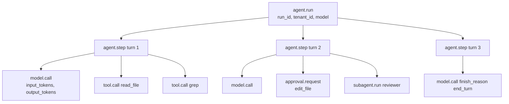
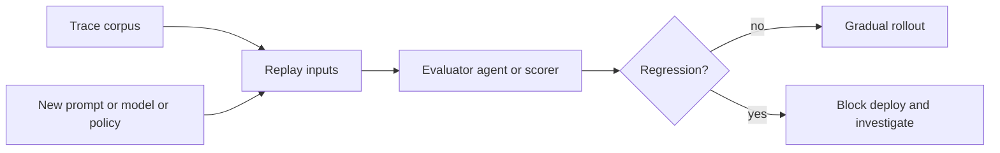

# Chapter 16 — Observability

## TL;DR

仅凭日志很难对 agent 进行调试。你需要一棵 trace 树，它能展示：哪一次模型调用引出了哪一次 tool call、哪一个 tool 结果改变了下一个 prompt、用掉了多少 token、latency 出现在哪里、以及这次运行为何停止。本章涵盖 agent observability 的四大支柱（traces、metrics、logs、eval）、面向 LLM 操作的 OpenTelemetry 属性约定、把一切串联起来的 correlation-ID 链条、把前面每一章埋下的 observability 信号汇聚成统一形态的 metrics 目录（catalog）、sampling 与 redaction（脱敏）规则，以及关键项与可选项的划分——哪些是每个 agent 从第一天起就必须埋点的，哪些可以等到规模逼你时再做。

---

## Why this matters

没有 trace 时，*"agent 搞糊涂了"* 这句话无法落地为行动。有了 trace，你可以打开某一次运行逐项检查：prompt 的拼装、检索到的 memory、tool 参数、tool 输出大小、停止原因、retry 次数、approval 决策、成本。Observability 不会让 agent 变可靠，它只是让失败变得足够可见、可以修复。

它重要的另一个原因是：前面每一章（Ch.04 到 Ch.15）都埋下了一个依赖这一层的具体 metric。Cache hit rate（Ch.04）。Compaction method 直方图（Ch.05）。Retrieval reach rate（Ch.06）。Curator action 直方图（Ch.07）。Run-state transition 计数（Ch.08）。Replan rate（Ch.09）。Subagent success rate（Ch.10）。Approval funnel（Ch.12）。Cost ledger（Ch.15）。本章正是这些散落信号获得统一形态的地方——被采集、被关联、可查询。

---

## The concept

### Four pillars, not three

经典的 observability 框架是三大支柱：traces、metrics、logs。对 agent 而言，*eval* 是分量相当的第四根支柱——因为 *"agent 是否做对了事？"* 这个问题，单凭 latency 和 token 是回答不了的。

| 支柱 | 它回答的问题 | 体量 | 形态 |
|---|---|---|---|
| **Traces** | 这一次具体运行发生了什么？ | 每次运行一条 | span 组成的树 |
| **Metrics** | 跨所有运行正在发生什么？ | 持续 | 时间序列 |
| **Logs** | 系统在某一具体时刻说了什么？ | 高 | 结构化的行 |
| **Evals** | agent 产出的结果对不对？ | 抽样 | 带分数的通过/失败 |

在成熟的部署中，每根支柱面向不同的受众。Traces 给排查事故的工程师；metrics 给盯仪表盘的 SRE；logs 给取证审查和审计轨迹（Ch.05）；evals 给负责 agent 质量的团队。

### The trace tree for an agent run

天然的单元是「运行」。一次运行成为根 span；其下的一切都是子节点：



这棵树就是调试的单元。Logs 和 metrics 都指回一个 trace ID；出问题时，你打开的就是这条 trace。

### OpenTelemetry attribute conventions

OpenTelemetry GenAI 语义约定（semantic conventions）是目前最接近 agent telemetry 标准的东西。其中很多字段仍处于 OpenTelemetry 的 *Development* 稳定级别——这是 semconv 在告诉你 *做好改名的准备*——但其形态已经足够稳定，值得现在就投入、日后再迁移。相关属性如下：

| 属性 | 它承载什么 |
|---|---|
| `gen_ai.provider.name` | `anthropic`、`openai`、`bedrock` 等 |
| `gen_ai.request.model` | 请求的 model ID |
| `gen_ai.response.model` | 实际提供服务的 model ID（fallback 时可能不同） |
| `gen_ai.usage.input_tokens` | 计费的 input token |
| `gen_ai.usage.output_tokens` | 计费的 output token |
| `gen_ai.usage.cache_read_input_tokens` | cache 命中（Ch.04） |
| `gen_ai.usage.cache_creation_input_tokens` | cache 写入（Ch.04） |
| `gen_ai.response.finish_reasons` | `end_turn`、`tool_use`、`max_tokens`…… |
| `gen_ai.tool.name` | 模型调用的 tool |

在你自己的命名空间里加上 agent 专属属性：

```ts
function modelAttributes(call, result) {
  return {
    "gen_ai.provider.name":              call.provider,
    "gen_ai.request.model":              call.modelId,
    "gen_ai.response.model":             result.modelId,
    "gen_ai.usage.input_tokens":         result.usage.inputTokens,
    "gen_ai.usage.output_tokens":        result.usage.outputTokens,
    "gen_ai.usage.cache_read_input_tokens":     result.usage.cacheRead     ?? 0,
    "gen_ai.usage.cache_creation_input_tokens": result.usage.cacheCreation ?? 0,
    "gen_ai.response.finish_reasons":    [result.finishReason],
    "agent.profile":                     call.profile,
    "agent.run_id":                      call.runId,
    "agent.session_id":                  call.sessionId,
    "agent.tenant_id":                   call.tenantId,
    "agent.parent_run_id":               call.parentRunId,        // subagents
  };
}
```

把属性字符串集中放在一处。让它们散落在整个代码库里，会让最终的改名变得痛苦——而且这次改名一定会来。

### Correlation IDs: the chain that ties everything together

有三个 ID 必须贯穿每一行日志、每一个 metric 标签、每一个 span：

- **`run_id`** —— agent 的一次运行。每次调用一个，贯穿整棵树保持稳定。
- **`session_id`** —— 对话线程（Ch.05）。每个进行中的 session 一个；一个 session 包含多次运行。
- **`step_id`** —— loop 的一次迭代（Ch.02）。在同一次运行内区分第 3 轮与第 7 轮。

外加几个可选项：`tool_call_id`（对应 Ch.01 的往返）、`subagent_run_id`（委派时，Ch.10）、`parent_run_id`（其逆向）。

没有这条链，排查生产事故就得靠猜——猜哪行日志属于哪次运行，通常按时间戳猜，而一旦两次运行有重叠，这招就垮了。有了这条链，一句 `grep run_id=abc123` 就能把那次运行的所有 log、metric 和 span 全部捞回来。

### Instrumenting the loop, the model call, and the tool call

值得拥有 span 的三个地方：

```ts
async function invokeAgent(input, ctx) {
  return ctx.tracer.startActiveSpan("agent.run", async (span) => {
    span.setAttributes({
      "agent.run_id":     input.runId,
      "agent.session_id": input.sessionId,
      "agent.tenant_id":  input.actor.tenantId,
    });
    try {
      const result = await runLoop(input, ctx);
      span.setAttribute("agent.status", "completed");
      return result;
    } catch (err) {
      span.setAttribute("agent.status", "failed");
      span.recordException(err);
      throw err;
    } finally {
      span.end();
    }
  });
}

async function callModel(call, ctx) {
  return ctx.tracer.startActiveSpan("model.call", async (span) => {
    const start = performance.now();
    let firstTokenAt;
    const result = await ctx.modelProvider.stream(call, {
      onToken: (token) => {
        if (firstTokenAt === undefined) {
          firstTokenAt = performance.now();
          span.addEvent("model.first_token", {
            ttft_ms: Math.round(firstTokenAt - start),
          });
        }
        ctx.stream.emit(call.runId, { type: "token", token });
      },
    });
    span.setAttributes(modelAttributes(call, result));
    return result;
  });
}

async function executeTool(call, ctx) {
  return ctx.tracer.startActiveSpan("tool.call", async (span) => {
    span.setAttributes({
      "gen_ai.tool.name":   call.name,
      "agent.tool.call_id": call.id,
      "agent.run_id":       call.runId,
    });
    const result = await ctx.tools.dispatch(call.name, call.input, ctx.toolContext);
    span.setAttributes({
      "agent.tool.ok":           result.ok,
      "agent.tool.fatal":        result.ok ? false : result.fatal,
      "agent.tool.result_chars": result.ok ? JSON.stringify(result.result).length : 0,
    });
    return result;
  });
}
```

Time-to-first-token 是流式 agent 最受关注的 UX 指标。总时长是最受关注的容量指标。两者都要记录。

### The metrics catalog — composing every prior chapter

前面每一章都至少埋下了一个可观测信号。它们合在一起，构成了 agent 专属的 metrics 目录：

| Metric | 来源章节 | 它告诉你什么 |
|---|---|---|
| `cache_hit_ratio` | Ch.04 | prompt cache 划不划算？取决于 workload——在稳定的多轮 workload 上，过半是个合理的起步目标，但完整图景见 Ch.04。 |
| `compaction_method_count{method}` | Ch.05 | 哪种 compaction 技术在挑大梁？ |
| `compaction_compression_ratio` | Ch.05 | 每一遍省下了多少？ |
| `retrieval_empty_hand_rate` | Ch.06 | 查询是否空手而归？要么 memory 差，要么 query 差。 |
| `retrieval_reach_rate` | Ch.06 | 模型是否真的用上了我们注入的内容？ |
| `memory_write_rejection_rate` | Ch.07 | safety filter 是否在咬人？ |
| `curator_action_count{action}` | Ch.07 | curator 有没有在裁剪任何东西？ |
| `run_state_transition_count{from,to}` | Ch.08 | 运行把时间花在哪些状态上？ |
| `replan_rate` | Ch.09 | 计划多久需要更新一次？ |
| `subagent_success_rate{role}` | Ch.10 | 每个专家是否都在出力？ |
| `health_check_success_rate{probe}` | Ch.11 | harness 健康吗？ |
| `approvals{state}` | Ch.12 | 按终态划分的 approval funnel。 |
| `channel_inbound_count{channel}` | Ch.13 | 每个 channel 的流量。 |
| `cost_usd{tenant,model}` | Ch.15 | 按 model 划分的各 tenant 花费。 |
| `outbox_depth` | Ch.15 | 副作用投递的滞后。 |
| `queue_depth{queue}` | Ch.15 | 积压。 |
| `ttft_ms` | 本章 | Time to first token。 |
| `tokens_per_run` | 本章 | 每次运行的成本驱动项。 |

这不是一张愿望清单——它是前面各章每一处 *"这其实也是 observability"* 节拍的并集。只要你像上面那样给 trace 树埋了点，这些指标接起来都不难；而每当某个 metric 发生变动、你追问为什么时，它们都会回报你。

### Cost as a first-class metric

成本既出现在 trace 里（每个 `model.call` span），也出现在 metrics 里（按 tenant、按 model、按天）。公式可以从 Ch.04 的属性集机械地算出来：

```ts
function costFromUsage(usage, model) {
  const r = pricing[model];                  // 向你的 agent 询问当前费率
  return (usage.inputTokens               * r.input)
       + (usage.cacheReadInputTokens      * r.cache_read)
       + (usage.cacheCreationInputTokens  * r.cache_creation)
       + (usage.outputTokens              * r.output);
}
```

聚合到「每 tenant 每天」，呈现在运维仪表盘（Ch.15）上，对照预算把关（routing 决策归 Ch.17 所有）。生产 agent 中最有用的单一告警，是针对每 tenant 每日成本的 *anomaly detection（异常检测）*。一个合理的起步规则：当某 tenant 的当日成本超过其滚动 7 天均值的 3 倍时就触发寻呼。Hermes Agent 和 Paperclip 的仪表盘都呈现了这类信号；阈值取决于 workload，值得调优。

### Logs vs metrics vs traces — when to use which

三种角色：

- **Traces** 是 *因果的*。用它回答 *这一次具体运行为什么那样做？* 它对一眼即看的仪表盘来说太啰嗦。
- **Metrics** 是 *聚合的*。用它回答 *我们在所有运行上整体表现如何？* 它丢失了个体的故事。
- **Logs** 是 *颗粒化的事件*。用它做取证审查（Ch.05 的审计日志是经典例子），以及容纳那些塞不进 span 的东西——启动错误、周期性后台任务、Ch.07 里 curator 的 action 日志。

贯穿三者的规则：每一行日志、每一个 metric 数据点、每一个 span 都携带相同的 correlation ID，这样你才能从一根支柱跳到另一根。点开一个 metric 尖峰，拿到贡献该尖峰的 trace ID；打开某条 trace，看到它时间窗内的日志。

### Sampling strategy for agent traces

到了规模上，记录每一个 span 都很贵。一个务实的 sampling 策略：

- **始终开启（100%）** —— 任何出错的运行、任何超预算的运行、任何带 approval 的运行、任何触碰了破坏性 tool 的运行、任何 subagent 的派生。
- **基于尾部（100%）** —— 树里任一 span 出错，就回溯性地捕获整棵树。这需要一个带缓冲的 collector（带 `tail_sampling_processor` 的 OpenTelemetry Collector）。
- **基于头部（10–25%）** —— 其余一切，在 session 开始时按 `run_id` 的确定性哈希抽样，使一个 session 的各次运行要么全采、要么全不采。

最大的错误是低比例的均匀采样。有意思的运行恰恰是那些例外；按 1% 均匀采样，会把它们中的绝大多数都丢掉。错误和昂贵的运行始终开启，其余的走基于头部的采样。

### Redaction at the trace boundary

Telemetry 会泄露。三类内容必须在抵达 trace sink *之前* 就被脱敏：

- **Secrets** —— API key、OAuth token、从 Ch.15 的 `$secret:` 引用解析出的值。用模式匹配并替换为 `[REDACTED_<KIND>]`。
- **PII** —— 邮箱、电话号码、SSN、支付信息。做法相同；有些团队会维护一份每 tenant 的字段允许清单，列明哪些字段可以被持久化。
- **模型的输入和输出** —— 默认在 span 上只记录 token *数量*，绝不记全文。全文存进一个单独受控、有严格访问控制的审计存储里（Ch.05 那只增不改的审计日志正是合适的归宿）。

Hermes Agent 的 `RedactingFormatter` 在日志格式化器这一层处理这件事；在 trace 流水线里，正确的位置是 *exporter*，或者 OpenTelemetry Collector 里的一个流内 processor。事后再脱敏——等 span 已经发往第三方 backend 之后——就太晚了。

### Eval as observability

Trace 会变成一份回归数据集。在改动 system prompt、model profile、tool schema 或 routing 策略之前，重放有代表性的 trace 并给结果打分。



架构很简单：采集生产 trace，针对候选改动重放它们，给结果打分（语义相似度、结构化字段比对、Ch.10 验证模式里的 evaluator subagent），并为 rollout 把关。这套 eval 套件是你对抗静默回归的安全网——那种能通过测试、抽查时看着也合理、却在一周后才在生产暴露的回归。

要做更丰富的设置，就把一个较小的 eval 持续跑起来：每小时抽样 50 次最近的生产运行，针对一份基线配置重跑，一旦发生背离就告警。Hermes Agent 有一个后台模式可以做这件事；Paperclip 则通过它的 `heartbeat_runs` 审计日志提供了构建这套机制的部件。

### Eval methods — what to score and how to score it

上一小节讲的是 *gate*——重放、比对、晋升。这一小节讲 *方法*——具体该给什么打分、用什么 judge、输入从哪来。这是你能不蒙着眼上线并改进 agent 所需的最小 eval 套件。

**要打分的四个维度。** 大多数 agent eval 都可归结为这四个，大致按主观性递增排列：

- **功能正确性** —— agent 是否做了被要求做的事？对于闭式任务是二值的（测试通过、值匹配），可给部分分时则是分级的。这是最重要的维度，且当任务存在 ground truth 时也最容易自动化。
- **步骤效率** —— 它用了多少轮、多少 tool call、多少 token？一个与用户感知 latency 和账单相关的成本代理指标。从上面那棵 trace 树里算出来很便宜。
- **输出质量** —— 形式是否规范、是否准确、是否有用。通常需要一个 judge（能确定性判定就尽量确定性，否则用 LLM-as-judge）。
- **用户满意度** —— 显式反馈（点赞/点踩、接受/拒绝某个 diff），或隐式反馈（接受所需时长、用户是否重试）。这是最重要的信号，也是大规模下最难收集的。

能打全四个维度就都打；按用户实际为之付费的部分给它们加权。

**三种 judge 模式。** 大致按偏好顺序：

- **确定性检查** —— 正则、JSON Schema 校验、代码执行、与已知答案做相等比对。最便宜、最快、最可靠。优先用；任何能做成确定性的都应该做成确定性。
- **LLM-as-judge** —— 用一个更便宜的模型，对照评分量规（rubric）给 agent 的输出打分。非确定性任务的标准做法。要在设计上对抗三种偏差：*verbosity bias（冗长偏好）*（judge 偏爱更长的输出）、*position bias（位置偏好）*（judge 偏爱它先看到的那个选项）、*self-preference（自偏好）*（来自同一模型家族的 judge 会给自家家族打更高分）。缓解办法：给 judge 配一份严密的量规、随机化位置、用一个与 agent 不同的模型家族。
- **成对比较** —— 把两份输出（基线 vs 候选）摆给 judge，问它哪个更好。对于模糊任务，这比绝对打分更可靠——*"A 比 B 好吗？"* 这个问题，模型回答得比 *"这个好不好？"* 更一致。

对于高风险的 eval，集成两到三个 judge 并取多数。分歧本身就是有用的信号——judge 们意见不一的那些案例，正是值得人来看一眼的案例。

**eval 语料从哪来。** 三个来源，按对生产 agent 的有用程度排序：

- **生产 trace 语料。** Ch.05 的审计日志加上本章前面那棵 trace 树，是你手头最便宜、最相关的 eval 集。抽样 50–100 次最近的运行，针对候选重放，打分。因为是真实流量，所以总是有代表性。
- **合成数据集。** 用一个更强的模型生成测试输入，去触发你的生产流量尚未碰到的边缘情况。对覆盖率有用；对分布的可靠性较差。
- **公开基准。** 用于定位方向、用于和同行交流，而非直接当生产 gate。用它们了解 state of the art 在哪，而不是用它们决定要不要上线。

**值得了解、用于定位的基准。** 它们有助于理解什么是难的、领域的水准线在哪。这些没有一个能替代在你自己 workload 上做评测，但花几分钟知道它们的名字是值得的：

- **SWE-bench / SWE-bench Verified** —— coding agent 解决真实的 GitHub issue。回答 *"agent 能否交付一个修复？"* 的领先参照。
- **τ-bench** —— 跨真实领域（航空、零售）的 tool-use。针对目标完成度测试多轮 tool calling。
- **GAIA** —— 通用 AI 助手回答复杂的真实世界问题。retrieval 加推理加 tool use 的端到端。
- **WebArena** —— 网页导航任务。使用浏览器的 agent 的参照。
- **AgentBench** —— 横跨 OS、代码、网页、知识任务的广义能力基准。

还有更多，而且每个季度都有新的。和你一起读这门课的 agent 能说出当前榜首是谁；上面这些名字足够稳定，值得记下来用于定位。

**可以上线的最小 eval 套件。** 上面这些你一个都不需要就能起步。最低限度是：

- 一份小而固定的语料——10 到 50 条真实 workload 输入，提交进仓库。
- 一个打分函数——能确定性就确定性，不能就用 LLM 判分。
- 一个基线 vs 候选的运行器，为两边各产出一个数字。
- 一个告警，在该数字回退超过某阈值时触发。

就这些。在此之上的一切——judge 集成、公开基准接入、合成生成、reward model——都是当 workload 值得时你才长出来的东西。能交付最有用 agent 的团队，往往是那些拥有 *每次改动都真的会跑* 的最小 eval 套件的团队，而不是那些拥有从不拦截一次部署的最精巧 eval 框架的团队。

### Eval governance — keeping the eval pipeline honest

一条对生产运行打分的 eval 流水线，本身就是一个生产系统。运行它的团队要负责四件事：

- **数据集版本化。** eval 语料会变——你加入边缘情况、淘汰过时的、修正标注。固定一个版本，记录每个分数是由哪个数据集版本产出的；针对 `eval_set@v3` 的一次回退，未必是针对 `eval_set@v4` 的回退。
- **量规版本化。** LLM-as-judge 的量规也是会移动的目标。给它们版本化，记录每次运行由哪个版本评分。没有这一步，*"模型退化了"* 和 *"我们收紧了量规"* 看起来一模一样。
- **Evaluator 漂移。** 更换 judge 模型——更便宜的版本、不同的家族、新发布——即便 agent 没变，也会让绝对分数发生偏移。judge 一变就重新基线；相比绝对阈值，更倾向于 *相对* 打分（同一 judge 下基线 vs 候选）。
- **重放隐私。** trace 语料含有用户数据。重放 trace 会重新处理那些可能受 Ch.07 删除标记或 Ch.08 恢复隐私规则约束的内容。重放前先过滤语料；eval 流水线绝不能变成一条让用户已请求移除的内容死灰复燃的路径。

对评测 agent 的 eval 流水线，要施加与被评测 agent 同等的版本化、审计与隐私纪律。否则它号称提供的那道 gate 就是虚构——一个因没人能复原的原因而变动的数字。

### The trace-replay debug surface

与 metrics 仪表盘相对应、面向运维者的补充，是打开单次运行并就地内联查看它。

Paperclip 与 OpenCode 殊途同归的模式：

- 顶部是根 span，带关键属性（model、token、cost、status、duration）。
- 下方是缩进的子 span 树——steps、模型调用、tool call、subagent 运行。
- 点开任意 span，看到属性、该时间窗的日志、错误与栈轨迹。
- 一个 *Replay* 按钮，用相同输入针对当前代码重跑同一轮。
- 一个时间线视图，展示墙钟时间花在了哪（等模型 vs 执行 tool vs 排队等待）。

这是 agent 调试中最有价值的单一运维工具。把底层那棵 trace 树建好，这个 UI 就很直白；建砸了，没有任何 UI 能救你。

### Critical vs optional — what to instrument on day one

本章里并非每个 metric 都是强制的。诚实的分类：

**关键项 —— 每个 agent 从第一天起：**

- 根 `agent.run` span，带 `run_id`、`tenant_id`、`status`、总 token、cost。
- 每次 LLM 调用一个 `model.call` span，带上 OpenTelemetry 的 token 属性。
- 每次派发一个 `tool.call` span，带 name、ok/fatal、result_chars。
- 每一行日志上的 correlation ID。
- 每个未捕获异常的错误日志。
- cache hit ratio metric（Ch.04——太便宜，没理由不做）。
- 每 tenant 每日成本 metric（Ch.15——是运营所需，不是可选）。

**早期高价值：**

- Run-state transition 计数（Ch.08）。
- Approval funnel（Ch.12）。
- TTFT 与总时长直方图。
- 出错时的基于尾部的 sampling。
- exporter 处的结构化 redaction。

**可选，直到规模逼你做：**

- 持续 eval 套件。
- 成本异常检测。
- 每 tool 的 latency 直方图。
- trace 属性的 schema 版本化。
- trace 重放 UI。
- 超出 Ch.02 运行时检测之外的 doom-loop 告警。

要避开的陷阱：在关键层之前先去建可选层。一个有二十张图、却没人信任的仪表盘，比一张能抓住每次事故的图还糟。从关键清单的顶端开始，只有当上一层扎实了，才往下加一层。

### Schema versioning for trace attributes

你今天上线的属性日后一定要变。三个习惯：

- **给你的自定义属性加命名空间**（`agent.*`），让改名有边界。
- **新增属性；不要重新利用旧属性。** 含义若变了，就给它一个新名字。
- **显式地给 trace schema 版本化**，在根 span 上放一个 `trace_schema_version` 属性。查询就变成了 *给我 `schema=v2` 且……的运行*——旧运行不会把查询搞坏。

OpenTelemetry GenAI 约定本身也在演进。把它们当作今天的标准名称，也当作一年后待迁移的候选。

---

## Real-system notes

- **OpenCode** 从它的 server 流式输出结构化的 session 事件，把 session 和 message 部分持久化到 SQLite，并把总线暴露给 SSE 客户端——这是一个 coding agent 实用的 observability 界面，同时也充当你接入任何 OTLP exporter 时的 trace 种子。
- **Paperclip** 记录 `heartbeat_run_events`、`cost_events`、`issue_approvals` 以及 adapter 执行状态，给运维者一个直接映射到本章 metrics 目录的控制平面视图。是 trace 重放 UI 模式的最强参照。
- **Hermes Agent** 自带一个用于结构化日志的 `RedactingFormatter`、一个用 FTS5 做审计的 session 搜索，以及一个可跑持续 eval 的后台模式——是源头脱敏与 eval-即-observability 这两个模式的有用参照。
- **OpenClaw** 提醒我们：trace 必须包含 *channel* 和 *adapter* 元数据——同一个 agent 行为可能因平台而异，而把 Slack 和 Telegram 混为一谈的 observability，会掩盖真实的失败。

---

## Common failure cases

*这些失败是持久的；它们的修复方式演进最快——每条都点出模式，把当前的具体做法留给你和你的 AI 伙伴。*

- **基数爆炸（Cardinality explosion）。** 一个每运行唯一的 ID 落到了某个 metric 标签上，序列数量暴涨，metrics backend 变慢、并按活跃序列计费。*修复：有界标签规则——标签只携带小的封闭集合，无界 ID 放到 traces 和 logs 上，exemplar 把一个 metric 桥接回一条有代表性的 trace。*
- **一堆互不相连的扁平 span。** trace context 没能跨过某个异步或进程边界，于是子 span 开了新的根，整棵树碎成了孤儿。*修复：在每个边界上显式传播 trace context，并对树形（孤儿 span 率、每次运行一个根）告警，而不是对 span 数量告警。*
- **从不拦截的 eval gate。** 一个绿色的 "evals passed" 检查变得不稳定、缓慢或陈旧，于是回归从一个已经几个月没拦住任何东西的 gate 上溜了过去。*修复：跟踪 gate 自身的拦截率和 judge 稳定性，让拦截套件保持小而快，并按计划刷新语料。*
- **secret 泄露进 traces。** 一份凭据经由 redactor 从未走过的路径抵达 trace sink——一个嵌套的 tool payload、一条被记录的异常、一段被回显的模型输出。*修复：在 trace 边界做纵深防御——对 span 属性做允许清单、清洗异常、并用一个持续运行的诱饵 secret 来证明它有效（Ch.18）。*
- **没人信任的仪表盘。** 每个 metric 都配了阈值告警，正常的方差不停地触发它们，于是 on-call 学会了无视那个真正告警将会出现的频道。*修复：只对用户能感知的症状告警，并做寻呼/工单/仅看板的分级，凡是触发后很少导向行动的告警就剪掉。*

---

## Pair with your agent

- *"按 `gen_ai.*` 属性约定把 OpenTelemetry 接进我的 harness。验证每次模型调用、每次 tool call、每次 approval 都发出一个 span。在我的 OTLP backend 里打开一次运行，确认 trace 树与实际发生的一致。"*
- *"给每一行日志、每个 span、每个 metric 加上 correlation ID（`run_id`、`session_id`、`step_id`、`tool_call_id`）。给我演示一个 `grep run_id=...`，把一次运行跨三根支柱的完整故事捞回来。"*
- *"把本章的 metrics 目录实现为单一的一套 Prometheus 或 OTLP metric。为每个 tenant 建一个仪表盘：今日成本、cache hit ratio、run-state 分布、approval funnel、按错误率排名的 top tools。"*
- *"建立这套 sampling 策略：对错误和昂贵运行（超过 \$0.10）始终开启，任一错误 span 触发基于尾部的 100%，其余一切走基于头部的 10%。用一次压力测试来验证。"*
- *"在 OTLP exporter 或 collector 里加 redaction。照着 Hermes 的 `RedactingFormatter` 规则来建模。在一个 tool 参数里故意注入一份 secret，验证它绝不会抵达 trace backend。"*
- *"搭一个 eval-即-observability 的循环：每小时抽样 50 次生产运行，针对我当前的配置重放，用一个 evaluator subagent（Ch.10）打分，背离超过 5% 就告警。"*
- *"为一次运行建出 trace 重放 UI：树、属性、日志，以及一个能重跑同一轮的 *Replay* 按钮。用我 OTLP backend 的 API。"*
- *"加上成本异常检测：当某 tenant 的当日成本超过其滚动 7 天均值的 3 倍时寻呼。用一个月的历史数据来调那个倍数。"*
- *"带我过一遍：本章目录里的哪些 metric 在我的 agent 里 *还没* 接上。按关键/高价值/可选的划分来排优先级。"*

---

## What's next

你现在能看见你的 agent 在做什么了。下一章会用这些测量来决定该用 *哪个模型*、*哪个 provider*，何时 fallback、何时限流，以及如何实时执行每 tenant 的预算。Ch.17 是成本与 latency 策略。

---

<!-- nav-footer -->
<div align="center">

[⬅️ 上一章：Ch.15 Backend infrastructure](15-backend-infrastructure.md) · [📖 课程目录](../../README_zh.md) · [下一章：Ch.17 Cost, latency & model strategy ➡️](17-cost-latency-model-strategy.md)

</div>
