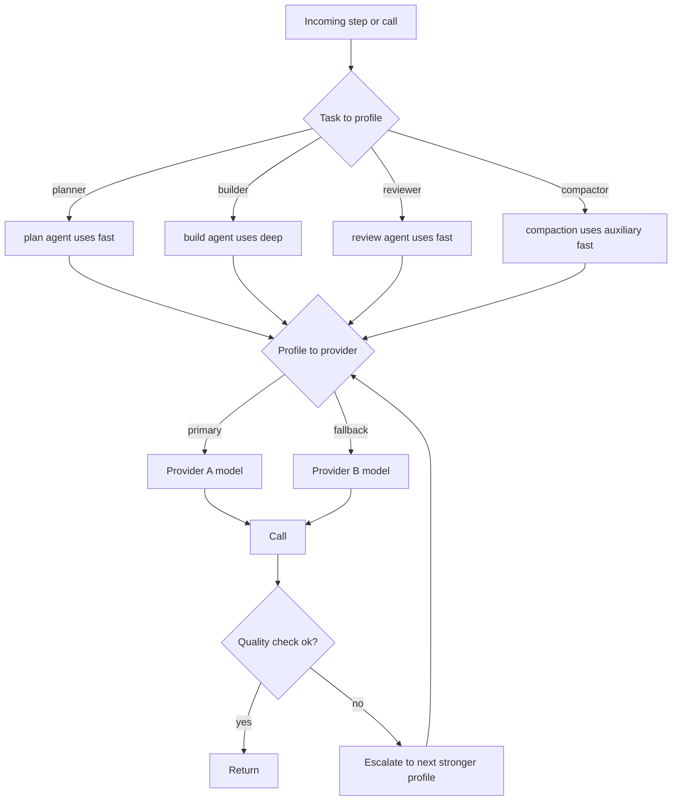
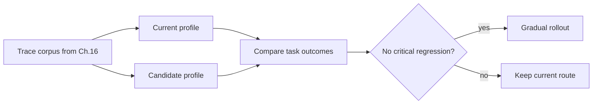

# Chapter 17 — Cost, latency, and model strategy

## TL;DR

模型选择是一项架构决策，而不是写在文件顶部的一个常量。生产级 agent 会在多个 model profile（fast、balanced、deep、embedding）之间 route 工作，强制执行 per-tenant 预算，对瞬时故障进行 retry，并仅在质量确有需要时才 escalate。然而，最大的 cost 杠杆并不是挑对模型——而是当一个确定性 tool、一个 regex、一个 BM25 index，或一个经典 ML 库能够更快、更省、更可靠地给出答案时，*干脆不调用模型*。本章涵盖 routing cascade、辅助模型层（auxiliary-model tier）、"别调用 LLM"启发式、调用前的 token 预算、streaming 与 batch 的 trade-off、作为 per-tenant 摊销杠杆的 prompt caching、eval-gated promotion、cost forecasting、异常响应策略，以及 operator override。

---

## Why this matters

一个 agent loop 会把模型调用成倍放大。单个 workflow 可能会为 planning、tool selection、retrieval synthesis、最终响应、一轮 evaluation 以及一步 memory curation 各调用一次模型。如果每次调用都用最贵的模型，系统在经济上就会变得脆弱。如果每次调用都用最便宜的模型，质量就会在用户偏偏会在意的时刻以微妙的方式崩坏。而如果这次调用本可以用一个 regex 完成，那你就是花钱请 LLM 做一台 1980 年代的文本处理器在微秒内免费就能做完的活。

这门手艺叫 routing——而 routing 的起点是在问*该用哪一个？*之前，先问*我们到底该不该调用模型？*

---

## The concept

### The three-way trade

每一次模型调用都被三股力量朝不同方向拉扯：

- **Quality** — 输出是否达标？
- **Latency** — 返回是否足够快，配得上这种请求形态？
- **Cost** — tenant 的预算是否负担得起？

没有任何一个模型能在这三者上全胜。生产级 routing 就是这样一门功夫：为每次调用在这个三角形上挑出正确的那个点，而不是在全局挑出一个唯一赢家。

### Model profiles, not model names

在代码和配置中使用具名的 profile。在一个地方把它们映射到具体的 provider model ID。这样课程就可以说*"compaction 用 `fast` profile"*，而不会在底层模型变化时失效——而且定价快照（pricing snapshot）连同日期戳都集中保存在一个文件里。

```ts
type ModelProfileName =
  | "fast"            // small, fast, cheap; routine classification and summarization
  | "balanced"        // the default workhorse
  | "deep"            // expensive, reasoning-capable; hard problems and final review
  | "embedding"       // retrieval indexes; not a chat model
  | "local-private";  // on-device or in-VPC; sensitive content

type ModelProfile = {
  name:                ModelProfileName;
  provider:            "anthropic" | "openai" | "bedrock" | "local" | string;
  modelId:             string;
  contextWindowTokens: number;
  maxOutputTokens:     number;
  pricingSnapshot?: {
    retrievedAt:                 string;       // date-stamped
    inputPerMillionTokens:       number;
    outputPerMillionTokens:      number;
    cacheReadPerMillionTokens?:  number;
    cacheWritePerMillionTokens?: number;
    sourceUrl:                   string;
  };
};
```

五个 profile 几乎覆盖了所有情况。profile 越多，团队的认知负担就越重，而且价格变动时容易漏改的地方也越多。

### The routing cascade

生产级系统按以下顺序在三个层级上做 routing：



- **Level 1 — Task to profile。** agent 或步骤类型挑选 profile。OpenCode 把模型绑定到 *agent*（build、plan、explore、compaction）。Paperclip 把 adapter 的选择绑定到 issue 类型，adapter 再各自拥有自己的模型。Hermes Agent 在 session 开始时挑选，并在整个过程中保持固定。
- **Level 2 — Profile to provider with fallback。** 每个 profile 都有一个主 provider/模型和一条 fallback 链。遇到 429、quota 错误或 5xx 时，轮换 key（Hermes Agent 的 credential pool）或 fall back 到下一个 provider。这就是 Ch.15 的 rate-limit cascade。
- **Level 3 — Quality escalation。** 如果一次廉价调用产出的输出未通过自动化的 quality check，就用更强的 profile 重跑。把它视为与基础设施 retry 相互独立的机制——*quality escalation* 和 *transient retry* 是两种不同的机制。

### Per-call vs per-step vs per-run selection

一个微妙却昂贵的陷阱：在 session 中途切换模型，通常会打破 Ch.04 的 prompt cache。三种策略，大致按对 cost 越来越不友好排列：

- **Per-run**（多数生产系统采用）。模型在 session 开始时选定，并在整个 run 中保持固定。cache 命中会跨多轮累积复利。
- **Per-step**（实践中少见）。每一步都可以挑一个不同的模型。对辅助层（auxiliary tier，下一节）很有用——那里有一个独立的廉价模型负责 compaction 或 summarization；但如果*主*模型每步都轮换，你每次都要付 cache miss 的代价。
- **Per-call**（对主 agent 少见；对 router 和 auxiliary tier 则属常态）。每一次独立调用都独立 route。跨调用的 cache 摊销基本上荡然无存，因此只有当架构已明确以 cache 换取 routing 灵活性时才说得通——比如逐请求分类并 route 的 LLM router 服务，或者那些调用很短、本就不指望 cache 复利的 auxiliary tier。

规则是：**主 agent 模型按 per-run；auxiliary 模型和 router 形态的调用可以按 per-step 或 per-call。** 让主 agent 逐调用轮换，是 agent 系统里最常见的 cost 爆炸源头；解药通常是明确区分哪些调用是 *router 形态*（不假设有 cache）、哪些是 *session 形态*（cache 会累积复利）。

### The auxiliary model tier

生产级系统不会把所有模型调用都走主 agent。它们保留一个独立的 *auxiliary* 层，专门处理狭窄、廉价、无 tool 的任务：

- **Compaction**（Ch.05）—— Hermes Agent 的 `auxiliary_client` 为 `ContextCompressor` 调用更便宜的模型；OpenCode 专门的 `compaction` agent 在无 tool 且预算固定的情况下运行。
- **Summarization** —— 把冗长的 tool result 转成片段；把一段 50 轮的 transcript 转成一个交接块。
- **Classification** —— *"这是一个问题还是一条命令？"*——一次带紧凑 schema 的廉价调用。
- **Title 和 slug 生成** —— OpenCode 运行一个 `title` agent 来生成 session 标签。
- **Embedding 生成** —— 这根本不是 chat 模型；完全是另一种形态。

auxiliary tier 是仅次于 caching 的第二大 cost 杠杆。把 compaction 跑在与主 agent 相同的昂贵模型上，可能会让一个 session 的账单翻倍，而这活儿廉价模型完全胜任。

### Don't call the LLM at all

最大的 cost 杠杆也最容易被忽视：当一个确定性 tool、一个库，或一个 regex 就能回答问题时，根本不该让 LLM 介入。对于任何有标准答案（ground-truth）的查询，生产级系统都会毫不留情地走确定性路径。

| Task | Deterministic option | When to add an LLM |
|---|---|---|
| Find files by name pattern | `glob`, `ripgrep` | Never |
| Find code by exact string | `ripgrep`, FTS5 | Never |
| Find semantically-similar text | Embeddings + ANN (`sqlite-vec`, `pgvector`) | Only for ambiguous queries needing rerank |
| Parse JSON, YAML, CSV | A parser library | Never |
| Extract structured fields | Regex, lookup tables, classical NER | Only when the input format is unbounded |
| Detect language / intent | Fast classifier (fastText, regex rules) | Only when ambiguous edges matter |
| Compute, count, aggregate | Code, SQL | Never — models are bad at arithmetic |
| Render a diff | `diff` library | Never |
| Validate a schema | Schema validator | Never |
| Format output (JSON, markdown) | A serializer | Only if the output schema is open-ended |
| Summarize known structure | Templates, slot-filling | Only for free-form text |
| Pick a category from a closed list | Classifier or rule engine | Only for ambiguous edges |

OpenCode 的 tool 层是最清晰的参考：文件搜索用的是 `ripgrep` 和 `glob`，从不用 LLM。Hermes Agent 的 `session_search` 先用 FTS5，仅在需要对结果做 summarize 时才调用 LLM。Paperclip 的 heartbeat 本身*不做*任何 LLM 调用——它把工作 route 给可能调用、也可能不调用模型的 adapter。

经验法则是：*如果查询有确定性答案，就用确定性 tool。LLM 是留给主观判断的。* 每一次你跳过的模型调用，都是在 cost、latency 以及"模型凭空编造答案的概率"上省下的一笔。

```ts
// A router that prefers deterministic paths.
async function answer(query: Query, ctx: Context) {
  if (query.shape === "file_search")    return await ctx.tools.ripgrep(query);
  if (query.shape === "structured_get") return await ctx.db.get(query.key);
  if (query.shape === "parse_known")    return await ctx.parser.parse(query);
  if (query.shape === "classify_closed") {
    const result = ctx.classifier.predict(query.text);
    if (result.confidence > 0.9) return result.label;
    // fall through to LLM only on low confidence
  }
  return await ctx.llm.call(query, { profile: "balanced" });
}
```

### Token-estimate-before-send

在任何一次模型调用之前，先数 token。这样三件事就成为可能：

- **在出账单之前拒绝。** 如果请求会超出 tenant 的预算，就提前以清晰的错误返回，而不是等 provider 已经把账记到你头上之后才发现。
- **在 overflow 之前 compact。** 如果请求会超出 context window，先跑一次 compaction（Ch.05）——这比捕获 `prompt_too_long` 错误后再 retry 要便宜。
- **挑对 profile。** 如果请求只有 200 token，`fast` profile 就够；如果是 50 K token 且需要深度推理，那么无论预算如何都需要 `deep` profile。

Hermes Agent 的 `model_metadata.py` 正是为了这种调用前检查而缓存每个模型的 context 上限和 cost 系数。OpenCode 的 `usable()` 计算 `context_limit − max_output − safety_buffer`，并在下一次调用之前触发 compaction。两者都把 token 计数视为调用前的标准闸门。

### Streaming vs non-streaming: a cost lever, not just UX

Streaming 感觉像是一个 UX 选择（把实时 token 推给用户），但它同样影响 cost 的形态：

- **Streaming** —— 部分输出在毫秒级别就开始到达；用户可以在响应进行到一半时打断。per-token cost 与 non-streaming 相同，但*感知*的 latency 要低得多。这是交互式 chat 的正确默认值。
- **Non-streaming** —— 一次往返，一次读取拿到完整响应。在规模化场景下 HTTP 开销更低（同样的负载，一个连接对比多个连接）。允许在展示给用户之前对完整响应做后处理。这是 batch 任务、cron、定时作业的正确默认值。

Hermes Agent 用一个 `streaming=True/False` 标志把这件事显式化。Paperclip 的 adapter 则各自逐 adapter 选择。规则是：*交互形态用 streaming；非交互形态不需要它。* streaming 在规模上并不免费——每个打开的连接都占用一个 worker 线程（Ch.15）。

### Prompt caching as multi-tenant amortization

Ch.04 讲过 cache 的机制；这里的 cost 视角不同。cache 的节省可以*跨* session 累积复利，而不只是在单个 session 内部——*前提是*一组条件同时成立：

- 一个只构建一次、在众多 session 间复用的 system prompt，会把它的 cache 创建成本摊销到所有 session 上——前提是前缀字节稳定（Ch.04）、每次调用的模型都相同（即上文的 per-run 纪律）、provider 所适用的 tenant 或 org scope 保持一致、provider 的 cache 保留窗口在两次使用之间尚未失效，且请求的密度足够大以保持条目处于热态。一旦丢掉其中任何一个前提，摊销就停止了。在暴露显式 caching 的 provider 上，cached input token 通常按 fresh input 的一个零头计费；具体系数因厂商而异且会变动——去读当前的定价页，永远不要硬编码一个比率。
- Hermes Agent 把渲染后的 system prompt 持久化在 `SessionDB` 里，因此当 gateway eviction 之后到来一条新的用户消息时，会重放字节完全一致的内容——*只要* cache 的保留窗口还没过期，cache 就能在 eviction 中幸存。
- OpenCode 的两段式 system 数组（model-family 规则 + agent 专属覆盖）经过塑形，使得 model-family 那一半能在众多 agent 之间 cache 命中。

这对 routing 的启示是：在一个 session 内尽可能保持模型不变，并让 system prompt 跨 session 字节稳定（Ch.04 的规则）。在 session 中途切换模型，或者用一个时间戳去重建 prompt，都会把跨 session 的摊销白白扔掉。

### Retry vs escalation

生产级系统区分两类故障；它们不是同一种机制：

```ts
async function routeAndCall(step: AgentStep, ctx: ModelContext) {
  const profile = chooseProfile(step);

  // Transient: infrastructure retry with backoff.
  const result = await callWithRetry({ ...step, profile }, ctx);

  // Quality escalation: a different mechanism.
  if (await passesQualityCheck(step, result)) return result;

  const stronger = nextStrongerProfile(profile);
  if (!stronger) return result;

  await ctx.trace.event("model.escalated", {
    from: profile, to: stronger, reason: "quality_check_failed",
  });
  return callWithRetry({ ...step, profile: stronger }, ctx);
}
```

- **Transient retry** 处理 429、5xx、网络错误。退避、重试，最终 fall back 到另一个 provider（Ch.15 的 cascade）。模型输出的目标是相同的。
- **Quality escalation** 处理一次成功调用、但其输出未通过下游检查（schema validation、evaluator subagent、基本的合理性检查）的情况。用更强的 profile 重跑。模型在第二次会给出*更好*的输出。

把 quality 失败当成 retry 处理是一个常见的 bug：用相同的 prompt 重试相同的廉价模型，只会得到同样不充分的答案。

### Cost forecasting per tenant

反应式（reactive）的预算闸门（Ch.15）是在一个 run 已经启动之后才拒绝它。Forecasting 则在 run 之前预测，并据此 route：

- **从 session 形态估算 per-run cost。** 同一 tenant 近期类似任务的多次 run 给出一个基线；乘以模型的 per-token cost。
- **与剩余预算比较。** 如果预测值 > 剩余预算，响应取决于 tenant 的*预算策略*，而不是一个硬编码的默认值。某些 tenant——一个高风险的法务审查 workflow、一个受监管数据的部署——宁可*阻断*并请求预算审批，也不愿悄无声息地得到一个更便宜的答案。另一些 tenant——交互式 chat、探索性编码——则更愿意*降级*：route 到更便宜的 profile、启用更激进的 compaction、在 UI 中把这个 trade-off 显式呈现。router 读取策略；降级是*一种*有效策略，而不是默认。在没有显式策略选择的情况下把 quality 契约和 cost 契约混在一起，正是一个"超预算即降级"的系统悄悄违反受监管数据协议的方式。
- **在事关重大时把预测呈现给用户。** *"按你当前设置，这个任务预计花费 \$2.40；切换到 fast profile 预计 \$0.30？"*——由 operator override（见下文）来处理这个选择。

Paperclip 的 `budget_policies` 表保存着 tenant 的层级；forecasting 层在 dispatch 之前读取它。Hermes Agent 不做预测；它在事后做出反应。如果你负担得起一次性把它接入埋点，forecasting 这套模式是更省的上线路径。

### Cost anomaly response

Ch.16 介绍了 cost anomaly *detection*——那个 3× rolling-7-day 告警。Ch.17 负责的是*响应策略*：

- **软响应。** 在接下来的 N 次 run 中把该 tenant route 到更便宜的 profile；启用更严格的 compaction；通知用户其花费异常。
- **硬响应。** 暂停该 tenant 的新 run；恢复前要求 operator 确认；把任何进行中的 run 标记为 `scheduled_retry`（Ch.08），使其在人工审查后再继续。
- **分级响应。** 第一次飙升：软响应。跨两天的持续飙升：硬响应。手动 override：两者皆绕过。

在生产中行得通的模式是*自动软响应，手动硬响应*。软响应可逆，且搞错了代价很小；硬响应会阻断真实工作，需要一个人来做决定。

### Operator override

Routing 必须有一个逃生舱口。两种模式：

- **Per-run model bump。** *"这个任务事关全局；无论策略如何，都用 `deep` 跑。"* 记录到 audit log（Ch.05）；cost 记在 operator 自己拥有的 override 预算上。
- **Per-session pinning。** 在一次调查或 debugging session 期间，把某个特定 session 锁定到某个特定模型。

Paperclip 在 issue 上的 `assigneeAdapterOverrides` JSONB 正是这个——一个 operator 设置的 override，heartbeat 在 dispatch 时会遵从它。OpenCode 允许用户通过 CLI 标志或 UI 为每个 session 挑选 agent（从而挑选模型）。两者都必不可少；没有 override 的纯自动 routing，会把一次糟糕的决策拖成一场漫长的事故。

### Eval-gated promotion

在把某一步从 `balanced` 移到 `fast`（为省 cost 的*降级*）或从 `balanced` 移到 `deep`（为保质量的*升级*）之前，先重放有代表性的 trace 并对比结果：



这就是 Ch.16 的 eval-as-observability 模式应用到 routing 上。这套架构与 provider 无关：收集生产 trace（Ch.16），对候选 profile 重放，用一个 evaluator subagent（Ch.10 的 verification 模式）或一个确定性对比来给结果打分，然后为 rollout 设闸门。尽可能按 tenant 跑 eval——对一种 workload 有效的 profile，在另一种上可能会回归（regress）。

### Latency budgets per request type

不同的请求形态有不同的 latency 容忍度。早早把它接进来，好让 router 知道该为什么去优化：

| Request shape | p50 budget | p95 budget | Compatible profiles |
|---|---|---|---|
| Interactive chat (TUI, web) | <2 s to first token | <10 s total | `fast`, `balanced` with streaming |
| Long-running coding task | <30 s per step | <2 min per step | `balanced`, `deep` |
| Background curation (Ch.07) | n/a | <5 min | `fast` auxiliary |
| Cron / scheduled work | n/a | minutes to hours | any profile |
| Eval batch | n/a | hours | any profile, often `fast` |

把 profile 匹配到预算上。在一个 chat 请求上用 `deep` profile，即便答对了也是一次 UX 失败。在一个困难的编码任务上用 `fast` profile，则会用糟糕的输出浪费掉 operator 一整个下午。

### Cache-aware costing

定价计算必须考虑到 cached input token 比 fresh token 更便宜：

```ts
// The cost formula expects a provider-normalized Usage shape.
// Each provider adapter (Ch.11) produces this; the cost layer never sees
// the raw provider response.
type NormalizedUsage = {
  freshInputTokens:       number;   // input billed at the full rate
  cacheReadInputTokens:   number;   // input billed at the cache-read rate
  cacheWriteInputTokens:  number;   // input billed at the cache-write rate, if any
  outputTokens:           number;
};

function estimateCost(profile: ModelProfile, usage: NormalizedUsage): number {
  const p = profile.pricingSnapshot;
  if (!p) return 0;
  return (usage.freshInputTokens      * p.inputPerMillionTokens        / 1e6)
       + (usage.cacheReadInputTokens  * (p.cacheReadPerMillionTokens  ?? p.inputPerMillionTokens) / 1e6)
       + (usage.cacheWriteInputTokens * (p.cacheWritePerMillionTokens ?? p.inputPerMillionTokens) / 1e6)
       + (usage.outputTokens          * p.outputPerMillionTokens       / 1e6);
}
```

各家 provider 的 usage 报告对 `input_tokens` 究竟包含什么并不一致——有的把 cached token 算进 input 总数里，有的单独报告，有的还有额外的逐请求条目（reasoning token、tool token）。*在 adapter 边界处做归一化*：来自 Ch.11 的每个 provider adapter 都输出 `NormalizedUsage` 形态；cost 公式永远看不到 provider 的原始响应。跳过这一步，你就会在一个 provider 上重复计数、在另一个上少计——而每一个下游 cost 决策都会继承这个错误。pricing snapshot 里那些 per-cache 字段是故意留作 stub 的：cache 系数和专用 token 费率因厂商而异且变动频繁，所以 snapshot 的职责是*带着日期戳和 source URL 承载当前的数字*，而不是去编码一组会悄悄过期的默认值。

### Provider economics beyond per-token

per-token 的 input/output 定价是头条。生产级 routing 还得考虑厂商提供的其他几条"车道"：

- **Batch / flex 层。** 许多 provider 为延迟要求更宽松的异步工作提供一条打折车道——往往能在同步费率上省下相当可观的一部分，代价是响应窗口被延后。Background curation（Ch.07）、持续的 eval batch（Ch.16）以及夜间 cron 作业都是天然契合的对象。把这条车道作为 per-workload 的开关来呈现，而不是一个全局设置。
- **Priority 层。** 相反方向的车道：为在负载下保证 throughput 或更短 latency 付一笔溢价。对带 SLA 的付费层流量有用；对 free-tier 工作则很少值得付这个钱。
- **Retry 成本是真实存在的。** 一个你重试的 429，如果第一次在失败前已经 stream 了 token，那就是两笔可计费的调用；而如果 retry 落到了更贵的 fallback 上，成本还会叠加。把 retry 作为 Ch.16 metric catalog 里独立的一条来追踪，这样你就能看见一个不健康 provider 带来的二阶成本，而不是把它埋进原始调用里。
- **逐 provider 的怪癖。** 有的 provider 在某些 endpoint 上根本不为 cached input 计费；有的收取一笔 cache 创建溢价、但首次命中后就消失；有的把 embedding 相对 chat 大幅打折；有的按 region 定价不同。cost router 需要一个 per-provider 的定价形态概念，而不是一个通用的 per-model 费率。

把这些全部作为 routing 层上的策略旋钮来呈现，而不是硬编码常量。厂商格局每个季度都在变；router 的职责是知道有哪些车道存在，并让 operator 挑出与 workload 匹配的那一条。

---

## Real-system notes

- **Paperclip** 通过 adapter manifest 暴露 model profile，并在控制平面使用 `budget_policies` + `cost_events` 表。issue 上的 `modelProfileHint` 就是 operator-override 模式；heartbeat 在 dispatch 前会查询它。它是 per-tenant cost forecasting 和预算强制执行最强的参考。
- **OpenCode** 把模型绑定到 agent（build、plan、explore、compaction、title），每个 agent 都有自己的权限集。compaction agent 是 auxiliary 模型的一个干净示例——无 tool、廉价、专注于一项工作。provider-family 专属的 system prompt（`SystemPrompt.provider(model)`）按 family 保持 cache 稳定。
- **Hermes Agent** 维护一个模型元数据缓存（`model_metadata.py`），其中含有 context 上限和 cost 系数，为 compaction 调用 `auxiliary_client`（用比主 agent 更便宜的模型），并在 429 时通过 `credential_pool` 轮换 API key。它是"先查 token 以免撑爆预算"这一模式最清晰的参考。
- **OpenClaw** 提醒我们：routing 不只关乎价格；对一个个人助理 gateway 来说，channel、隐私和 backend 可用性同样重要。即便云端模型更便宜，对敏感内容而言，本地模型才是正确的选择。

---

## Common failure cases

*这些失败是持久的；它们的修复方式演变得最快——每条都只命名模式，把当前的具体细节留给你和你的 AI 伙伴。*

- **一切都跑在昂贵模型上。** compaction、classification 和 title 生成全都走 deep 模型，账单是你估算的好几倍。*修复：把 auxiliary tier 做成一条硬性的架构边界，并按调用目的（call purpose）埋点统计 cost。*
- **prompt cache 悄无声息地不再命中。** 在没有任何功能变更的情况下，per-turn 的 cost 缓慢爬升，而 cache-read 占比逐渐趋近于零。*修复：把 cache-read 占比作为一个 metric 来盯，并禁止 session 中途切换模型——在 session 开始时挑定主模型并保持固定（Ch.04）。*
- **你的 token 估算与 provider 的账单对不上。** 调用前预算检查通过了，但 tenant 还是超支；或者你拒绝了本来装得下的请求。*修复：在 adapter 边界处对 usage 做归一化，使 cost 公式永远不接触 provider 的原始响应（Ch.11）。*
- **Quality escalation 反复重跑同一个错误答案。** 一个未通过检查的步骤用相同的 prompt 重试相同的模型，为一个糟糕的结果付了 N 次钱。*修复：把 transient retry 与 quality escalation 分开，并把 escalation 限制在单跳之内（Ch.15）。*
- **为省钱而降级毁掉了质量。** 一次超预算悄悄把 tenant route 到更便宜的 profile，质量在没有任何警报的情况下回归。*修复：把降级做成一个 per-tenant 的预算策略，并把每一次永久性的 profile 变更都用 eval-gated promotion 设闸门（Ch.16）。*

---

## Pair with your agent

- *"清点我 agent 中的每一次模型调用。对每一次，告诉我它应该用哪个 profile（`fast`、`balanced`、`deep`、`embedding`、`local-private`）以及为什么。标出任何当前用错 profile 的调用。"*
- *"过一遍我的 tool registry。对每个 tool，判断它能否被某个确定性库（`ripgrep`、FTS5、embeddings、regex、schema validator）替代或抄近路。对流量最高的那几个，给我展示节省的估算。"*
- *"加上 auxiliary 模型层：用一个独立的、更便宜的模型来做 compaction（Ch.05）、summarization 和 classification。验证主 agent 的模型在每个 run 内保持不变，使得 Ch.04 的 prompt cache 持续命中。"*
- *"实现调用前的 token 预算：在调用前数 token，超出 context 上限就 compact，超出 tenant 剩余预算就拒绝，并向用户返回一个干净的错误。用三个故意超大的 prompt 来测试。"*
- *"把本章的 routing cascade 实现成代码：Level 1 task → profile，Level 2 profile → provider 带 fallback 链，Level 3 在检查失败时做 quality escalation。把它接进我的 loop，并记录每一次 escalation 事件。"*
- *"为每个 tenant 设置 cost forecasting。用我上个月的 `cost_events`，按任务类型估算 per-run cost。当预测超出剩余预算时，route 到更便宜的 profile 而不是阻断。给我展示三个真实的 run，以及各自的 routing 决策。"*
- *"加上一个 operator override：在每个 run 上加一个 `assigneeAdapterOverrides` 风格的字段，能仅为该 run 提升模型。把这个 override 记进 audit log（Ch.05）；记在一个独立的 override 预算上。"*
- *"搭起一个 eval-gated promotion 循环：每周抽样 50 个生产 run，对下一个更便宜的 profile 重放，用一个 evaluator subagent（Ch.10）打分，仅当没有关键回归时才 promote。先针对某一种特定的步骤类型跑起来。"*
- *"把我上周的 per-turn cost 按 fresh input、cache_read input、cache_write input 和 output 拆开画出来。告诉我我的 prompt cache 是否物有所值，以及我该在哪里收紧前缀来拉大这个差距。"*

---

## What's next

你现在有了一个 routing 层，它为每次调用挑出正确的模型、知道何时干脆不调用模型、能从 provider 故障中恢复，并在不产生意外费用的情况下强制执行预算。下一章将从 cost 控制转向危害防范：Ch.18 涵盖 safety 与对抗性输入——prompt injection、memory 边界处的威胁模型、tool scoping，以及那些防止 agent 被武器化、转而对付其用户的策略控制。

---

<!-- nav-footer -->
<div align="center">

[⬅️ 上一章：Ch.16 Observability](16-observability.md) · [📖 课程目录](../../README_zh.md) · [下一章：Ch.18 Safety & adversarial inputs ➡️](18-safety-adversarial-inputs.md)

</div>
