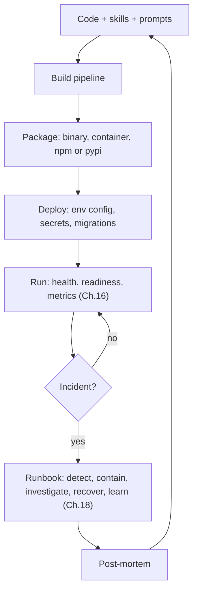
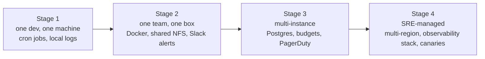

# Chapter 19 — Operations and forward-deployed agents

## TL;DR

发布一个 agent 只是运营它的开始。真实的部署要经受重启、密钥管理、队列、备份、模型废弃、成本暴涨,以及各种客户专属环境的考验。本章讲的就是让这一切变得可承受的运维纪律:打包与分发、跨环境的 config、deploy 时的 schema 迁移、graceful shutdown(优雅关闭)、runbook(操作手册)目录、为 agent 量身定制的 SLO、对 prompt 和 skill 改动的变更管理,以及 *forward-deployed*(前置部署)模式——让 operator(运维者)随系统一同交付,近到可以就地修复问题。读完本章,你应该清楚每一位 operator 在他们第一次凌晨三点被叫醒之前,都希望自己早已接好的那些东西。

---

## Why this matters

Agent 的 demo 跑在一个终端里、用一把 API key。真实的部署要服务许多用户,跨越多次重启,还要处理密钥、队列、日志、审批、预算和数据边界。运维设计决定了一个有用的原型能否熬过它与真实使用场景的第一次接触——也决定了团队能否在不每周焦头烂额的情况下持续迭代它。

它重要的另一个原因是:agent 运维与普通 web 服务的运维有着本质区别。模型是一个第三方依赖,它的行为会在几乎没有预警的情况下发生变化。成本可能随使用量非线性暴涨。*bug* 可能藏在某个 prompt、某个 skill、某个 tool、某份 config,或一次模型升级里——而修复往往是一次 markdown 编辑,而非一次代码 deploy。runbook 和 on-call(值班)的形态必须反映这一点。

---

## The concept

### The shape of operating an agent



把它读成一个闭环。代码变成 package;package 变成一次部署;部署运行起来并发出信号;incident 触发 runbook;post-mortem(事后复盘)再反馈回代码。每个方框都有一个章节负责——Ch.19 的职责是把它们串起来的那套 *运维纪律*。

### Packaging and distribution

一个严肃的 agent 会以下面三种形态之一交付:

- **单一二进制(single binary)** —— 用 Bun 构建(OpenCode)、可 pip 安装的 wheel(Hermes Agent)、用 npm 打包(OpenClaw)。安装占用最小;最容易交付给那些不跑 Docker 的 operator。
- **容器镜像(container image)** —— Hermes Agent、OpenClaw 和 Paperclip 都提供了带多阶段构建的 Dockerfile。这是服务端部署的合理默认选择;运行时可预期;更新方便。
- **桌面封装(desktop wrapper)** —— 围绕一个本地服务的 Electron、Tauri 或 SwiftUI 外壳。OpenCode 的桌面应用以及 OpenClaw 的 iOS/macOS 客户端是参考样本。适合面向终端用户的安装。

跨平台的重要性超出你的想象。Hermes Agent 提供了显式的 Windows 处理(MinGit 捆绑、UTF-8 补丁);OpenCode 支持 macOS、Linux 和 Windows。正确的打包方式取决于工作负载——单个静态链接的二进制非常适合 Go 和 Rust 写的 agent;对于需要把运行时一并带上的 Python 或 Node agent,容器通常是合理的默认;而桌面封装适合面向终端用户的安装。让 package 的形态匹配 operator 的环境,而不是去追求一个放之四海皆准的 *最快*。

更新机制——Sparkle(Mac 桌面)、`npm publish`、container registry 或 `pip`——应当与安装路径相匹配。把它们混着用会让 operator 困惑(*"我到底该 `apt upgrade` 还是 `pip install -U`?"*)。

### Configuration across environments

三层,按加载顺序:

```ts
type AppConfig = {
  environment:        "local" | "staging" | "production";
  databaseUrl:        string;
  queueUrl:           string;
  modelProfilesPath:  string;
  traceExporterUrl?:  string;
  secretsProvider:    "env" | "local_encrypted" | "cloud_secret_manager";
};

function loadConfig(env: Record<string, string>): AppConfig {
  // 1. 内置默认值。
  // 2. 基于文件:从已知路径读取 config.yaml 或 config.json。
  // 3. 环境变量覆盖。
  // 用 schema 校验;缺失必填字段时 fail-fast(Ch.11 bootstrap)。
  return ConfigSchema.parse({
    environment:       env.NODE_ENV ?? "local",
    databaseUrl:       env.DATABASE_URL,
    queueUrl:          env.QUEUE_URL,
    modelProfilesPath: env.MODEL_PROFILES_PATH ?? "./model-profiles.json",
    traceExporterUrl:  env.OTLP_ENDPOINT,
    secretsProvider:   env.SECRETS_PROVIDER ?? "env",
  });
}
```

这里的纪律是:每个必填字段都有 schema,validation 在启动时失败(Ch.11 的 bootstrap 顺序),并且 config 文件里绝不出现任何明文密钥——只有在运行时解析的 `$secret:` 引用(Ch.15)。Paperclip 的 `secret_access_events` 表记录了每一次解析,这样 operator 就能审计 *谁在什么时候读了什么*。

按环境的覆盖:把单独的 config 文件(`config.staging.yaml`、`config.prod.yaml`)纳入版本管理,再用环境变量去覆盖那些真正属于秘密的部分。覆盖链是 *默认值 → 文件 → 环境变量*,严格按此顺序,最后跑一遍 schema 校验。

### Schema migration on deploy

Ch.08 讲过数据纪律。在 deploy 时,有三件事必须按顺序发生:

- 运行待执行的迁移(幂等;在同一 revision 上可安全重跑)。
- 验证最终的 schema 与运行中代码的预期一致(这是一个启动时检查,而不是一个运行时假设)。
- 在 deploy *之前* 而非之后做快照。恢复一个快照很容易;在一次破坏性迁移之后再恢复就难了。

Drizzle 风格的工具(OpenCode、Paperclip)和 Alembic 风格的工具(Hermes Agent)最终都收敛到同一种模式:迁移文件带版本号、按顺序应用、记录在 `migrations` 表里、每个文件由一个原子事务把守。增量式(additive)迁移是安全的;破坏性的迁移要等到其最后一个消费者之后再发两个版本(Ch.15)。

### Graceful shutdown

一个信号(SIGTERM、SIGINT)把 worker 翻转进 drain(排空)模式——Ch.11 讲过生命周期,Ch.15 讲过多机版本:

```ts
class WorkerRuntime {
  private shuttingDown = false;

  async start() {
    onSignal(["SIGTERM", "SIGINT"], () => { this.shuttingDown = true; });

    while (!this.shuttingDown) {
      const job = await this.queue.claim({ timeoutMs: 5_000 });
      if (!job) continue;
      await this.runJobWithCheckpointing(job);
    }

    await this.flushPendingWrites();
    await this.releaseAllLeases();
    await this.closeConnections();
  }
}
```

来自生产环境的两条规则:graceful drain 要有一个截止期限(通常是几分钟);超过期限仍在运行的任何东西,都在状态机里标记为 `cancelled`(Ch.08),好让 reaper(回收器)干净利落地接手它。并且每次关闭都写下同一个结构化的 *"shutdown reason"*(关闭原因)事件,这样 post-mortem 就能回答 *进程是因为我们让它停才停的,还是它崩溃了?*

### Runbooks — the catalog

运营一个 agent 时使用最频繁的产物就是 runbook。下面是六类反复出现的 incident 及其 runbook 的形态:

| Incident | 首要检查项 | 可能的修复 | Rollback |
|---|---|---|---|
| Provider 触发 rate limit 或配额耗尽 | 按 tenant 划分的成本看板(Ch.16);credential 池状态(Ch.15) | 轮换 API key;切换到 fallback 模型(Ch.17);提高该 tenant 的 rate limit | 无——它是外部因素 |
| 宣布模型废弃 | Provider 发布说明;新模型上的 eval 套件结果 | 重新 pin 到具体版本;跑 eval gate;在 5% 流量上做 canary(Ch.17) | 在 config 里 pin 回上一个版本 |
| Tenant 成本暴涨(Ch.16 异常) | 按 tenant 的成本 trace;近期的 tool 直方图 | 按 tenant 的 rate limit 或模型降级(Ch.17);若持续则暂停新的 run | 恢复之前的限额;退还额度 |
| MCP server 宕机或被攻陷 | MCP 连接日志;reaper 状态 | 标记该 server 不可用;向用户提示;轮换 credential(Ch.13) | 在 config 里禁用该 MCP server |
| schema 迁移失败 | 迁移日志;数据库快照时间戳 | 回滚此次 deploy;从快照恢复(Ch.08) | 恢复 deploy 前的快照 |
| 怀疑发生 memory poisoning(记忆投毒) | trace 重放(Ch.16);审计日志(Ch.05);supersedes 链 | 回退受影响的 memory 条目(Ch.07);用更新后的威胁模式扫描(Ch.18) | 通过 `supersedes` 链把 memory 回滚 |

每一行都是 `RUNBOOK/` 目录(与代码相邻)里的一个 markdown 文件。每个文件都链接到能确认该症状的看板查询、能拉出受影响 run 的 trace 查询,以及用于 rollback 的精确命令。runbook 目录会成为 operator 在代码之外改动最频繁的文件。

### Forward-deployed engineering

agent 运维中最被低估、最少被讨论的一种模式是:*operator 随 agent 一同交付。* 与其让一个 SaaS 团队隔着距离运营服务,不如让一名工程师贴近客户、被嵌入到现场——为 runbook 编辑、skill 新增、成本暴涨以及系统日常形态而 on-call。Anthropic 和 Palantir 推广了这个术语;但这个模式比它们任何一家都更宽泛。

当 operator 是 forward-deployed 时,agent 的设计会发生哪些变化:

- **本地优先(local-first)的默认。** OpenCode、Hermes Agent 和 OpenClaw 都在 operator 的机器上运行一个单用户守护进程——没有云账户,没有外部状态。operator 可以从自己的文件系统里 resume、检查、回退。
- **runbook 与代码相邻,纳入版本管理。** `RUNBOOK.md`、`SOUL.md`、`AGENTS.md`——都是凌晨三点要看、第二天要改的东西。operator 的 repo *就是* 部署本身。
- **skill 和 memory 在磁盘上累积**(Ch.06、Ch.07)。随着 operator 使用,agent 会变得更聪明,无需外部知识库。当 operator 把系统交接给同事时,skill 目录就是交接产物。
- **配置就是 operator repo 里的一个文件**(或一个私有 gist),密钥放在操作系统 keychain 或一个加密的本地存储里。没有云配置 UI;没有需要保持同步的独立部署看板。
- **observability 是可配置的,而非默认假定的。** 敏感的部署会自托管 trace(Ch.16);离线模式会优雅降级。由 operator 决定什么东西离开这台机器。
- **operator 为行为 on-call,而非为基础设施。** 云上的 SRE 盯着 CPU 和内存。forward-deployed 的 operator 盯着 *agent 做了什么*——当 agent 卡住时编辑 skill,当某个 incident 反复出现时新增一条 runbook,当 API key 轮换时同步轮换 auth token。

这种模式适用于:客户更看重控制权而非便利性、数据不能离开客户边界、或者工作流足够定制化以至于一刀切的 SaaS 行不通的时候。大多数内部工具的部署都适合。许多企业部署也适合。多 tenant 的消费级应用通常不适合——Ch.15 里 Paperclip 那种控制平面(control-plane)的形态才是那里的正确模型。

### The agent-operator role

谁来看着 agent?他们需要哪些技能?这个角色无法干净地对应到 *SRE* 或 *开发者*。一份有用的岗位描述:

- **能流畅地读日志和 trace**(Ch.16)——解读 agent 尝试了什么、为什么停下来。
- **无需代码 deploy 就能编辑 prompt、skill 和 config**——agent 的行为大多是 *被配置出来的*,而非被编码出来的。
- **管理密钥和 API key**(Ch.15)——轮换、审计、吊销。
- **理解任务领域**——判断 agent 的工作是否正确,而不仅仅是它是否完成了。
- **监控成本并设定预算**(Ch.17)——防止失控的支出;与利益相关方重新协商限额。
- **分诊 incident**——收集复现步骤、附上 session JSONL、撰写 post-mortem。

这个角色更接近一名 *领域 SRE(domain SRE)* 而非传统 SRE。大多数团队要么从一位喜欢这个 agent 的资深工程师那里培养出这个角色,要么招一个本身就具备领域知识的人。最不奏效的拆分是:一个通用的 ops 团队盯着 CPU 看板,而另一个独立的 ML 团队盯着模型。两边都漏掉了 agent 实际 *做了什么*。

### Operational maturity progression

大多数 agent 部署会走过四个阶段,有时就在同一个团队内部完成:



阶段之间的迁移本身就是信号:

- *Stage 1 → 2:* 需要不止一个人来可靠地运营这套系统。是时候把它放进容器并加上 runbook 了。
- *Stage 2 → 3:* 需要不止一台机器(Ch.15 的部署拓扑谱系开始起作用)。Postgres 取代 SQLite;预算变成硬性 gate;告警路由到一个真正的 on-call 轮班。
- *Stage 3 → 4:* 该系统对业务是 mission-critical(关键任务级)的。多区域、observability 技术栈、canary deploy、专职 SRE 覆盖。

大多数 agent 部署在 Stage 1 或 2 上生存并茁壮成长。在工作负载尚不足以证明其必要性之前就硬推到 Stage 3,是一种常见的"工程自娱自乐"。

### Change management for agent behavior

prompt、skill 和 tool 的改动与代码的 deploy 方式不同:

- **prompt 改动** 会使 Anthropic 的前缀 cache 失效(Ch.04)。成本影响的估算应当成为变更评审的一部分。
- **skill 新增** 通常是免费的——模型会在下一次 session 里通过索引模式发现它们(Ch.06)。可以零停机推送。
- **tool 改动** 可能与进行中的 session 不兼容(较旧的 run 期望旧的 schema)。要么归档进行中的 session,要么在一个过渡窗口期内同时支持两套 schema(Ch.08 的增量迁移规则)。
- **模型升级** 在晋升前需要一个 eval gate(Ch.16)——把近期生产 run 的廉价 trace 在新模型上重放,以旧模型的结果为基准打分。
- **rollback 纪律。** 每一次改动都应当无需 deploy 即可逆:prompt、skill 和 tool 都应当放在 repo 里(或放在一个带版本的 config 里),这样 `git revert` 就能把 agent 退回它原来的样子。

### Model lifecycle

你 agent 底下的那个模型,是一个按厂商节奏而非你的节奏老化的第三方依赖。这里的纪律是:

- **Pin 住版本。** 在 config 里引用具体的模型快照——带日期后缀的或锁定版本的 ID——而不是那个未 pin 的别名。一个会悄悄路由到新快照的别名,与 Docker 镜像上的 `latest` 是同一类 bug:一次你并没有部署的行为变化。"行为在几乎没有预警的情况下发生变化"对别名而言是成立的;但它不应对你的生产 config 成立。
- **跟踪废弃日历。** Provider 会发布废弃时间表。一个无人监控的废弃,会在端点返回 final-call 错误的那一刻变成凌晨三点的故障。一个每周任务,把 provider 的模型列表与你的 config 做 diff,并对那些计划在六十天内废弃的条目发出告警——这只要几行代码,却是 agent 运维里最便宜的胜利之一。
- **让模型改动经过 eval 把守。** 一次模型版本号的提升是一个 deploy 事件,而非一次 config 编辑。在候选快照上跑 eval 套件(Ch.16),与当前快照对比,以无重大回归为前提把守 rollout。本章前面那一行模型废弃的 runbook 是这套纪律的一半;eval gate 是另一半。
- **先 canary,再全量。** 先把新模型 rollout 给一小部分流量——按 tenant、按 agent profile、或随机抽样——并盯着 Ch.16 的指标目录。无回归则晋升;一旦有任何指标移动就 rollback。

把模型当作任何其他有发布周期的依赖来对待:pin 住、监控、把守、canary。

### SLOs and error budgets for agents

对 agent SLO 真正重要的那些指标是 *agent 形态* 的,而非 *web 形态* 的。下面的数字是 *起步示例*,而非默认值——从你自己工作负载的基线测量里挑选目标(*目标 = 基线 + 改进*,而不是 *目标 = 教科书上的数字*):

| SLO | 它衡量什么 | 起步目标示例 |
|---|---|---|
| **任务成功率(Task success rate)** | 抵达最终答案的 run / 总 run 数 | 交互式工作负载上一个较高的稳态百分比;从基线数据设定你自己的值 |
| **任务完成耗时(Time-to-task-complete)** | p50 / p95 的轮次时长 | 取决于工作负载 |
| **每任务成本(Cost per task)** | 每个已完成任务的平均 token 花费 | 设定后按月复核 |
| **Cache 命中率** | cache 读取 / 总输入(Ch.04) | 取决于工作负载——Ch.04 有完整图景 |
| **审批漏斗完成率(Approval-funnel completion)** | 已批准 / 已请求(Ch.12) | 急剧下降意味着 agent 问得太频繁;健康的系统这一项趋于偏高 |
| **可用性(Availability)** | 已执行的心跳 / 计划的心跳(Ch.15) | 你的交互式用户对同类 SaaS 的任何期望 |

错误预算的运作方式与普通服务相同:为每季度的失败 run 设一个预算,由 incident 逐步消耗。当预算耗尽时,功能开发暂停,直到可靠性工作追上来。会把团队搞垮的形态是:在基础设施指标(CPU、RAM)上设 SLO,而对用户可见的指标(任务成功率)却无人监控。

### Feedback loops from production

信号通过五条路径回流到开发团队:

- **用户报告。** operator 把问题连同 session JSONL 一起捕获。最便宜、信噪比最高。
- **eval 套件偏离**(Ch.16)。持续 eval 会在生产 trace 偏离基线时标记出来。
- **成本趋势**(Ch.17)。成本账本会标记出花费正在攀升的那个 tenant 或那个模型。
- **trace 异常**(Ch.16)。新的错误模式、新的 tool 失败、新的 doom-loop(死循环)特征(Ch.02)。
- **skill 与 memory 洞察**(Ch.07)。curator(策展器)会浮现出值得提升为 skill 的序列,以及应当归档的 memory 条目。

这里的纪律是:每一条渠道都汇入开发团队按固定节奏评审的同一个队列——每周是一个有用的起点。从许多渠道分诊却不做聚合,正是 regression(回归问题)在众目睽睽下藏身的方式。

### The runbook format that gets read at 3 a.m.

奏效的 runbook,是那个有人在被叫醒时真的会去读的那一份。来自生产环境的五条规则:

- **Markdown,而非 PDF。** 与代码相邻地存在 agent 的 repo 里;可被 grep;在 operator 的编辑器里渲染。
- **决策树,而非段落。** *"若症状 X,检查 Y;若问题在 Y,修复 Z。"*
- **可复制粘贴的命令。** runbook 应当让一个精疲力竭的 operator 去粘贴,而非去阅读。
- **链接,而非复述。** 链接到看板查询、trace 查询、rollback 脚本。不要复述那些会过时的上下文。
- **无指责(blameless)的语气。** *"rate limit 是设计的一部分,不是一场危机。"* runbook 也是新 operator 学习系统失败模式的方式。

一个有用的测试:在工作时间把 runbook 交给一个新团队成员,让他们去解决一个模拟的 incident。任何让他们困惑的地方,就是凌晨三点会让 on-call 困惑的地方。

一个符合这些规则的具体模板:

```markdown
# Runbook: <症状形态的简短标题>

**Severity:** P0 / P1 / P2 —— 什么样的用户影响才值得把人叫醒。

**Detection:** 把你叫醒的那个告警或看板面板。附上确切的
查询语句,这样你一键就能验证症状。

**First checks:** 三到五个带可复制粘贴命令或看板链接的
具体步骤。决策树,而非段落。

**Likely fixes:** 两三个最常见的成因以及各自的修复方法。
*"试过了;还是坏的"* 则回到 first checks。

**Rollback:** 当上面的修复不奏效时,把系统退回最近一个已知
良好状态的明确命令或 PR。

**Comms:** 谁被告知什么、在哪个 channel、按什么时钟。包括
内部(工程、on-call)以及——对用户可见的 incident——面向
客户的状态更新。隐私类 incident 还有额外的时钟(监管机构
通知、受影响用户通知);针对这些的 runbook 要明确写出
截止期限,这样 on-call 就不必在 incident 进行中临时推导。
触发它们的威胁模型见 Ch.18。

**Post-mortem trigger:** 一个阈值,超过它,这个 incident 就要
撰写一份书面 post-mortem,而不仅仅是执行一次 runbook。
```

这七个字段是每个 runbook 都应当回答的;模板足够短,让一个精疲力竭的 operator 可以一坐下来就为一类新 incident 填好它。纪律不在于这个模板——而在于 *拥有一个并且每次都用它*。前后不一致的 runbook 比没有 runbook 更糟:on-call 会学会不信任它们,然后干脆不读了。

---

## Real-system notes

- **Paperclip** 是最偏运维的参考系统:带定时 `pg_dump` 的 Postgres、带 `secret_access_events` 审计的加密密钥、plugin worker 隔离、adapter 级的 config 与预算、兼作审计轨迹的 run 日志,以及一个用于 run 检查的控制平面 UI。读它是为了搞清 *一个运维级的 agent 服务到底长什么样*。
- **OpenCode** 展示了本地优先的分发:内嵌 server、桌面封装、TUI,以及启动时的 Drizzle 迁移。是 forward-deployed 单用户形态的有力参考。
- **Hermes Agent** 是无人值守运营的参考:cron 触发的工作、消息 channel 触发、一个可带可选 extras(gateway、MCP、web)安装的 Python wheel,以及显式的 Windows 处理。
- **OpenClaw** 是自托管 channel 运营的参考:plugin 与 config 管理、可在不重启的情况下启用或禁用的按 channel adapter,以及一个 operator 可以在单台 VPS 上运行的个人助理 gateway 模式。

---

## Common failure cases

*这些失败是持久的;它们的修复方式演变得最快——每条只点明模式,把当下的具体细节留给你和你的 AI 伙伴。*

- **一个 prompt 修复却需要一次完整的代码 deploy。** 你知道要改的那一句话,但它和代码走同一条流水线,于是一个十五字符的修复要等上同样的四十五分钟。*修复:开一条独立的、快速的行为发布通道(prompt、skill、config 放在一个带版本的存储里),拥有与代码相同的来源溯源(provenance)和一条命令即可 revert——绝不在机器上手改。*
- **模型别名悄悄路由到了一个新快照。** 没人部署过,但行为变了、成功率掉了,因为 config 指向了一个被厂商重新指向的、未 pin 的别名。*修复:pin 住带日期的快照 ID,再加上一个每周漂移检查,断言每个别名仍解析到你预期的位置,并对临近的废弃发出告警。*
- **runbook 在你需要它的那一刻已经过时。** 你在 incident 进行中粘贴它的命令,结果报错——参数变了、看板挪了、脚本被删了。*修复:把 runbook 当作可测试的产物——自动化的链接与命令检查、定期的 game day,以及一个 last-verified(最后验证)时间戳。*
- **成本悄悄翻倍,你却是从账单上才知道的。** 花费连续几周攀升,却没有哪一天看起来吓人。*修复:对变化率和按 tenant 的占比告警,而不仅是绝对总额,并把预算作为一个硬性 gate(Ch.17)。*
- **一次 deploy 杀掉了进行中的工作。** 一次例行发布硬杀了那些长时间运行的任务,它们或消失、或从零重启、或把一个副作用触发了两次。*修复:把 drain 截止期限设到 p99 的任务时长,并在步骤边界上强制幂等,这样 resume 重放出来的就是一次空操作(Ch.08)。*

---

## Pair with your agent

- *"盘点我 agent 的每一个运维面:打包、config、密钥、deploy、迁移、shutdown、runbook、SLO、反馈回路。对每一项,标出我已经有的、缺失的,并为每个缺口提出最小的第一步。"*
- *"把本章的 runbook 目录写成 `RUNBOOK/` 里的 markdown 文件。每个文件:症状、首要检查项、可能的修复、rollback。链接到我 OTLP 后端里实际的看板或 trace 查询。"*
- *"建立变更管理纪律:每一次 prompt、skill 或 tool 改动都要经过一次评审,其中包含一个 eval-gate 检查(Ch.16)和一个成本影响估算(Ch.17)。给我看 PR 模板。"*
- *"为我的 agent 定义 SLO:任务成功率、任务完成耗时、每任务成本、cache 命中率。用我上个月的生产数据来设定目标。把每一项都接入一个告警,当某个 SLO 有在本季度被违反的风险时发出寻呼。"*
- *"针对 forward-deployed 模式审计我的部署:skill 和 memory 是否在 operator 的机器上?config 是否在他们的 repo 里?密钥是否在 keychain 而非 config 文件里?如果这个模式对我的工作负载有意义,提出最小的改动来契合它。"*
- *"带我走一遍四阶段的运维成熟度演进。指出我当前所处的阶段,以及接下来要做的 *最有用的那一次* 迁移。"*
- *"搭一个反馈回路聚合器:用户报告、eval 偏离、成本暴涨、trace 异常,以及 skill-curator 的建议,全部路由进一个每周评审队列。给我看上周的队列作为样本。"*
- *"压测我的 graceful shutdown:在一次进行中的 run 期间发出 SIGTERM,此时有两个待执行的 tool call 和一次部分写出的 outbox。验证下一个实例能通过 Ch.08 的 reaper 干净地接手,而不重复触发那个副作用。"*

---

## What's next

现在你已经能让一个 agent 在生产环境里长期运行、用有据可循的动作从 incident 中恢复,并把信号反馈回 agent 的行为。Ch.20 探讨一个紧密相关的角度:*agent 自主采取行动*。proactive agents(主动型 agent)——cron 调度的工作、事件驱动的唤醒、watchdog、后台 curation——改变了失败模式的集合,并带来它们自己的一套设计纪律(opt-in 语义、升级阶梯、*无人在看* 时的规则)。Ch.21 接着讲 *agent 在两次 run 之间改进自己的行为*——自演化的 memory、skill、prompt 和权重。Ch.22 用一张设计画布为本课程收尾,帮你判断你自己的项目到底需要什么形态的 agent。

---

<!-- nav-footer -->
<div align="center">

[⬅️ 上一章：Ch.18 Safety & adversarial inputs](18-safety-adversarial-inputs.md) · [📖 课程目录](../../README_zh.md) · [下一章：Ch.20 Proactive agents ➡️](20-proactive-agents.md)

</div>
