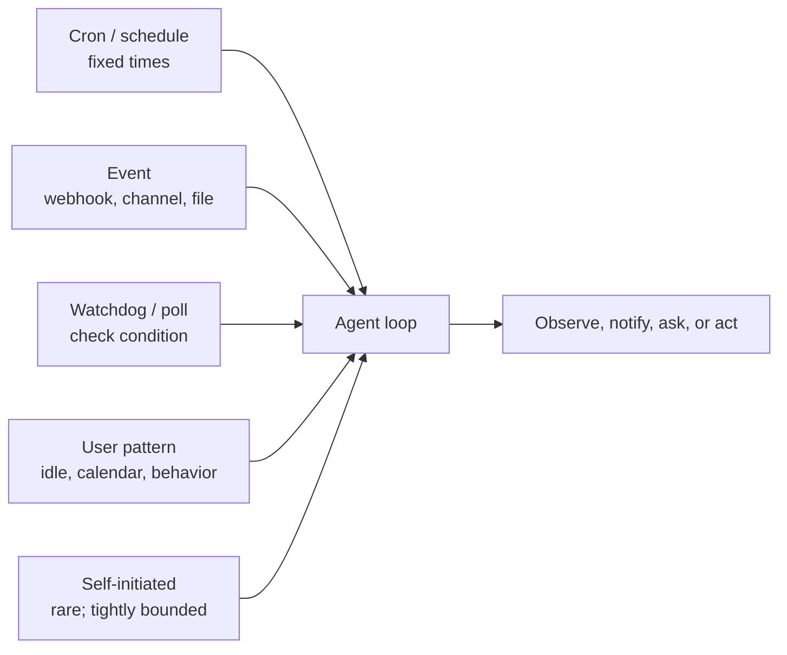
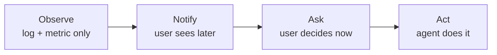

# Chapter 20 — Proactive agents

## TL;DR

本课程的大部分内容都假定一种 reactive(被动响应)的形态:用户消息到来,agent loop 运行,然后把响应返回。Proactive agent(主动型 agent)则会在*没有任何用户发起请求时*主动做事——定时的 cron 任务、事件驱动的唤醒、对外部状态变化做出反应的 watchdog(看门狗)、后台 curation(梳理/养护),以及偶尔出现的自发任务。这里的运作机制大多在前面的章节里已经见过(Ch.08 的 run 状态机、Ch.13 的 channel adapter、Ch.15 的 heartbeat 调度器),但其中的设计纪律是真正全新的:何时该打断、何时该排队、何时该汇总成摘要;如何设计 opt-in(主动选择加入)语义,让 proactivity 帮上忙而不是惹人烦;从 notify 到 ask 再到 act 的升级阶梯;那些专属于"无人看管时所做工作"的失败模式;以及一条铁律——proactivity 是用户*按类别*授予的一种权限,而绝不是默认开启的。

---

## Why this matters

一个 reactive agent 最糟糕的失败是给出错误答案。一个 proactive agent 最糟糕的失败则是以下三者之一:一次*错误的行动*却无人在场制止;一场*成本飙升*却无人盯着;或者一波*通知洪流*把用户训练成对 agent 发来的一切都视而不见。每一种都是同步请求-响应系统中不会出现的事故类别;每一种也都是——如果你在没有掌握本章纪律的情况下就上线 proactive 功能——可以预见的失败模式。

它之所以重要还有另一个原因:proactive 功能正是"用户想起来才会打开的工具"与"已经融入用户工作方式的 agent"之间的分水岭。每天早上 9 点的简报、在部署失败时发出告警的 watchdog、把本周 PR 汇总成摘要的 cron 任务——这些时刻正是一个 agent 赢得自己一席之地的关键。做得好,它们会持续累积用户的信任;做得差,一周之内就把信任挥霍殆尽。

---

## The concept

### Reactive vs proactive — when each fits

大多数 agent 一开始是 reactive 的,并且一直保持 reactive。只有在满足下列条件之一时,才去增加 proactive 形态:

- 用户有一种**反复出现的需求**,而每次都不需要他们亲自关注——每日报告、每周摘要、定期健康检查。
- 世界上的某些东西**发生了变化**,而用户需要在几分钟内、而非几小时内知晓——部署失败了、某个指标越过了阈值、有一封来自被关注发件人的邮件到了。
- 这项工作本身最好在用户*不在场*时完成——后台 curation、eval 运行、空闲时段的训练(Ch.21 会接着讲这个)。

如果这些条件一个都不满足,就不要增加 proactive 形态。*Proactivity 是一项功能;空转运行则是一笔成本。*

### The trigger taxonomy

五种 trigger 类型几乎涵盖了生产环境中所有的 proactive 工作:



- **Cron / schedule(定时调度)。** 固定时间——每个工作日早上 9 点、每个整点。最简单、最可预测;适合常规的周期性任务。
- **Event-driven(事件驱动)。** 一个 webhook 被触发(Ch.13)、一条 channel 消息到达、一个文件发生变化、一个日历事件触发。响应最及时;因为它对世界而非时钟做出反应,所以显得"聪明"。
- **Watchdog / polling(看门狗 / 轮询)。** agent 周期性地检查某个条件(一个价格、一个队列深度、一个状态页),只有在条件满足时才行动。当源系统不发出事件时很有用。
- **User-pattern triggered(用户模式触发)。** agent 注意到某种行为模式——用户正空闲、日历有空档、已经 N 小时没回复——然后主动提供帮助。最难做对;也最容易惹人烦。
- **Self-initiated(自发)。** 罕见。agent 在没有 trigger 的情况下自行判断某件事值得做。仅保留给边界严格、风险很低的行动(Ch.07 里的后台 curator 就是一例)。

大多数真实系统会组合使用两种或更多。*Cron + event* 是最常见的搭配:一个定时检查某事的 cron 任务,再加上在特定事件发生时触发的 event handler。

### Cron — the workhorse

区分"能用的 cron"与"坏掉的 cron",关键在三件事:

- **持久化的 job 定义。** Hermes Agent 把 cron 任务存在 `~/.hermes/cron/jobs.json` 里,调度器在每个 tick 时读取这个文件。Paperclip 把 routine 存在 Postgres 的 `routines` 表里,可在重启后存活。OpenClaw 则把它们放在 config 中。这个存储必须能在进程重启后存活——否则当你重新部署时,就会丢失已排定的工作。
- **错过触发(missed-fire)策略。** 当一个 job 的计划触发时间在进程宕机期间已经过去时,该怎么办?三个选项——*恢复后触发一次*(现在就跑)、*跳过*(当作已经跑过)、*为每个错过的实例各触发一次*(按每个错过的窗口各跑一次来补齐)。要明确地选定其中一个;很多 cron 库的默认行为是由实现定义的,而且令人困惑。
- **Idempotency(幂等性)。** 一个在执行到一半崩溃后重新触发的 cron 任务,不应把自己的工作做两遍。使用由 cron 表达式加上计划时间派生出的 run key;在执行前据此去重。Ch.08 的 outbox 模式在这里原封不动地适用。

```ts
// Cron job shape that survives restarts and avoids double-fire.
type CronJob = {
  id:           string;
  agent:        string;          // which agent profile runs the job
  schedule:     string;          // cron expression
  missedFire:   "skip" | "once_on_recovery" | "fire_each";
  payload:      unknown;         // what the agent should do
  enabled:      boolean;
  createdAt:    string;          // anchor for the first scheduled window
  lastFiredAt?: string;
  ownerUserId:  string;          // for tenant scoping and audit (Ch.05, Ch.15)
};

function runKey(job: CronJob, scheduledFor: Date): string {
  return sha256(`${job.id}:${scheduledFor.toISOString()}`).slice(0, 32);
}

async function maybeFireCron(job: CronJob, now: Date, ctx: SchedulerCtx) {
  // Anchor next from the last fired window or — for a never-fired job —
  // from createdAt. Computing from `now` here would silently skip every
  // window that should have fired between creation and now, which is
  // wrong for any missed-fire policy except "skip".
  const anchor = job.lastFiredAt ?? job.createdAt;
  const next   = nextScheduledTime(job.schedule, anchor);
  if (next > now) return;

  const key = runKey(job, next);

  // Atomic claim: the dedup record, the queue insert, and the lastFiredAt
  // update commit in one transaction. Without atomicity, a crash between
  // enqueue and record re-fires the job on recovery — double execution
  // of a side effect that may not be safe to repeat (Ch.08's outbox
  // pattern is the same shape, generalised).
  await ctx.db.transaction(async (tx) => {
    const claimed = await tx.dedup.tryClaim(key);   // false if key already seen
    if (!claimed) return;
    await tx.runs.enqueue({ agent: job.agent, payload: job.payload, runKey: key });
    await tx.cron.markFired(job.id, next);
  });
}
```

anchor 与 missed-fire 策略相互作用:`fire_each` 从 `createdAt` 起向前推进,为每个错过的窗口各认领一个 key;`once_on_recovery` 无论过去了多少个窗口都恰好认领一个;`skip` 则把 `lastFiredAt` 推进到最近的过去窗口而不触发。Per-tenant(按租户)隔离在这里同样重要:租户 A 的 cron 任务针对租户 A 的数据运行,计入租户 A 的预算(Ch.15),记入租户 A 的审计日志(Ch.05)。一个租户失控的 cron 绝不应阻塞另一个租户。

### Event-driven wakeups

Event trigger 依托于 Ch.13 的 connector 层。三种形态:

- **Webhook triggers。** 当事件发生时,平台会发起一个 HTTP 回调——一条 Slack 消息、一个 Stripe 事件、一次 GitHub push。Ch.13 的 webhook handler(HMAC + 去重 + 先回 202 再入队)把事件交给 agent loop。agent 把它当作一个 `ChannelEvent` 来处理——形态与用户消息相同,语义不同。
- **Channel-event subscriptions。** Discord WebSocket、Slack events API、IMAP push 通知。channel adapter 持有一条打开的连接,并在事件到达时将其入队。
- **File-system 或 storage watcher。** `inotify`、S3 bucket 通知、云存储 trigger。当文件被创建或修改时,watcher 触发;agent 检视后决定是否行动。

贯穿这三种形态的纪律是:事件走的是与用户消息相同的队列(Ch.15),这样 agent 的 loop、observability 和预算约束就能统一地工作。*一个事件,不过是用户没有打字发出的一条消息。*

### Watchdog and polling

当源系统不发出事件时,agent 就进行轮询。三条规则:

- **让节奏匹配波动性。** 一个每秒轮询一次的价格监视器是浪费;一个每小时轮询一次的部署状态轮询器又太慢。选一个既匹配源系统的变化速率、又匹配消费方 latency 预算的节奏。
- **稳定时退避。** 当被监视的值已经有一阵子没变化时,拉长轮询间隔;一旦它变化,就退回到基准节奏。这能让源系统免受不必要的负载。
- **把这次监视本身作为一项 metric 暴露出来。** Ch.16 的 observability 模式在此适用——轮询器每次检查发出一个 span,*值已变化*记一个 counter,轮询 latency 记一个 histogram。一个静默的轮询器是一个你无法信任的轮询器。

Paperclip 的 `scanSilentActiveRuns`(Ch.15)是把 watchdog 应用到 agent *自身*——检查那些超过阈值仍无任何输出的 run 并予以升级。同样的模式应用到外部:agent 监视一个系统,在某些东西漂移时升级。

### Opt-in semantics — proactivity is a permission

最重要的一条规则:*proactivity 是用户按类别授予的一种权限,而不是默认开启的。* 用户不应该需要去把他们的 agent 静音;而应该是他们要主动 opt into(选择加入)被打断这件事。

```ts
// A coarse-grained permission record. Per category, not per message.
type ProactivePermission = {
  category:       string;        // "daily_brief", "deploy_alerts", "weekly_summary"
  enabled:        boolean;
  channel:        "inline" | "email" | "slack" | "push";
  frequencyCap?:  { count: number; per: "hour" | "day" | "week" };
  quietHours?:    { start: string; end: string; timezone: string };
  snoozeUntil?:   string;
};

// Before sending a proactive notification, check all gates.
async function shouldNotify(
  user: User,
  category: string,
  now: Date,
  ctx: ProactiveCtx,
): Promise<boolean> {
  const perm = await ctx.permissions.get(user.id, category);
  if (!perm?.enabled)                                           return false;
  if (perm.snoozeUntil && now < new Date(perm.snoozeUntil))    return false;
  if (perm.quietHours && isInQuietHours(now, perm.quietHours)) return false;
  if (perm.frequencyCap) {
    const sent = await ctx.notifyLog.countRecent(
      user.id, category, perm.frequencyCap.per,
    );
    if (sent >= perm.frequencyCap.count) return false;
  }
  return true;
}
```

类别是粗粒度的,而非逐条消息——用户对*部署告警*只 opt in 一次,而不是对每一次部署都选择一遍。Channel 是按类别设定的——紧急的走 inline,汇总的走 email。Frequency cap 和 quiet hours 即便在一个已启用的类别内,也能防止 agent 违反那些隐含的预期。

实话实说:每一项 proactive 功能上线时都*默认禁用*,而 agent 对该功能要做的第一件事,就是询问用户是否想要它。*意外是信任的敌人。*

### Timing intelligence — interrupt, queue, or digest

对每一个 proactive 事件,有三种时机选择:

| Mode | When to use | Cost | Example |
|---|---|---|---|
| **Interrupt now(立即打断)** | 高紧急度、有时间窗口价值 | 占用用户注意力 | 生产部署失败 |
| **Queue for next session(排到下次会话)** | 不久后有用但不紧急 | 一点点认知积压 | 周一要 review 的新 PR |
| **Digest(汇总摘要)** | 聚合起来有用,单条价值低 | 每条几乎无成本 | 每日邮件摘要 |

大多数 proactive 功能的默认选择应当是 *digest*。只有对那些用户明确告诉过你"值得打断"的事情,才使用 interrupt。即便在一次会话内,也要把相关的通知批处理——五条 PR 评论一起送达,远比五次独立的提醒更不打扰。

MetaClaw 的 idle-window 调度器(Ch.21 那一章讲自我进化时会更深入)就是把 timing intelligence 应用到训练上:繁重的工作在睡眠时段、键盘空闲、日历空档时运行。同样的原则适用于任何 proactive 工作——*在用户没有把注意力放在任何别的事情上时再去做它。*

### The escalation ladder

对于任何一类 proactive 行动,agent 有四级阶梯可供选择:



- **Observe(观察)。** 仅仅记录事件。没有任何面向用户的呈现。用于构建那些为后续阶梯提供依据的数据集。
- **Notify(通知)。** 在摘要或低优先级 channel 中呈现。用户看得到;但没有任何东西代表他们行动。
- **Ask(询问)。** 以一个主动的 prompt 形式呈现。由用户决定是否行动;agent 的职责是让这个决定变得容易。
- **Act(行动)。** agent 直接采取行动。仅当用户此前已对该类别 opt into 了自主行动、该行动可逆、且审计日志会记录它(Ch.05)时,这才是合法的。

一条有用的规则:*从 observe 起步,逐级挣得向上攀登的权利。* 一项新的 proactive 功能上线时只做 observe,直到你掌握了证明用户想要下一级的数据。然后才 notify。然后才 ask。然后——只有在明确 opt-in 且具备回滚纪律的前提下——才 act。

### Notification design and the flood problem

proactive agent 最可预见的失败就是通知洪流。三道防线:

- **按类别设 frequency cap。** 一小时五次 Slack 提醒令人厌烦;一次则受欢迎。设上限,其余的排队汇入摘要。
- **自适应节奏。** 当用户连续忽略 N 条通知时,放慢节奏。明确询问是否要继续启用这个类别。
- **把 snooze 和 mute 作为一等公民的操作。** 每条通知都附带一个*稍后再静默此项*的控制。用户选择 snooze 本身就是信息——把它记录下来,并让它影响节奏。

成熟通知系统(Slack、GitHub、Linear)中普遍的模式是:用户每次不响应,该通知此后获得的注意力就更少。一个能从"不响应"中学习的 proactive agent,是用户会留下的;一个不会学习的,则会被静音并遗忘。

### Permission and approval for unattended work

Ch.12 的 approval gate 假定有用户在场点击确认。proactive 工作打破了这个假设。三种策略:

- **Pre-approved categories(预先批准的类别)。** 任何用户已明确启用的项(上面提到的 opt-in)在每次执行时都不需要进一步审批——*前提是*该行动有界、非破坏性、且可逆。类别级别的*同意*绝不会让破坏性行动(删除、发送、扣费、部署)绕过 Ch.12 的 approval gate;即便在一个预先批准的类别内,这些行动仍然需要逐次审批。剩余那份始终需要升级的清单,见下文 *What NOT to make proactive*。
- **Async approval(异步审批)。** agent 提出行动方案,通过一个允许延迟响应的 channel(Slack、email、移动推送)将其呈现,在获得批准前不行动。这是有界的——若在 N 小时内无响应,默认*不行动*并记录这次超时。
- **Default-deny(默认拒绝)。** 任何既不在预先批准类别中、又没有经过询问并得到回答的事,都不运行。没有例外。

要避免的陷阱是*隐含同意*——*"用户已经忽略我的 proactive 邮件一周了,那就说明没问题"*。并非如此。没有反对不等于批准。如果一个类别没有在创造价值,就把这一点呈现给用户,并询问是否要禁用它。

### The "no user is watching" failure modes

三类专属于 proactive 工作的失败:

- **Silent errors(静默错误)。** 一个 cron 任务已经失败了两周;没人注意到,因为没人会手动去跑它。防御:每一次 proactive run 都发出一个 span(Ch.16),并在连续失败时告警。
- **Cost spirals(成本失控)。** 一个 watchdog 每 30 秒轮询一次,持续了一年;在账单到来之前没人看到这笔钱。防御:per-tenant 预算 gate(Ch.15)对 proactive run 的约束,与对交互式 run *完全一样*。在成本 dashboard 上把趋势暴露出来(Ch.16)。
- **Runaway loops(失控的循环)。** 一个自发的 agent 生成 subagent,而后者又生成 subagent。Ch.10 的递归上限和 Ch.02 的步数上限在此适用,但对 proactive 工作,这些限制应当比交互式*更紧*——因为没有用户在场打断它。

一个有用的生产细节:每一次 proactive run 都在其 trace 上带一个 tag(`triggered_by: cron | event | watchdog | pattern | self`)。Dashboard 按 trigger 类型拆分。当出现问题时,你就知道这是用户发起的还是系统自己发起的。

### What NOT to make proactive

反向清单,按风险类别划分:

- **破坏性行动。** 任何会删除、发送、扣费、部署的操作。始终要求逐次获得明确的用户决定,即便在一个预先批准的类别内。
- **跨租户操作。** 租户 A 的 proactive run 绝不应触碰租户 B 的数据。Ch.06 的 namespace 规则不可妥协。
- **不可逆的 side effect。** 如果你无法回滚它,就不要让 agent 自行去做。
- **任何用户没有先看过的东西。** 如果一个类别从未向用户演示过、用户也从未明确地说过*好的,请让它自行运行*,那它就不应自行运行。

一条有用的规则:*如果某个行动会让一个理性的用户在看到结果时说出"等等,这是什么?",那它就不该被 proactive 地执行。*

---

## Real-system notes

- **Hermes Agent** 是文件支撑的 cron 与后台 curator 模式最强的参考:`~/.hermes/cron/jobs.json` 配上一个带文件锁的 tick 调度器,`spawn_background_review_thread` 负责回合结束后的 proactive curation,`maybe_run_curator` 负责空闲时段的 skill 生命周期管理。cron 任务在执行前会被扫描有无 prompt-injection 模式——proactive run 拿到的安全 gate 比交互式更紧(Ch.18)。
- **Paperclip** 是 orchestration 级别 proactive 调度的参考:heartbeat 调度器每 30 秒 tick 一次,`routineService.tickScheduledTriggers` 触发到期的基于 cron 的 routine,`scanSilentActiveRuns` watchdog 检测卡住的 agent,重试延迟从 2 分钟逐级升到 2 小时。Per-company 的预算 gate 对所有 run 生效,与 trigger 类型无关。
- **OpenClaw** 是 channel-event 驱动 proactive 工作的参考:channel 插件持有各自的订阅(Discord WebSocket、Slack events、Telegram polling),事件走的是与用户消息相同的 gateway。cron 任务默认以完整的 tool 访问权限运行——作为反面教材很有用,提醒我们在 proactive run 需要更紧的信任边界时*不该*怎么做。
- **OpenCode** 大体上是 reactive 的(由用户发起的编码会话),但它的 session-event SSE 流和 snapshot 系统,对于研究"如何把 proactive 活动呈现给一个已连接的 UI"很有学习价值。

---

## Common failure cases

*这些失败是持久的;它们的修复方式演进得最快——每条都点出模式,把当下的具体做法留给你和你的 AI 伙伴。*

- **agent 把用户训练成无视它。** proactive 提醒的频率一路上涨,直到用户把这个 channel 静音,从而错过那条真正重要的。*修复:在投递面而非类别上对打断设上限,并把低参与度的类别自动降级为 digest。*
- **cron 任务停止触发,却没人注意到。** 一个计划运行的任务悄无声息地不再发生,而"没有输出"这件事没有触发任何错误告警。*修复:对预期运行做 dead-man's-switch(死手开关)式的存活监控——对"缺失的事件"告警,而不只是对失败告警。*
- **同一条通知触发了两次(或同一个 job 跑了两次)。** 重试、副本,或"做完工作后才崩溃"导致系统重跑了一个它已经跑过的 job,有时还会重复一个真实世界中的动作。*修复:一个原子的、跨进程的去重认领,加上一个幂等的下游 side effect(Ch.08、Ch.03)。*
- **一个 watchdog 默默地向你计费一整年。** 一个轮询器永远以基准节奏运行,持续地流失成本,在发票到来之前没人把它归因到任何地方。*修复:让 proactive 工作运行在与交互式工作相同的 per-tenant 预算 gate 之下(Ch.15),并在成本账本中带上 trigger 类型归因(Ch.16)。*
- **agent 在无人看管下做了某件人类本会制止的事。** 一个预先批准的类别在过期数据或已变化的世界上自主行动,而没有人盯着去拦下它。*修复:在预先批准的类别内部仍让 approval gate 保持有效(Ch.12),把破坏性或不可逆的实例升级为异步审批,并带一个默认拒绝的超时。*

---

## What's next

你现在已经有了一套 proactive 设计的框架——trigger 分类法、opt-in 纪律、escalation ladder、timing 模式,以及那些专属于"无人看管时所做工作"的失败模式。Ch.21 会从一个相关的角度接着讲:与其讨论*agent 自行采取行动*,不如问问——如果*agent 自行改进自己*会怎样?Self-evolving agent(自我进化的 agent)——记忆固化、skill 学习、prompt 精炼、LoRA 个性化——是 proactive 调度天然的补充,它们有着同样的 gating 纪律,也同样需要 Ch.07 里的那些回滚路径。

---

<!-- nav-footer -->
<div align="center">

[⬅️ 上一章：Ch.19 Ops & forward-deployed](19-ops-and-forward-deployed.md) · [📖 课程目录](../../README_zh.md) · [下一章：Ch.21 Self-evolving agents ➡️](21-self-evolving-agents.md)

</div>
