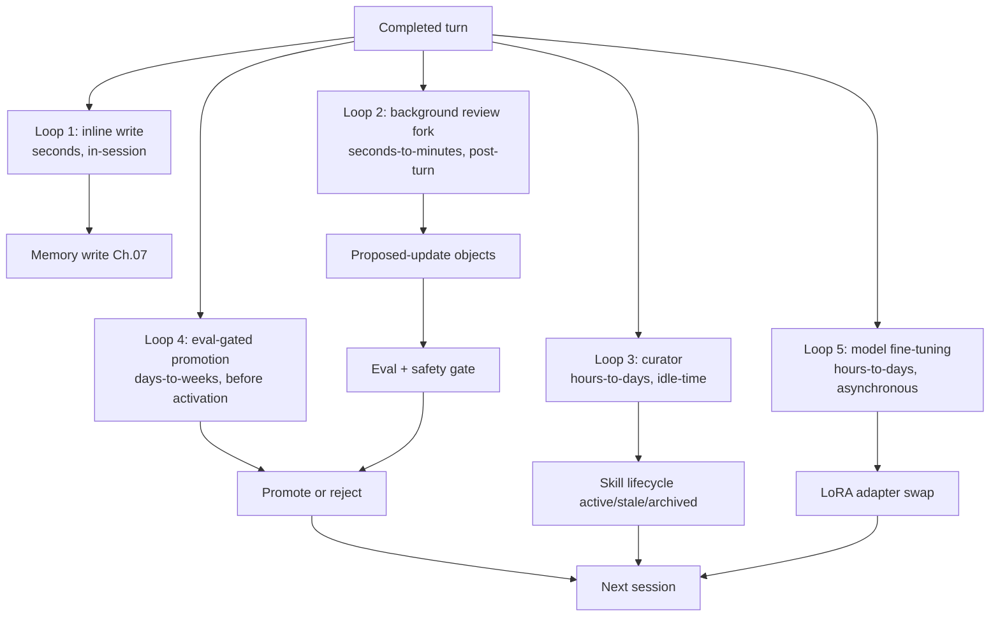
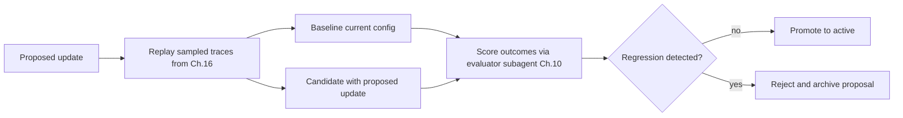
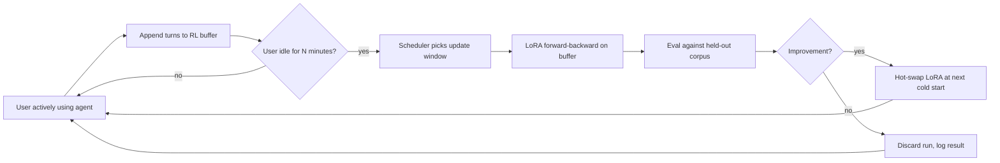

# Chapter 21 — Self-evolving agents

## TL;DR

一个 self-evolving agent 会在两次运行之间更新自己的 memory、skill、prompt、tool description，甚至是 model weights（模型权重）——把昨天的经验变成明天的能力。做得好，agent 会稳步变得更敏锐，而不需要人类对每一处改动都参与其中；做得差，它就会发生漂移、毒化自己的 memory，或者悄无声息地改写自己的安全控制。让这件事变得安全的纪律，完全由前面章节构建起来的模式组成：用 proposed-update（提议更新）对象而非直接写入、由一个 evaluator subagent 审阅提议、supersedes-chain（替代链）回滚、eval-gated promotion（以 eval 为闸门的提升），以及在*什么被允许演化*和*什么必须留在人类变更控制之下*之间划出一条严格的界线。本章涵盖完整的 loop、近期的研究面（MetaClaw、Tinker、agentskills.io 联邦化 hub，以及基于 LoRA 的个性化），以及那些防止演化退化为突变的规则。

---

## Why this matters

一个从不学习的 agent 会重复自己的错误——在每个 session 里重新发现相同的项目约定、重新在相同的 tool call 上失败、重新跑相同的搜索。一个没有护栏就自我更新的 agent 更糟：它会毒化自己的 memory、削弱自己的 tool、从单次糟糕的回合里学到错误的教训，或者悄悄积累一堆彼此冲突的 skill。

目标是*受控的适应，而非自主的突变。* Hermes Agent 的 background review fork（后台审阅分叉）是受控版本最清晰的生产级参考——下文的 Loop 1–3，今天就已经在用。MetaClaw（2025 年的一个框架，用持续的 LoRA fine-tuning 和 skill 演化把个人 agent 包裹起来）是更激进版本最早的参考之一——下文的 Loop 5，处于研究级，仅在少数系统里落地。两者都有效——而它们之所以有效，是因为每一处更新都要经过一个由人类或 harness 控制的闸门。

---

## The concept

### What evolution actually means

agent 有五个层面可以演化，每个层面有自己的节奏、自己的闸门。前两个在生产中是普遍存在的；后三个在 2026 年仍属研究级，仅在少数系统里落地。

| Layer | What changes | Cadence | Gate | Example |
|---|---|---|---|---|
| **Memory** | `MEMORY.md`、`USER.md`、结构化事实 | 每个 session 或后台 | 安全过滤器（Ch.07）；curator | Hermes Agent background review |
| **Skills** | 模型可调用的具名过程（Ch.14） | 后台 curator | Curator lifecycle（Ch.07） | Hermes 的 `skill_manage`；MetaClaw skill bank |
| **Prompt sections** | 项目 context、术语表、偏好 | 手动或 curator 提议 | Eval gate（Ch.16、Ch.17） | OpenCode 的 `plan.md`；agent profile 覆盖项 |
| **Tool descriptions** | 措辞、示例、"do not use for" 行 | 手动；极少自动化 | Cache invalidation（Ch.04）；变更审阅（Ch.19） | 逐个 tool 的描述编辑 |
| **Model weights** | LoRA adapter、RL fine-tuned 权重 | 数小时到数天，异步 | Eval suite + canary | MetaClaw + Tinker；on-policy distillation |

其余的一切——安全策略、tool registry 的组成、密钥访问、审批阈值——都留在显式的人类变更之下（Ch.19 变更管理）。这条界线很锋利：*blast radius（影响半径）低、可逆的产出可以演化；任何会扩大权限的东西则不可以。*

### The five-loop evolution architecture

自我演化不是一个 loop，而是五个在不同时间尺度上交叠的 loop。生产系统会有意地把它们组合起来。



- **Loop 1 — inline write（行内写入）。** agent 在 session 中途调用 `memory.write`。最便宜，也最危险。仅保留给用户刚刚陈述的事实。
- **Loop 2 — background review fork（后台审阅分叉）。** 一个 daemon subagent（Hermes Agent 的标志性模式）审阅刚刚完成的 transcript，并提议 memory 或 skill 更新。非阻塞；写入在*下一个 session* 才可见。
- **Loop 3 — curator（管理者）。** 一个独立进程在空闲时运行，整理 skill store（active → stale → archived，来自 Ch.07），合并重复项，修剪索引。
- **Loop 4 — eval-gated promotion（以 eval 为闸门的提升）。** Loop 2 或 Loop 3 提出的任何更新，在被激活前都必须通过一个小型 eval suite。该闸门防止*看似合理但实则错误*的更新上线。
- **Loop 5 — model fine-tuning（模型微调）。** 最新的 loop。对话变成训练样本；一个 LoRA adapter（Tinker、MinT、Weaver）更新模型权重本身。异步;在空闲窗口内进行。

你不需要全部五个。大多数 agent 只交付 Loop 1–3。Loop 4 是把生产级演化与"聪明的 demo 式演化"区分开的关键。Loop 5 是前沿。

### The background review fork — the canonical pattern

Hermes Agent 的 `spawn_background_review_thread` 是 Loop 2 最干净的参考。在一次成功、未被中断、且满足 nudge 阈值的回合之后，harness 会 fork 出一个带有三条约束的 daemon subagent：

- **受限的 tool 白名单**——通常只有 `{memory, skill_manage, skills_list, skill_view}`。这个审阅分叉不能 exec、不能在 memory 之外写入、也不能调用外部 API。
- **接收完整的 transcript** 外加一个审阅 prompt（Hermes 的 `_MEMORY_REVIEW_PROMPT` 和 `_SKILL_REVIEW_PROMPT`）。
- **写入以原子方式落盘，并在下一个 session 可见，而非当前 session**——这又是 Ch.04 的 cache 规则，应用到写入上：正在运行的 prompt 不能在飞行途中被改变。

```ts
// Background review fork — non-blocking; writes visible next session.
async function spawnBackgroundReview(completed: CompletedTurn, ctx: HarnessContext) {
  if (!completed.successful || completed.interrupted)            return;
  if (!ctx.policy.meetsNudgeThreshold(completed))                return;

  spawnDaemon(async () => {
    const reviewer = ctx.subagents.fork({
      profile:        "memory_curator",                          // Ch.10/Ch.14
      tools:          ["memory", "skill_manage", "skills_list", "skill_view"],
      model:          "auxiliary_cheap",                          // Ch.17
      systemPrompt:   ctx.prompts.memoryReviewPrompt,
      maxSteps:       5,
    });
    const proposals = await reviewer.run({ transcript: completed.transcript });
    for (const p of proposals) await ctx.evolution.submitProposal(p);
  });
}
```

这个模式*在构造上就是低 blast-radius 的。* 即便审阅者对每一个提议都判断错了，harness 在应用之前仍会对每一个加以闸门控制。即便某个提议通过了闸门，它也可以通过 supersedes 链回滚。而主 loop 始终保持畅通不被阻塞——用户从不等待演化。

### Skill compilation — turning observed procedures into named skills

当 agent 可靠地以相同顺序运行三四个 tool 来处理某个反复出现的任务时，这个序列就是*一个等待被命名的 skill。* 这个模式如今在编码类和助手类 agent 中都已成为标准：

- 跨多次运行观察到一个成功的过程。
- 命名它：清晰的 `name`、`description`、有序的步骤、前置条件。
- 把它保存为带 YAML frontmatter 的 markdown skill 文件（Ch.14 的形态）。
- 加载进下一个 session 的 skill 索引;模型在需要时调用 `skill_view(name)` 来读取正文。

Hermes Agent 的 curator 正是这么做的——它从观察到的序列中提议新 skill，由 eval gate 决定它们是否被提升到 active 索引。MetaClaw 的 *Skills Injection & Evolution* 模块是同一个 loop，外加显式的逐 session 摘要：每段对话都贡献潜在的 skill 候选，再由一个 evolver LLM 把它们合成进 library。

让这件事变得安全的纪律：skill 是被*新增*的，而非被编辑的。如果 agent 想改一个已有的 skill，它会提议一个带版本号递增 frontmatter 的新版本;旧版本被归档，而非被覆盖。Ch.07 的 supersedes 链直接适用。

### The proposed-update object

自我演化中最重要的单一模式：*agent 提议;harness 裁决。* agent 不直接写入 memory 或 skill——它发出结构化的提议，由 harness 校验、闸门控制，再决定应用或拒绝。

```ts
type ProposedUpdate = {
  id:                string;
  kind:              "memory" | "skill" | "prompt_section" | "tool_description" | "lora_weight";
  targetId?:         string;                            // existing entry to update
  patch:             string;                            // diff or new content
  rationale:         string;                            // why the agent proposed this
  proposedByRunId:   string;                            // Ch.05 audit log link
  proposedByLoop:    "inline" | "background_review" | "curator" | "fine_tune";
  risk:              "low" | "medium" | "high";
  reversibility:     "instant" | "next_session" | "requires_redeploy";
  evalRequired:      boolean;
  evalResults?:      { baseline: number; candidate: number; delta: number };
  status:            "proposed" | "evaluating" | "approved" | "rejected" | "applied" | "rolled_back";
};
```

这条纪律之所以重要，有三个原因：

- **原子化审计。** 每一处改动都是一个显式对象，带有来源 run、一个 rationale（理由）和一个可逆性层级。事故后的复盘可以用一次查询回答*是谁提议了这个、为什么？*
- **可组合的闸门。** 同一个提议依次流过安全过滤器（Ch.07）、eval gate（Ch.16/17）和审批 gate（Ch.12），而每个闸门都无需知道其他闸门的存在。
- **在构造上就可逆。** 回滚就是"把 `status` 设为 `rolled_back` 并重新激活上一个版本"——没有考古挖掘，没有猜测。

### Eval-gated promotion

在一个 proposed update 激活之前，运行一个小型 eval suite，把提议的配置与 baseline 进行比较。这是把 Ch.16 的 eval-as-observability（以 eval 作为可观测性）模式，专门应用到自我演化上。



来自生产的三条规则：

- **使用 evaluator subagent**（Ch.10 的验证模式），跑在一个固定的 eval 语料上，而非跑在生成该提议的那些 trace 上。否则你就是在对照提议者自己的样例做评估。
- **逐步提升。** 如果某个 skill 更新通过了 eval，先在 5% 的 session 中激活它;在一天的干净信号后扩大到 25%;只有在一周之后才全量铺开。
- **回归时自动回滚。** Ch.16 的成本异常模式同样适用于质量：如果提升后的 eval 分数比 baseline 下降超过 5%，就回退并把该提议浮出来供人类审阅。

这个模式把 agent 的自我改进与那条同样能捕捉模型升级和 prompt 编辑的 eval 流水线对齐（Ch.17、Ch.19）。复用这条流水线，正是让演化在运营上可控的关键。

### Versioning and rollback — the supersedes chain

每一处被应用的更新都会获得一个版本号、一个来源提议 ID，以及一个指向上一个版本的指针。Ch.07 为 memory 引入了 supersedes 链；同样的形态对 skill、prompt section、乃至 LoRA 权重都适用。

```ts
type VersionedArtifact = {
  artifactId:        string;          // stable across versions
  version:           number;          // monotonic
  content:           string;          // the actual skill body, memory entry, prompt section
  createdAt:         string;
  createdBy:         "user" | "agent" | "curator" | "fine_tune";
  sourceProposalId?: string;          // links back to the ProposedUpdate
  supersedes?:       string[];        // versions this one replaces
  status:            "active" | "stale" | "archived";
};
```

回滚是机械化的：重新激活上一个版本,把当前版本标记为 `archived`，记录这次操作。没有外科手术，没有特例，也没有让 store 处于不一致状态的风险。*如果你无法回滚一处更新，你就不能让 agent 自动提议它。*

### RL personalization — the new frontier

2025–2026 年让自我演化真正变得强大的进展：从生产对话中对模型权重做 LoRA fine-tuning，在活跃 session 之间异步运行。参考系统：

- **Tinker**（Thinking Machines Lab，2025）——一个参数高效 fine-tuning 的 API，带有 `forward_backward` 和 `sample` 原语。多个训练 run 通过 LoRA 共享算力。支持带多回合 tool use 的自定义 RL loop。
- **MetaClaw**（Aiming Lab，2025）——一个坐落在用户与个人 agent 之间的透明代理。三种模式：skills-only（无 GPU）、RL（持续 fine-tuning）和 auto（带空闲窗口调度的 RL）。一个 Process Reward Model 异步给回复打分;LoRA adapter 在不重启的情况下热切换。
- **On-Policy Distillation（OPD，在线策略蒸馏）**——把一个更大的 teacher 模型逐 token 的对数概率蒸馏进一个更小的 LoRA student，MetaClaw 用它来廉价地提升质量。

每个 RL 个性化系统最终都会收敛到的架构：

- **对话变成训练样本。** 每个回合——输入、输出、tool call、结果——都被记录进一个缓冲区。
- **一个异步 judge 给回复打分。** 一个独立的 evaluator（通常是更强的模型）给每个样本标注一个 reward 信号。
- **LoRA adapter 离线 fine-tune。** 一个调度器周期性地从缓冲区拉取一个 batch，运行 `forward_backward`，并写出更新后的 adapter 权重。
- **adapter 在 session 边界处热切换。** agent 在下一次冷启动时加载新 adapter；正在飞行中的 session 保持当前权重。

跨这些系统都成立的两条安全规则：

- **fine-tuned 后的 adapter 必须通过与任何其他 proposed update 相同的 eval gate。** eval 分数下降就会回退该 adapter——与 skill 和 memory 同样的 supersedes 链。
- **base model 保持不变。** 个性化发生在 adapter 层；你随时可以退回 base。希望保有这种控制力的运营者应当使用 LoRA，而非全量 fine-tuning。

对于任何 Loop 5 的生产部署来说，还有两个同样承重的同意与策略层面的考量——它们不是架构性的，但也不是可选的：

- **用户对训练的同意。** 上面每一种个性化方案都把生产对话变成了训练数据。用户必须同意——在法律意义上明确地同意——他们的内容才能被这样使用。Ch.20 的类别级 opt-in 框架是用来捕获这种同意的架构主干；而法律层面的解读（在你所在的司法辖区什么算作同意、是否必须是细粒度的、是否必须可随删除而撤销）则属于 Ch.18 的范畴。把"我们会用你的对话来改进 agent"当作一个 Ch.12 形态的显式询问，而非一条被埋没的条款。
- **provider 条款。** 一些模型 API 禁止用它们的输出去训练其他模型——包括从那些输出衍生而来的 LoRA adapter。在围绕 Loop 5 做设计之前，先读底层模型的服务条款；一个违反上游 provider 条款的个性化栈，距离被一次策略更新关停只有一步之遥，而这不是你想在上线之后才发现的失败模式。

### Meta-learning scheduler — updating during idle windows

MetaClaw 最有意思的贡献是 *meta-learning scheduler（元学习调度器）：* fine-tuning 发生在睡眠时段、键盘空闲期，或日历上预定的空档中。这避免了让用户等待训练，也避免了始终在线的 GPU 时间成本。



对于运行在用户机器上的 agent（forward-deployed，Ch.19），空闲窗口调度是让 RL 个性化变得可行的唯一办法——GPU 是用户的,训练不能阻塞他们的工作。对于云托管的 agent，同样的模式控制成本：在非高峰时段训练成本更低，与服务的争用也更少。

### Federated skill libraries — agentskills.io and the marketplace

skill 是带 frontmatter 的 markdown 文件。它们极易共享。2024–2025 年把这一点变成真正模式的进展：`agentskills.io`，一个用于发布和拉取版本化 skill 的 hub，通过 GitHub App 鉴权，带有 semver 风格的版本锁定。

Hermes Agent 提供一等公民级的集成：`hermes skills install <name>` 从 hub 拉取;`hermes skills push <name>` 把本地 skill 发布回去。让它用起来安全的纪律：

- **从 hub 导入的 skill 仍然是 proposed update。** 它们要经过与 agent 自己提议的更新相同的闸门——eval suite 在新 skill 激活前先跑一遍。
- **锁定版本，而非浮动版本。** 安装时写 `version: 1.2.0`，而不是 `version: latest`。hub 端的回滚是一回事;你已安装的版本才是真相。
- **provenance（来源信息）在导入后依然留存。** skill 携带关于它来自何处的元数据;审计日志（Ch.05）记录这次安装操作;curator（Loop 3）日后若它陷入弃用可以将其归档。

同样的 hub 模式延伸到 evaluator subagent、plan 模板，以及（当 LoRA adapter 变得可经 hub 分发时）个性化权重本身。

### What NOT to automate

自我演化应当让 agent 把自己的工作做得更好，而不是默认变得更强大。把下面这些保留在手动变更之下（Ch.19 的变更管理纪律）：

| Layer | Why not self-evolve |
|---|---|
| 安全与安全策略 | 对约束的自我修改正是那个失败模式（Ch.18 agentic misalignment） |
| Tool registry 的组成 | 新增 tool 会改变能力面;需要人类审阅 |
| 权限规则与审批阈值 | 放松这些正是攻击者想要的 |
| 密钥访问模式 | 即便只是读取访问，也会改变威胁模型 |
| 生产部署规则 | 超出 agent 的 blast radius |
| 模型 provider 的选择或 fallback 链 | 运营决策，而非可学习的决策 |
| 成本预算的强制 | agent 总是会想要更高的预算 |

一条有用的规则：*如果改动让 agent 更谨慎、更狭窄或更透明，自动化没问题。如果它让 agent 更宽泛、更自信或更难审计，那就保持手动。*

### The drift problem and drift detection

一个经过 1000 个 session 自我演化的 agent，已经是一个不同的 agent 了。它的 memory 经过了整合，它的 skill 大量繁殖，它的 prompt 积累了 context。如果没有检测，你只会在用户抱怨时才察觉。

三道具体的防线，全都由前面章节组合而成：

- **在 agent 初始化时为 eval baseline 拍快照。** 在全新的 agent 上跑一遍 eval suite（Ch.16），保存分数。每 N 个 session 重跑一次该 suite；分数下降超过阈值就告警。
- **给 skill 和 memory 的增长设上限。** curator（Loop 3）归档 30/90 天未使用的条目（Ch.07）。Memory 大小预算（Ch.06）把前缀存储的 memory 总量上限设在 10–20 KB。任一上限被触及，就触发一次运营者审阅。
- **周期性 baseline 重置选项。** 运营者应当有一条单命令的*重置 memory 并只重新导入锁定 skill* 的路径。极少使用;没有版本化则无从谈起。Hermes Agent 的 curator 状态文件让这件事成为单次归档操作。

诚实的表述：drift（漂移）不是一个要修的 bug，而是一个要管理的属性。一部分 drift 是 agent 在学习你的项目；一部分 drift 是 agent 在忘记它本应做的事。Eval gate 和快照就是你区分两者的方式。

### Shadow evolution — parallel testing before promotion

eval-gated promotion 的一个更保守的版本：在 N 个真实 session 上让候选配置与生产 agent *并行*运行，比较结果，只有在两者一致时才提升。这正是 eval gate 离线近似的东西;shadow evolution（影子演化）则把它做成实时的。

OpenCode 的 session-fork 原语给了你构件：fork 这个 session，运行候选配置，对照实时 agent 的输出打分（具体 API 随时间有所变动;请在项目的 session 模块里查看当前的方法名）。Hermes Agent 和 OpenClaw 可以针对同一个 gateway 立起多个并行的 agent 实例。这个模式在今天的生产中并不常见——运营上的复杂度不容小觑——但对于高风险的演化来说，它是越过离线 eval gate 之后自然的下一步。

### Population-based evolution — rare, but worth knowing

光谱的最远端：维护一个 agent 变体的*种群*——不同的 prompt、不同的 skill 集、不同的 fine-tuned adapter——让它们在真实工作负载上竞争。得分高的变体繁衍;得分差的变体退役。像 ADAS 这样的研究论文以及更广义的"agent 即基因组"文献都在探索这一点;生产系统目前尚未实现它，主要是因为对当前的工作负载而言，运营复杂度盖过了收益。

值得为 Ch.22 的设计画布记住——如果你的工作负载真的足够多样，且你有相应的工程预算，population-based evolution 能跑赢单 agent 演化。对其余所有人来说，上面那套五-loop 架构就是务实的视野尽头。

---

## Real-system notes

- **Hermes Agent** 是 Loop 1–3 外加 skill-hub 集成最强的生产参考：`spawn_background_review_thread` 用于回合后的审阅分叉，`agent/curator.py` 用于空闲时段的 skill 生命周期管理器，`agentskills.io` hub 集成用于联邦化 skill，在 memory 边界处做威胁模式扫描（Ch.07），以及锁定版本的 skill 安装。它目前*不*交付 Loop 5（模型权重演化）；那个前沿存在于 MetaClaw 和基于 Tinker 的栈中。
- **MetaClaw**（Aiming Lab，2025;请查看项目 README 了解当前状态）是 Loop 5 最早的开放参考之一：坐落在个人 agent 之前的透明代理，三种模式（skills-only / RL / auto），通过 Tinker/MinT/Weaver 风格后端做 LoRA fine-tuning，用 On-Policy Distillation 廉价提升质量，meta-learning scheduler 把训练推迟到空闲窗口。值得作为迄今为止"类脑持续学习"最完整的表达来阅读——但要把它当作研究级架构，而非生产默认值。
- **OpenCode** 交付了那些基础原语——用于 shadow evolution 的 session-fork、带父 session 链的 session compaction（Ch.05）、用于版本化 schema 的 Drizzle 迁移——但默认并不运行自我演化 loop。是在其上构建一个的坚实基座。
- **Paperclip** 提供治理视角：每一个自我提议的更新都是一个带 `approval` 流程的 `issue`，可审计、可逆，且在运营者仪表盘里可见。对于那些自我演化需要显式签字、而不仅仅是一个 eval gate 的组织来说，这是正确的形态。

一个指向开源仓库之外的指引：Anthropic 关于 *post-training* 的文章，以及 Thinking Machines Lab 关于 *Tinker* 的发布公告，是了解基于 LoRA 的个性化走向何方最好的简短读物。

---

## Common failure cases

*这些失败是持久的;它们的修法演进得最快——每一条都点出模式，把当下的具体细节留给你和你的 AI 伙伴。*

- **eval gate 从不拒绝任何东西。** 每个提议都一路放行，agent 不停地变，而闸门是在一个漂移的 baseline 上批改自己的作业。*修法：回放一个提议者从未见过的留出语料，在初始化时冻结一个黄金 baseline，并跟踪提议拒绝率以确认闸门仍然在咬合（Ch.16）。*
- **agent 从单次糟糕的回合里学到错误的教训。** 一次偶然、一次宕机，或一个言简意赅的用户，从仅一个样本就变成了永久的事实或 skill。*修法：把演化闸门设在跨 N 个独立 session 的复现之上，而非单次出现，并在新 memory 影响行为之前先把它隔离。*
- **skill 越堆越多直到彼此打架。** 一个只增不删的 library 长成一堆近乎重复的项，模型挑错了那个，而 curator 的空闲窗口永远不来。*修法：设一个 skill 数量和字节上限，强制每接纳一个新条目就做一次合并整理，用一个混合的 curator 触发器（空闲、或间隔、或上限被突破）。*
- **个性化的 adapter 悄无声息地跑偏了。** 不透明的权重 reward-hack 了那个 judge，或者相对于一个你只拍过一次快照、再没重跑过的 baseline 持续侵蚀。*修法：每次 adapter 切换都重跑那个冻结的黄金 eval，用一个多信号 eval 而非单个 judge 数字来打分，并把 base-model fallback 演练到位（策略层面归 Ch.18 管）。*
- **一个自动应用的更新扩大了 agent 被允许做的事。** 权限被横向地扩大了——通过一条 memory 条目、一段 skill 正文或一节 prompt section，因为它的 `kind` 看起来安全，闸门就把它提升了。*修法：对 patch 内容跑一个 blast-radius 分类器，对任何触及权限的提议一律默认拒绝、不论它在哪一层，并把它路由到人类变更管理（Ch.19）。*

---

## Pair with your agent

- *"盘点我的 agent 中当前哪些会演化、哪些是硬编码的。对于五-loop 架构里的每一层（memory、skill、prompt section、tool description、model weights），告诉我我已经有了哪些、缺了哪些，以及哪些我应当明确*不要*自动化。"*
- *"实现 Hermes Agent 的 background review fork 模式：在每一次满足 nudge 阈值的成功回合之后，spawn 一个带 tool 白名单 `{memory, skill_manage, skills_list, skill_view}` 的 daemon subagent，让它提议更新，并通过本章的 proposed-update 对象提交它们。"*
- *"构建带全部字段的 proposed-update 对象：id、kind、patch、rationale、来源 run ID、risk、reversibility、eval 结果、status。把安全过滤器（Ch.07）、eval gate（Ch.16）和审批 gate（Ch.12）作为可组合的中间件接到提议流上。"*
- *"接好 eval-gated promotion：在每个提议上，从我的 Ch.16 语料里回放 20 条 trace，分别穿过 baseline 和候选配置。用一个 evaluator subagent（Ch.10）打分。只有在没有 > 5% 的回归时才提升。逐步铺开（5% → 25% → 100%），在质量下降时自动回滚。"*
- *"给 skill 和 prompt section 加上 supersedes 链。验证回滚是一次操作。把一次*提议 / 应用 / 检测回归 / 回滚* 的演练端到端跑一遍。"*
- *"搭起 drift detection：在 agent 初始化时为 eval baseline 拍快照，每 50 个 session 重跑一次，当近期均值比 baseline 低 5% 时告警。把*重置 memory 并只重新导入锁定 skill* 作为一个单命令的运营者操作浮出来。"*
- *"如果我想用 Tinker 或 MetaClaw 试 LoRA 个性化，带我走一遍集成：对话怎么进入缓冲区、judge 怎么给它们打分、调度器怎么挑空闲窗口、adapter 怎么在 session 边界处热切换。给我看那个防止坏 adapter 被提升的 eval gate。"*
- *"审计一下我即将要让 agent 自我修改的东西。对每一层，套用那条*更谨慎、更狭窄、更透明 vs 更宽泛、更自信、更难审计* 的规则。把任何不及格的标出来。"*

---

## What's next

你现在已经拥有了完整的 agent + 集成 + 扩展 + 可见性 + 经济性 + 安全 + 运营 + 主动性 + 演化这条主干。走过二十一章，问题变成了：你自己的 agent 到底需要什么才能上线？Ch.22 以一张设计画布为这门课收尾——一种结构化的方式，把 Ch.01–21 里的一切翻译成你项目的具体形态：archetype（原型）、有边界的 tool 集合、planning 模式、memory 层、部署拓扑、安全控制、主动触发器、演化策略。少一点阅读;多一点抉择。

---

<!-- nav-footer -->
<div align="center">

[⬅️ 上一章：Ch.20 Proactive agents](20-proactive-agents.md) · [📖 课程目录](../../README_zh.md) · [下一章：Ch.22 Designing your own agent ➡️](22-designing-your-own-agent.md)

</div>
