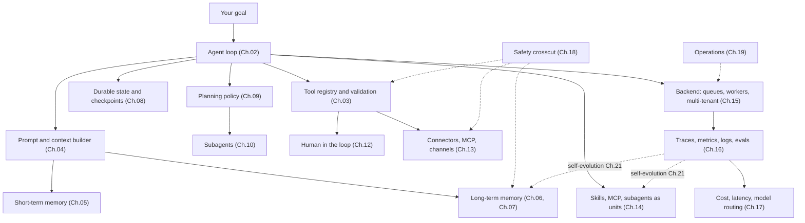

# Chapter 22 — Designing your own agent

你已经读完了二十一章。这一章不是又一章。它是一块 design canvas（设计画布）——一种把 Ch.01 到 Ch.21 的所有内容，翻译成*你自己*项目的具体形态的方法。先从 intent（意图）出发，而非架构：use case、目标、scope、budget、用户、成功标准、最坏情况下的错误。一旦 intent 足够清晰，架构在很大程度上就只是一道选择题——挑出前面各章里哪些组件是 load-bearing（承重）的，哪些可以暂缓。

教程类项目通常让所有人都搭同一个东西。这对打分有用；但对培养品味、对建立 ownership、对做出你真正在意的东西，毫无帮助。agent 系统的范围非常广——personal assistant、coding agent、research agent、workflow control plane、内部工具、企业自动化，以及那些还没有归类的东西。课程给了你积木；这一章帮你决定，你的项目究竟需要其中哪些。

这一章还刻意做了另一件事：它不再写代码。前面每一章都是一张地图；这一章是一只指南针。最小可信的第一版有一个清晰的职责、若干 tool、基础的 observability，以及一个停止条件。代码会从你和你的 agent 围绕你自己问题的对话中生长出来。

---

## The concept

### The whole system in one frame

把它当作一份*哪些东西可能是 load-bearing 的*清单来读，而不是一份*哪些东西必须存在*的蓝图。你的第一版大概会用到这里的四个方框——loop、几个 tool、基础 memory、一个 trace sink。其余大部分都是当工作负载需要时才加上的层。Ch.11 是把这一切串联起来的 composition（组合）层；Ch.19 讲它如何随时间运行；Ch.20 讲 agent 主动发起的行动；Ch.21 闭合那条反馈边——从 observability 回到 agent 在下一次 session 中所使用的 memory 和 skill。

如果你能叫出每一个方框的名字，并向朋友解释它的作用，那你就准备好动手了。

### Intent first — the project canvas

在任何架构决策之前，先回答下面这些问题。这份 canvas 里没有一个问题是关于*怎么做*的；它们全都关于*做什么*和*为什么*。

- **Use case。** 用一句话说，这个 agent 执行的是什么具体而重复的任务？*"它对涌入的 support ticket 做分类，并起草回复供人工审核"*，这是一个 use case。*"它是个 AI 助手"*，不是。
- **Goal（目标）。** 对用户来说，成功长什么样？节省了工时？周转更快？错误更少？要具体。
- **Scope。** 第一版里，什么在 scope 之内、什么在 scope 之外？要狠下心。任何在外面的东西，都是*下一个*版本的事。
- **Budget。** 每一次 run 能花多少钱？每个用户每月能花多少？如果你答不上来，agent 会用一张你没预料到的账单告诉你答案。
- **Users（用户）。** 多少人？他们是谁？支持模式是什么？一个操作者带五个同事，和一万个陌生人，是完全不同的两种系统。
- **Success criteria（成功标准）。** 你怎么知道它在起作用？指标是什么？谁来衡量？
- **Worst-case mistake（最坏情况下的错误）。** agent 可能做出的、最坏且合理的事情是什么？*"发错一封邮件"*可以挽回；*"删掉一位客户的数据"*不能。这里的答案，决定了你的 Ch.12 approval 和 Ch.18 controls。

七个问题，十分钟的书写。只要有任何一个含糊，随之而来的架构决策也会含糊。只要它们都清晰，架构大体上会自己拼出来。

### The architecture canvas — walk through this with your agent

一旦 intent 锁定，就和你的 agent 坐下来，一起把下面这些走一遍。每一项都指向有完整论述的那一章；agent 可以陪着你一起读。目标不是现在就回答每一个问题——而是搞清楚你已经回答了哪些、推迟了哪些。

- **Loop shape（Ch.02, Ch.09）。** 任务是 one-shot、multi-step，还是 long-running？它需要一个显式的 plan，还是 tool selection 就够了？什么样的停止条件能证明这次 run 已经完成？
- **Tools and permissions（Ch.03, Ch.12）。** agent 需要哪些 tool？哪些是只读的、破坏性的、idempotent（幂等）的？哪些需要一道 approval gate？
- **Memory layers（Ch.05, Ch.06, Ch.07）。** 它需要记住用户偏好、项目事实、过往失败吗？是 file-backed、structured、vector，还是 hybrid？谁可以查看、编辑或删除 memory？
- **Persistence（Ch.08）。** 这次 run 需要在崩溃或一次部署中存活下来吗？resume 的故事是怎样的？
- **Connectors（Ch.13）。** 哪些 channel——Slack、Telegram、web、CLI、MCP server、自定义？你需要自己写哪些 adapter？
- **Extension shape（Ch.14）。** agent 学到的东西里，哪些应该变成一个 skill（markdown）、一个 MCP tool（外部）、或一个 subagent（它自己的 loop）？
- **Backend topology（Ch.15）。** 嵌入式单进程、gateway，还是多机？在 10× 用量下，规模看起来是什么样？
- **Observability（Ch.16）。** 哪些 metric 重要？一条成功的 trace 长什么样？你会随产品发布的最小 eval kit 是什么？
- **Cost strategy（Ch.17）。** 哪里可以用一个确定性的 tool 替代一次 LLM 调用？model profile 有哪些？budget gate 在哪里？
- **Safety（Ch.18）。** 每一个输入来源归属于哪一个 trust tier（信任层级）？对你的 use case 来说，哪些攻击是要紧的？defense in depth（纵深防御）是什么？
- **Operations（Ch.19）。** 谁是 operator？是 forward-deployed 还是 hosted？第一天就存在哪些 runbook？
- **Proactive triggers（Ch.20）。** agent 会在没有用户请求的情况下干活吗——cron、webhook、watchdog？哪些类别是 opt-in 的？升级阶梯（escalation ladder）是什么？
- **Self-evolution（Ch.21）。** 允许什么自动演进？什么必须留在人工变更之下？rollback（回滚）路径是什么？

你不需要把这些全都回答出来。你需要知道的是：哪些你已经决定、哪些你已经推迟、哪些你甚至还没想到。陪你读这一章的 agent，可以按需把其中任何一项给你讲深。

### Choose an archetype

有五种 archetype 在生产级 agent 系统中反复出现。挑出最贴近你项目的那一个；对该 archetype 而言 load-bearing 的章节，列在旁边。

- **Personal assistant gateway** —— 许多入站 channel 汇入一个自托管的 agent。参考系统：OpenClaw、Hermes Agent。Load-bearing：connectors（Ch.13）、memory（Ch.05–07）、safety（Ch.18）、observability（Ch.16）、forward-deployed operations（Ch.19）、proactive triggers（Ch.20）、self-evolution（Ch.21）。
- **Coding agent** —— 阅读、编辑、测试、对代码进行推理。参考系统：OpenCode。Load-bearing：tool validation（Ch.03）、loop 与停止条件（Ch.02）、state 与 resume（Ch.08）、permissions 与 approval（Ch.12）、observability（Ch.16）、cost strategy（Ch.17）。
- **Workflow control plane** —— 协调许多 agent、任务、approval、budget、workspace。参考系统：Paperclip。Load-bearing：backend infrastructure（Ch.15）、HITL 与 governance（Ch.12）、connectors（Ch.13）、observability（Ch.16）、durable state（Ch.08）、multi-tenant safety（Ch.18）。
- **Knowledge and research agent** —— retrieval、综合、引用，并保持 knowledge base 的新鲜。参考系统：Hermes Agent 的 memory 模式、OpenCode 的 compaction。Load-bearing：long-term recall（Ch.06）、context 与 cache（Ch.04, Ch.05）、tool validation（Ch.03）、带显式 eval 的 observability（Ch.16）、面向 knowledge base 的 self-evolution（Ch.21）。
- **Forward-deployed enterprise agent** —— 定制、local-first，工程师随系统一同交付。参考系统：Hermes Agent、OpenClaw，以及 OpenCode 的部分。Load-bearing：operations（Ch.19）、带严格 trust boundary 的 safety（Ch.18）、memory privacy（Ch.06, Ch.07）、runbook 纪律（Ch.19）、面向无人值守工作的 proactive triggers（Ch.20）、self-evolution gate（Ch.21）。

这些是透镜，不是必须照搬的搭建方案。大多数真实项目会混合两种——带 workflow-control-plane orchestration 的 coding agent，带 knowledge-base retrieval 的 personal-assistant gateway。挑两者中更接近的那个，等你长出了第一个的边界，再让第二个进来。

---

## Final thought

这门课的目的，从来不是让你去复制别人的产品，或背下某个 framework。它的目的是给你一张系统地图。一旦你能叫出 loop、boundary、prompt、memory、persistence、planner、delegation、harness、approval gate、connector、skill、backend、trace、routing、safety policy、runbook，以及那条 evolution 反馈边的名字，你就能凭着好得多的直觉去设计自己的东西——剩下的，你的 agent 可以补上。

去搭一个你真心希望它存在的东西吧。陪你读这一章的 agent，你准备好了，它就准备好了。

---

<!-- nav-footer -->

[⬅️ 上一章：Ch.21 Self-evolving agents](21-self-evolving-agents.md) · [📖 课程目录](../../README_zh.md)

